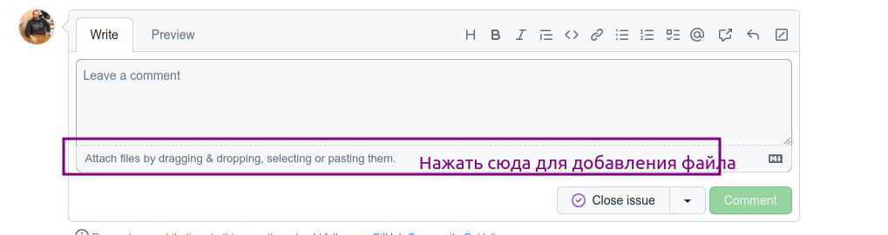

# Если вы хотите доработать Универсальные инструменты 1С, добро пожаловать :)

# Инструкция для Конфигуратора

## Необходимое ПО

1. Устанавленная платформа 1С версии 8.3.12 и выше. 
1. Устанавленная последнюю БСП с режимом совместимости 8.3.12
      * Например, 3.0.3.341 

### Нужно соблюсти очень простые правила:

1. Поискать задачу в списке задач [issues](https://github.com/cpr1c/tools_ui_1c/issues) проекта 
2. Если нет уже существующей задачи, создайте новую, в которой опишите новые требования. В этой задаче можно будет обсудить как само требование, так и реализацию.

Возможно, Ваше требование уже реализовано или может быть реализован другим способом, отличным от придуманного Вами.

1. Возьмите версию из **актуального релиза** на момент старта разработки. Скачивайте файл **полной версии** `UI.cfe`
1. Выполните необходимые для Вас доработки. 
1. **Приложите файл** доработанного расширения **к задаче**, которую реализовывали. Это можно сделать через вставку файла в комментарий к задаче
   
   
### Дополнительно
- **Не желательно** использовать **табличные части** обработок и отчетов. Это связано с особенностями сборки портативных инструментов.  
- Желательно придерживаться [стандартов разработки 1С](https://its.1c.ru/db/v8std)
- Для использования чужих обработок нужно разрешение автора или подходящая лицензия
