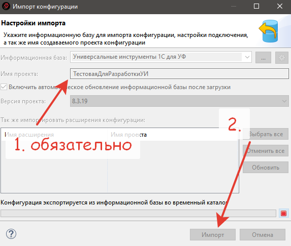

# Если вы хотите доработать Универсальные инструменты 1С, добро пожаловать :)

## Подготовка программного окружения

1. Устанавливаем jdk-full с [bellsoft](https://bell-sw.com/pages/downloads/) 
   * На 17.04.2021 протестировано на версии bellsoft-jdk15.0.2+10-windows-amd64-full.msi.
   * Внимание рекомендуемая версия вендером - jdk 11
1. После установки перезагружаем ПК. 
1. Устанавливаем платформа 1С версии 8.3.12 и выше с поддержкой EDT.
   * На 17.04.2021 протестировано на версии 8.3.19.900 (тестовая версия)
   * рекомендуемая версия 8.3.15
1. Устанавливаем [1С:EDT 2020.5](https://edt.1c.ru/docs/new/download.php) и выше.
   * На 17.04.2021 протестировано на версии 2021.1.2, установленно при помощи стартер EDT (на ИТС строка Дистрибутив 1C:EDT для ОС Windows 64 бит)
1. Устанавливаем последнюю БСП с режимом совместимости 8.3.12
      * Например версию 3.0.3.341 

## Запуск среды для разработки

### Создание fork проекта

1. Создание `fork` проекта ветки `develop` в свой репозиторий.
   

1. Клонируем свой репозитории на локальный ПК.

   ```
      git clone https://github.com/ВАШАКАУНТ/tools_ui_1c.git
   ```
### Создание шаблонной базы на основе БСП

1. Создаем новую базу в 1с из шаблона "Библиотека стандартных подсистем (демо)" -> 3.0.3.341.
1. Открываем созданную базу в Конфигураторе, идем в Расширения, снимаем со всех **Активность**, и удаляем их безвозвратно.
1. Применяем изменения, закрываем конфигуратор. 

### Настройка проекта в 1С:EDT

1. Открываем `1CEDT Start`, авторизуемся используя [аккаунт]( https://developer.1c.ru/).
1. Добавляем **Новый Проект**.
1. Указываем Прикладное решение версия `2021.1.2`, если оно не установленно, закачается само.
    Вводим имя проекта и папку.
   

1. Запускаем среду ЕДТ. при запуске снова [авторизуемся]( https://developer.1c.ru/).
1. Жмем **Начать работу**.
1. Импортируем проект из GIT, Существующий локальный репозиторий - наш созданный fork проекта на ПК, нажимаем в мастере Далее, Далее, Готово.
    
   

1. Импортируем наш Шаблон БСП в `Навигатор`, через которую будет осуществляться запуск и отладка расширения.
   


1. В мастере обязательно указываем имя проекта **ТестоваяДляРазработкиУИ**,


1. Ждем окончания загрузки, будет долго. 
1. Обновляем конфигурацию базы данных информационной базы из `EDT` (Shift+F7)

Радуемся, все готово :)

### Нужно соблюсти очень простые правила:

1. Поискать задачу в списке задач (issues) проекта https://github.com/cpr1c/tools_ui_1c/issues
2. Если нет уже существующей задачи, создайте новую, в которой опишите новые требования. В этой задаче можно будет обсудить как само требование, так и реализацию.

Возможно, Ваше требование уже реализовано или может быть реализован другим способом, отличным от придуманного Вами.

1. Сделайте fork проекта
1. Получите локальную копию на своем компьютере веток `develop` - сделать `checkout` или `pull` из полученного fork для каждой из веток.
1. Создайте свою собственную ветку на базе `develop`.
1. Выполните необходимые для Вас доработки.
1. Далее сделайте pull-request в проект. https://github.com/cpr1c/tools_ui_1c/pulls
   - ВАЖНО: **выбирайте ветку `develop`, а не `master`**
   - ВАЖНО: **убедитесь, что Ваш fork синхронизирован с оригинальным репозиторием**

### Дополнительно
- **Не желательно** использовать **табличные части** обработок и отчетов. Это связано с особенностями сборки портативных инструментов.  
- Желательно придерживаться стандартов разработки 1С https://its.1c.ru/db/v8std
- Для использования чужих обработок нужно разрешение автора или подходящая лицензия
