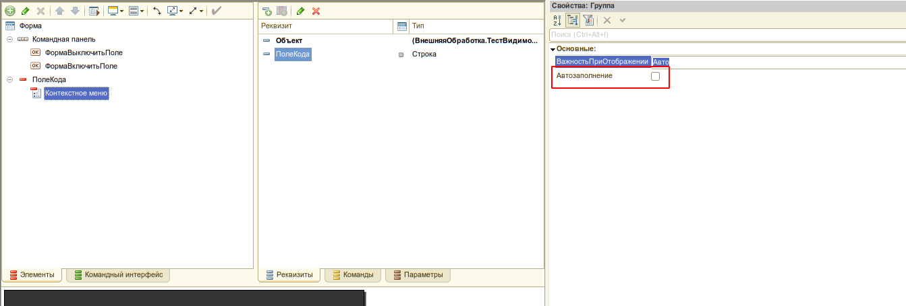

#Подключение редактора кода в новую форму

1. Добавить на форму элемент типа **"ПолеТекстовогоДокумента"**, связанного с реквизитом формы типа **Строка(0)**


2. Отключить у добавленного элемента формы автозаполнение контекстного меню


3. При необходимости добавить несколько редакторов кода на одну форму повторить пункты 1-2
4. В модуль формы добавить экспортную переменную 
   ```bsl

   &НаКлиенте
    Перем УИ_РедакторКодаКлиентскиеДанные Экспорт;
   ```
5. В обработчик события **ПриСозданииНаСервере** вствить код

   ```bsl

 	УИ_РедакторКодаСервер.ФормаПриСозданииНаСервере(ЭтотОбъект);
   ```
При необходимости можно явно задать вид редактора, используемого на форме. 

 ```bsl

	УИ_РедакторКодаСервер.ФормаПриСозданииНаСервере(ЭтотОбъект,"Ace");
   ```

6. В обработчике события **ПриСозданииНаСервере** для каждого редактора кода, используемого на форме,  необходимо вызвать метод

 ```bsl
УИ_РедакторКодаСервер.СоздатьЭлементыРедактораКода(ЭтотОбъект, "Сервер", Элементы.ПолеАлгоритмаСервер);
```

Возможные параметры метода СоздатьЭлементыРедактораКода:

```bsl

// Создать элементы редактора кода.
// 
// Параметры:
//  Форма - ФормаКлиентскогоПриложения-
//  ИдентификаторРедактора - Строка - Уникальный в пределах формы идентификатор редактора. Должен соответствовать правилам именования переменных
//  ПолеРедактора - ПолеФормы - Поле редактора
//  СобытияРедактора - Неопределено, Структура - Имена процедур формы для обработки событий редактора. Список поддерживаемых событий в методе УИ_РедакторКодаСервер.НовыйПараметрыСобытийРедактора
//  ЯзыкРедактора - Строка - Язык редактора кода. По умолчанию "bsl". 
//  ГруппаКомманднойПанели - ГруппаФормы - Группа коммандной панели, куда будут добавлены кнопки. Пока в разработке
Процедура СоздатьЭлементыРедактораКода(Форма, ИдентификаторРедактора, ПолеРедактора, СобытияРедактора = Неопределено, ЯзыкРедактора = "bsl",
	ГруппаКомманднойПанели = Неопределено) Экспорт
```

7. В обработчик события **ПриОткрытии** вствить код

```bsl

УИ_РедакторКодаКлиент.ФормаПриОткрытии(ЭтотОбъект, Неопределено);

```
8. Скопировать в модуль формы подключаемые обработчики

```bsl

//@skip-warning
&НаКлиенте
Процедура Подключаемый_ПолеРедактораДокументСформирован(Элемент)
	УИ_РедакторКодаКлиент.ПолеРедактораHTMLДокументСформирован(ЭтотОбъект, Элемент);
КонецПроцедуры

//@skip-warning
&НаКлиенте
Процедура Подключаемый_ПолеРедактораПриНажатии(Элемент, ДанныеСобытия, СтандартнаяОбработка)
	УИ_РедакторКодаКлиент.ПолеРедактораHTMLПриНажатии(ЭтотОбъект, Элемент, ДанныеСобытия, СтандартнаяОбработка);
КонецПроцедуры

//@skip-warning
&НаКлиенте
Процедура Подключаемый_РедакторКодаОтложеннаяИнициализацияРедакторов()
	УИ_РедакторКодаКлиент.РедакторКодаОтложеннаяИнициализацияРедакторов(ЭтотОбъект);
КонецПроцедуры

&НаКлиенте 
Процедура Подключаемый_РедакторКодаЗавершениеИнициализации() Экспорт

КонецПроцедуры

&НаКлиенте
Процедура Подключаемый_РедакторКодаОтложеннаяОбработкаСобытийРедактора() Экспорт
	УИ_РедакторКодаКлиент.ОтложеннаяОбработкаСобытийРедактора(ЭтотОбъект);
КонецПроцедуры

```

8. В метод **Подключаемый_РедакторКодаЗавершениеИнициализации** вставить код инициализации данных редакторов. В этот момент все редакторы уже инициализированы и доступны для взаимодействия

```bsl
&НаКлиенте 
Процедура Подключаемый_РедакторКодаЗавершениеИнициализации() Экспорт
	УИ_РедакторКодаКлиент.УстановитьТекстРедактора(ЭтотОбъект, "Код", "Сообщить(1)", Истина);
	УИ_РедакторКодаКлиент.УстановитьТекстРедактора(ЭтотОбъект, "Код2", "Сообщить(2)", Истина);

КонецПроцедуры


```