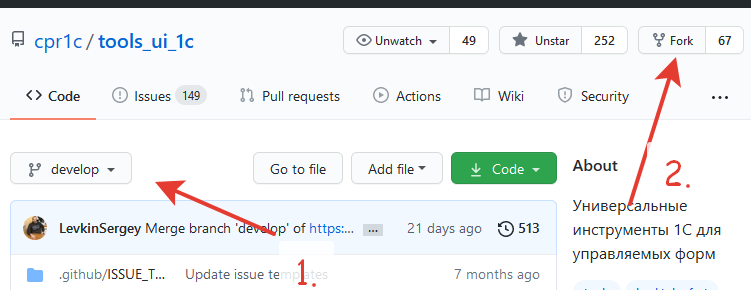

# Процесс Pull Request

Пошаговое руководство по созданию pull request в проект.

:::tip
Новичок в open source? Рекомендуем [Open Source Contributor Guide](https://alei1180.github.io/open-source-contributor-guide/) — подробное руководство для контрибьюторов с нуля.
:::

## Пошаговый workflow

### 1. Задача

- Поищите существующую задачу в [issues](https://github.com/cpr1c/tools_ui_1c/issues)
- Если подходящей нет — создайте новую, где опишите, что и зачем нужно сделать
- Дождитесь обратной связи — возможно, ваше предложение уже реализовано или требует уточнения

### 2. Fork и клонирование

1. Создайте fork проекта ветки `develop` в свой репозиторий на GitHub

   

2. Клонируйте свой репозиторий на локальный ПК:

```bash
git clone https://github.com/ВАШАКАУНТ/tools_ui_1c.git
cd tools_ui_1c
```

### 3. Ветка

Всегда работайте от ветки `develop`:

```bash
git checkout develop
git pull origin develop
git checkout -b feature/краткое-описание-изменения
```

:::important
Убедитесь, что ваш fork синхронизирован с оригинальным репозиторием перед созданием новой ветки.
:::

### 4. Разработка

- [Настройте окружение](/docs/contributing/setup-edt) для работы
- Соблюдайте [правила оформления кода](/docs/contributing/coding-guidelines)
- После завершения доработок проверьте работоспособность

### 5. Сборка и проверка

Соберите расширение по [инструкции](/docs/guides/build-from-source) и убедитесь, что:

- проект собирается без ошибок
- инструменты корректно работают в 1С
- не появилось ли новых проблем в существующих инструментах
- исправлены все замечания анализатора Sonar

### 6. Pull Request

1. Отправьте ветку в свой fork

```bash
git push origin feature/краткое-описание-изменения
```

2. Откройте [Pull Request](https://github.com/cpr1c/tools_ui_1c/pulls) на GitHub

3. **ВАЖНО**: выбирайте целевую ветку `develop`, **не `master`**

4. В описании PR укажите:
   - ссылку на issue (если есть), используя `Close #N` для автоматического закрытия задачи при слиянии
   - что делает изменение
   - как протестировать

Подробный гайд по оформлению PR и работе с git: [Open Source Contributor Guide](https://alei1180.github.io/open-source-contributor-guide/)

### 7. Ревью

- Дождитесь ревью своих изменений
- Будьте готовы внести правки по замечаниям
- После одобрения PR будет влит в `develop`

## Важно

- **Ветка `develop`, а не `master`** — все PR идут только в develop
- **Синхронизируйте fork** перед началом работы
- **Не делайте rebase** после создания PR без необходимости
- **Один PR — одна задача** (или логически связанная группа изменений)

## Полезные ссылки

- [Open Source Contributor Guide](https://alei1180.github.io/open-source-contributor-guide/) — подробное руководство для контрибьюторов: от настройки git до создания PR
- [Pro Git Book](https://git-scm.com/book/ru/v2) — книга по Git на русском
- [Learn Git Branching](https://learngitbranching.js.org/) — интерактивное изучение ветвления в Git
- [Oh Shit, Git!?!](https://ohshitgit.com/ru) — типичные проблемы с Git и их решение
- [Keep a Changelog](https://keepachangelog.com/ru/1.1.0/) — рекомендации по ведению CHANGELOG
