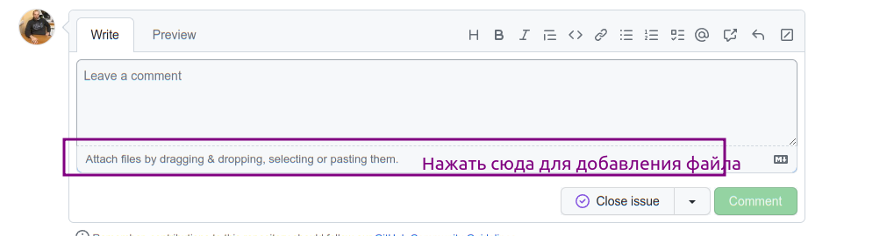

# Доработка через Конфигуратор

Инструкция для тех, кто предпочитает работать в Конфигураторе 1С без EDT.

## Необходимое ПО

1. **Платформа 1С** версии 8.3.12 и выше
2. База данных на конфигурации на базе **БСП** версии 3.0 и выше с режимом совместимости 8.3.12

## Запуск среды для разработки

### Создание тестовой информационной базы

1. Создайте новую базу в 1С на основе любой конфигурации, использующей **БСП версии 3.0 и выше**
2. Откройте базу в Конфигураторе, перейдите в **Расширения**, снимите активность со всех расширений и удалите их
3. Примените изменения и закройте Конфигуратор

### Подготовка расширения

1. Скачайте **файл полной версии** `UI.cfe` из актуального релиза на [странице Скачать](/download)
2. Откройте тестовую базу в Конфигураторе
3. Перейдите в **Расширения**, нажмите **Добавить** и укажите скачанный файл `UI.cfe`
4. Убедитесь, что расширение активно и нет ошибок совместимости

## Порядок работы

Перед началом разработки ознакомьтесь с [правилами оформления кода](/docs/contributing/coding-guidelines).

### 1. Найдите или создайте задачу

- Поищите существующую задачу в [issues](https://github.com/cpr1c/tools_ui_1c/issues) проекта
- Если подходящей нет — создайте новую, где опишите, что и зачем нужно сделать

### 2. Выполните доработку

- Вносите изменения в расширение через Конфигуратор
- Соблюдайте [правила оформления кода](/docs/contributing/coding-guidelines)
- Для использования чужих обработок нужно разрешение автора или подходящая лицензия

### 3. Сохраните результат

После завершения доработок выгрузите расширение в файл:
- В Конфигураторе перейдите в **Расширения**, выберите нужное, нажмите **Сохранить в файл**
- Убедитесь, что файл имеет расширение `.cfe`
- Заархивируйте файл в формате `.zip`

### 4. Приложите файл к задаче

**Приложите файл** доработанного расширения к задаче, которую реализовывали. Это можно сделать через вставку файла в комментарий на GitHub:

