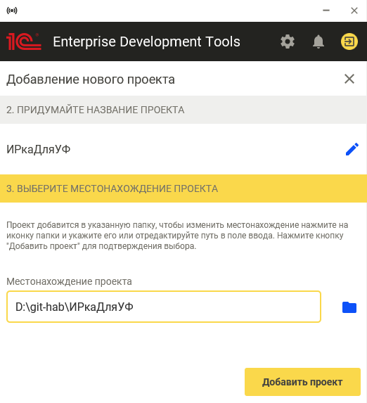
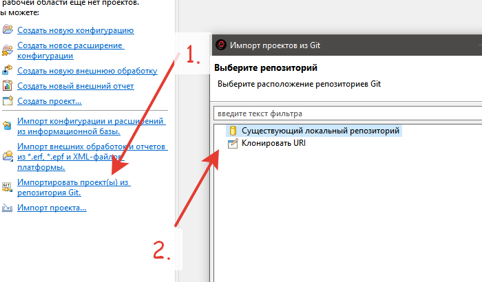
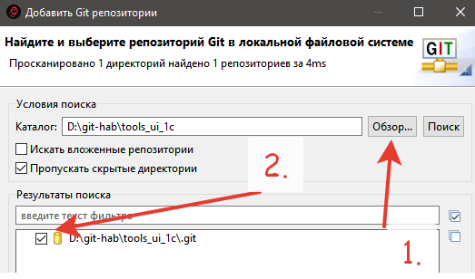
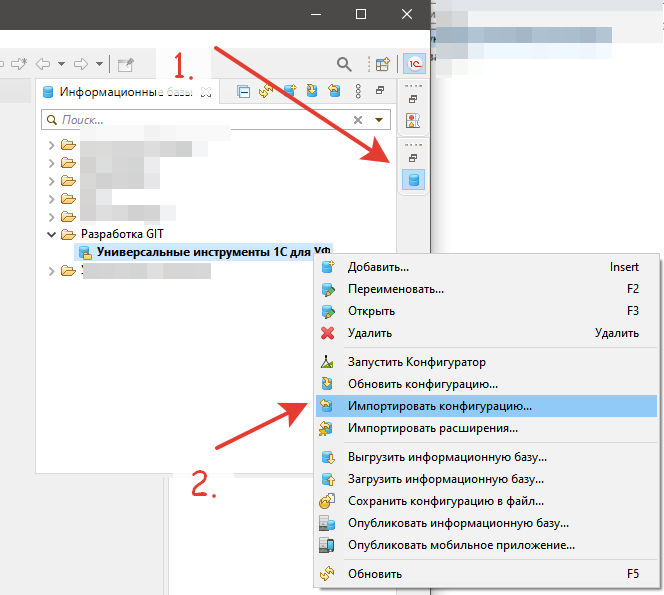
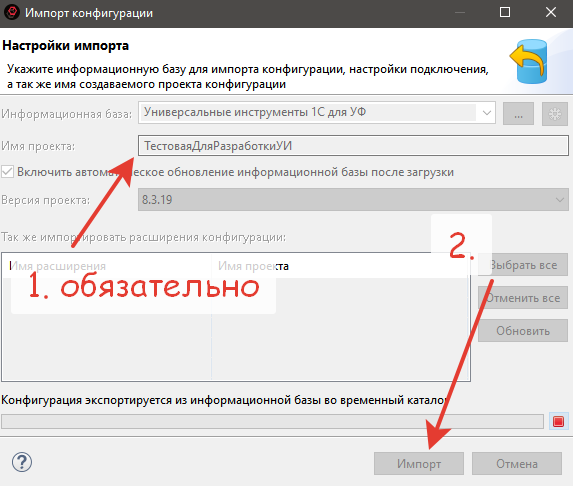

# Доработка через EDT

Инструкция для доработки подсистемы через 1С:EDT.

## Необходимое ПО

1. **Платформа 1С** версии 8.3.12 и выше с поддержкой EDT (рекомендуемая — 8.3.15)
2. **1С:EDT** — [скачать](https://edt.1c.ru/docs/new/download.php) версию 2025.2 и выше (протестировано на 2021.1.2, установка через стартер EDT)
3. **БСП** версии 3.0 и выше с режимом совместимости 8.3.12

## Запуск среды для разработки

### Настройка Git

Выполните настройку Git согласно [инструкции 1С](https://its.1c.ru/db/edtdoc#content:10054:hdoc:t000054__настройки-групповой-разработки).

### Создание fork проекта

1. Создайте fork проекта ветки `develop` в свой репозиторий на GitHub

   

2. Клонируйте свой репозиторий на локальный ПК:

   ```bash
   git clone https://github.com/ВАШАКАУНТ/tools_ui_1c.git
   ```

### Создание информационной базы из шаблона БСП

1. Создайте новую базу в 1С на основе любой конфигурации, использующей **БСП версии 3.0 и выше**
2. Откройте базу в Конфигураторе, перейдите в **Расширения**, снимите активность со всех расширений и удалите их
3. Примените изменения, закройте Конфигуратор

### Настройка проекта в 1С:EDT

1. Откройте `1CEDT Start`, авторизуйтесь через [аккаунт разработчика](https://developer.1c.ru/)
2. Добавьте **Новый проект**, укажите прикладное решение версии 2025.2.6 (если не установлено — загрузится автоматически)
3. Введите имя проекта и папку

   

4. Запустите среду EDT, при запуске снова авторизуйтесь
5. Нажмите **Начать работу**
6. Импортируйте проект из GIT из локальной папки (ваш fork), в мастере нажимайте Далее, Далее, Готово

   
   

7. Импортируйте шаблон БСП в **Навигатор**, через который будет осуществляться запуск и отладка расширения

   

8. В мастере обязательно укажите имя проекта **ТестоваяДляРазработкиУИ**

   

9. Дождитесь окончания загрузки (будет долго)
10. Обновите конфигурацию базы данных из EDT (Shift+F7)

Готово. Можно приступать к разработке.

## Правила разработки

Перед началом работы ознакомьтесь с [процессом Pull Request](pull-request-process) и соблюдайте [правила оформления кода](coding-guidelines).

### Git workflow
Подробное описание [процесс Pull Request](pull-request-process)

1. Сделайте fork проекта (см. выше)
2. Получите локальную копию ветки `develop` из своего fork
3. Создайте свою ветку на базе `develop`:

   ```bash
   git checkout develop
   git pull origin develop
   git checkout -b feature/краткое-описание-изменения
   ```

4. Выполните необходимые доработки
5. Отправьте ветку в свой fork и создайте [Pull Request](https://github.com/cpr1c/tools_ui_1c/pulls)

   :::important
   - **Выбирайте целевую ветку `develop`, а не `master`**
   - **Убедитесь, что ваш fork синхронизирован с оригинальным репозиторием**
   :::
