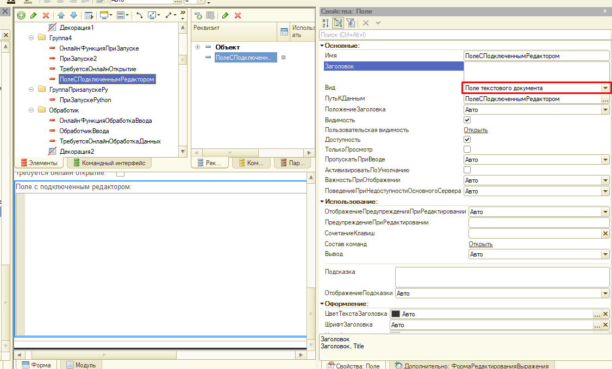
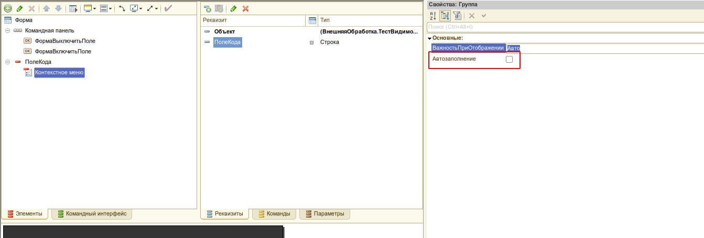

# Подключение редактора кода на форму

Пошаговая инструкция по встраиванию редактора кода (Monaco/Ace) в форму 1С.

### 1. Добавьте поле редактора

Добавьте на форму элемент **ПолеТекстовогоДокумента**, связанный с реквизитом формы типа **Строка(0)**.



### 2. Отключите автозаполнение

У добавленного элемента отключите автозаполнение контекстного меню.



### 3. Экспортная переменная

В модуль формы добавьте экспортную переменную:

```bsl
&НаКлиенте
Перем УИ_РедакторКодаКлиентскиеДанные Экспорт;
```

### 4. ПриСозданииНаСервере

В обработчик **ПриСозданииНаСервере** вставьте вызов:

```bsl
УИ_РедакторКодаСервер.ФормаПриСозданииНаСервере(ЭтотОбъект);
```

При необходимости можно явно задать вид редактора:

```bsl
УИ_РедакторКодаСервер.ФормаПриСозданииНаСервере(ЭтотОбъект, "Ace");
```

### 5. Создание элементов редактора

Для каждого редактора кода на форме вызовите метод:

```bsl
УИ_РедакторКодаСервер.СоздатьЭлементыРедактораКода(ЭтотОбъект, "Сервер", Элементы.ПолеАлгоритмаСервер);
```

### 6. ПриОткрытии

В обработчик **ПриОткрытии** добавьте:

```bsl
УИ_РедакторКодаКлиент.ФормаПриОткрытии(ЭтотОбъект, Неопределено);
```

### 7. Подключаемые обработчики

Скопируйте в модуль формы подключаемые обработчики:

```bsl
&НаКлиенте
Процедура Подключаемый_ПолеРедактораДокументСформирован(Элемент)
    УИ_РедакторКодаКлиент.ПолеРедактораHTMLДокументСформирован(ЭтотОбъект, Элемент);
КонецПроцедуры

&НаКлиенте
Процедура Подключаемый_ПолеРедактораПриНажатии(Элемент, ДанныеСобытия, СтандартнаяОбработка)
    УИ_РедакторКодаКлиент.ПолеРедактораHTMLПриНажатии(ЭтотОбъект, Элемент, ДанныеСобытия, СтандартнаяОбработка);
КонецПроцедуры

&НаКлиенте
Процедура Подключаемый_РедакторКодаОтложеннаяИнициализацияРедакторов()
    УИ_РедакторКодаКлиент.РедакторКодаОтложеннаяИнициализацияРедакторов(ЭтотОбъект);
КонецПроцедуры

&НаКлиенте
Процедура Подключаемый_РедакторКодаЗавершениеИнициализации() Экспорт
КонецПроцедуры

&НаКлиенте
Процедура Подключаемый_РедакторКодаОтложеннаяОбработкаСобытийРедактора() Экспорт
    УИ_РедакторКодаКлиент.ОтложеннаяОбработкаСобытийРедактора(ЭтотОбъект);
КонецПроцедуры
```

### 8. Инициализация данных редакторов

В методе **Подключаемый_РедакторКодаЗавершениеИнициализации** вставьте код инициализации. В этот момент все редакторы уже инициализированы и доступны для взаимодействия:

```bsl
&НаКлиенте
Процедура Подключаемый_РедакторКодаЗавершениеИнициализации() Экспорт
    УИ_РедакторКодаКлиент.УстановитьТекстРедактора(ЭтотОбъект, "Код", "Сообщить(1)", Истина);
    УИ_РедакторКодаКлиент.УстановитьТекстРедактора(ЭтотОбъект, "Код2", "Сообщить(2)", Истина);
КонецПроцедуры
```

---

Описание всех методов API редактора кода см. в разделе [Редактор кода](/docs/api/code-editor).
