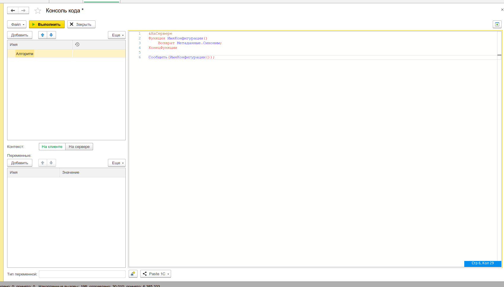

# Выполнение кода через обработку

:::info
Доступно с версии **v23.6.1**
:::

Редактор кода поддерживает два режима исполнения алгоритмов: напрямую через `Выполнить()` и через сборку внешней обработки (`.epf`). Режим «через обработку» позволяет выполнять код в контексте, максимально приближенном к реальной внешней обработке.



## Режимы выполнения

| Режим                   | Описание                                                                                       | Особенности                                                                                               |
| ----------------------- | ---------------------------------------------------------------------------------------------- | --------------------------------------------------------------------------------------------------------- |
| **Через `Выполнить()`** | Код выполняется напрямую через `Выполнить(ТекстАлгоритма)`                                     | Проще, не требует сборки обработки. Нельзя объявлять процедуры и функции                                  |
| **Через обработку**     | Код преобразуется в модуль внешней обработки, собирается `.epf`, затем создаётся и выполняется | Поддерживает `Асинх`/`Ждать`, директивы компиляции, объявление собственных процедур и функций с экспортом |

Режим переключается в панели инструментов редактора кода кнопкой **«Режим выполнения кода через обработку»**.

## Как это работает

1. Текст алгоритма анализируется парсером встроенного языка через плагин `УИ_ПлагинПарсераВстроенногоЯзыка_ДоработкаТекстаАлгоритмаДляОбработки`
2. Из текста формируется модуль внешней обработки с экспортной функцией `УИ_ВыполнитьАлгоритм()` и процедурой инициализации переменных `УИ_ИнициализироватьПеременные()`
3. Выполняется сборка временного файла `.epf` с именем `УИ_РедакторКода_ОбработкаИсполнения_<Идентификатор>`
4. Обработка создаётся через `ВнешниеОбработки.Создать()` (на сервере) или `ПолучитьФорму()` (на клиенте)
5. В переменные обработки передаётся контекст выполнения, вызывается `УИ_ВыполнитьАлгоритм()`, результат возвращается вызывающему коду

## Клиент-серверные вызовы

Режим «через обработку» позволяет выполнять алгоритмы со смешанными клиент-серверными вызовами в одном алгоритме.

### Пример алгоритма

Клиентский алгоритм с вызовом серверного метода:

```bsl
Процедура ВыполнитьНачислениеЗарплаты() Экспорт
    Сообщить("Обработка сотрудника " + СотрудникСсылка);
    ОбработатьСотрудникаНаСервере(СотрудникСсылка);
КонецПроцедуры

&НаСервере
Процедура ОбработатьСотрудникаНаСервере(Сотрудник)
    Объект = Сотрудник.ПолучитьОбъект();
    Объект.Зарплата = ?(Объект.Стаж > 5, 100000, 70000);
    Объект.Записать();
КонецПроцедуры
```

Плагин директив не тронет `ОбработатьСотрудникаНаСервере` (уже есть `&НаСервере`), а к `ВыполнитьНачислениеЗарплаты` добавит `&НаКлиенте`.


## Когда использовать

Режим «через обработку» полезен когда:

- Нужно выполнить код с операторами `Асинх` и `Ждать`
- Алгоритм содержит смешанные клиент-серверные вызовы с директивами компиляции
- Требуется поведение, максимально близкое к реальной внешней обработке
- В теле алгоритма используются собственные процедуры и функции (в режиме `Выполнить()` они недоступны)

## Программное управление

Включение и проверка режима через API редактора кода:

```bsl
// Проверить текущий режим
Режим = УИ_РедакторКодаКлиент.РежимИспользованияОбработкиДляВыполненияКодаРедактора(Форма, "Код");

// Установить режим
УИ_РедакторКодаКлиент.УстановитьРежимИспользованияОбработкиДляВыполненияКодаРедактора(Форма, "Код", Истина);
```

Также доступен метод сборки обработок для принудительного создания `.epf`:

```bsl
УИ_РедакторКодаКлиент.НачатьСборкуОбработокДляИсполненияКода(Форма, Оповещение, Алгоритмы, ИдентКлиент);
```

## Связанные разделы

- [Редактор кода — API](/docs/api/code-editor)
- [Выполнение кода из 1С (Консоль кода)](/docs/tools/development-tools/code-console)
- [Консоль запросов](/docs/tools/development-tools/query-console)
- [Редактор HTML](/docs/tools/development-tools/html-editor)
