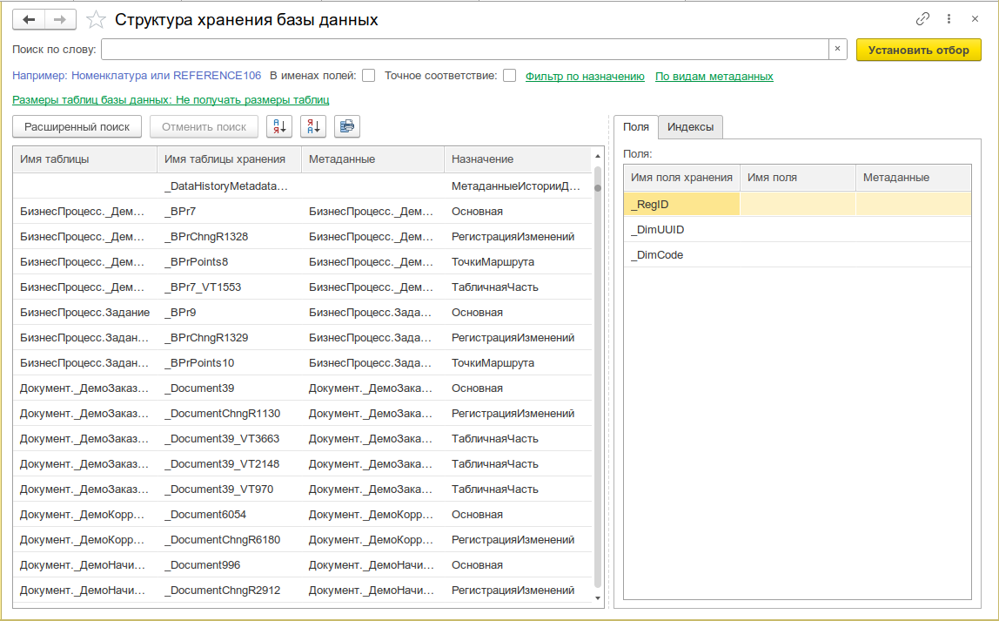
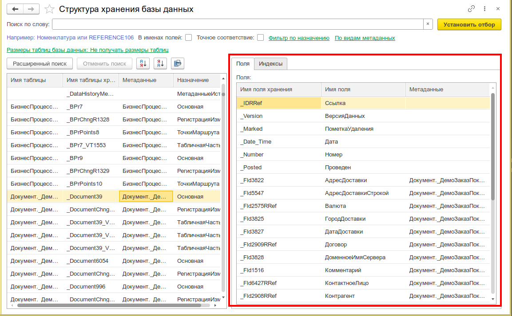
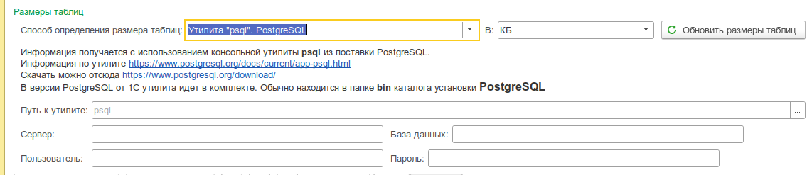
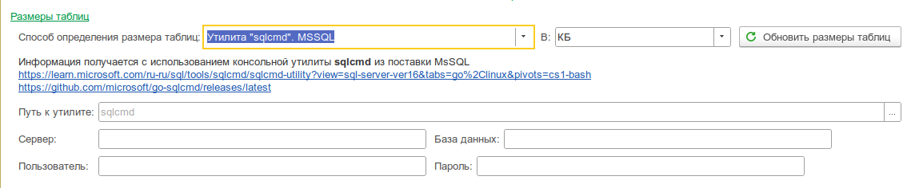
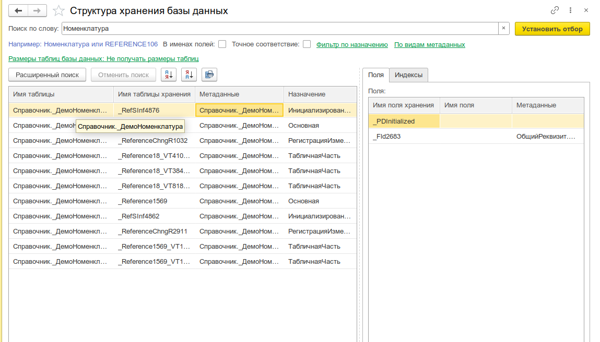
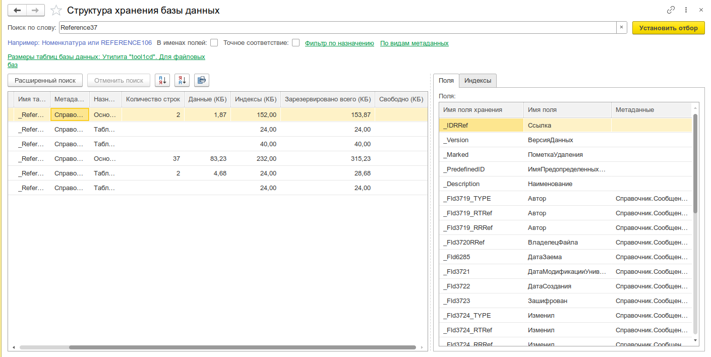

# Структура хранения базы данных

Просмотр имён таблиц базы данных и их взаимосвязей с объектами метаданных. Инструмент для анализа физической структуры хранения 1С: какие SQL-таблицы соответствуют справочникам, документам, регистрам и другим объектам метаданных, их поля и индексы.

_Общий вид формы со списком таблиц, панелью фильтров слева и строкой поиска сверху_

доб
---

## Назначение

Инструмент отображает соответствие между объектами метаданных конфигурации и их физическими таблицами в базе данных (СУБД). Позволяет посмотреть имена таблиц хранения, состав полей, индексы, а также получить информацию о размерах таблиц.

Пригодится для:

- **Анализа структуры БД** — быстрый поиск SQL-таблицы по имени метаданных и наоборот
- **Оптимизации производительности** — оценка размера таблиц, количества записей, индексов
- **Разработки SQL-запросов** — понимание физических имён полей и таблиц для прямых запросов к СУБД
- **Администрирования** — мониторинг разрастания таблиц, поиск «тяжёлых» объектов

---

## Основные возможности

- **Полная структура хранения БД** — все таблицы конфигурации: основные, табличные части, подчинённые регистры, перечисления и т.д.
- **Поиск по таблицам и полям** — фильтрация по имени таблицы, метаданных, назначению; поиск по именам полей хранения с точным или частичным совпадением
- **Фильтр по назначению** — показывать/скрывать таблицы по типу назначения (основная, табличная часть, индексы и т.д.)
- **Фильтр по видам метаданных** — показывать/скрывать объекты по типу (Справочник, Документ, Регистр сведений и т.д.)
- **Детализация по каждой таблице** — раскрывающийся список полей (имя поля хранения, имя поля метаданных) и индексов (состав полей индекса)
- **Размеры таблиц** — получение размера данных, индексов, зарезервированного и свободного места, количества записей (опционально)
- **Несколько способов получения размеров** — платформенный метод, утилита tool1cd (файловые базы), psql (PostgreSQL), sqlcmd (MSSQL)
- **Единицы измерения** — переключение между килобайтами и мегабайтами

---

## Быстрый старт

1. Откройте меню **Универсальные инструменты → Администрирование → Структура хранения базы данных [УИ]**
2. Дождитесь загрузки — инструмент автоматически получит структуру хранения базы данных платформенным методом `ПолучитьСтруктуруХраненияБазыДанных()`
3. Для поиска конкретной таблицы или объекта введите текст в поле **Поиск по слову** и нажмите **Найти** (или Enter)
4. Используйте фильтры слева для уточнения: по назначению и по видам метаданных
5. Для просмотра полей и индексов — раскройте строку таблицы

---

## Интерфейс

### Панель поиска и фильтров

В верхней части формы расположены элементы управления:

| Элемент                   | Назначение                                                                        |
| ------------------------- | --------------------------------------------------------------------------------- |
| **Поиск по слову**        | Текстовый поиск по имени таблицы, имени таблицы хранения, метаданным и назначению |
| **Искать в именах полей** | Флажок — расширяет поиск на имена полей хранения и имена полей метаданных         |
| **Точное соответствие**   | Флажок — искать точное совпадение вместо частичного                               |
| **Найти**                 | Кнопка применения фильтра                                                         |

В левой части расположены две группы фильтров с флажками:

- **Фильтр по назначению** — список типов назначения таблиц (основная, табличная часть, индексы и т.д.) с возможностью включать/отключать каждую позицию
- **По видам метаданных** — список типов объектов метаданных (Справочник, Документ, Регистр сведений, Регистр накопления, Перечисление и т.д.)

:::tip
Используйте кнопки «Выделить всё» / «Снять всё» в каждой группе для быстрого переключения.
:::

### Таблица результатов

Основная таблица содержит строки — по одной на каждую таблицу хранения. Колонки:

| Колонка                  | Описание                                                                  |
| ------------------------ | ------------------------------------------------------------------------- |
| **Имя таблицы**          | Синонимичное имя таблицы (например, `Номенклатура`, `ПоступлениеТоваров`) |
| **Имя таблицы хранения** | Физическое имя таблицы в СУБД (например, `_Reference37`, `_Document139`)  |
| **Метаданные**           | Полный путь к объекту метаданных (например, `Справочник.Номенклатура`)    |
| **Назначение**           | Тип таблицы: `основная`, `табличная часть`, `перечисление` и т.д.         |

Каждая строка раскрывается в подчинённую таблицу с двумя вкладками:

- **Поля** — список полей таблицы:
  - Имя поля хранения — физическое имя колонки в СУБД
  - Имя поля — имя реквизита в метаданных
  - Метаданные — полный путь к реквизиту
- **Индексы** — список индексов таблицы с составом полей:
  - Имя индекса хранения — физическое имя индекса
  - Поля индекса — имена полей, входящих в индекс

_Раскрытая строка таблицы с детализацией по полям и индексам_


### Размеры таблиц

При выборе способа получения размеров под таблицей результатов отображаются дополнительные колонки:

| Колонка                           | Описание                          |
| --------------------------------- | --------------------------------- |
| **Кол-во строк**                  | Количество записей в таблице      |
| **Данные (КБ/МБ)**                | Размер данных                     |
| **Индексы (КБ/МБ)**               | Размер индексов                   |
| **Зарезервировано всего (КБ/МБ)** | Суммарный зарезервированный объём |
| **Свободно (КБ/МБ)**              | Неиспользуемое место в таблице    |

Способ получения размера выбирается в выпадающем списке:

| Способ                         | Описание                                    | Требования                                      |
| ------------------------------ | ------------------------------------------- | ----------------------------------------------- |
| **Не получать размеры таблиц** | Размеры не показываются                     | —                                               |
| **Платформенный метод**        | Функция `ПолучитьРазмерДанныхБазыДанных()`  | Платформа 8.3.15+                               |
| **Утилита tool1cd**            | Внешняя утилита `ctool1cd` для файловых баз | Файловая ИБ; не Linux x86, не macOS             |
| **Утилита psql**               | Консольная утилита PostgreSQL               | PostgreSQL; указать сервер, БД, пользователя    |
| **Утилита sqlcmd**             | Консольная утилита MSSQL                    | MSSQL; указать сервер, БД, пользователя, пароль |

:::info
**Платформенный метод** не показывает размеры платформенных таблиц и вспомогательных данных (индексы). Весь размер данных объекта (включая табличные части) отображается для основной таблицы. Метод не учитывает историю данных и расширения конфигурации.
:::

При выборе `psql` или `sqlcmd` появляются поля для ввода параметров подключения к СУБД: сервер, база данных, пользователь и пароль, а также путь к исполняемому файлу утилиты (опционально, по умолчанию ищется в `PATH`).

_Настройка подключения к PostgreSQL (psql) для получения размеров таблиц_


_Настройка подключения к MSSQL (sqlcmd) для получения размеров таблиц_


Единица измерения переключается между **КБ** и **МБ** — заголовки колонок обновляются автоматически.

---

## Сценарии использования

### Поиск SQL-таблицы по объекту метаданных

```
Задача: Узнать, какая SQL-таблица соответствует справочнику "Номенклатура"
```

1. Введите `Номенклатура` в поле поиска
2. Нажмите **Найти**
3. В результатах найдите строку с метаданными `Справочник.Номенклатура`
4. В колонке **Имя таблицы хранения** — физическое имя таблицы в СУБД

_Результат поиска: строка с метаданными Справочник.Номенклатура, её SQL-таблица и назначение_


### Поиск объекта метаданных по SQL-имени

```
Задача: Вы работаете с СУБД и нашли таблицу "_Reference37". Какому объекту конфигурации она принадлежит?
```

1. Введите `_Reference37` в поле поиска
2. Включите **Точное соответствие** для исключения лишних совпадений
3. Нажмите **Найти**
4. В колонке **Метаданные** — полное имя объекта конфигурации

### Поиск по имени поля хранения

```
Задача: Найти все таблицы, в которых есть поле с определённым физическим именем
```

1. Введите имя поля (например, `REFERENCE37`)
2. Включите **Искать в именах полей**
3. Нажмите **Найти**
4. В результатах будут только те таблицы, у которых хотя бы одно поле содержит искомое имя

### Анализ размера таблиц (PostgreSQL)

1. Выберите способ **Утилита psql**
2. Заполните параметры подключения: сервер (`localhost`), база данных (`trade_db`), пользователь (`postgres`), пароль
3. При необходимости укажите путь к `psql` (если утилита не в `PATH`)
4. Нажмите **Обновить размеры таблиц базы данных**
5. Колонки с размерами заполнятся данными из СУБД

_Таблица результатов с заполненными колонками размеров (данные, индексы, строки)_


### Анализ размера таблиц (файловая база)

Для файловых баз используется утилита `tool1cd`:

1. Выберите способ **Утилита tool1cd**
2. Нажмите **Обновить размеры таблиц базы данных**
3. Утилита `ctool1cd` будет автоматически извлечена из макета и запущена для анализа файла базы данных

### Фильтрация по виду метаданных

```
Задача: Посмотреть только таблицы регистров сведений
```

1. В группе **По видам метаданных** нажмите **Снять всё**
2. Установите флажок только на `РегистрСведений`
3. Таблица результатов отфильтруется — останутся только строки, относящиеся к регистрам сведений

### Быстрая оценка «тяжёлых» объектов

1. Выберите способ получения размеров (например, платформенный)
2. Нажмите **Обновить размеры таблиц базы данных**
3. Отсортируйте таблицу по убыванию колонки **Данные**
4. Самые объёмные объекты окажутся вверху списка

---

## Интеграция с другими инструментами

- **Программный доступ** — функция `УИ_ОбщегоНазначения.СтруктураХраненияБазыДанных()` возвращает таблицу значений со структурой хранения БД.
