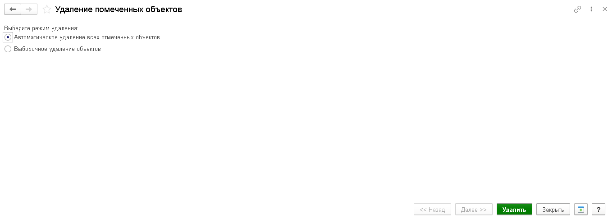
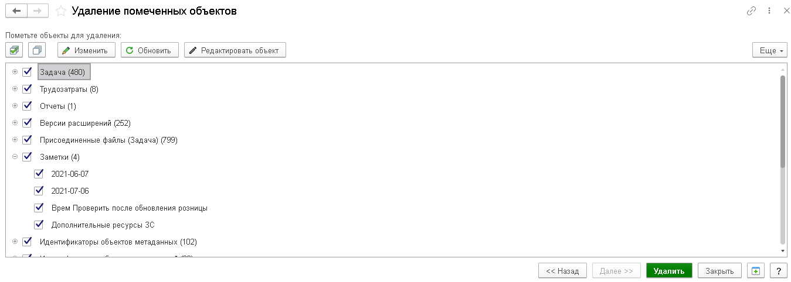
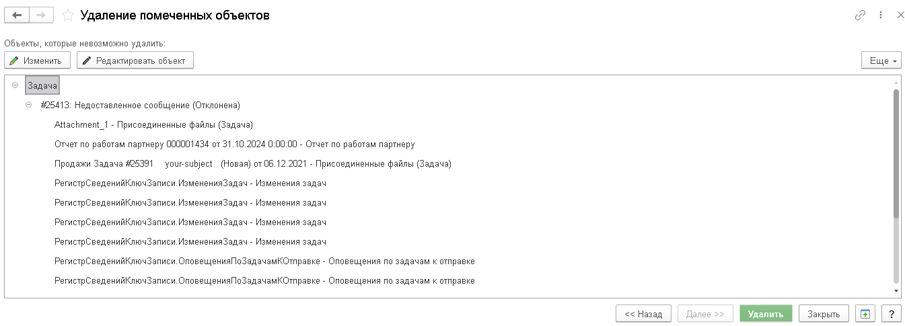

# Удаление помеченных объектов

Удаление помеченных объектов — инструмент администрирования, который находит и окончательно удаляет из базы все объекты, помеченные на удаление. Это копия стандартной обработки из БСП, адаптированная для работы независимо от БСП.

:::info
Инструмент защищает ссылочную целостность базы: объекты не удаляются, если на них есть ссылки. Результат содержит список объектов, не удалённых из-за зависимостей, и позволяет открыть связанные объекты для исправления.
:::

_Общий вид формы удаления помеченных объектов_

---

## Назначение

Инструмент позволяет безопасно очистить базу от объектов, помеченных на удаление, с контролем ссылочной целостности. Он помогает быстро понять, почему часть объектов не удаляется, и получить детальную информацию о зависимостях.

---

## Что делает инструмент

- Находит все объекты, помеченные на удаление, в текущей ИБ.
- Удаляет объекты в режиме **Полного удаления** либо **Выборочного удаления**.
- Сохраняет целостность базы: не удаляет объект, если на него ссылаются другие объекты.
- После выполнения показывает:
  - количество удалённых объектов,
  - список объектов, которые не удалось удалить,
  - для каждого оставшегося объекта — ссылку на объект, препятствующий удалению.

---

## Основные возможности

- **Режим полного удаления** — удаляются все объекты, помеченные на удаление.
- **Режим выборочного удаления** — видно список помеченных объектов, выбираются только нужные.
- **Дерево помеченных объектов** — объекты группируются по типам метаданных.
- **Дерево оставшихся объектов** — показывает объекты, которые не удалось удалить, с ссылками на причины.
- **Открытие объектов** — двойной клик открывает объект в форме, а команда **Редактировать объект** позволяет быстро исправить ссылочную зависимость.
- **Анализ причин отказа** — объекты, блокирующие удаление, сгруппированы и описаны.
- **Поддержка работы с регистровыми ссылками** — для регистров и табличных частей применяются специальные исключения при проверке ссылок.

---

## Как применять

- Используйте инструмент для безопасной очистки базы от помеченных на удаление объектов.
- Начните с режима **Выборочное удаление**, чтобы проверить, что именно будет удалено.
- Если объект не удалился, откройте связанную запись и исправьте ссылочную связь или зависимость.
- Повторите удаление после корректировки, пока база не станет чистой от недоступных объектов.
- Инструмент показывает, какие объекты были удалены и какие остались — это удобно при подготовке базы к сопровождению или обновлению.

---

## Технические детали

- Инструмент работает на основе сервера: поиск и удаление выполняются в привилегированном режиме.
- Алгоритм:
  - получает список всех объектов, помеченных на удаление;
  - в режиме **Полный** формирует полный набор удаляемых ссылок;
  - пытается удалить объекты с контролем ссылочной целостности;
  - если обнаружены ссылки, формирует таблицу `Найденные` и `НеУдаленные`;
  - для регистров формирует правила исключения по измерениям, для объектных таблиц строит динамический запрос по своим реквизитам.
- Если удаление проходит успешно, выводится итоговое сообщение и обновляется список.
- Если удаление не выполнено, инструмент строит дерево оставшихся объектов с ссылками, затрудняющими удаление.
- Рекомендуется для сценариев, когда нужно выполнить массовую зачистку базы без конфигуратора.

---

## Скриншоты и описание

_Выбор режима удаления: полный или выборочный_

_Выборочные объекты для удаления из списка помеченных_

_Результат удаления и объекты, оставшиеся из-за ссылочной целостности_

---

## Быстрый старт

1. Откройте меню **Универсальные инструменты → Администрирование → Удаление помеченных объектов [УИ]**.
2. Выберите режим:
   - **Полный** — удалить все помеченные объекты;
   - **Выборочный** — выбрать конкретные объекты для удаления.
3. Нажмите **Далее** (в режиме выборочного удаления) или **Удалить** (в режиме полного удаления).
4. Если после выполнения остались объекты, откройте их и устраните ссылки.
5. Повторите удаление.

---

## Важно

- Удаление объектов — **необратимая операция**.
- Если на объект существуют ссылки, он останется в базе.
- Перед массовым удалением сделайте резервную копию базы.
- Доступ к инструменту ограничен административными правами.
