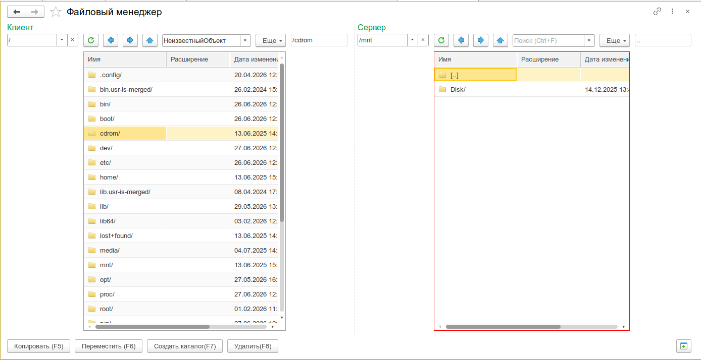
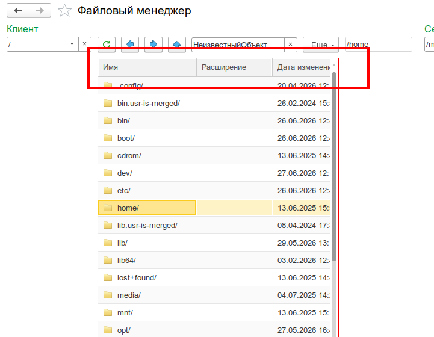
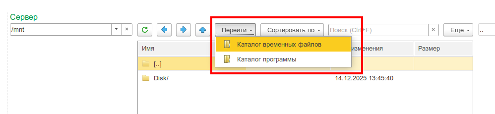
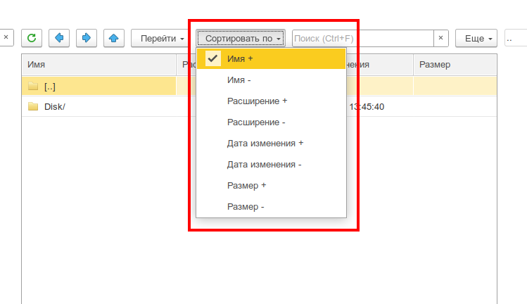
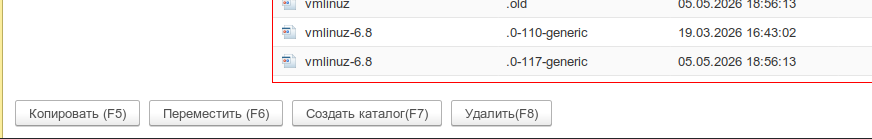

# Файловый менеджер

Двухпанельный файловый менеджер для работы с файловой системой клиента и сервера 1С. Копирование, перемещение, удаление, переименование файлов и каталогов между клиентской и серверной сторонами.

:::info
Форк обработки с [Infostart](https://infostart.ru/public/1027326/). [Разрешение автора](https://github.com/cpr1c/tools_ui_1c/issues/108).
:::

_Общий вид Файлового менеджера: две панели «Клиент» и «Сервер» с таблицами файлов и панелями навигации_


---

## Назначение

Инструмент для удобного переноса файлов между файловой системой клиентского компьютера и сервером 1С. Замена стандартным диалогам выбора файла, когда требуется массовое копирование, перемещение или администрирование файлов на обеих сторонах.

Пригодится для:

- **Переноса файлов клиент → сервер** — загрузка отчётов, шаблонов, макетов, внешних обработок на сервер
- **Выгрузки файлов сервер → клиент** — скачивание результатов, логов, выгруженных данных на локальный компьютер
- **Администрирования серверных каталогов** — очистка временных файлов, управление структурой каталогов на сервере
- **Работы в тонком/веб-клиенте** — когда нет прямого доступа к файловой системе сервера

---

## Основные возможности

- **Двухпанельный интерфейс** — левая панель «Клиент», правая панель «Сервер», активная панель выделяется красной рамкой
- **Копирование файлов** — с клиента на сервер и с сервера на клиент (через временное хранилище)
- **Перемещение файлов** — копирование с последующим удалением в источнике
- **Удаление файлов и каталогов** — с подтверждением, поддержка множественного выбора
- **Переименование** — инлайн-диалог ввода нового имени
- **Создание каталогов** — с проверкой существования (асинхронно на клиенте)
- **Навигация по каталогам** — двойной клик по папке для входа, кнопки «Назад», «Вперёд», «Вверх»
- **История переходов** — до 25 последних посещённых каталогов в выпадающем списке
- **Быстрый переход** — Рабочий стол, Каталог документов, Каталог программы, Временные файлы
- **Список дисков Windows** — отображение всех доступных дисков A-Z (только на Windows)
- **Сортировка** — по имени, расширению, дате изменения, размеру; возрастание/убывание; каталоги всегда первыми
- **Пиктограммы файлов** — иконки в зависимости от расширения (используется `УИ_КоллекцияПиктограммФайлов48`)
- **Открытие файлов** — двойной клик по файлу запускает приложение по умолчанию
- **Поиск по строке** — встроенный поиск в таблице файлов

---

## Быстрый старт

1. Откройте меню **Универсальные инструменты → Администрирование → Файловый менеджер [УИ]**
2. В левой панели («Клиент») выберите каталог на клиентской машине
3. В правой панели («Сервер») выберите каталог на сервере
4. Выделите файлы в активной панели и нажмите **Копировать** (или **Переместить**) — файлы перенесутся на противоположную сторону

---

## Интерфейс

### Панели «Клиент» и «Сервер»

Интерфейс разделён на две симметричных панели:

| Элемент            | Назначение                                                                     |
| ------------------ | ------------------------------------------------------------------------------ |
| **Поле пути**      | Текущий каталог; редактирование вручную или выбор из истории (до 25 записей)   |
| **Таблица файлов** | Список файлов и подкаталогов; колонки: Имя, Расширение, Дата изменения, Размер |
| **Панель команд**  | Кнопки навигации и операций над файлами                                        |

Активная панель выделяется **красной рамкой** — переключение происходит при клике на таблицу.

_Активная панель (Клиент) с красной рамкой, неактивная панель (Сервер) — без рамки_


### Колонки таблицы файлов

| Колонка            | Описание                                                         |
| ------------------ | ---------------------------------------------------------------- |
| **Имя**            | Имя файла (без расширения) или имя каталога с суффиксом `/`      |
| **Расширение**     | Расширение файла (`.txt`, `.docx`, `.epf` и т.д.)                |
| **Дата изменения** | Дата и время последнего изменения (формат `yyyy-MM-dd HH:mm:ss`) |
| **Размер**         | Размер файла в килобайтах (для каталогов не отображается)        |

### Панель команд (каждой панели)

| Кнопка             | Действие                                             |
| ------------------ | ---------------------------------------------------- |
| **Обновить**       | Перечитать содержимое текущего каталога              |
| **Назад** (`←`)    | Перейти к предыдущему каталогу в истории             |
| **Вперёд** (`→`)   | Перейти к следующему каталогу в истории              |
| **Вверх** (`↑`)    | Перейти на уровень выше (`..`)                       |
| **Перейти**        | Выпадающее меню быстрого перехода                    |
| **Сортировать по** | Выпадающее меню выбора поля и направления сортировки |

_Меню быстрого перехода: Рабочий стол, Документы, Каталог программы, Временные файлы_


_Меню сортировки по имени/расширению/дате/размеру с направлениями_


### Операции с файлами

Операции применяются к **выделенным строкам** в **активной панели** и переносят файлы на противоположную сторону:

| Команда             | Где находится                             | Действие                                            |
| ------------------- | ----------------------------------------- | --------------------------------------------------- |
| **Копировать в**    | Командная панель формы / контекстное меню | Копирует выделенные файлы на противоположную панель |
| **Переместить в**   | Командная панель формы / контекстное меню | Копирует + удаляет исходные файлы                   |
| **Удалить**         | Контекстное меню / кнопка                 | Удаляет файл/каталог (с подтверждением)             |
| **Создать каталог** | Контекстное меню / кнопка                 | Создаёт подкаталог в текущем каталоге               |

_Контекстное меню файла: Копировать, Переместить, Удалить, Переименовать, Создать каталог_


### Выделение нескольких файлов

Таблица поддерживает **множественный выбор** (MultiRow). Используйте стандартные клавиши:

- **Ctrl+клик** — добавить/снять выделение с отдельной строки
- **Shift+клик** — выделить диапазон строк

Операции копирования и перемещения применяются ко всем выделенным строкам одновременно.

### История переходов

Каждая панель ведёт собственную историю посещённых каталогов (до 25 записей). История отображается в выпадающем списке поля пути. Последний посещённый каталог всегда вверху списка. Кнопки **Назад/Вперёд** перемещаются по истории.

### Диски Windows

При пустом пути на Windows отображается список доступных дисков (A:\, B:\, C:\ и т.д.). Двойной клик по диску открывает его корневой каталог. На Linux путь по умолчанию — `/`.

---

## Сценарии использования

### Копирование файла с клиента на сервер

```
Задача: Загрузить внешнюю обработку "МояОбработка.epf" с рабочего места на сервер
```

1. В панели «Клиент» перейдите в каталог, где лежит файл
2. Выделите `МояОбработка.epf` в таблице
3. В панели «Сервер» перейдите в целевой каталог (например, `/home/usr/1c/upload/`)
4. Нажмите **Копировать** (или выберите в контекстном меню)
5. Файл будет скопирован через временное хранилище

### Копирование каталога с сервера на клиент

```
Задача: Скачать каталог с логами с сервера на локальный компьютер
```

1. В панели «Сервер» перейдите в каталог с логами
2. Выделите нужные файлы и подкаталоги
3. В панели «Клиент» перейдите в целевой каталог
4. Нажмите **Копировать** — структура подкаталогов будет сохранена

### Перенос каталога целиком

1. Выделите каталог в исходной панели
2. Нажмите **Переместить** — каталог и всё его содержимое будут скопированы на противоположную сторону, исходный каталог удалён

:::info
Перемещение выполняется как последовательность «Копировать» + «Удалить». При массовых операциях следите за индикатором состояния.
:::

### Очистка временных файлов на сервере

1. В панели «Сервер» нажмите **Перейти → Временные файлы**
2. Выделите файлы для удаления
3. Через контекстное меню выберите **Удалить**
4. Подтвердите удаление

### Создание структуры каталогов на сервере

1. Активируйте панель «Сервер» (клик по таблице)
2. Нажмите **Создать каталог** (или контекстное меню)
3. Введите имя нового каталога
4. Каталог будет создан, и панель перейдёт в него

---

## Ограничения

- **Версия платформы** — требуется платформа 1С не ниже 8.3.18 (поддержка асинхронных функций)
- **Переименование каталогов на сервере** — корректно переименовываются только файлы; переименование каталогов на серверной стороне ограничено возможностями платформы
- **Перемещение через временное хранилище** — при копировании больших объёмов данных используется временное хранилище 1С, что может создавать дополнительную нагрузку на память сервера
