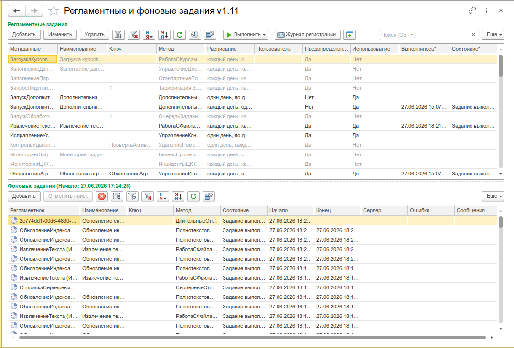
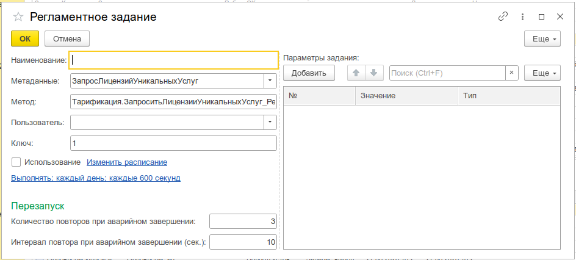
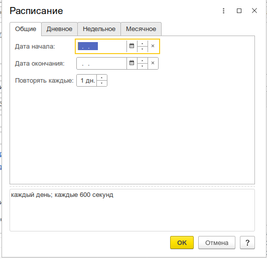
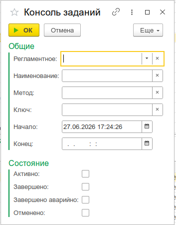

# Консоль заданий

Просмотр, настройка, запуск и мониторинг регламентных и фоновых заданий информационной базы 1С.

:::info
Форк [JobsConsole2019](https://github.com/kuzyara/JobsConsole2019.epf) (автор: Николай Кузнецов). [Разрешение автора](https://github.com/kuzyara/JobsConsole2019.epf/issues/6). Лицензия GPL3.
:::

_Общий вид Консоли заданий: верхняя таблица — регламентные задания, нижняя — фоновые задания, связанные с выбранным регламентным_


---

## Назначение

Консоль заданий — это инструмент администрирования, предоставляющий единый интерфейс для управления **регламентными** и **фоновыми** заданиями 1С. Собирает все задания в одном месте и позволяет выполнять с ними все необходимые операции без написания кода и без открытия конфигуратора.

Инструмент пригодится для:

- **Администрирования регламентных заданий** — просмотр, создание, редактирование, удаление, настройка расписания
- **Мониторинга фоновых заданий** — отслеживание состояния, длительности, ошибок выполнения
- **Ручного запуска заданий** — немедленный запуск регламентного задания по требованию
- **Отмены зависших заданий** — принудительная остановка активного фонового задания
- **Диагностики проблем** — просмотр сообщений пользователю и ошибок последнего выполнения
- **Настройки параметров** — редактирование параметров регламентных заданий

---

## Основные возможности

- **Сводный список** — регламентные и фоновые задания в одной форме, фоновые привязаны к регламентным по методу и ключу
- **Просмотр состояния** — для каждого регламентного задания отображается статус и дата последнего выполнения
- **Создание/Редактирование регламентных заданий** — выбор метаданных, настройка расписания, имени, ключа, пользователя, количества повторов при аварийном завершении
- **Редактирование параметров** — добавление, удаление и изменение значений параметров регламентного задания (массив произвольных типов)
- **Настройка расписания** — через стандартный диалог `ДиалогРасписанияРегламентногоЗадания`
- **Запуск вручную** — немедленный запуск как фонового задания на сервере, так и синхронный вызов на клиенте
- **Отмена фоновых заданий** — принудительная остановка активного задания
- **Защитный фильтр** — автоматический отбор фоновых заданий за последний час при открытии (предотвращает подвисание на базах с интенсивным запуском)
- **Отборы** — по ключу, наименованию, метаданным, предопределённости, использованию для регламентных; по дате, ключу, методу, состоянию, регламентному заданию — для фоновых
- **Автообновление** — настраиваемое автоматическое обновление обоих списков с интервалом от 5 секунд
- **Просмотр сообщений** — вывод сообщений пользователю от фонового задания
- **Журнал регистрации** — быстрый доступ к стандартному журналу регистрации 1С
- **Оптимизация производительности** — состояние выполнения запрашивается только для видимых строк (остальные — при активации строки), на больших базах не «подвисает»
- **Работа из любого клиента** — тонкий, толстый, веб-клиент (для веб-клиента ограничена работа ЖР)

_Диалог редактирования регламентного задания с таблицей параметров и расписанием_


_Стандартный диалог настройки расписания регламентного задания_


_Диалог отбора фоновых заданий с фильтрами по дате, состоянию и регламентному заданию_


---

## Быстрый старт

1. Откройте меню **Универсальные инструменты → Консоль заданий**
2. В верхней таблице отобразится список всех регламентных заданий, в нижней — фоновые задания (с автоотбором за последний час)
3. Выберите регламентное задание и нажмите **Запустить задание** для немедленного выполнения
4. Для просмотра деталей дважды кликните по строке регламентного задания — откроется диалог редактирования
5. Для просмотра сообщений фонового задания кликните на ячейку с числом сообщений в колонке «Сообщения»

---

## Сценарии использования

### Просмотр и мониторинг всех заданий

```
Задача: Узнать, какие регламентные задания работают в базе, когда выполнялись, и какие
        фоновые задания были запущены за последний час
```

1. Откройте **Универсальные инструменты → Консоль заданий**
2. Верхняя таблица покажет все регламентные задания, их расписание и состояние последнего выполнения
3. Нижняя таблица покажет фоновые задания за последний час (защитный фильтр)
4. Для просмотра более ранних фоновых заданий настройте отбор (кнопка **Отбор**) или отключите защитный фильтр

### Немедленный запуск регламентного задания

```
Задача: Запустить обмен данными сейчас, не дожидаясь расписания
```

1. Выделите нужное регламентное задание
2. Нажмите **Запустить задание** — задание будет выполнено как фоновое на сервере
3. После запуска список автоматически обновится, а новое фоновое задание будет выделено

При необходимости выполнить задание **в текущем сеансе** :

1. Выделите задание
2. Нажмите **Выполнить-> На сервере** — метод будет вызван синхронно

### Создание нового регламентного задания

```
Задача: Создать новое регламентное задание с параметрами и расписанием
```

1. Нажмите **Добавить** (Ins) в командной панели регламентных заданий
2. В диалоге выберите **Метаданные** — метод подставится автоматически
3. Заполните **Наименование**, **Ключ**, **Пользователя**
4. Настройте **Расписание** (клик по тексту расписания или кнопка)
5. В таблице **Параметры** добавьте строки с нужными значениями (поддерживаются любые типы)
6. Нажмите **ОК** — задание будет сохранено

### Редактирование параметров существующего задания

```
Задача: В штатной консоли БСП нельзя изменить параметры регламентного задания — только
        расписание и флажок использования. В Консоли заданий это возможно.
```

1. Выделите регламентное задание и нажмите **Изменить** (F2)
2. В диалоге перейдите к таблице **Параметры**
3. Добавьте, измените или удалите строки с нужными значениями
4. Нажмите **ОК** — изменения сохранятся

### Настройка расписания

```
Задача: Изменить расписание выполнения задания с ежечасного на ежедневное в 22:00
```

1. Выделите задание и нажмите **Расписание**
2. Откроется стандартный диалог `ДиалогРасписанияРегламентногоЗадания`
3. Настройте периодичность: «Ежедневно», время старта 22:00
4. Нажмите **ОК** — расписание сохранится

### Отмена зависшего фонового задания

```
Задача: Регламентное задание выполняется больше суток (зависло) — нужно его остановить
```

1. В нижней таблице найдите активное фоновое задание (состояние «Активно»)
2. Выделите его и нажмите **Отменить**
3. Задание будет принудительно остановлено (сервер пошлёт сигнал отмены)

### Поиск проблем по ошибкам и сообщениям

```
Задача: Регламентное задание завершается аварийно — нужно понять причину
```

1. Найдите задание в верхней таблице — в колонке **Состояние** будет `ЗавершеноАварийно`
2. Посмотрите колонку **Ошибки** в нижней таблице (связанное фоновое задание)
3. Кликните на число в колонке **Сообщения** фонового задания — отобразятся все сообщения пользователю
4. При необходимости нажмите **Журнал регистрации** для просмотра системного журнала

### Настройка автообновления списка

```
Задача: При запуске тяжёлого задания нужно следить за его статусом в реальном времени
```

1. Нажмите **Настройка списка** (верхняя или нижняя командная панель)
2. Включите флажок **Автообновление**
3. Укажите интервал (например, 10 секунд)
4. Нажмите **ОК** — список будет обновляться автоматически
5. Отключить автообновление можно повторным вызовом диалога или кнопкой-флажком

### Отбор фоновых заданий по регламентному

```
Задача: Увидеть только те фоновые задания, которые относятся к конкретному регламентному
```

1. Выделите регламентное задание в верхней таблице
2. Нажмите **Отбор по текущему** — нижняя таблица покажет только фоновые задания, запущенные от этого регламентного задания
3. Для сброса отбора нажмите **Отключить отбор**

### Массовое удаление неиспользуемых регламентных заданий

```
Задача: В базе накопились дублирующиеся неиспользуемые регламентные задания — нужно их удалить
```

1. Установите отбор по **Не предопределённые** через диалог отбора
2. Выделите несколько строк (Ctrl+клик, Shift+клик)
3. Нажмите **Удалить** (Del)
4. Система проверит, что среди выделенных нет предопределённых, и удалит их

---

## Ограничения

- **Предопределённые задания** — удалить их через консоль нельзя (защита на уровне платформы), только через конфигуратор
- **Получение состояния на больших базах** — при первом открытии и большом количестве заданий состояние последнего выполнения загружается с таймаутом (200 мс); для всех строк сразу нужно выполнить полное обновление кнопкой «Обновить регламентные задания»
