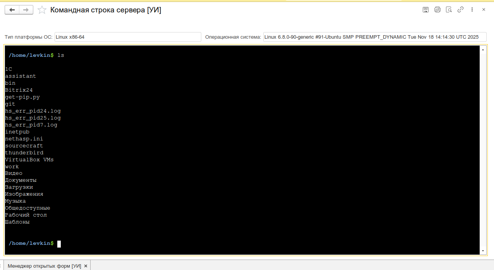
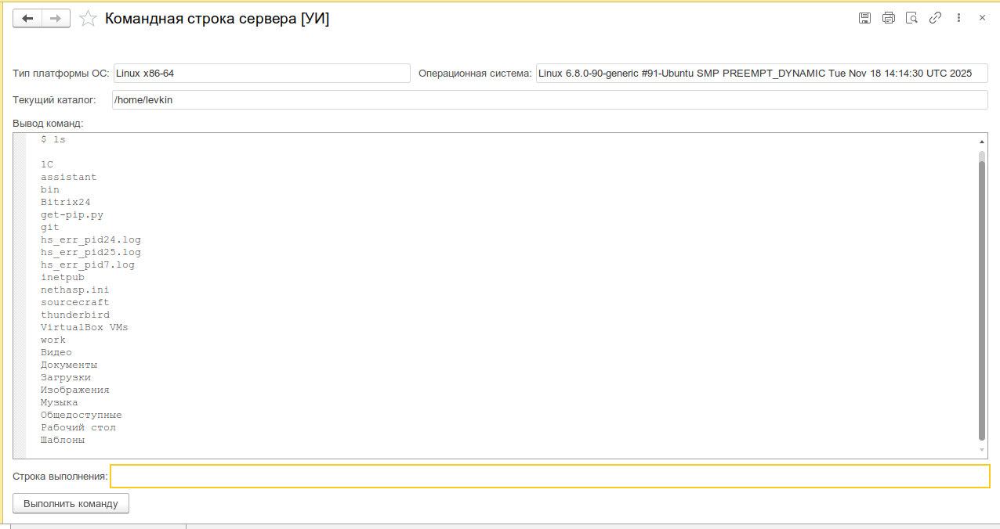
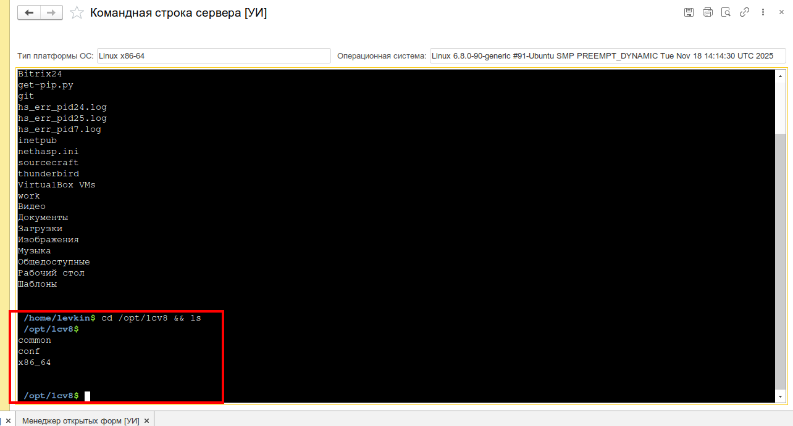

# Командная строка сервера

Встроенный эмулятор терминала ОС прямо в форме 1С:Предприятие. Позволяет выполнять команды операционной системы на сервере не выходя из интерфейса 1С.

_Основной вид инструмента: HTML-терминал (OneTerminal) с выводом команды `ls`_


---

## Назначение

Инструмент предоставляет доступ к командной оболочке сервера, на котором работает кластер 1С. Выполнение команд происходит на стороне сервера 1С (не на клиенте). Это полноценный shell-доступ, ограниченный правами учётной записи серверного кластера.

Пригодится для:

- **Диагностики сервера** — проверка доступности ресурсов (`ping`, `curl`), состояния служб (`systemctl status`)
- **Администрирования файловой системы** — навигация, просмотр и операции с файлами на сервере
- **Работы с СУБД** — выполнение SQL-запросов через `psql` или `sqlcmd`
- **Работы с Docker/контейнерами** — `docker ps`, `docker logs`, `docker exec`
- **Быстрой отладки** — запуск скриптов, проверка переменных окружения, сетевые проверки

:::warning
Инструмент выполняет команды с правами учётной записи серверного кластера 1С. Будьте внимательны — это прямой доступ к ОС сервера.
:::

---

## Основные возможности

- **Полноценный эмулятор терминала** на базе [xterm.js](https://xtermjs.org/) (v3.14.5) — рендеринг ANSI-цветов, поддержка Unicode, автоматическое растягивание на всю доступную область формы
- **Навигация в файловой системе** — `cd`, смена каталога, промпт отображает текущий путь (`user@host:/path$`)
- **История команд** — навигация по ранее введённым командам стрелками `↑`/`↓`
- **Автодополнение по Tab** — одиночный `Tab` дополняет до наибольшего общего префикса, двойной `Tab` (500 мс) выводит список всех доступных команд в `PATH`
- **Многострочный ввод** — поддержка длинных команд с переносом, навигация `←`/`→`, `Home`/`End`, `Backspace`, `Delete`
- **Обнаружение ссылок** — URL в выводе команд кликабельны (аддоны `web-links`)
- **Команда `clear`** — обрабатывается локально в браузере, очищает экран без вызова сервера
- **Переменные окружения** — просмотр и модификация переменных окружения перед выполнением команды; таблица `ПеременныеОкружения` автоматически синхронизируется после каждого запуска
- **Информация о сервере** — отображение версии ОС и типа платформы сервера 1С (`Windows`, `Linux`)
- **Fallback-режим** — на платформах без WebKit (старые версии 1С, Linux-клиент) автоматически включается режим нативных полей 1С без HTML-терминала
- **Кроссплатформенность** — работает на Windows и Linux; автодополнение адаптируется под ОС

---

## Быстрый старт

1. Откройте меню **Универсальные инструменты → Администрирование → Командная строка сервера [УИ]**
2. Дождитесь загрузки терминала — в заголовке отобразится информация об ОС и типе платформы
3. Введите команду в промпте, например `whoami` или `ping -c 4 8.8.8.8`, и нажмите `Enter`
4. Результат выполнения отобразится в терминале
5. Для смены каталога используйте `cd /path`

```shell
user@server:/var/www$ whoami
usrsrv1c
user@server:/var/www$ ping -c 2 8.8.8.8
PING 8.8.8.8 (8.8.8.8) 56(84) bytes of data.
64 bytes from 8.8.8.8: icmp_seq=1 ttl=118 time=12.3 ms
64 bytes from 8.8.8.8: icmp_seq=2 ttl=118 time=11.8 ms
```

---

## Интерфейс

### Верхняя панель (информация о сервере)

| Элемент                  | Назначение                                                    |
| ------------------------ | ------------------------------------------------------------- |
| **Операционная система** | Версия ОС сервера (например, `Microsoft Windows Server 2022`) |
| **Тип платформы ОС**     | Тип платформы сервера 1С (`Windows x64` / `Linux x64`)        |

### HTML-терминал (основной режим)

При загрузке формируется HTML-документ с интерфейсом OneTerminal.

_Схема обмена: JS отправляет команду → 1С выполняет на сервере → возвращает вывод_

### Fallback-режим (нативные поля 1С)

На платформах без WebKit вместо HTML-терминала отображается страница с элементами управляемой формы:

| Элемент               | Назначение                                          |
| --------------------- | --------------------------------------------------- |
| **Текущий каталог**   | Поле с путём текущего рабочего каталога (read-only) |
| **Вывод команд**      | Поле текстового документа с результатами выполнения |
| **Строка выполнения** | Поле ввода команды                                  |
| **Выполнить команду** | Кнопка отправки команды (Enter)                     |

_Режим нативных полей 1С (fallback на платформе без WebKit)_


## Сценарии использования

### Навигация и просмотр файлов на сервере

```
Задача: Посмотреть содержимое каталога логов сервера 1С
```

1. Откройте **Командная строка сервера**
2. Выполните `cd /var/log/1c/` (Linux) или `cd C:\Program Files\1cv8\logs` (Windows)
3. Введите `ls -la` или `dir`
4. Промпт отобразит новый текущий каталог

```shell
user@server:/opt$ cd /var/log/1c
user@server:/var/log/1c$ ls -la
total 128
drwxr-xr-x  2 usrsrv1c usrsrv1c   4096 Jul 27 10:00 .
drwxr-xr-x 10 root     root       4096 Jul 21 08:00 ..
-rw-r--r--  1 usrsrv1c usrsrv1c  57034 Jul 27 10:00 1c.log
```

_Навигация по файловой системе сервера через терминал 1С_


### Сетевая диагностика

```
Задача: Проверить доступность сервера лицензирования
```

```shell
user@server:~$ ping -c 3 license-server.local
PING license-server.local (10.0.1.50) 56(84) bytes of data.
64 bytes from 10.0.1.50: icmp_seq=1 ttl=64 time=0.8 ms
64 bytes from 10.0.1.50: icmp_seq=2 ttl=64 time=0.6 ms
64 bytes from 10.0.1.50: icmp_seq=3 ttl=64 time=0.7 ms
```

```
Задача: Проверить HTTP-ответ веб-сервера
```

```shell
user@server:~$ curl -I http://localhost:8080/example-service
HTTP/1.1 200 OK
Content-Type: application/json
Date: Mon, 27 Jul 2026 10:05:00 GMT
```

### Работа с Docker

```
Задача: Посмотреть запущенные контейнеры на сервере
```

```shell
user@server:~$ docker ps
CONTAINER ID   IMAGE                            STATUS        NAMES
a1b2c3d4e5f6   postgres:15                      Up 2 weeks    pg-main
f6e5d4c3b2a1   nginx:alpine                     Up 5 days     nginx-proxy
```

### Выполнение SQL-запроса через psql

```
Задача: Выполнить простой SQL-запрос к PostgreSQL прямо из 1С
```

```shell
user@server:~$ PGPASSWORD=mypass psql -h localhost -U postgres -d mydb -c "SELECT COUNT(*) FROM _Reference37;"
 count
-------
  1542
(1 row)
```

---

## Архитектура

Инструмент состоит из трёх компонентов:

| Компонент                                | Назначение                                               |
| ---------------------------------------- | -------------------------------------------------------- |
| **OneTerminal (JS)**                     | Frontend-терминал на xterm.js, встроенный в ПолеHTML     |
| **Модуль формы 1С**                      | BSL-логика: приём событий, вызов команд, обновление UI   |
| `УИ_ОбщегоНазначения`                    | Серверное выполнение команд через `ЗапуститьПриложение`  |
| `УИ_РаботаСКоманднойСтрокойКлиентСервер` | Парсер shell-команд (используется в других инструментах) |

Подробнее о фронтенде: [LevkinSergey/OneTerminal](https://github.com/LevkinSergey/OneTerminal) на GitHub.

---

## Ограничения

### Каждая команда — отдельный процесс

Инструмент **не поддерживает интерактивные сеансы**. Каждое нажатие `Enter` порождает новый процесс ОС через `ЗапуститьПриложение`, команде передаётся строка для выполнения, после завершения процесса в терминал возвращается `stdout`/`stderr`.

Это означает, что **не будут работать**:

- Интерактивные утилиты — `top`, `htop`, `nano`, `vim`, `mc`
- Команды, требующие ввода — `ssh user@host` (без ключей), `telnet`, `ftp`
- Бесконечные процессы — `tail -f`, `ping -t` (Windows), `journalctl -f`
- Команды, ожидающие подтверждения — `apt install`, `rm -i`, `systemctl restart` (на некоторых настройках sudo)

```shell
# ❌ Не сработает — процесс не завершится
user@server:~$ top

# ✅ Корректно — процесс завершается и отдаёт вывод
user@server:~$ top -bn1
```

### Состояние между командами

Сохраняется только **текущий каталог** и **переменные окружения**. Всё остальное состояние (алиасы, сессионные настройки shell) между вызовами не persists — каждый запуск происходит в чистом окружении.

### Права выполнения

Команды выполняются с правами учётной записи, от которой работает серверный кластер 1С (`usrsrv1c` на Linux, `USR1CV8` на Windows). Команды, требующие `root`/`sudo` или права администратора, не будут выполнены без предварительной настройки `sudoers`.
