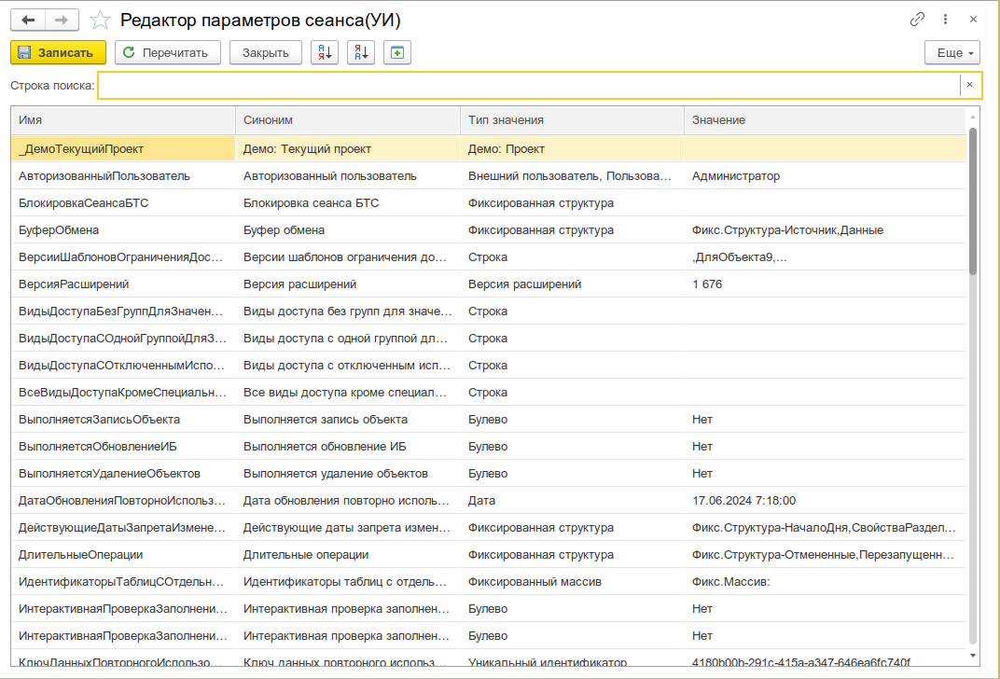

# Редактор параметров сеанса

Просмотр и изменение значений всех параметров сеанса информационной базы 1С в одном интерфейсе — без написания кода и без открытия конфигуратора.

_Общий вид Редактора параметров сеанса: поле поиска сверху, таблица параметров с колонками Имя, Синоним, Тип значения, Значение_


---

## Назначение

Редактор параметров сеанса — это инструмент администрирования и отладки, который собирает все параметры сеанса, определённые в метаданных конфигурации, в единую таблицу и позволяет просматривать и изменять их текущие значения в рамках текущего сеанса.

Инструмент пригодится для:

- **Просмотра значений всех параметров сеанса** — мгновенная сводка по всей конфигурации, без точечного написания `ПараметрыСеанса.ИмяПараметра` в консоли кода
- **Изменения значений параметров сеанса** — установка нужного значения с контролем по типу (ссылки, примитивы, перечисления, `Null` и др.)
- **Диагностики и отладки** — быстрая проверка, какое значение фактически хранится в параметре перед выполнением кода, который его читает
- **Обучения и демонстрации** — наглядный показ работы параметров сеанса консультантам и разработчикам без погружения в метаданные и конфигуратор

---

## Основные возможности

- **Сводная таблица** — все параметры сеанса в одной таблице с колонками: Имя, Синоним, Тип значения, Значение
- **Редактирование значений** — редактирование значения любого параметра с кнопкой выбора (учитывает тип параметра) и кнопкой очистки
- **Поддержка любых типов** — ссылки, примитивы (число, строка, дата, булево), хранилища значения, уникальные идентификаторы, двоичные данные, описания типов, фиксированные коллекции, системные перечисления, `Null`
- **Подсветка изменений** — изменённые строки выделяются бледно-бирюзовым фоном
- **Поиск по имени/синониму** — текстовое поле поиска с фильтрацией строк в реальном времени
- **Привилегированный режим** — чтение значений всех параметров сеанса, включая те, к которым у текущего пользователя нет прямого доступа
- **Защита от потери данных** — при нажатии «Перечитать» с несохранёнными изменениями появляется диалог с предложением сохранить
- **Сортировка** — по любому столбцу таблицы (по возрастанию/убыванию)

---

## Быстрый старт

1. Откройте меню **Универсальные инструменты → Редактор параметров сеанса [УИ]**
2. В таблице отобразятся все параметры сеанса конфигурации с их текущими значениями
3. Чтобы изменить значение, кликните в ячейку колонки **Значение** и выберите или введите новое значение
4. Нажмите **Записать** — изменения будут применены к текущему сеансу
5. Для обновления данных из базы нажмите **Перечитать**


---

## Интерфейс

### Поле поиска

Текстовое поле в верхней части формы. Фильтрация строк таблицы выполняется по вхождению подстроки в **Имя** или **Синоним** параметра (регистронезависимо). Кнопка очистки (крестик) сбрасывает фильтр и показывает все строки.

### Таблица параметров сеанса

| Колонка        | Режим        | Описание                                                              |
| -------------- | ------------ | --------------------------------------------------------------------- |
| **Имя**        | Только чтение | Имя параметра сеанса в метаданных (например, `ТекущийПользователь`)    |
| **Синоним**    | Только чтение | Синоним параметра сеанса, заданный в конфигураторе                    |
| **Тип значения**| Только чтение | Описание типа параметра (ссылка, строка, число и т.д.)               |
| **Значение**   | Редактируется | Текущее значение параметра; кнопка выбора открывает диалог подбора значения, кнопка очистки сбрасывает значение |

Изменённые строки подсвечиваются **бледно-бирюзовым** цветом фона для наглядного контроля того, какие параметры будут записаны.

### Командная панель формы

| Кнопка               | Действие                                                      |
| -------------------- | ------------------------------------------------------------- |
| **Записать**         | Сохраняет изменения в текущий сеанс                           |
| **Перечитать**       | Перезагружает значения всех параметров сеанса из сеанса       |
| **Закрыть**          | Закрывает форму редактора                                     |
| **Сортировка (↑/↓)** | Сортирует строки таблицы по выбранному столбцу                |

При нажатии **Перечитать**, если есть несохранённые изменения, появляется диалог: *«Есть изменения. Произвести запись перед чтением?»* с вариантами «Да», «Нет», «Отмена».

---

## Сценарии использования

### Просмотр всех параметров сеанса

```text
Задача: Узнать, какие параметры сеанса используются в конфигурации и какие у них
        текущие значения — для диагностики или ознакомления
```

1. Откройте **Редактор параметров сеанса**
2. Вся информация — в таблице: имена, синонимы, типы и текущие значения
3. При необходимости отсортируйте таблицу по нужному столбцу

### Изменение значения параметра сеанса

```text
Задача: Установить параметр сеанса "ТекущийПользователь" в значение
        "Справочник.Пользователи.ИвановИван" для тестирования сценария
```

1. Найдите строку с нужным параметром (используйте поиск по имени/синониму)
2. Кликните в колонку **Значение**
3. Нажмите кнопку выбора (три точки) — откроется диалог подбора значения, учитывающий тип параметра
4. Выберите нужное значение
5. Строка подсветится бледно-бирюзовым — признак изменения
6. Нажмите **Записать**

### Очистка значения параметра сеанса

```text
Задача: Сбросить значение параметра сеанса в неопределено (Null)
```

1. Найдите нужный параметр
2. Кликните в колонку **Значение**
3. Нажмите кнопку очистки (крестик)
4. Значение будет установлено в `Null`
5. Строка подсветится — нажмите **Записать**

### Поиск параметра по имени или синониму

```text
Задача: В конфигурации 50+ параметров сеанса — нужно быстро найти параметр,
        отвечающий за текущий период
```

1. В поле поиска введите часть имени или синонима, например `период` или `Period`
2. Таблица отфильтруется — останутся только строки, где имя или синоним содержат введённую подстроку
3. Для сброса фильтра очистите поле поиска

### Диагностика: проверка значения перед выполнением кода

```text
Задача: Код не работает, предположительно из-за неверного значения параметра сеанса —
        нужно проверить фактическое значение перед выполнением
```

1. Откройте **Редактор параметров сеанса**
2. Найдите проверяемый параметр
3. Посмотрите фактическое значение в колонке **Значение**
4. При необходимости скорректируйте значение и нажмите **Записать**
5. Перезапустите проблемный код — ошибка должна исчезнуть

---

## Ограничения

- **Изменение применимо только к текущему сеансу** — запись параметров влияет исключительно на текущий сеанс пользователя. Другие пользователи и сеансы не затронуты.
- **Нельзя добавить или удалить параметры сеанса** — инструмент только редактирует значения существующих параметров. Для добавления/удаления параметров сеанса требуется конфигуратор.
- **Защищённые параметры сеанса** — доступ к чтению/записи ограничен правами, настроенными на параметр сеанса в конфигурации. Привилегированный режим включается только на время чтения.
