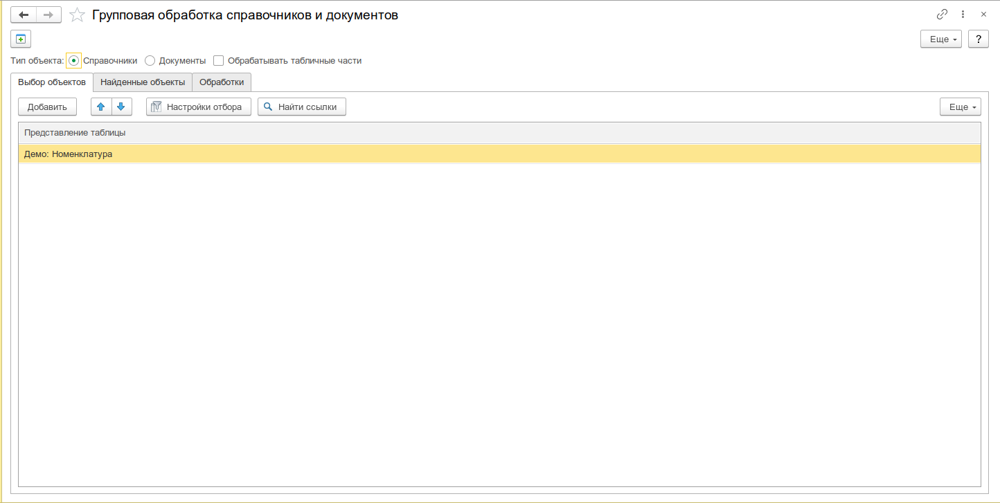
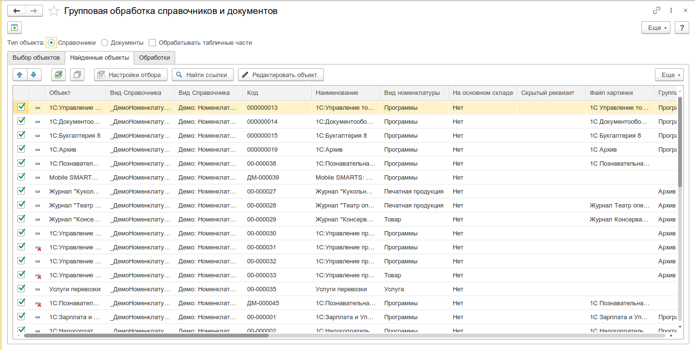
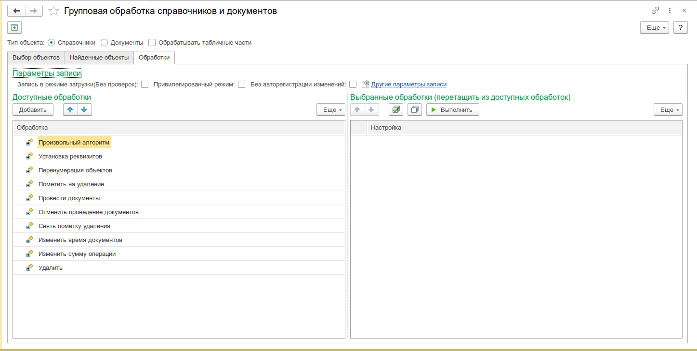
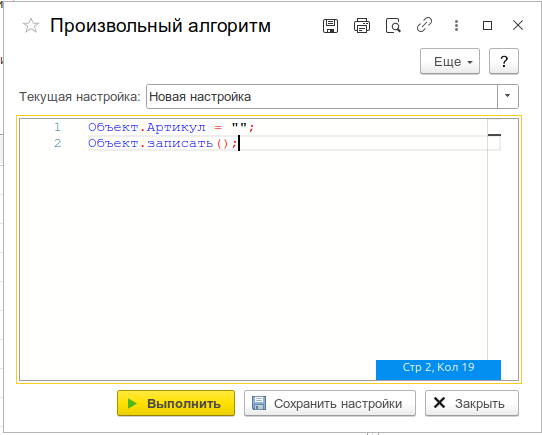
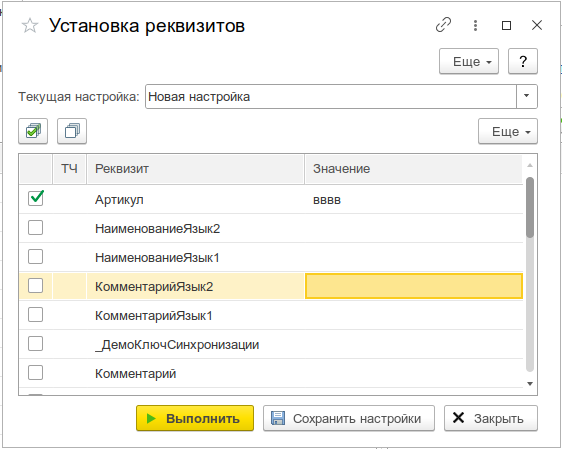
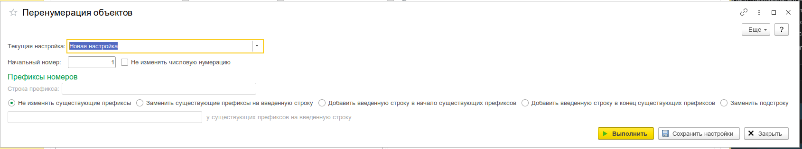

# Групповая обработка справочников и документов

**Групповая обработка справочников и документов** — универсальный инструмент для поиска объектов в справочниках и документах по произвольным условиям с последующей массовой обработкой найденных объектов.

Инструмент реализован как единая обработка-контейнер, внутри которой доступны предустановленные обработчики (подформы), а также предусмотрена возможность добавления собственных через механизм шаблонов.



---

## Область применения

Типовые сценарии использования:

- **Массовое изменение реквизитов** — установка значений реквизитов для группы справочников или документов (например, смена ставки НДС, ответственного, подразделения).
- **Проведение / отмена проведения документов** — групповая обработка докустов за период.
- **Перенумерация объектов** — сквозная перенумерация справочников или документов с настройкой префиксов.
- **Пометка на удаление / снятие пометки** — массовая пометка на удаление или её снятие.
- **Изменение времени документов** — сдвиг времени документов на начало/конец дня или на произвольное время.
- **Изменение сумм операций** — массовое изменение суммовых реквизитов (установка, увеличение/уменьшение на сумму или процент).
- **Произвольный алгоритм** — выполнение произвольного кода на встроенном языке 1С для каждого объекта выборки.
- **Каскадная обработка** — последовательное выполнение нескольких обработок из списка выбранных за один проход.

---

## Архитектура

### Общая схема работы

Инструмент состоит из двух логических частей:

1. **Форма подбора и обработки объектов** ([`ПодборИОбработка`](src/Инструменты/src/DataProcessors/УИ_ГрупповаяОбработкаСправочниковИДокументов/Forms/ПодборИОбработка/Module.bsl)) — основная форма, отвечающая за:
   - выбор объекта поиска (справочник или документ);
   - настройку отборов через СКД или произвольный запрос;
   - выполнение поиска и отображение результатов;
   - координацию выбранных обработок.

2. **Подформы-обработчики** — каждая реализует конкретный вид обработки. Все подформы зарегистрированы в дереве доступных обработок через [`ЗагрузитьОбработки`](src/Инструменты/src/DataProcessors/УИ_ГрупповаяОбработкаСправочниковИДокументов/ObjectModule.bsl:93).

### Механизм поиска объектов

Поиск реализован в процедуре [`НайтиСсылкиПоОтбору`](src/Инструменты/src/DataProcessors/УИ_ГрупповаяОбработкаСправочниковИДокументов/Forms/ПодборИОбработка/Module.bsl:268). Поддерживаются два режима:

#### Режим 0 — Отбор по реквизитам (СКД)

- Динамически строится запрос `ВЫБРАТЬ ... ИЗ Справочник.<Имя> КАК _Таблица` (или `Документ.<Имя>`).
- В запрос включаются все реквизиты объекта метаданных и реквизиты табличных частей.
- Условия отбора накладываются через механизм СКД (форма [`ФормаОтбора`](src/Инструменты/src/DataProcessors/УИ_ГрупповаяОбработкаСправочниковИДокументов/Forms/ФормаОтбора/Module.bsl)).
- Дополнительно работает **поиск по строке** — ищет подстроку во всех строковых полях объекта (включая `Наименование`, `Код`, `Номер` и строковые реквизиты) через оператор `ПОДОБНО`.

#### Режим 1 — Произвольный запрос

- Пользователь пишет произвольный текст запроса на языке 1С.
- Поддерживаются параметры запроса, в том числе вычисляемые выражения.
- Результат выгружается в таблицу найденных объектов.

### Механизм обработки объектов

Каждая подформа-обработчик экспортирует метод [`ВыполнитьОбработку`](src/Инструменты/src/DataProcessors/УИ_ГрупповаяОбработкаСправочниковИДокументов/Forms/ПодборИОбработка/Module.bsl:381), который вызывается из основной формы для каждой выбранной обработки. Последовательность:

1. Основная форма перебирает строки таблицы **«Выбранные обработки»**.
2. Для каждой включённой обработки открывается соответствующая подформа с параметрами (настройки, отбор, найденные объекты).
3. Вызывается `ВыполнитьОбработку()` — обработка выполняется последовательно для каждого найденного объекта.
4. Поддерживается **индикатор прогресса** с отображением времени выполнения и возможностью прерывания.

Запись объектов в базу выполняется через [`УИ_ОбщегоНазначения.ЗаписатьОбъектВБазу`](src/Инструменты/src/CommonModules/УИ_ОбщегоНазначения/Module.bsl) с учётом параметров записи формы (режим записи, проведение, транзакционность).

---

## Интерфейс и сценарий работы

### Главная форма — «Подбор и обработка объектов»

Основная форма разделена на две закладки.

#### Закладка «Найденные объекты»

**Поля формы:**

| Поле                             | Описание                                                                                                                                                                                                                                                                                     |
| -------------------------------- | -------------------------------------------------------------------------------------------------------------------------------------------------------------------------------------------------------------------------------------------------------------------------------------------- |
| **Объект поиска**                | Выбор типа объекта: справочник или документ. Список формируется динамически из метаданных конфигурации с проверкой прав `Просмотр`.                                                                                                                                                          |
| **Виды объектов**                | Таблица выбора конкретных объектов метаданных (один или несколько справочников/документов). Открывает форму [`ФормаВыбораТаблиц`](src/Инструменты/src/DataProcessors/УИ_ГрупповаяОбработкаСправочниковИДокументов/Forms/ФормаВыбораТаблиц/Module.bsl) с деревом объектов и табличных частей. |
| **Обрабатывать табличные части** | Флаг — если включён, поиск и обработка выполняются построчно по табличным частям выбранных объектов.                                                                                                                                                                                         |
| **Строка поиска**                | Быстрый поиск подстроки во всех строковых полях. Комбинация клавиш **F9**.                                                                                                                                                                                                                   |
| **Настройки отбора**             | Открывает форму отбора на базе СКД с возможностью переключения в режим произвольного запроса.                                                                                                                                                                                                |

**Действия:**

- **Найти ссылки** — выполнить поиск по заданным условиям.
- **Выбрать все / Отменить выбор всех** — массовое управление флажками в таблице результатов.
- Результаты поиска отображаются в таблице с динамически формируемыми колонками (все реквизиты объекта). Для справочников отображается иконка группы/элемента и пометки удаления.

_Главная форма — закладка «Найденные объекты» с результатами поиска, строкой поиска и настройками отбора._


#### Закладка «Обработки»

**Элементы формы:**

| Элемент                 | Описание                                                                                                                                                     |
| ----------------------- | ------------------------------------------------------------------------------------------------------------------------------------------------------------ |
| **Доступные обработки** | Дерево: первый уровень — типы обработок, второй уровень — сохранённые настройки для каждой обработки. Двойной щелчок / **Enter** открывает форму настройки.  |
| **Выбранные обработки** | Список обработок, добавленных для выполнения. Добавляются перетаскиванием из дерева доступных. Флажок включает/исключает обработку из группового выполнения. |
| **Выполнить**           | Запускает последовательное выполнение всех включённых обработок из списка выбранных.                                                                         |

_Главная форма — закладка «Обработки» с деревом доступных обработок и списком выбранных._


---

## Доступные обработки

### 1. Произвольный алгоритм

Форма: [`ПроизвольныйАлгоритм`](src/Инструменты/src/DataProcessors/УИ_ГрупповаяОбработкаСправочниковИДокументов/Forms/ПроизвольныйАлгоритм/Module.bsl)

Выполняет произвольный код на встроенном языке 1С для каждого объекта выборки. Код вводится в редакторе с подсветкой синтаксиса (на базе компонента `УИ_РедакторКода`).

**Переменные, доступные в коде:**

| Переменная | Тип                  | Описание                                                                |
| ---------- | -------------------- | ----------------------------------------------------------------------- |
| `Объект`   | Объект               | Текущий обрабатываемый объект (получен через `Ссылка.ПолучитьОбъект()`) |
| `СтрокаТЧ` | СтрокаТабличнойЧасти | Если включён режим обработки табличных частей — текущая строка ТЧ       |

**Пример:**

```bsl
Объект.Наименование = "Новое наименование";
Объект.Записать();
```

Поддерживает сохранение настроек (текст алгоритма) для повторного использования.

_Форма настройки произвольного алгоритма — редактор кода с подсветкой синтаксиса._


---

### 2. Установка реквизитов

Форма: [`УстановкаРеквизитов`](src/Инструменты/src/DataProcessors/УИ_ГрупповаяОбработкаСправочниковИДокументов/Forms/УстановкаРеквизитов/Module.bsl)

Позволяет массово установить значения реквизитов (включая реквизиты табличных частей) для выбранных объектов.

**Параметры:**

| Параметр       | Описание                                                                                          |
| -------------- | ------------------------------------------------------------------------------------------------- |
| **Реквизиты**  | Таблица со списком доступных реквизитов. Для каждого: флажок включения, имя, тип, новое значение. |
| **РеквизитТЧ** | Признак, что реквизит принадлежит табличной части (заполняется автоматически).                    |

**Алгоритм работы** ([`ОбработатьОбъект`](src/Инструменты/src/DataProcessors/УИ_ГрупповаяОбработкаСправочниковИДокументов/Forms/УстановкаРеквизитов/Module.bsl:26)):

1. Для каждого включённого реквизита проверяется флаг `Выбрать`.
2. Если реквизит табличной части — значение устанавливается в `СтрокаТЧ[Реквизит.Реквизит]`.
3. Иначе — в `Объект[Реквизит.Реквизит]`.
4. Объект записывается через `УИ_ОбщегоНазначения.ЗаписатьОбъектВБазу`.

_Форма установки реквизитов — таблица реквизитов с флажками и новыми значениями._


---

### 3. Перенумерация объектов

Форма: [`ПеренумерацияОбъектов`](src/Инструменты/src/DataProcessors/УИ_ГрупповаяОбработкаСправочниковИДокументов/Forms/ПеренумерацияОбъектов/Module.bsl)

Выполняет перенумерацию справочников (код) или документов (номер) с гибкой настройкой префиксов и начального номера.

**Параметры:**

| Параметр                           | Описание                                                                                                                                   |
| ---------------------------------- | ------------------------------------------------------------------------------------------------------------------------------------------ |
| **Начальный номер**                | Число, с которого начинается нумерация.                                                                                                    |
| **Не изменять числовую нумерацию** | Флаг — если установлен, перезаписывается только префикс, числовая часть остаётся без изменений.                                            |
| **Способ обработки префиксов**     | 1 — оставить как есть; 2 — заменить на указанный префикс; 3 — добавить префикс слева; 4 — добавить префикс справа; 5 — заменить подстроку. |
| **Строка префикса**                | Значение префикса (для способов 2–5).                                                                                                      |
| **Заменяемая подстрока**           | Подстрока для замены (для способа 5).                                                                                                      |

**Алгоритм работы** ([`ОбработатьОбъект`](src/Инструменты/src/DataProcessors/УИ_ГрупповаяОбработкаСправочниковИДокументов/Forms/ПеренумерацияОбъектов/Module.bsl:41)):

1. Определяется тип номера (числовой или строковый) и длина номера из метаданных.
2. Формируется новый номер с учётом префикса и числовой части.
3. При возникновении коллизии (номер уже занят) — номер увеличивается на 1, а конфликтующий объект получает номер из «резервного диапазона» (максимальный номер минус индекс).
4. После основного цикла выполняется проверка неуникальных номеров ([`ПроверитьНеУникальныеНомера`](src/Инструменты/src/DataProcessors/УИ_ГрупповаяОбработкаСправочниковИДокументов/Forms/ПеренумерацияОбъектов/Module.bsl:148)).

_Форма перенумерации — настройка начального номера, префикса и способа обработки._


---

### 4. Пометить на удаление

Форма: [`ПометитьНаУдаление`](src/Инструменты/src/DataProcessors/УИ_ГрупповаяОбработкаСправочниковИДокументов/Forms/ПометитьНаУдаление/Module.bsl)

Устанавливает пометку удаления (`ПометкаУдаления = Истина`) для всех выбранных объектов. Не требует настройки — выполняется сразу после нажатия «Выполнить».

---

### 5. Снять пометку удаления

Форма: [`СнятьПометкуУдаления`](src/Инструменты/src/DataProcessors/УИ_ГрупповаяОбработкаСправочниковИДокументов/Forms/СнятьПометкуУдаления/Module.bsl)

Снимает пометку удаления (`ПометкаУдаления = Ложь`) для всех выбранных объектов.

---

### 6. Провести документы

Форма: [`ПровестиДокументы`](src/Инструменты/src/DataProcessors/УИ_ГрупповаяОбработкаСправочниковИДокументов/Forms/ПровестиДокументы/Module.bsl)

Выполняет проведение всех выбранных документов. Оперативный режим проведения определяется параметрами записи формы.

---

### 7. Отменить проведение документов

Форма: [`ОтменитьПроведениеДокументов`](src/Инструменты/src/DataProcessors/УИ_ГрупповаяОбработкаСправочниковИДокументов/Forms/ОтменитьПроведениеДокументов/Module.bsl)

Отменяет проведение всех выбранных документов.

---

### 8. Изменить время документов

Форма: [`ИзменитьВремяДокументов`](src/Инструменты/src/DataProcessors/УИ_ГрупповаяОбработкаСправочниковИДокументов/Forms/ИзменитьВремяДокументов/Module.bsl)

Изменяет время в дате документов. Полезно для хронологического упорядочивания документов в пределах одного дня.

**Параметры:**

| Параметр                  | Описание                                                                                                                  |
| ------------------------- | ------------------------------------------------------------------------------------------------------------------------- |
| **Вид изменения времени** | `ВНачалоДня` — установить время 00:00:00; `ВКонецДня` — установить 23:59:59; `Произвольное` — установить указанное время. |
| **Введенное время**       | Значение времени (для режима «Произвольное»).                                                                             |

**Алгоритм** ([`ОбработатьОбъект`](src/Инструменты/src/DataProcessors/УИ_ГрупповаяОбработкаСправочниковИДокументов/Forms/ИзменитьВремяДокументов/Module.bsl:23)):

- Для режима `ВНачалоДня`: `Объект.Дата = НачалоДня(Ссылка.Дата)`
- Для режима `ВКонецДня`: `Объект.Дата = КонецДня(Ссылка.Дата)`
- Для режима `Произвольное`: `Объект.Дата = НачалоДня(Ссылка.Дата) + (ВведенноеВремя - '00010101')`

---

### 9. Изменить сумму операции

Форма: [`ИзменитьСуммуОперации`](src/Инструменты/src/DataProcessors/УИ_ГрупповаяОбработкаСправочниковИДокументов/Forms/ИзменитьСуммуОперации/Module.bsl)

Массовое изменение суммовых реквизитов объектов и их табличных частей.

**Параметры:**

| Параметр                    | Описание                                                                                                         |
| --------------------------- | ---------------------------------------------------------------------------------------------------------------- |
| **Вид действия над суммой** | 0 — установить значение; 1 — увеличить на сумму; 2 — увеличить на %; 3 — уменьшить на сумму; 4 — уменьшить на %. |
| **Параметр действия**       | Числовое значение для операции.                                                                                  |
| **Текущий реквизит**        | Выбор суммового реквизита для изменения.                                                                         |

**Алгоритм** ([`ИзменитьЗначениеСуммы`](src/Инструменты/src/DataProcessors/УИ_ГрупповаяОбработкаСправочниковИДокументов/Forms/ИзменитьСуммуОперации/Module.bsl:17)):

| Вид                | Формула                                                        |
| ------------------ | -------------------------------------------------------------- |
| Установить         | `Результат = ПараметрДействия`                                 |
| Увеличить на сумму | `Результат = ТекущееЗначение + ПараметрДействия`               |
| Увеличить на %     | `Результат = ТекущееЗначение × (100 + ПараметрДействия) / 100` |
| Уменьшить на сумму | `Результат = ТекущееЗначение - ПараметрДействия`               |
| Уменьшить на %     | `Результат = ТекущееЗначение × (100 - ПараметрДействия) / 100` |

---

### 10. Удалить

Форма: [`Удалить`](src/Инструменты/src/DataProcessors/УИ_ГрупповаяОбработкаСправочниковИДокументов/Forms/Удалить/Module.bsl)

Выполняет непосредственное удаление (физическое) выбранных объектов из базы данных.

:::warning
Операция необратима. Рекомендуется перед использованием создать резервную копию базы данных.
:::

---

## Расширение функциональности

### Шаблон обработки

Форма [`ШаблонОбработки`](src/Инструменты/src/DataProcessors/УИ_ГрупповаяОбработкаСправочниковИДокументов/Forms/ШаблонОбработки/Module.bsl) предназначена для создания собственных обработчиков.

**Процедура добавления новой обработки:**

1. В режиме конфигуратора скопировать форму `ШаблонОбработки`.
2. Изменить **имя** и **синоним** формы — синоним будет отображаться в дереве доступных обработок.
3. Реализовать в модуле формы экспортные процедуры:
   - `ВыполнитьОбработку()` — основная логика обработки объектов.
   - `СохранитьНастройку()` — сохранение параметров настройки (опционально).
   - `ЗагрузитьНастройку()` — восстановление сохранённых параметров (опционально).
4. После сохранения форма автоматически появится в дереве доступных обработок.

**Управление доступностью настроек** выполняется в [`ЗагрузитьОбработки`](src/Инструменты/src/DataProcessors/УИ_ГрупповаяОбработкаСправочниковИДокументов/ObjectModule.bsl:93) через соответствие `СоответствиеДоступностиНастроек`:

- `Истина` — обработка поддерживает сохранение пользовательских настроек (отображаются на втором уровне дерева).
- `Ложь` — обработка выполняется без предварительной настройки.

---

## Ограничения и особенности

- **Права доступа** — инструмент проверяет право `Просмотр` для каждого объекта метаданных при формировании списка выбора. Объекты без права просмотра не отображаются.
- **Режим совместимости** — разработан для отключённой поддержки модальности и синхронных вызовов. Работает на платформе 8.3.12 и выше.
- **Табличные части** — при включённом флаге «Обрабатывать табличные части» поиск и обработка выполняются построчно. В результатах поиска добавляются колонки `Т_ТЧ` (имя табличной части) и `Т_НомерСтроки`.
- **Производительность** — при больших выборках рекомендуется использовать отборы для ограничения количества обрабатываемых объектов.
- **Параметры записи** — для всех обработок, кроме «Произвольный алгоритм», используются параметры записи из основной формы (режим записи, проведение, транзакционность).

---

## Связанные инструменты

- [Поиск и удаление дублей](/docs/tools/data-tools/deduplication) — обнаружение и устранение дублирующихся элементов.
- [Редактор реквизитов объекта](/docs/tools/data-tools/object-attributes-editor) — низкоуровневое редактирование объектов, групповая замена ссылок.
- [Удаление помеченных объектов](/docs/tools/administration-tools/marked-objects-deletion) — окончательное удаление элементов, помеченных на удаление.
