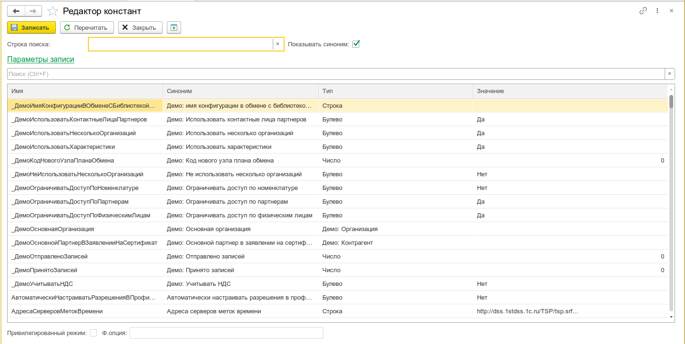
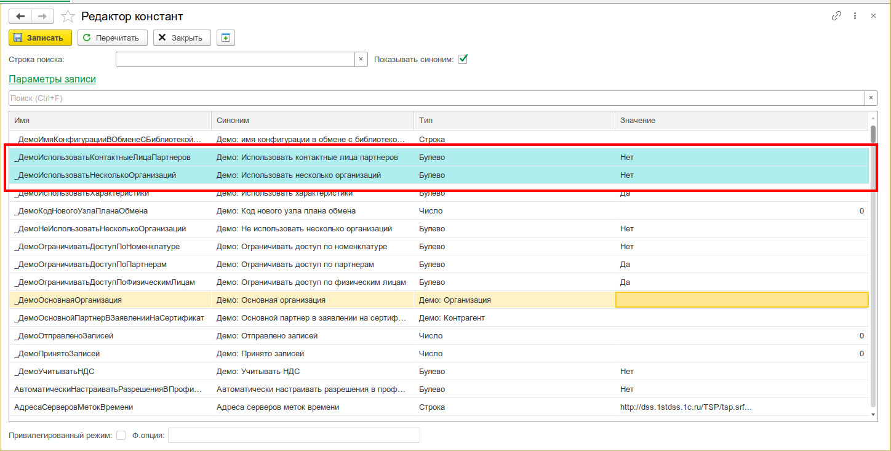

# Редактор констант

Просмотр и редактирование значений всех констант в виде единой таблицы. Удобная альтернатива открытию каждой константы по отдельности через стандартный интерфейс 1С.



## Назначение

- Просмотр полного списка констант конфигурации в одной таблице
- Редактирование значений констант произвольных типов (число, строка, дата, ссылочные типы, хранилище значения и др.)
- Поиск и фильтрация констант по имени и синониму
- Контроль изменений: подсветка изменённых строк перед записью
- Отображение служебной информации: тип данных, функциональная опция, признак привилегированного режима

## Особенности

- **Привилегированный режим** — при загрузке значений констант включается привилегированный режим, что гарантирует чтение даже тех констант, доступ к которым ограничен правами или функциональными опциями.
- **Запись только изменённого** — при выполнении команды «Записать» в базу сохраняются только те константы, у которых был изменён флаг «Изменено». Это минимизирует нагрузку на блокировки и журнал регистрации.
- **Подсветка изменений** — строки с несохранёнными изменениями визуально выделяются цветом фона.
- **Фильтрация по поиску** — поиск работает по имени и синониму константы в реальном времени, скрывая не подходящие строки.

## Откуда открыть

| Способ                                                      | Описание      |
| ----------------------------------------------------------- | ------------- |
| Меню **Универсальные инструменты → Редактор констант [УИ]** | Основной вход |

## Основной интерфейс

Форма состоит из панели инструментов, строки поиска и таблицы со списком всех констант метаданных.

### Панель инструментов (командная панель формы)

| Команда        | Описание                                                                                                    |
| -------------- | ----------------------------------------------------------------------------------------------------------- |
| **Записать**   | Сохраняет в базу значения всех изменённых констант                                                          |
| **Перечитать** | Перезагружает значения всех констант из базы. При наличии несохранённых изменений — запрос на подтверждение |

### Панель настройки отображения

| Элемент                | Назначение                                                               |
| ---------------------- | ------------------------------------------------------------------------ |
| **Строка поиска**      | Фильтрация строк таблицы по вхождению текста в имя или синоним константы |
| **Показывать синоним** | Флаг видимости колонки «Синоним» в таблице                               |

### Таблица констант

Основная рабочая область. Содержит все константы метаданных конфигурации.

| Колонка                     | Описание                                                                                  |
| --------------------------- | ----------------------------------------------------------------------------------------- |
| **Имя**                     | Имя константы по метаданным (только чтение)                                               |
| **Синоним**                 | Синоним константы (только чтение). Скрывается флагом «Показывать синоним»                 |
| **Тип**                     | Описание типа константы (только чтение)                                                   |
| **Значение**                | Текущее значение константы. Редактируется с учётом типа константы.                        |
| **Ф.опция**                 | Имя функциональной опции, если константа используется как хранилище опции (только чтение) |
| **Привилегированный режим** | Признак `ПривилегированныйРежимПриПолучении` у функциональной опции (только чтение)       |

**Редактирование значения:**

- Поле **«Значение»** автоматически подстраивает тип ввода под описание типа константы (`Тип`).
- Для ссылочных типов доступна кнопка выбора (лупа) и очистки (крестик).
- При изменении значения строка подсвечивается бледно-бирюзовым цветом.
  
- Запись изменений выполняется только по команде **«Записать»** — все изменённые строки записываются одной операцией.

### Дополнительная информация текущей константы

Под таблицей отображаются поля текущей (выделенной) строки:

- **Привилегированный режим** — флаг, показывающий значение `ПривилегированныйРежимПриПолучении` из функциональной опции, связанной с константой
- **Ф.опция** — имя функциональной опции, для которой данная константа является хранилищем

### Параметры записи

Сворачиваемая группа **«Параметры записи»** — стандартный механизм универсальных инструментов для настройки режима записи объектов (проведение документа, режим транзакции и т.д.).

## Сценарии использования

### Массовое обновление значений

```
1. Открыть «Редактор констант»
2. Найти нужные константы через строку поиска
3. Изменить значения в колонке «Значение»
4. Нажать «Записать» — все изменения сохранятся одной операцией
```

### Аудит текущих значений

```
1. Открыть редактор
2. Просмотреть полный список констант с типами и текущими значениями
3. При необходимости отфильтровать по имени через строку поиска
4. Включить/отключить колонку «Синоним» для удобства чтения
```


