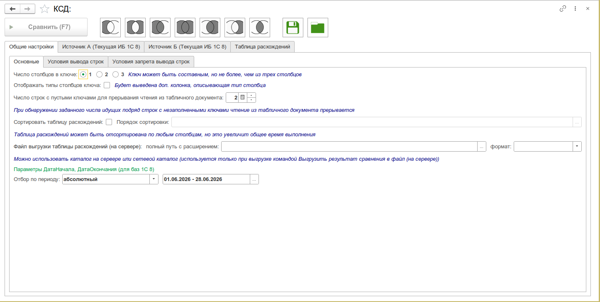

# Консоль сравнения данных

Сравнение данных из двух произвольных источников по ключу с применением операций реляционной алгебры. Поддерживаются: текущая/внешняя 1С 8, SQL, 1С 7.7, CSV/TXT/DBF/XLS/DOC/XML, JSON, табличный документ.

:::info
Форк [«Консоль сравнения данных»](https://infostart.ru/public/581794/) (автор: Сертаков Виталий). [Разрешение автора](http://forum.infostart.ru/forum9/topic165873/message2373325/#message2373325).
:::

## Кратко о возможностях

- **7 типов источников** — любые комбинации А и Б
- **7 реляционных операций** — разность, пересечение, соединения (круги Эйлера)
- **Составной ключ** — до 3 столбцов с приведением (Строка, ВРег, { }, УИД, произвольный код)
- **До 5 реквизитов** на источник, с произвольным кодом заполнения
- **Фильтрация строк** — условия вывода и запрета вывода (в т.ч. произвольный код 1С)
- **Итоги** — Сумма, Среднее, Максимум, Минимум, Количество
- **Экспорт** — CSV, DOCX, HTML, MXL, ODS, PDF, TXT, XLS, XLSX
- **Сохранение/загрузка** настроек в файл или справочник
- **Предпросмотр** данных источника (все строки / 100 / 1000 / дубликаты)
- **Относительный период** для регламентных операций
- **Конструктор запросов** и тестирование подключения

## Полная инструкция

- [Подробная инструкция по работе с инструментом](/docs/tools/data-tools/data-comparison-console/instruction)

## Связанные статьи

- [Интеграция с БСП](/docs/guides/bsp-integration)
