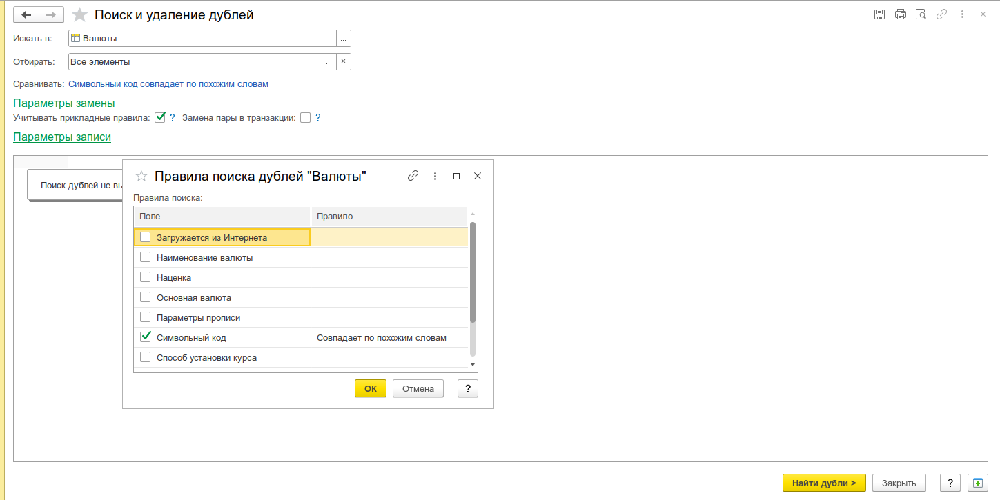
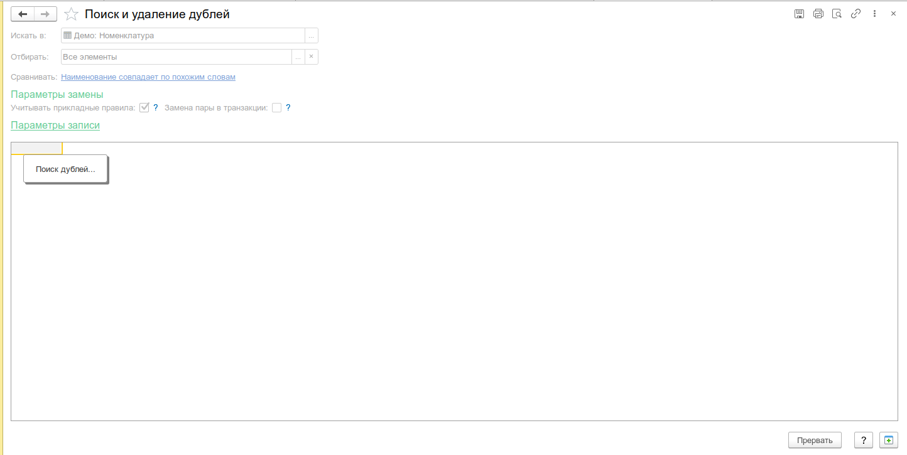
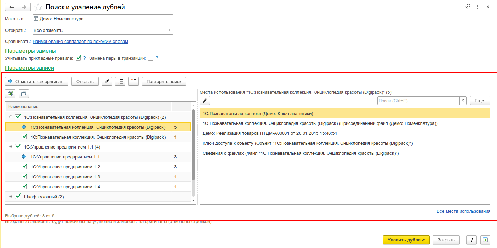
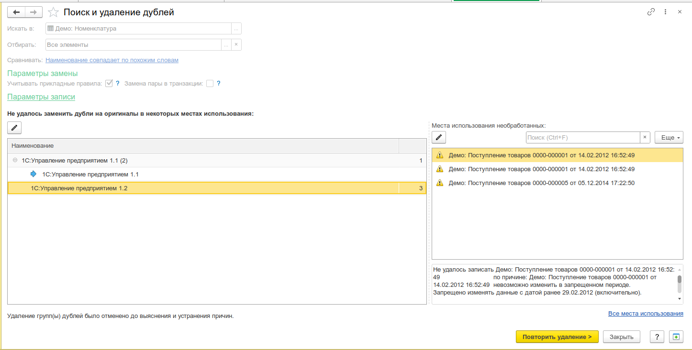

# Поиск и удаление дублей

**Поиск и удаление дублей** — инструмент для обнаружения и устранения дублирующихся элементов ссылочных типов. Позволяет найти все вхождения дублей в объектах информационной базы, заменить ссылки на дубли ссылками на выбранный «оригинальный» элемент и пометить дубли на удаление.

Инструмент является форком стандартной обработки из БСП, расширенный дополнительными параметрами выполнения замены.

---

## Область применения

Дубли элементов возникают, когда пользователи ошибочно вводят новые элементы вместо поиска существующих. В результате в документах и регистрах используются разные ссылки на один и тот же объект реального мира, что приводит к:

- некорректным проводкам и расхождениям в учёте;
- задвоению остатков и оборотов;
- ошибкам в отчётности.

Инструмент решает эту проблему комплексно: находит дубли, позволяет выбрать «правильный» элемент (оригинал) и автоматически заменяет все ссылки с дубля на оригинал во всей базе данных.

---

## Поддерживаемые типы объектов

- **Справочники** — все виды, включая иерархические
- **Документы**
- **Планы счетов**
- **Планы видов расчёта**

---

## Архитектура и работа с данными

### Поиск дублей

Поиск выполняется в фоновом задании через механизм [`ФоновыйПоискДублей`](src/Инструменты/src/DataProcessors/УИ_ПоискИУдалениеДублей/ObjectModule.bsl:454). Алгоритм:

1. **Формирование запроса** — на основе выбранной области поиска (объекта метаданных) строится запрос `ВЫБРАТЬ РАЗРЕШЕННЫЕ ... ИЗ <ОбластьПоиска>` с полями, участвующими в сравнении.
2. **Чтение эталонных объектов** — все элементы области поиска читаются через СКД (схема компоновки данных строится динамически).
3. **Поиск кандидатов** — для каждого эталонного элемента выполняется поиск по полям сравнения:
   - **Равно** (`"Равно"`) — строгое совпадение значений реквизитов.
   - **Подобно** (`"Подобно"`) — нечёткое сравнение строк через внешнюю компоненту `FuzzyStringMatchExtension` (алгоритм расстояния Левенштейна / Damerau-Levenshtein).
4. **Формирование результата** — дубли группируются: каждая группа содержит один «оригинал» (первый найденный элемент) и все его дубли. Результат помещается во временное хранилище.

Ограничение: по умолчанию поиск останавливается при достижении **1500 дублей** (параметр `МаксимальноеЧислоДублей`).

### Удаление дублей (замена ссылок)

Удаление выполняется в фоновом задании через [`ФоновоеУдалениеДублей`](src/Инструменты/src/DataProcessors/УИ_ПоискИУдалениеДублей/ObjectModule.bsl:495). Поддерживаются два режима:

#### 1. Штатная замена через 1С

Вызывается [`УИ_ОбщегоНазначения.ЗаменитьСсылки`](src/Инструменты/src/CommonModules/УИ_ОбщегоНазначения/Module.bsl:3116) — универсальный механизм замены ссылок, который:

- Находит все места использования дубля в объектах базы данных (документы, регистры, справочники и т.д.).
- Заменяет ссылку дубля на ссылку оригинала.
- Помечает дубль на удаление (устанавливает `ПометкаУдаления = Истина`).

**Параметры замены:**

| Параметр                     | Тип    | Описание                                                                                                                                     |
| ---------------------------- | ------ | -------------------------------------------------------------------------------------------------------------------------------------------- |
| `УчитыватьПрикладныеПравила` | Булево | Проверять каждую пару «дубль → оригинал» через прикладной обработчик `ВозможностьЗаменыЭлементов`                                            |
| `ЗаменаПарыВТранзакции`      | Булево | `Истина` — вся замена одного дубля в одной транзакции (ресурсоёмко, но атомарно); `Ложь` — короткие транзакции на каждое место использования |
| `СпособУдаления`             | Строка | `"Пометка"` — пометить на удаление; `"Удаление"` — удалить непосредственно (физическое удаление)                                             |

#### 2. Замена через SQL

Режим [`СгенерироватьТолькоSQL`](src/Инструменты/src/DataProcessors/УИ_ПоискИУдалениеДублей/ObjectModule.bsl:523) — **не выполняет замену в 1С**, а генерирует SQL-скрипт для выполнения непосредственно в СУБД. Поддерживаемые СУБД:

- **PostgreSQL**
- **MSSQL**

Скрипт содержит:

- `UPDATE` для замены ссылок в таблицах (с обработкой `UNIQUE CONSTRAINT` через `EXCEPTION WHEN OTHERS` / `TRY CATCH`).
- `DELETE` для избыточных строк дублей в регистрах сведений (когда после замены измерения совпадают с оригиналом).
- Обработку движений документов и последовательностей.

SQL-режим полезен, когда:

- объём замен очень велик и штатная замена через 1С слишком медленна;
- требуется минимизировать время блокировок;
- необходимо выполнить замену в обход прикладной логики.

После выполнения SQL-скрипта в СУБД требуется **«Пересчёт итогов»** в 1С.

---

## Интерфейс и сценарий работы

Интерфейс реализован в виде **пошагового мастера** (wizard) с последовательными шагами.

### Шаг 1. Настройка поиска

**Поля формы:**

- **Область поиска дублей** — выбор объекта метаданных (справочник, документ, план счетов, план видов расчёта). Открывает форму [`ОбластьПоискаДублей`](src/Инструменты/src/DataProcessors/УИ_ПоискИУдалениеДублей/Forms/ОбластьПоискаДублей/Module.bsl) со списком доступных объектов.
- **Отбирать** — настройка предварительного отбора элементов через СКД (форма [`ПравилаОтбора`](src/Инструменты/src/DataProcessors/УИ_ПоискИУдалениеДублей/Forms/ПравилаОтбора/Module.bsl)). Позволяет ограничить область поиска, например, только элементами определённой группы или с определённым значением реквизита.
- **Сравнивать** — настройка правил поиска дублей (форма [`ПравилаПоиска`](src/Инструменты/src/DataProcessors/УИ_ПоискИУдалениеДублей/Forms/ПравилаПоиска/Module.bsl)). Для каждого реквизита выбирается:
  - **Совпадает** — строгое равенство значений.
  - **Похоже** — нечёткое сравнение (доступно для строковых реквизитов при наличии компоненты `FuzzyStringMatchExtension`).
- **Учитывать прикладные правила** — флаг, включающий вызов прикладных обработчиков поиска дублей (если они определены для выбранного объекта метаданных).

**Параметры замены** (отображаются на шаге выбора основного элемента):

- **Замена пары в транзакции** — атомарная замена каждого дубля.
- **Замена через SQL** — переключение в режим генерации SQL-скрипта (без выполнения в 1С).
- **Тип СУБД** — выбор `PostgreSQL` или `MSSQL` для SQL-режима.

_Форма настройки поиска дублей — область поиска, отбор, правила сравнения, параметры замены._

### Шаг 2. Выполнение поиска

После нажатия «Найти дубли» запускается фоновое задание. Отображается индикатор прогресса с количеством найденных дублей. Поиск можно прервать кнопкой «Прервать».

_Процесс поиска дублей — индикатор прогресса, сообщение о количестве найденных._

### Шаг 3. Выбор основного элемента (оригинала)

Результаты поиска отображаются в виде **дерева**:

- **Группа дублей** — строка с наименованием элемента-оригинала.
- **Дочерние элементы** — найденные дубли, сгруппированные вокруг оригинала.

**Колонки дерева:**

| Колонка            | Описание                                               |
| ------------------ | ------------------------------------------------------ |
| Наименование       | Наименование элемента                                  |
| Код                | Код элемента (или номер для документов)                |
| Мест использования | Количество объектов, ссылающихся на данный элемент     |
| Оригинал           | Маркер `→`, указывающий на выбранный оригинал в группе |
| Пометка            | Флажок для отметки дубля к удалению                    |

**Действия:**

- **Отметить как оригинал** — назначить выбранный элемент оригиналом в группе.
- **Открыть** — открыть форму элемента для просмотра.
- **Развернуть / Свернуть группу дублей** — управление видимостью дерева.
- **Выделить все дубли / Снять выделение** — массовые операции с флажками.
- **Все места использования** — открыть отчёт «Места использования ссылок» по всем элементам списка.

В правой части формы отображается информация по выделенному элементу:

- для группы — количество найденных дублей;
- для элемента — перечень объектов, в которых он используется (или сообщение «Не используется»).

_Результаты поиска — дерево дублей с колонками, выделенный оригинал, отмеченные дубли, панель информации о местах использования._

### Шаг 4. Удаление дублей

После нажатия «Удалить дубли» запускается фоновое задание замены ссылок. Ход выполнения отображается в журнале удаления с автоматической прокруткой.

**Возможные исходы:**

- **Успешное удаление** — все дубли обработаны, ссылки заменены, дубли помечены на удаление.
- **Неудачные замены** — часть ссылок не удалось заменить. Отображается дерево проблемных дублей с указанием причин:
  - `ОшибкаБлокировки` — не удалось заблокировать данные.
  - `ОшибкаЗаписи` — ошибка при записи объекта.
  - `ТребуетсяSQL` — замена требует прямого SQL-вмешательства (для таблиц, не поддерживающих замену через 1С).
- **Дублей не найдено** — сообщение об отсутствии дублей по заданным критериям.

_Результат удаления — журнал удаления с логом замены, итоговое сообщение._

### Шаг 5. SQL-скрипт (режим «Замена через SQL»)

Если выбран режим «Замена через SQL», после завершения фонового задания в журнале отображается сгенерированный SQL-скрипт. Скрипт нужно скопировать и выполнить в СУБД, после чего выполнить «Пересчёт итогов» в 1С.

---

## Ограничения и особенности

- **Нечеткий поиск** — требует установки внешней компоненты `FuzzyStringMatchExtension` из макета `УИ_КомпонентаПоискаСтрок`. Если компонента не установлена, доступно только строгое сравнение (`"Равно"`).
- **Ограничение поиска** — при достижении 1500 дублей поиск прекращается (настраивается через `МаксимальноеЧислоДублей`).
- **SQL-режим** — не выполняет замену в 1С, только генерирует скрипт. После выполнения скрипта в СУБД обязателен «Пересчёт итогов».
- **Помеченные на удаление объекты** — не отображаются в списке областей поиска (фильтр по префиксу `"Удалить"`).
- **Пользователи** — исключены из поиска дублей (закомментированный код в модуле объекта).
- **Хранилища значений** — реквизиты типа `ХранилищеЗначения` не участвуют в сравнении.

---

## Связанные инструменты

- [Удаление помеченных объектов](/docs/tools/administration-tools/marked-objects-deletion) — окончательное удаление элементов, помеченных на удаление.
- [Поиск ссылок на объект](/docs/tools/data-tools/search-links) — просмотр всех мест использования ссылки.
- [Редактор реквизитов объекта](/docs/tools/data-tools/object-attributes-editor) — низкоуровневое редактирование объектов, групповая замена ссылок.
