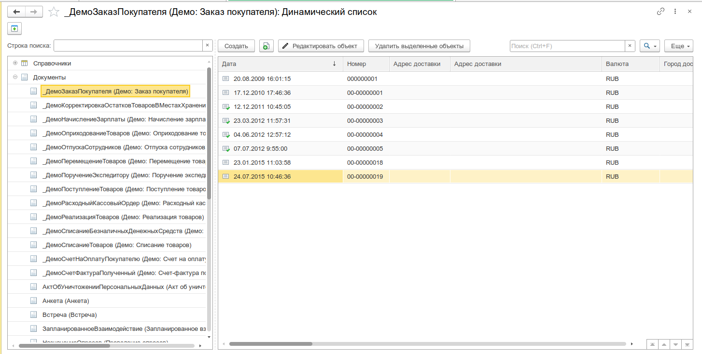

# Динамический список

Универсальный просмотрщик списков любых таблиц базы данных из единой формы. Позволяет выбрать объект метаданных через дерево метаданных, отобразить его содержимое в виде динамического списка и выполнять базовые операции с данными: просмотр, редактирование, удаление.



## Назначение

- Просмотр содержимого любой таблицы базы данных: справочников, документов, регистров, планов, бизнес-процессов, задач
- Быстрая навигация по метаданным конфигурации через единое дерево с фильтрацией по строке поиска
- Редактирование выбранных объектов через [Редактор реквизитов объекта](/docs/tools/data-tools/object-attributes-editor)
- Удаление объектов из базы данных (прямое или с контролем ссылок)
- Использование в режиме выбора значения — подстановка ссылки из списка в вызывающую форму

## Особенности

### Дерево метаданных

Левая панель инструмента содержит дерево всех объектов метаданных конфигурации, сгруппированных по типам

Каждый тип имеет собственную пиктограмму. При выборе объекта в дереве справа динамически создаётся таблица с его данными.

### Фильтрация дерева метаданных

Поле **«Строка поиска»** над деревом позволяет отфильтровать объекты метаданных по синониму. При вводе текста в дереве остаются только те группы и объекты, синоним которых содержит введённую строку. Группы без подходящих объектов скрываются.

### Динамическое создание таблицы

При выборе объекта метаданных инструмент:

1. Создаёт реквизит формы типа `ДинамическийСписок` с привязкой к основной таблице выбранного объекта
2. Формирует колонки на основе стандартных реквизитов, измерений, ресурсов (для регистров) и реквизитов объекта
3. Добавляет командную панель с кнопками управления

Некоторые служебные реквизиты исключаются из отображения: `Ссылка`, `ИмяПредопределенныхДанных`, `ЭтоГруппа`, `Проведен`, `ПометкаУдаления`, `ЭтоУзел`, `Предопределенный`, `Родитель`.

### Режим выбора значения

Инструмент может открываться в режиме выбора — когда из списка нужно выбрать конкретную ссылку и передать её в вызывающую форму. В этом режиме:

- Выбор строки или двойной щелчок завершает выбор и возвращает значение
- Форма автоматически закрывается после выбора

Этот режим используется другими инструментами подсистемы (например, [Редактором реквизитов объекта](/docs/tools/data-tools/object-attributes-editor)) для подбора ссылочных значений.

## Откуда открыть

| Способ                                                                           | Описание                                                 |
| -------------------------------------------------------------------------------- | -------------------------------------------------------- |
| Меню **Универсальные инструменты → Работа с данными → Динамический список [УИ]** | Основной вход                                            |
| [Навигатор по метаданным](/docs/tools/development-tools/metadata-navigator)      | Команда «Просмотр данных» в свойствах объекта метаданных |
| Программный вызов `УИ_ОбщегоНазначенияКлиент.ОткрытьДинамическийСписок()`        | Открытие из кода с указанием имени объекта метаданных    |
| Параметр `ИмяОбъектаМетаданных` при открытии формы                               | Программное открытие с предустановленным объектом        |

## Основной интерфейс

Форма инструмента разделена на две функциональные зоны: **дерево метаданных** (слева) и **область отображения данных** (справа).

### Дерево метаданных

| Элемент               | Назначение                                                               |
| --------------------- | ------------------------------------------------------------------------ |
| **Строка поиска**     | Фильтрация объектов метаданных по синониму. Кнопка очистки — справа      |
| **Дерево метаданных** | Иерархический список всех объектов конфигурации, сгруппированных по типу |

### Область отображения данных

При выборе объекта в дереве справа отображается страница с динамическим списком. Если у объекта нет реквизитов для отображения, выводится сообщение **«Таблица недоступна для просмотра»**.

#### Командная панель таблицы

| Команда                                           | Описание                                                                                                                            |
| ------------------------------------------------- | ----------------------------------------------------------------------------------------------------------------------------------- |
| **Редактировать объект**                          | Открывает выбранный объект в [Редакторе реквизитов объекта](/docs/tools/data-tools/object-attributes-editor)                        |
| **Удалить выделенные объекты**                    | Прямое удаление выбранных объектов из базы без проверки ссылок. Перед удалением запрашивает подтверждение                           |
| **Удалить выделенные объекты с контролем ссылок** | Открывает инструмент [«Удаление помеченных объектов»](/docs/tools/administration-tools/delete-marked) с переданным списком объектов |

:::warning
Команда **«Удалить выделенные объекты»** выполняет безусловное удаление без проверки ссылочной целостности. Используйте её только когда точно уверены, что на удаляемые объекты нет ссылок из других объектов базы.
:::

## Сценарии использования

### Просмотр содержимого справочника

```
1. Открыть «Динамический список»
2. В дереве метаданных найти нужный справочник (или воспользоваться строкой поиска)
3. Выбрать его — справа отобразится таблица со всеми элементами
4. Использовать стандартные возможности динамического списка:
   - сортировка по колонкам
   - отбор по значениям (через шапку таблицы)
   - поиск по строке
```

### Редактирование объекта из списка

```
1. Выбрать объект метаданных в дереве
2. Найти нужную строку в таблице
3. Выделить строку → нажать «Редактировать объект»
4. В открывшемся Редакторе реквизитов объекта внести изменения
```

### Удаление группы объектов

```
1. Выбрать объект метаданных в дереве
2. Выделить несколько строк в таблице (с Ctrl или Shift)
3. Нажать «Удалить выделенные объекты»
4. Подтвердить удаление в диалоговом окне
```

### Удаление с проверкой ссылок

```
1. Выделить строки для удаления
2. Нажать «Удалить выделенные объекты с контролем ссылок»
3. В открывшемся инструменте удаления проверить ссылки и выполнить удаление
```

### Выбор значения для другого инструмента

```
1. В вызывающем инструменте (например, Редакторе реквизитов) нажать кнопку выбора ссылочного значения
2. В открывшемся Динамическом списке выбрать нужный объект метаданных
3. Найти и выбрать строку — значение подставится в исходную форму
```

## Где используется

| Инструмент                      | Как используется                                                                   |
| ------------------------------- | ---------------------------------------------------------------------------------- |
| **Редактор реквизитов объекта** | Выбор ссылочных значений через динамический список вместо стандартной формы выбора |
| **Навигатор по метаданным**     | Команда «Просмотр данных» для выбранного объекта метаданных                        |

## Программный интерфейс

### Открытие динамического списка

```bsl
// Общий модуль УИ_ОбщегоНазначенияКлиент
УИ_ОбщегоНазначенияКлиент.ОткрытьДинамическийСписок(
    "Справочник.Номенклатура",          // ИмяОбъектаМетаданных — полное имя метаданных
    ,                                    // ОписаниеОповещенияОЗавершении — для режима выбора
    ПараметрыФормы,                      // ПараметрыФормы — дополнительные параметры
    ВладелецФормы                        // ВладелецФормы — форма-владелец
);
```

## Связанные статьи

- [Редактор реквизитов объекта](/docs/tools/data-tools/object-attributes-editor) — низкоуровневое редактирование объектов из списка
- [Удаление помеченных объектов](/docs/tools/administration-tools/delete-marked) — удаление объектов с контролем ссылок
- [Навигатор по метаданным](/docs/tools/development-tools/metadata-navigator) — просмотр метаданных и быстрый доступ к динамическому списку
