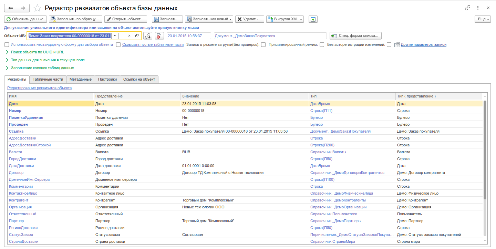
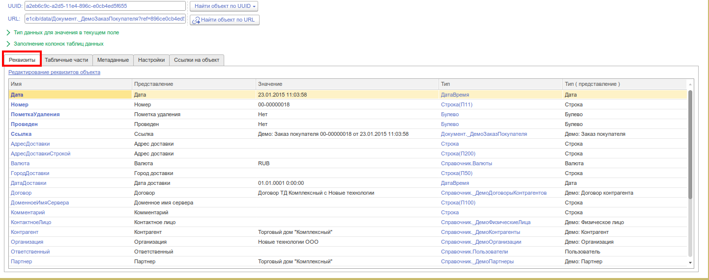
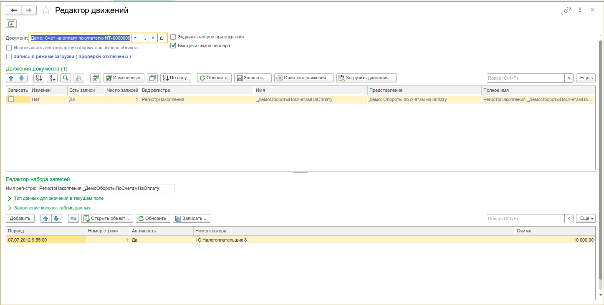
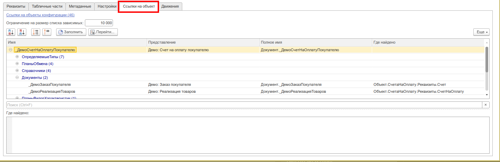
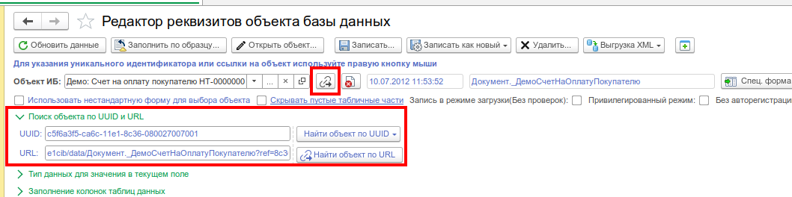
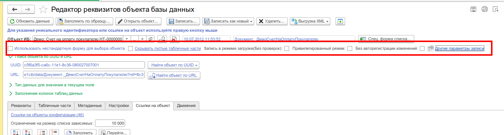
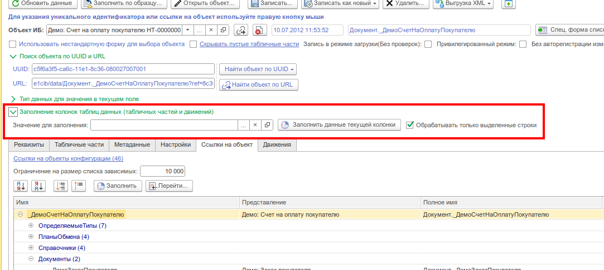

# Редактор реквизитов объекта

Низкоуровневое редактирование ссылочных объектов базы данных. Просмотр и изменение любого реквизита, табличной части, движения документа. Поиск объекта по UUID и URL. Выгрузка/загрузка XML, работа с предопределёнными данными.

:::info
Форк обработки [«Редактор объектов информационной базы 8.3»](https://infostart.ru/1c/tools/983887/). [Разрешение автора](http://forum.infostart.ru/forum24/topic203301/message2375899/#message2375899).
:::



## Назначение

- Прямое редактирование любого реквизита ссылочного объекта (Справочники, Документы, Планы видов характеристик и т.д.)
- Редактирование табличных частей
- Редактирование движений документов (основных и дополнительных)
- Редактирование предопределённых данных
- Поиск объекта по UUID / навигационной ссылке (URL)
- Массовое заполнение колонок таблиц
- Выгрузка / загрузка объекта в XML
- Создание копии объекта, удаление, проведение / распроведение
- Создание объекта с указанным UUID
- Работа с битыми ссылками

## Откуда открыть

| Способ                                                                    | Описание                                                  |
| ------------------------------------------------------------------------- | --------------------------------------------------------- |
| Меню **Универсальные инструменты → Редактор реквизитов объекта**          | Основной вход                                             |
| Контекстное меню объекта (подменю **Инструменты → Редактировать объект**) | Если форма подключена к подсистеме «Подключаемые команды» |
| Команда `УИ_._От(Ссылка)` из консоли кода / формы вычисления выражения    | Программный вызов                                         |
| Команда отладки `УИ_._от(СсылкаНаОбъектБД)`                               | Через «Вычислить выражение» в отладчике                   |
| Параметр `Параметры.мОбъектСсылка` при открытии формы                     | Программное открытие                                      |

## Основной интерфейс

Главная форма состоит из нескольких функциональных блоков и страниц.

### Шапка

- **Поле «Объект»** — ссылка на редактируемый объект. Поддерживает выбор типа (F4), ввод UUID или URL.
- Кнопки: **Вставить ссылку из буфера**, **Выбрать удалённый объект** (для битых ссылок), **Открыть форму списка**.
- Мета-информация: тип объекта (только чтение), дата создания (извлекается из UUID).

### Поиск по UUID и URL

Сворачиваемая группа:

- **UUID** — уникальный идентификатор объекта. Изменение триггерит пересчёт даты создания. При пустом значении после задания объекта — позволяет создать новый объект с указанным UUID.
- **URL (навигационная ссылка)** — при изменении автоматически загружает объект, на который указывает ссылка.

Команды поиска:

| Команда                         | Действие                                          |
| ------------------------------- | ------------------------------------------------- |
| **Найти объект по UUID**        | Поиск по UUID среди всех ссылочных типов          |
| **Найти объект по типу + UUID** | Позволяет выбрать тип объекта, затем ищет по UUID |
| **Найти объект по URL**         | Загрузка объекта по навигационной ссылке          |

### Тип данных текущего поля

Сворачиваемая группа. Отображает результирующий тип значения активного поля формы. Кнопка «Показать тип значения» формирует строку типа по значению в текущем элементе.

### Заполнение колонок таблиц данных

Сворачиваемая группа. Массовое заполнение колонок реквизитов, табличных частей и наборов записей:

- **Поле «Значение»** — значение для заполнения.
- **Кнопка «Заполнить данные текущей колонки»** — проставляет значение во все строки активной таблицы.
- **Флаг «Только выделенные строки»** — ограничивает заполнение выделенным диапазоном.

### Страницы (основная рабочая область)

| Страница                    | Назначение                                                                                                                                                 |
| --------------------------- | ---------------------------------------------------------------------------------------------------------------------------------------------------------- |
| **Реквизиты объекта**       | Таблица всех реквизитов: Имя, Тип, Значение, Ограничение выбора. Поддерживается редактирование предопределённых данных (выбор из выпадающего списка имён). |
| **Табличные части объекта** | Динамически создаваемые закладки для каждой табличной части. Добавление / удаление строк, редактирование колонок.                                          |
| **Движения**                | Работа с основными и дополнительными наборами записей. Выбор регистра, просмотр, редактирование, пакетная запись. Итоги по числовым колонкам.              |
| **Ссылки на объект**        | Дерево ссылающихся объектов (зависимые объекты, которые ссылаются на текущий).                                                                             |
| **Настройки**               | Сохранение/загрузка настроек обработки.                                                                                                                    |

## Команды инструмента

### Запись и управление объектом

| Команда                                        | Описание                                                          | 
| ---------------------------------------------- | ----------------------------------------------------------------- | 
| **Записать объект**                            | Записывает изменения реквизитов и табличных частей в базу         | 
| **Записать объект как новый**                  | Создаёт новый объект на основе текущих данных (новый UUID)        | 
| **Записать объект как новый с указанным UUID** | Создаёт новый объект с UUID из поля «UUID»                        | 
| **Записать объект как новый (по образцу)**     | Выбор объекта-образца, копирование его полей в текущий объект     |
| **Записать все объекты**                       | Пакетная запись всех объектов из таблицы (если открыто несколько) | 
| **Удалить объект**                             | Прямое удаление (без проверок, только для администраторов)        | 
| **Провести документ**                          | Перепроведение документа                                          | 
| **Распровести документ**                       | Отмена проведения                                                 | 

### Набор записей (движения)

| Команда                            | Описание                                              |
| ---------------------------------- | ----------------------------------------------------- |
| **Обновить набор записей**         | Загрузить движения для выбранного регистра            |
| **Записать набор записей**         | Сохранить изменения движений                          |
| **Показать все движения**          | Формирует отчёт по наличию движений во всех регистрах |
| **Переключить активность записей** | Инвертирует флаг «Активность» для всех строк набора   |

### Дополнительные движения

Открываются отдельной формой `ФормаРедакторДвиженийДоп`. Работает аналогично редактору движений, но для регистров дополнительных движений. Доступна, если в конфигурации есть метаданные документа «РегистраторРасчетов».

### Таблицы и фильтрация

| Команда                | Описание                                                 |
| ---------------------- | -------------------------------------------------------- |
| **Обновить таблицу**   | Перечитать данные реквизитов                             |
| **Отбор по таблицам**  | Фильтр — показать только реквизиты выбранных таблиц базы |
| **Отбор по полю**      | Поиск по имени реквизита                                 |
| **Сбросить настройки** | Вернуть стандартное отображение                          |

### Контекстное меню полей (правая кнопка мыши)

Для полей ввода с ссылочными типами данных:

| Пункт                                 | Действие                                                                          |
| ------------------------------------- | --------------------------------------------------------------------------------- |
| **Вставить ссылку на объект**         | Извлекает ссылку из буфера обмена (строка URL/UUID) и преобразует в значение поля |
| **Вставить уникальный идентификатор** | Вставляет UUID в строковое поле                                                   |
| **Показать тип значения**             | Отображает фактический тип данных текущего значения                               |
| **Открыть объект**                    | Открывает значение в редакторе реквизитов                                         |

### Ссылки на объект

Страница «Ссылки на объект» показывает дерево зависимых объектов. Команды:

- **Список зависимых** — открывает отдельную форму с настройкой лимита записей (по умолчанию 10 000).
- **Выгрузить объект в XML** — сохраняет объект с подчинёнными ссылками в XML-файл.
- **Загрузить из XML** — загружает объект из ранее выгруженного XML.

## Особенности

### Редактирование реквизитов



- Все реквизиты объекта отображаются в одной таблице (стандартные, табличных полей, табличных частей).
- Поддерживаются любые типы значений, включая `ХранилищеЗначения`.
- Для реквизита `ТипЗначения` (ПланВидовХарактеристик) автоматически формируется `ОписаниеТипов` из значения.
- Реквизит «ИмяПредопределенныхДанных» переключает колонку «Значение» в режим выбора из списка доступных имён.

### Работа с UUID и URL

- При смене объекта по URL автоматически вычисляется UUID и дата создания.
- Поиск по UUID среди всех типов — если тип известен, можно уточнить через «Найти по типу + UUID».
- Формат отображения битых ссылок: `<Тип объекта>(<UUID>)`, например `Справочник.Номенклатура(769:b1390050568b35ac11e6e46fdd2c3861)`.

### Предопределённые данные

- Редактирование имён предопределённых данных (для справочников).
- Контроль уникальности: дубликаты имён подсвечиваются.
- При изменении предопределённого имени выводится дополнительное предупреждение.

### Выгрузка/загрузка XML

- Выгрузка текущего объекта с подчинёнными ссылками в XML.
- Загрузка из ранее сохранённого XML с возможностью выбора режима обмена.
- Поддерживается выгрузка как с настройками, так и в упрощённом режиме.

### Безопасность

- Кнопка «Удалить объект» скрыта для пользователей без прав администратора.
- Перед записью, удалением, проведением — запрос подтверждения с таймаутом 20 секунд.
- При работе с предопределёнными данными — дополнительное предупреждение.

## Сценарии использования

### Быстрое исправление ссылки

```
1. Открыть инструмент
2. Ввести URL объекта из сообщения об ошибке в поле URL → объект загрузится
3. Исправить значение нужного реквизита
4. Ctrl+Shift+S — записать
```

### Создание копии документа

```
1. Выбрать документ-образец
2. Нажать «Записать объект как новый по образцу» → выбрать другой документ
3. Поля образца скопируются в текущий
4. Нажать «Записать объект как новый»
```

### Массовое заполнение табличной части

```
1. Открыть объект
2. Перейти на страницу табличной части
3. В поле «Заполнение колонок» задать значение
4. Включить «Только выделенные строки» при необходимости
5. Нажать «Заполнить данные текущей колонки»
```

### Редактирование движений

```
1. Открыть проведённый документ
2. Нажать «Редактор движений» на странице «Движения»
3. Выбрать регистр из выпадающего списка
4. Отредактировать записи
5. Сохранить набор записей
```

## Скриншоты







