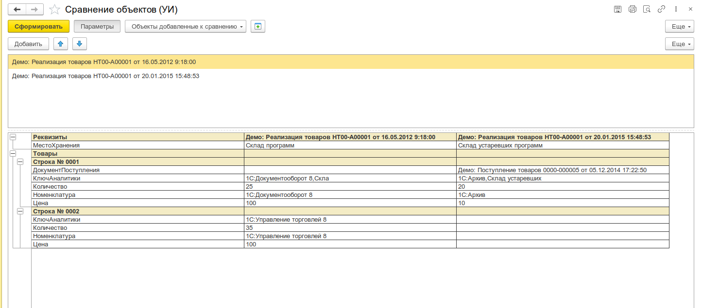
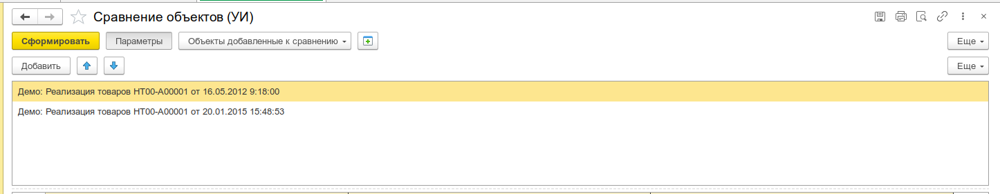
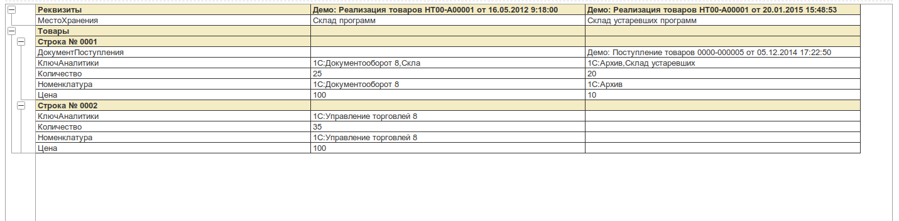
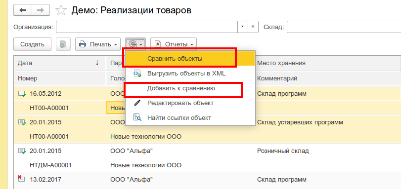

# Сравнение объектов

Инструмент для сравнения ссылочных объектов 1С по реквизитам и табличным частям с выводом результата в табличный документ. Позволяет быстро выявить различия между объектами одного вида без написания кода и создания внешних обработок.

:::info
Форк обработки [Сравнение объектов](https://infostart.ru/1c/tools/1240803/) (автор: [skyadmin](https://infostart.ru/user/1334251/)). [Разрешение автора](https://github.com/cpr1c/tools_ui_1c/issues/246).
:::

_Общий вид формы: таблица объектов для сравнения, кнопка «Сформировать», табличный документ с результатом_


---

## Назначение

Инструмент пригодится для:

- **Анализа расхождений данных** - быстрая проверка, чем различаются два документа или элемента справочника
- **Контроля переноса данных** - сравнение объектов в источнике и приёмнике
- **Поиска ошибочных изменений** - выявление реквизитов, которые были изменены в обход бизнес-логики
- **Сверки настроек** - сравнение элементов справочников с типовыми настройками
- **Отладки обменов** - проверка корректности выгрузки/загрузки объектов

Инструмент интегрируется с [Библиотекой стандартных подсистем (БСП)](/docs/guides/bsp-integration): в списки и формы объектов, подключённые к подсистеме «Подключаемые команды», добавляется подменю **Инструменты** с командами «Сравнить объекты» и «Добавить к сравнению».

---

## Основные возможности

- **Любые ссылочные объекты** - справочники, документы, планы видов и т.д. - обрабатываются все типы, доступные в метаданных
- **Сравнение реквизитов** - все основные реквизиты объекта выводятся построчно
- **Сравнение табличных частей** - каждая строка табличной части выводится отдельно с полным составом колонок
- **Автофильтрация совпадений** - реквизиты с одинаковыми значениями у всех объектов не выводятся (если объектов больше одного)
- **Сортировка по имени** - все реквизиты сортируются по алфавиту
- **Группировка и оформление** - табличный документ с автогруппировкой строк, жирным шрифтом и цветом фона для заголовков групп
- **Фиксация шапки и первой колонки** - удобная навигация при большом количестве объектов или реквизитов
- **Печать** - повтор шапки на каждой странице, автоподбор масштаба
- **Неограниченное количество объектов** - можно сравнивать два, три и более объектов одновременно
- **Программный вызов** - открытие формы с передачей массива ссылок через параметры

---

## Быстрый старт

1. Откройте **Меню Универсальные инструменты → Сравнение объектов [УИ]**
2. Добавьте строки в таблицу и выберите объекты через стандартный механизм выбора
3. Нажмите **Сформировать**

---

## Интерфейс

### Панель параметров

Верхняя часть формы содержит группу настраиваемых параметров:

| Элемент                                         | Назначение                                                                                                         |
| ----------------------------------------------- | ------------------------------------------------------------------------------------------------------------------ |
| **Использовать нестандартную форму для выбора** | Включает расширенный диалог выбора значения вместо стандартного поля ввода (сохраняется в настройках пользователя) |

### Таблица объектов

Центральный элемент управления списком сравниваемых объектов:

- **Колонка «Значение»** - поле ввода ссылки с кнопкой выбора, поддерживает автоподбор и очистку
- **Командная панель таблицы:**
  - Добавить, Изменить, Удалить
  - **Редактировать объект** - открывает редактор реквизитов для выбранного объекта
  - Переместить вверх/вниз
  - Сортировать по возрастанию/убыванию
- Режим выделения - множественный (MultiRow)
- Автовставка новой строки - да
- Поиск по строкам - да

_Таблица объектов с выбранными ссылками для сравнения_


### Панель команд формы

| Кнопка                | Назначение                                                          |
| --------------------- | ------------------------------------------------------------------- |
| **Сформировать**      | Выполняет сравнение и выводит результат в табличный документ        |
| **Параметры**         | Показывает/скрывает панель параметров                               |
| **Добавить к списку** | Импортирует объекты, ранее добавленные через «Добавить к сравнению» |
| **Очистить**          | Очищает хранилище объектов, добавленных к сравнению                 |

### Результат сравнения (табличный документ)

Результат отображается в виде иерархического табличного документа:

- **Столбцы:** первая колонка - наименование реквизита, остальные колонки - значения по каждому сравниваемому объекту
- **Группировка:** группы «Реквизиты» и по именам табличных частей выделены жирным шрифтом и цветом фона
- **Табличные части:** строки выводятся нумерованными (`Строка № 0001`, `Строка № 0002` …), внутри - реквизиты строки
- **Фильтрация:** строки с полностью совпадающими значениями удаляются из вывода
- **Навигация:** фиксация первой строки и первой колонки

_Результат сравнения: табличный документ с автогруппировкой, фиксацией колонок и подсветкой групп_


_Контекстное меню списка с командами «Сравнить объекты» и «Добавить к сравнению» (доступны при [подключении к БСП](/docs/guides/bsp-integration))_


---

## Сценарии использования

### Сравнение двух элементов справочника (при наличии БСП)

Для сравнения двух элементов «Номенклатура»:

1. Откройте список справочника «Номенклатура»
2. Выделите две записи
3. Контекстное меню → **Инструменты → Сравнить объекты**
4. Результат покажет только те реквизиты, значения в которых различаются

### Сравнение нескольких документов (при наличии БСП)

Можно сравнивать любое количество однотипных документов - например, три счёта на оплату, чтобы убедиться в одинаковой структуре табличных частей:

- Выделите все нужные документы в списке
- Выполните **Сравнить объекты**
- Если документы идентичны - табличный документ будет пустым (все строки отфильтрованы)
- Если есть различия - вы увидите только строки с различающимися данными

### Сравнение одного объекта (вывод всех реквизитов)

Если в список добавлен только один объект, автофильтрация не срабатывает - будут выведены **все** реквизиты и все строки табличных частей. Удобно для быстрой инспекции содержимого объекта.

### Программный вызов из кода 1С

Форму можно открыть из произвольного кода 1С, передав массив ссылок:

```bsl
СравниваемыеОбъекты = Новый СписокЗначений;
СравниваемыеОбъекты.Добавить(Справочники.Номенклатура.НайтиПоКоду("1"));
СравниваемыеОбъекты.Добавить(Справочники.Номенклатура.НайтиПоКоду("2"));

ПараметрыФормы = Новый Структура;
ПараметрыФормы.Вставить("СравниваемыеОбъекты", СравниваемыеОбъекты);

ОткрытьФорму("Обработка.УИ_СравнениеОбъектов.Форма", ПараметрыФормы);
```

### Использование с «Добавить к сравнению» и накопительным списком (при наличии БСП)

Команда **Добавить к сравнению** работает как накопитель: объекты сохраняются в системных настройках пользователя между сеансами. Это позволяет:

1. По мере работы в разных разделах программы добавлять объекты к сравнению
2. В конце открыть обработку и нажать **Добавить к списку**
3. Сформировать единый отчёт по всем накопленным объектам

### Редактирование объекта из списка сравнения

Если в результатах сравнения обнаружено расхождение, которое нужно исправить:

1. Выделите строку в таблице объектов
2. Нажмите **Редактировать объект**
3. Откроется редактор реквизитов для выбранного объекта - можно сразу внести изменения

---

## Интеграция с другими инструментами

- **Редактор реквизитов объекта** - найденные расхождения можно исправить через кнопку «Редактировать объект» непосредственно из формы сравнения
- **Поиск ссылок на объект** - если нужно понять, где ещё используется отличающийся объект
- **Выгрузка/загрузка XML** - для переноса исправленных объектов между базами

---

## Примечания

- Инструмент не требует наличия БСП - работает в любых конфигурациях на управляемых формах. 
- Контекстные команды «Сравнить объекты» и «Добавить к сравнению» в подменю **Инструменты** доступны только при [подключении к БСП](/docs/guides/bsp-integration)
