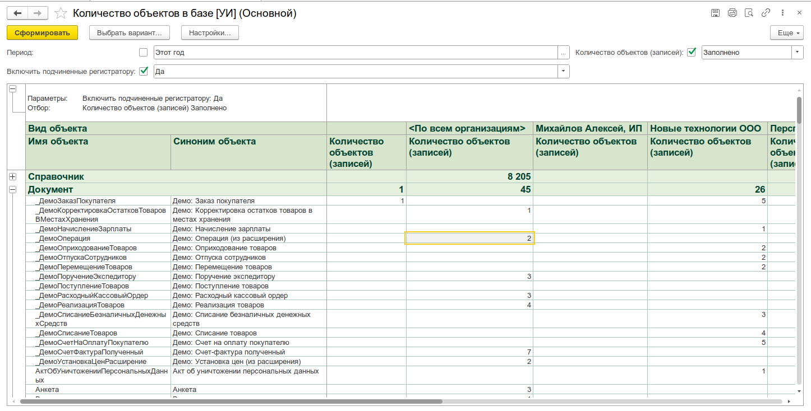

# Количество объектов в базе

Отчёт, показывающий количество записей по каждому объекту метаданных в информационной базе: справочникам, документам, регистрам, планам, бизнес-процессам и задачам. Позволяет быстро оценить наполненность базы и выявить объекты с избыточным или нулевым количеством записей.



## Назначение

- Оценка объёма данных по каждому объекту метаданных конфигурации
- Выявление объектов с нулевым количеством записей (неиспользуемые справочники, пустые регистры)
- Подготовка к переносу данных: определение объектов, для которых потребуются правила конвертации
- Контроль динамики роста базы: сравнение количества записей за разные периоды
- Анализ распределения данных по организациям для документов и регистров

## Особенности

### Фильтрация по периоду

Для объектов, поддерживающих дату (документы, регистры, бизнес-процессы, задачи), доступна фильтрация по периоду.

- **Документы** — фильтр по полю `Дата`
- **Регистры сведений / накопления / бухгалтерии** — фильтр по полю `Период`
- **Регистры расчёта** — фильтр по полю `ПериодРегистрации`
- **Бизнес-процессы и задачи** — фильтр по полю `Дата`
- **Справочники, ПВХ, планы счетов, планы видов расчёта** — период не применяется

### Группировка по организациям

Если у объекта метаданных есть реквизит (или измерение для регистров) с именем `Организация`, отчёт автоматически группирует данные по организациям. Для каждого объекта выводится отдельная строка по каждой организации.

### Подчинённые регистратору регистры сведений

Параметр **«Включить подчинённые регистратору»** управляет отображением регистров сведений, работающих в режиме подчинения регистратору:

- `false` (по умолчанию) — показываются только независимые регистры сведений
- `true` — показываются все регистры сведений, включая подчинённые регистратору

### Расшифровка — переход к списку объектов

Двойной щелчок по любой строке отчёта открывает контекстное меню с пунктом **«Показать список»**. При его выборе открывается форма списка соответствующего объекта метаданных с применёнными отборами (организация, период).

### Привилегированный режим

Все запросы к базе данных выполняются в привилегированном режиме, что гарантирует получение количества записей независимо от ограничений прав доступа и RLS.

## Откуда открыть

| Способ                                                               | Описание      |
| -------------------------------------------------------------------- | ------------- |
| Меню **Универсальные инструменты → Количество объектов в базе [УИ]** | Основной вход |

## Основной интерфейс

Форма отчёта построена на стандартном механизме отчётов 1С с формой отчёта БСП. Состоит из панели быстрых настроек, командной панели и табличного документа с результатом.

### Панель быстрых настроек

| Элемент                               | Назначение                                                  |
| ------------------------------------- | ----------------------------------------------------------- |
| **Период** (слева по)                 | Диапазон дат для фильтрации объектов, поддерживающих период |
| **Включить подчинённые регистратору** | Показывать регистры сведений, подчинённые регистратору      |

## Сценарии использования

### Инвентаризация наполненности базы

```
1. Открыть «Количество объектов в базе»
2. Сформировать отчёт без периода (по умолчанию — текущий год)
3. Просмотреть таблицу: объекты с нулевым количеством — кандидаты на отключение
4. Объекты с максимальным количеством — кандидаты на оптимизацию или архивацию
```

### Подготовка к переносу данных

```
1. Открыть отчёт
2. Оценить, по каким объектам метаданных есть данные
3. На основе полученных данных сформировать список правил конвертации для переноса
```

### Анализ данных по организациям

```
1. Сформировать отчёт
2. Для документов и регистров автоматически отобразятся строки с группировкой по организациям
3. Оценить распределение данных между организациями
```

### Анализ за конкретный период

```
1. Установить флаг «Период» и задать начало и конец периода
2. Сформировать отчёт
3. В результате останутся только объекты, попадающие в указанный период
```

