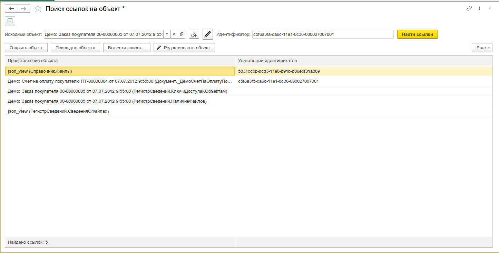

# Поиск ссылок на объект

Поиск всех объектов базы данных, которые ссылаются на указанный объект. Аналог стандартной обработки из меню «Все функции», но с расширенными возможностями навигации по результатам.



## Назначение

- Поиск всех ссылок на заданный объект по всей базе данных
- Навигация по найденным объектам: открытие, рекурсивный поиск, редактирование
- Ввод объекта поиска по навигационной ссылке (URL)
- Отображение метаданных найденных объектов с пиктограммами типов
- Быстрый поиск по строке в таблице результатов

## Особенности

### Рекурсивный поиск

Команда **«Поиск для объекта»** открывает новый экземпляр инструмента для выбранного найденного объекта. Это позволяет последовательно исследовать цепочки ссылок: объект А → объект Б → объект В и т.д.

### Ввод по навигационной ссылке

Кнопка **«Исходный объект по ссылке»** позволяет задать объект поиска по URL в формате `e1cib/data/ТипОбъекта?ref=UUID`. Это удобно, когда ссылка на проблемный объект получена из сообщения об ошибке, журнала регистрации или от другого пользователя.

## Откуда открыть

| Способ                                                                      | Описание                                                  |
| --------------------------------------------------------------------------- | --------------------------------------------------------- |
| Меню **Универсальные инструменты → Поиск ссылок на объект [УИ]**            | Основной вход                                             |
| Контекстное меню объекта (подменю **Инструменты → Найти ссылки на объект**) | Если форма подключена к подсистеме «Подключаемые команды» |
| Параметр `Параметры.ОбъектПоиска` при открытии формы                        | Программное открытие с предустановленным объектом         |

## Основной интерфейс

Форма состоит из двух функциональных зон: **шапка** (выбор объекта и запуск поиска) и **таблица результатов**.

### Шапка

- **Поле «Исходный объект»** — ссылка на объект, для которого выполняется поиск. Поддерживает выбор типа (F4), кнопку очистки.
- **Кнопка «Исходный объект по ссылке»** — позволяет ввести навигационную ссылку (URL) в формате `e1cib/data/...` для загрузки объекта.
- **Поле «Идентификатор»** — уникальный идентификатор (UUID) выбранного объекта, только чтение. Заполняется автоматически.
- **Кнопка «Редактировать исходный объект»** — открывает выбранный объект в [Редакторе реквизитов объекта](/docs/tools/data-tools/object-attributes-editor).
- **Кнопка «Найти ссылки»** — запускает поиск. Является кнопкой по умолчанию (срабатывает по Enter).

### Таблица результатов

Основная рабочая область. Содержит все найденные объекты, ссылающиеся на указанный.

| Колонка                      | Описание                                                                     |
| ---------------------------- | ---------------------------------------------------------------------------- |
| **Картинка**                 | Пиктограмма типа метаданных (Справочник, Документ, Регистр сведений и т.д.)  |
| **Представление объекта**    | Текстовое представление найденного объекта + полное имя метаданных в скобках |
| **Уникальный идентификатор** | UUID найденного объекта (только для ссылочных типов)                         |

В подвале таблицы отображается счётчик **«Найдено ссылок: N»**.

### Командная панель таблицы

| Команда                  | Описание                                                                                                                                                                    |
| ------------------------ | --------------------------------------------------------------------------------------------------------------------------------------------------------------------------- |
| **Открыть объект**       | Открывает выбранный объект в режиме просмотра (`ПоказатьЗначение`). Доступна для объектов, которые можно открыть (справочники, документы, планы видов характеристик и т.д.) |
| **Поиск для объекта**    | Открывает новый экземпляр инструмента «Поиск ссылок на объект» для выбранного найденного объекта (рекурсивный поиск)                                                        |
| **Редактировать объект** | Открывает выбранный объект в [Редакторе реквизитов объекта](/docs/tools/data-tools/object-attributes-editor)                                                                |

### Контекстное меню строки (правая кнопка мыши)

| Пункт                 | Действие                                                                           |
| --------------------- | ---------------------------------------------------------------------------------- |
| **Открыть объект**    | Открыть выбранный объект (доступно только для открываемых типов)                   |
| **Поиск для объекта** | Рекурсивный поиск ссылок на выбранный объект (доступно только для ссылочных типов) |

## Сценарии использования

### Поиск ссылок на элемент справочника

```
1. Открыть инструмент
2. Выбрать нужный элемент справочника в поле «Исходный объект»
3. Нажать «Найти ссылки»
4. Просмотреть таблицу результатов — все объекты, ссылающиеся на выбранный
5. При необходимости открыть любой найденный объект двойным щелчком
```

### Исследование цепочки зависимостей

```
1. Найти ссылки на объект А
2. В результатах найти объект Б, который ссылается на А
3. Выделить строку Б → нажать «Поиск для объекта»
4. В новом окне отобразятся объекты, ссылающиеся на Б
```

### Поиск по навигационной ссылке из ошибки

```
1. Скопировать URL из сообщения об ошибке (e1cib/data/...)
2. Нажать кнопку «Исходный объект по ссылке»
3. Вставить URL в диалоговое окно
4. Нажать «Найти ссылки»
```

## Где используется

| Инструмент                       | Как используется                                       |
| -------------------------------- | ------------------------------------------------------ |
| **Редактор реквизитов объекта**  | Страница «Ссылки на объект» — поиск зависимых объектов |
| **Удаление помеченных объектов** | Проверка наличия ссылок перед удалением                |
| **Подключаемые команды (БСП)**   | Пункт «Найти ссылки на объект» в контекстном меню форм |

Через подсистему **Подключаемые команды** (БСП) пункт **Инструменты → Найти ссылки на объект** появляется в формах списков и элементов справочников и документов. Подробнее — [Интеграция с БСП](/docs/guides/bsp-integration).

## Связанные статьи

- [Интеграция с БСП](/docs/guides/bsp-integration) — подключение команды «Найти ссылки на объект» к формам
- [Редактор реквизитов объекта](/docs/tools/data-tools/object-attributes-editor) — низкоуровневое редактирование найденных объектов
- [Удаление помеченных объектов](/docs/tools/administration-tools/delete-marked) — проверка ссылок перед удалением
