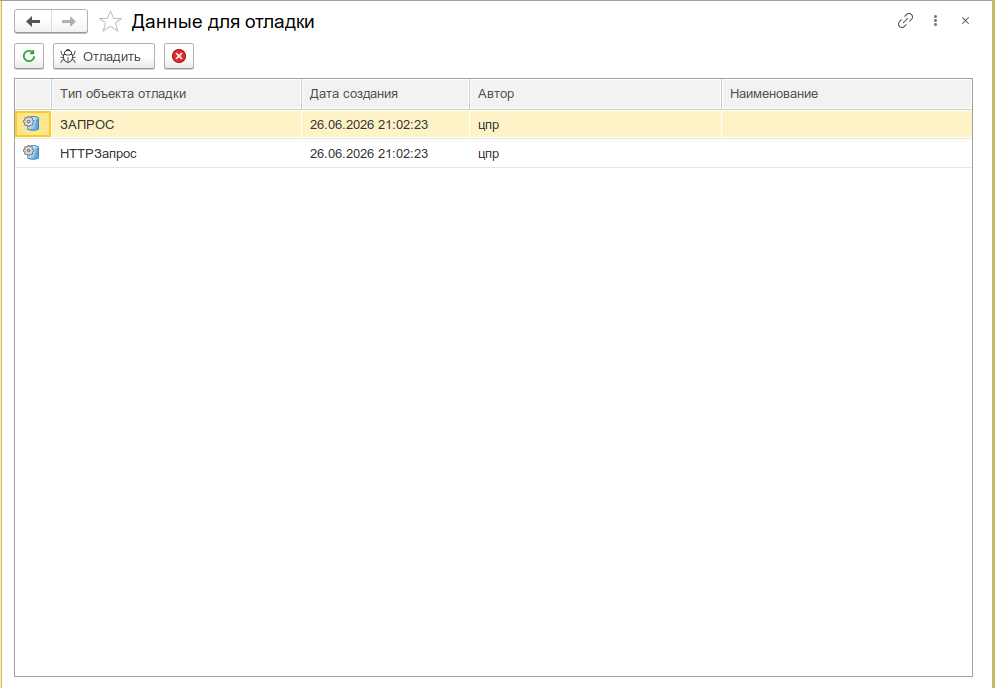
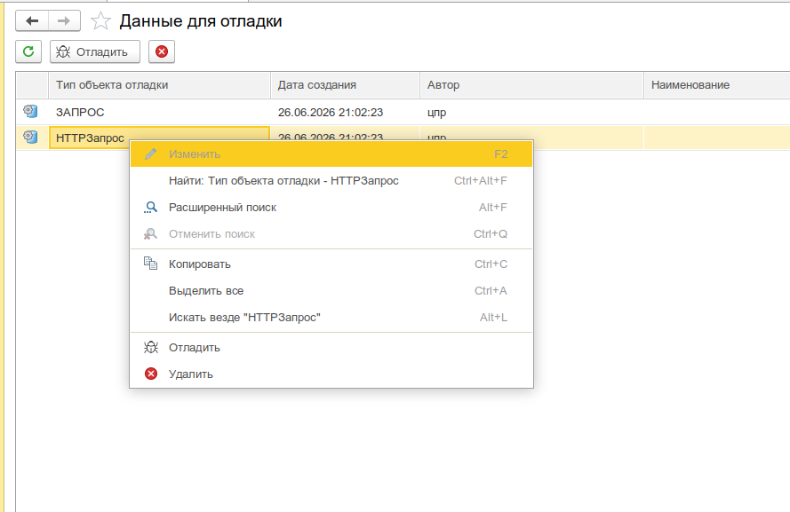
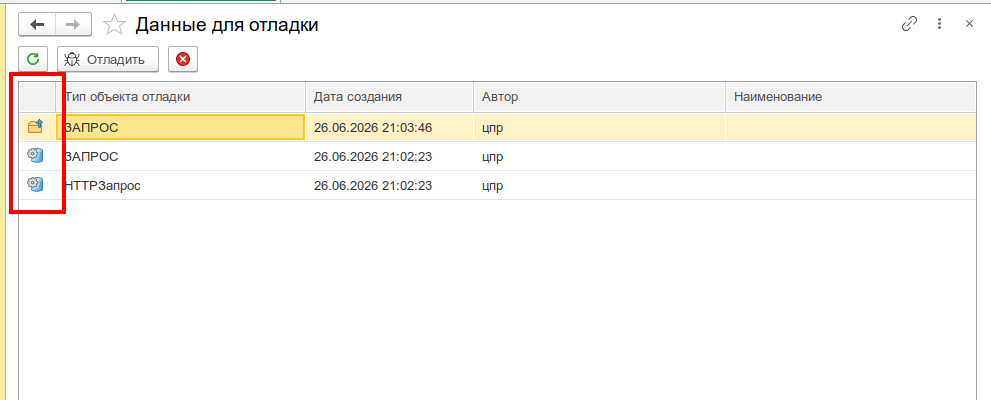

# Данные для отладки

Управление сохранёнными объектами отладки - единый список всех отладочных снимков, сделанных через `УИ_._От()` / `УИ_._ОтФ()` в тонком, веб- или толстом клиенте.



## Назначение

- Просмотр истории отладки - список всех сохранённых объектов с датой, автором и типом
- Повторное открытие объектов в соответствующем инструменте (консоль запросов, консоль отчётов, редактор реквизитов и т.д.)
- Удаление устаревших отладочных данных
- Контроль источников хранения: **Хранилище системных настроек** (основной режим) или **файлы на сервере** (портативная поставка / активная транзакция)

## Использование

1. Откройте форму - меню **Универсальные инструменты > Данные для отладки**
2. В таблице отображаются все сохранённые объекты отладки
3. **Двойной клик** по строке - открыть объект в соответствующей консоли
4. Контекстное меню / кнопки панели: **Отладить**, **Удалить**, **Обновить таблицу**



## Структура списка

| Колонка             | Описание                                                                       |
| ------------------- | ------------------------------------------------------------------------------ |
| Картинка            | Иконка источника: шестерёнка (хранилище настроек) или папка (файлы на сервере) |
| Тип объекта отладки | Тип сохранённого объекта (Запрос, СКД, HTTP и т.п.)                            |
| Дата создания       | Дата и время сохранения                                                        |
| Автор               | Имя пользователя, сохранившего объект                                          |
| Наименование        | Произвольное имя, заданное при вызове отладки                                  |

## Поддерживаемые типы объектов

| Тип                                     | Куда открывается                                                          |
| --------------------------------------- | ------------------------------------------------------------------------- |
| **Запрос**                              | Консоль запросов - текст запроса, параметры, результат, временные таблицы |
| **Менеджер временных таблиц**           | Консоль запросов с пустым текстом и заполненными временными таблицами     |
| **Схема компоновки данных**             | Консоль отчётов - СКД, настройки, внешние наборы, временные таблицы       |
| **Таблица формы** (динамический список) | Консоль отчётов с извлечёнными СКД и настройками                          |
| **Ссылочный объект БД**                 | Редактор реквизитов объекта                                               |
| **HTTP-запрос**                         | Консоль HTTP-запросов - URL, заголовки, тело, прокси, аутентификация      |

## Механизм хранения

### Системное хранилище настроек (по умолчанию)

Вызов `УИ_._От()` сериализует объект и сохраняет его в **Хранилище системных настроек** под ключом `УИ_УниверсальныеИнструменты_ДанныеДляОтладки`.

Ключ формируется как:

```
ТипОбъектаОтладки/Пользователь/ДатаВФорматеГГГГММДДЧЧММСС/Наименование
```

Если активна транзакция в портативной поставке - автоматически переключается на файловый вариант.

### Файловое хранение (`УИ_._ОтФ()`)

Вызов `УИ_._ОтФ()` сохраняет данные в каталог на сервере:

```
<каталог данных отладки>/<UUID>/
  - ДАННЫЕ.data      - сериализованный объект
  - МЕТАДАННЫЕ.json  - автор, дата, тип, наименование
```

Используется при:

- явном вызове `УИ_._ОтФ()`
- активной транзакции в портативной поставке



## Связанные разделы

- [Программный вызов отладки](/docs/guides/debugging) - как сохранять объекты из кода
- [Отладка внешних обработок БСП](/docs/guides/debugging-bsp-external)
- [Отладка в портативном варианте](/docs/guides/debugging-portable)
