# Менеджер открытых форм

Просмотр и редактирование открытых форм, их элементов, свойств, реквизитов и параметров прямо в режиме предприятия. А также открытие новых форм (включая системные) с передачей произвольных параметров.

:::info
Форк [ManagerOpenForms](https://github.com/SeiOkami/ManagerOpenForms) от [SeiOkami](https://infostart.ru/profile/1334251/). [Лицензия MIT](https://github.com/SeiOkami/ManagerOpenForms/blob/main/LICENSE)
:::

_Общий вид обработки: список открытых форм слева, панель информации и вкладки справа_
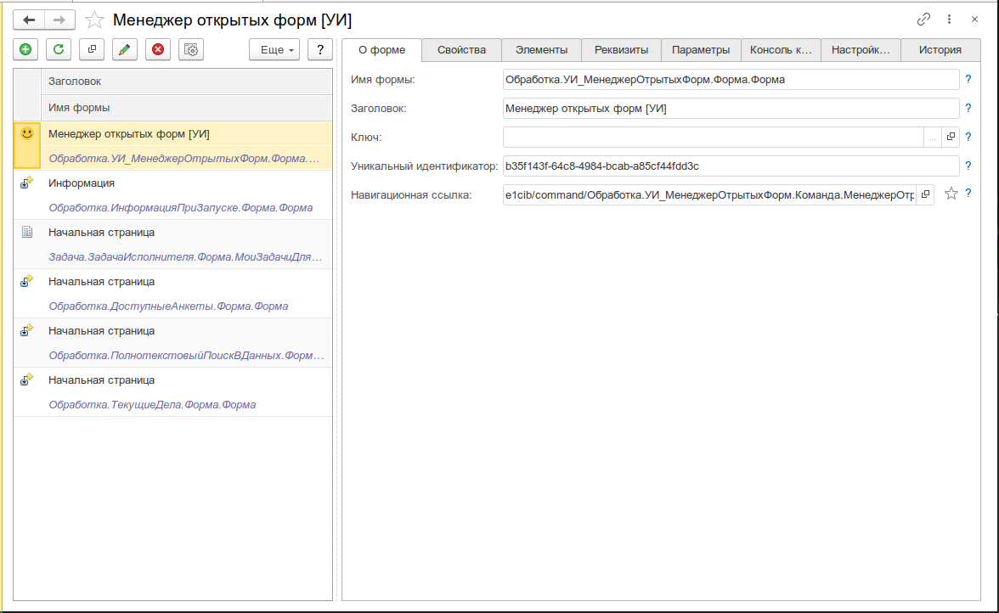


---

## Назначение

В процессе разработки и сопровождения конфигураций 1С часто возникает необходимость заглянуть «под капот» открытой формы: посмотреть скрытые элементы, временно изменить их свойства, подставить нужное значение в недоступный реквизит или просто понять, с какими параметрами форма была открыта. Делать это через отладку конфигуратора не всегда удобно или возможно — особенно на работающей базе заказчика.

Менеджер открытых форм решает эту задачу: обработка перехватывает все открытые окна, собирает информацию о формах, выводит её в редактор и позволяет выполнять разные манипуляции — от изменения видимости элементов до выполнения произвольного кода в контексте выбранной формы.

Инструмент будет полезен:

- **Разработчикам** — для быстрой диагностики и исправления проблем на форме без перезапуска предприятия
- **Консультантам и техподдержке** — для анализа проблем пользователя на работающей базе без глубоких знаний конфигурации
- **Тестировщикам** — для проверки поведения формы в различных состояниях (скрытые элементы, блокировка полей, статусы)

---

## Основные возможности

- **Список открытых форм** — сканирование всех окон предприятия: заголовок, ключ формы, уникальный идентификатор, навигационная ссылка, признак избранного
- **Управление формой** — активировать, закрыть, принудительно снять `ТолькоПросмотр`/`Доступность` со всех элементов
- **Дерево элементов** — рекурсивный просмотр всех элементов формы (группы, поля, кнопки, декорации, таблицы) с изменением свойств `Видимость`, `ТолькоПросмотр`, `Доступность`; двойной клик для позиционирования на элемент
- **Свойства формы** — просмотр и изменение свойств: `АвтоЗаголовок`, `Доступность`, `Заголовок`, `Модифицированность`, `ТолькоПросмотр`; произвольная установка любого свойства
- **Реквизиты формы** — сканирование реквизитов по шаблонам (Объект, Запись, Отчёт) и именам элементов; рекурсивный обход подчинённых свойств; редактирование значений; специализированные редакторы для `ДинамическийСписок`, `КомпоновщикНастроекКомпоновкиДанных`, `Структура`, `Соответствие`, XML
- **Параметры формы** — просмотр параметров, с которыми форма была открыта
- **Консоль кода** — выполнение произвольного кода 1С на клиенте (с доступом к выбранной форме) и на сервере; обмен данными через `ДополнительныеПараметры`
- **Настройки из хранилища** — просмотр, добавление, изменение и удаление настроек формы в хранилище системных настроек
- **История открытия** — платформенная история открытия текущей формы текущим пользователем
- **Открытие новой формы** — открытие любой формы по имени метаданных, в том числе системных форм платформы (sysForm), с передачей произвольных параметров
- **Автообновление по таймеру** — периодический опрос открытых окон с настраиваемой задержкой
- **Избранное** — добавление/удаление форм в избранное платформы прямо из обработки
- **Гибкие настройки** — отключение ненужных функциональных блоков для ускорения работы

---

## Быстрый старт

1. Откройте меню **Универсальные инструменты → Отладка → Менеджер открытых форм [УИ]**
2. В левой части нажмите **Обновить список открытых форм** — появятся все окна предприятия
3. Выберите интересующую форму — в правой части отобразится информация: заголовок, ключ, уникальный идентификатор, навигационная ссылка
4. Переключайтесь между вкладками для просмотра и редактирования:
   - **Элементы** — дерево элементов формы
   - **Свойства** — свойства формы
   - **Реквизиты** — дерево реквизитов
   - **Параметры** — параметры открытия формы
   - **Консоль кода** — выполнение кода в контексте формы
   - **Настройки из хранилища** — системные настройки формы
   - **История** — история открытия формы

---

## Интерфейс

### Список открытых форм

Левая панель содержит список всех открытых окон предприятия. Для каждой формы отображается заголовок, иконка типа метаданных и признак избранного.

Панель инструментов списка:

| Кнопка                       | Назначение                                                     |
| ---------------------------- | -------------------------------------------------------------- |
| **Обновить**                 | Пересканировать все открытые окна                              |
| **Активировать**             | Переключить фокус на выбранную форму                           |
| **Перечитать**               | Обновить информацию о выбранной форме                          |
| **Разрешить редактирование** | Снять `ТолькоПросмотр` и `Доступность` со всех элементов формы |
| **Открыть новую форму**      | Диалог открытия формы по имени метаданных                      |
| **Настройки**                | Открыть настройки обработки                                    |
| **Автообновление**           | Включить периодическое сканирование окон по таймеру            |
| **Сортировка**               | Упорядочить список по заголовку                                |
| **Закрыть**                  | Закрыть выбранную форму                                        |
| **Избранное**                | Добавить/удалить форму в избранное платформы                   |

_Панель списка открытых форм_
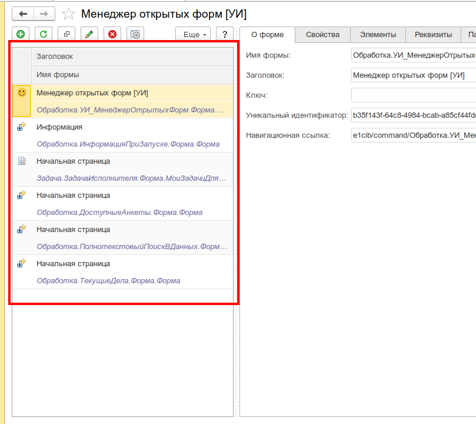

### О форме

Панель с информацией о выбранной форме:

- **Заголовок** — текущий заголовок формы
- **Ключ** — параметр формы «Ключ» (для форм элементов содержит ссылку на сам элемент)
- **Уникальный идентификатор** — идентификатор формы, которым оперирует обработка
- **Навигационная ссылка** — ссылка на форму; справа от поля — кнопка добавления в избранное

_Панель информации о выбранной форме_
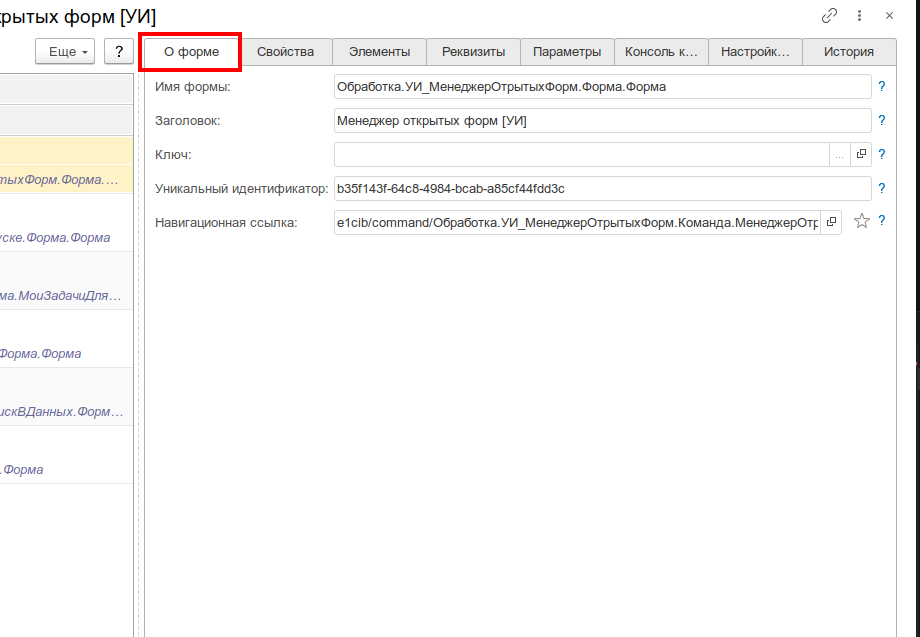

### Элементы

Данный функционал доступен, если в настройках установлен флажок «Работа с элементами форм».

Дерево всех элементов выбранной формы: группы, поля ввода, кнопки, таблицы, декорации, элементы управления. Для каждого элемента можно изменить:

- **Видимость** — показать/скрыть элемент на форме
- **ТолькоПросмотр** — разрешить/запретить редактирование
- **Доступность** — включить/отключить элемент

При двойном клике по элементу форма активируется с позиционированием на выбранный элемент. Обновление дерева — F5 или контекстное меню.

_Дерево элементов формы с возможностью изменения видимости и доступности_
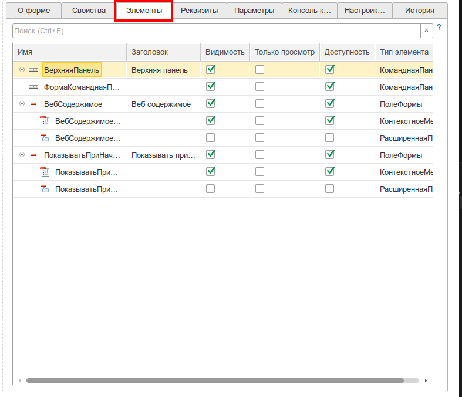

### Свойства

Данный функционал доступен, если в настройках установлен флажок «Работа со свойствами форм».

Список свойств формы:

- `АвтоЗаголовок`
- `Доступность`
- `Заголовок`
- `Модифицированность`
- `ТолькоПросмотр`

Также доступна **произвольная установка** любого свойства формы через пункт контекстного меню.

_Редактирование свойств формы_
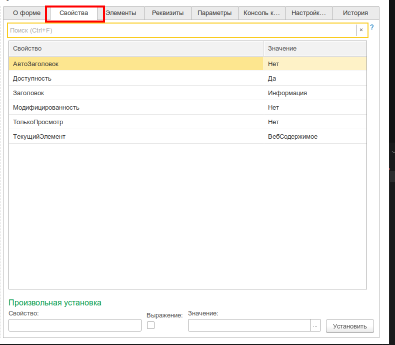

### Реквизиты

Данный функционал доступен, если в настройках установлен флажок «Работа с реквизитами форм».

Дерево реквизитов формы с возможностью изменения их значений. Из-за ограничений платформы полный список реквизитов другой открытой формы получить нельзя — реализовано «сканирование» по встроенным шаблонам:

- **Объект** — основные реквизиты объекта формы
- **Запись** — для форм записей регистров
- **Отчёт** — для форм отчётов
- **Имена элементов** — реквизиты, соответствующие элементам формы

Реквизиты, которые не удалось определить автоматически, можно проверить вручную, задав имя в поле внизу таблицы. В настройках инструмента можно указать список имён реквизитов, наличие которых будет проверяться автоматически в каждой открытой форме.

Для реквизитов поддерживается открытие в специализированных редакторах:

- **Динамический список** — компоновщик настроек, отбор, параметры, порядок, условное оформление
- **Компоновщик настроек** — полный редактор СКД
- **Структура / Соответствие** — редактор ключей и значений
- **XML** — прямое редактирование через сериализацию `ЗначениеВСтрокуВнутр`
- **Произвольные значения** — для коллекций и нестандартных типов

_Дерево реквизитов с возможностью редактирования значений_
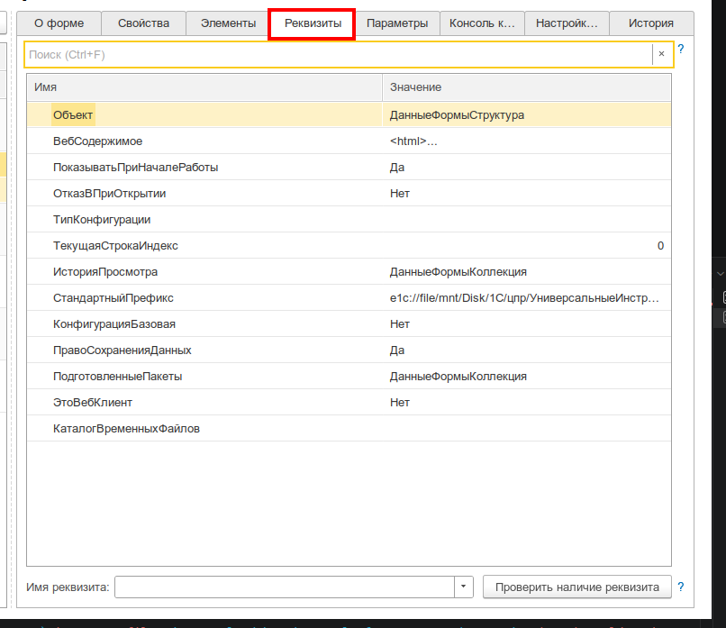

_Редактор структуры и соответствия_
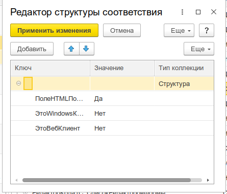

_Редактор значений через XML_
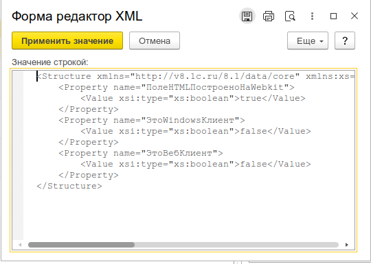

_Редактор динамического списка (компоновщик, отбор, параметры)_
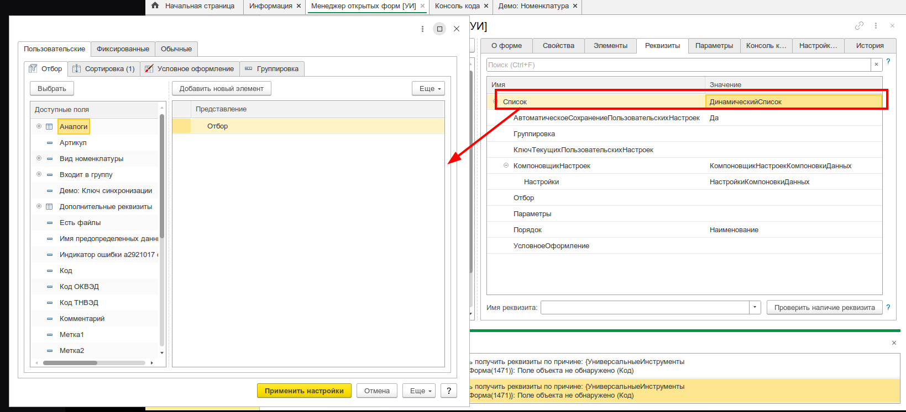

_Редактор компоновщика настроек (СКД)_
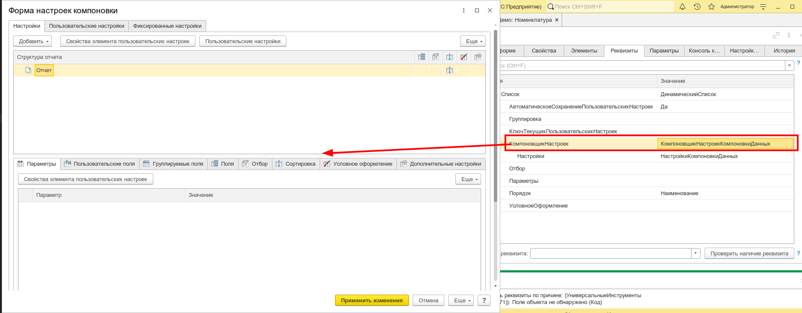

### Параметры

Данный функционал доступен, если в настройках установлен флажок «Показывать параметры форм».

Список параметров, с которыми форма была открыта. Позволяет понять, какие значения были переданы при открытии формы и изменить их в реальном времени.

_Параметры выбранной формы_
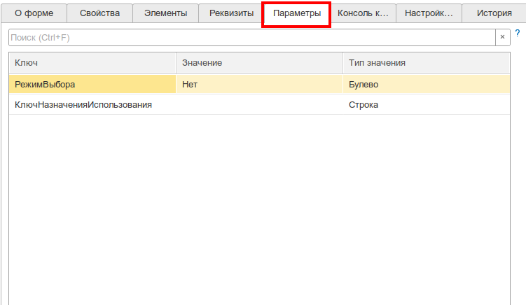

### Консоль кода

Данный функционал доступен, если в настройках установлен флажок «Работа с консолью кода».

Позволяет выполнить произвольный код 1С в контексте выбранной формы. Редактор кода разделён на две части: **&НаКлиенте** и **&НаСервере**.

**Доступные переменные (клиент):**

| Переменная                | Назначение                                             |
| ------------------------- | ------------------------------------------------------ |
| `ТекущаяФорма`            | Выбранная открытая форма (объект)                      |
| `ТекстНаСервере`          | Текст кода, выполняемого на сервере                    |
| `ДополнительныеПараметры` | Структура для обмена данными между клиентом и сервером |

**Доступные методы:**

| Метод                                                            | Назначение               |
| ---------------------------------------------------------------- | ------------------------ |
| `ВыполнитьКодНаСервере(ТекстНаСервере, ДополнительныеПараметры)` | Выполнить код на сервере |

**Пример — получить данные через запрос:**

```bsl
// &НаКлиенте
ДопПараметры = ДополнительныеПараметры;
ДопПараметры.Вставить("Команда", "ПолучитьДанные");

ВыполнитьКодНаСервере("
|// &НаСервере
|Запрос = Новый Запрос;
|Запрос.Текст = "
|"ВЫБРАТЬ
||    Номенклатура.Код,
||    Номенклатура.Наименование
||ИЗ
||    Справочник.Номенклатура КАК Номенклатура
||ГДЕ
||    Номенклатура.Ссылка = &Ссылка";
|Запрос.УстановитьПараметр(""Ссылка"", ДополнительныеПараметры.Ссылка);
|Результат = Запрос.Выполнить().Выгрузить();
|ДополнительныеПараметры.Вставить(""Результат"", Результат);
|", ДопПараметры);

// Результат доступен в ДополнительныеПараметры.Результат
```

_Консоль кода с примером выполнения запроса_
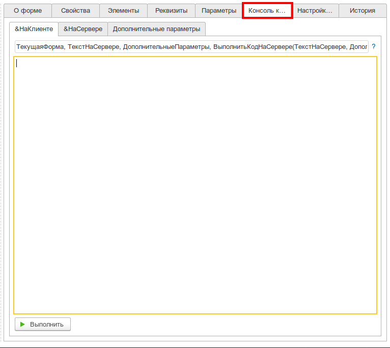

### Настройки из хранилища

Данный функционал доступен, если в настройках обработки стоит флажок «Работа с настройками форм».

Таблица показывает список настроек из хранилища системных настроек для выбранной формы. Команды панели (или F5) обновляют список. Поддерживается добавление, изменение и удаление настроек. Редактирование настройки происходит в виде строки, полученной методом `ЗначениеВСтрокуВнутр(Настройка)`.

_Редактирование настройки из хранилища_
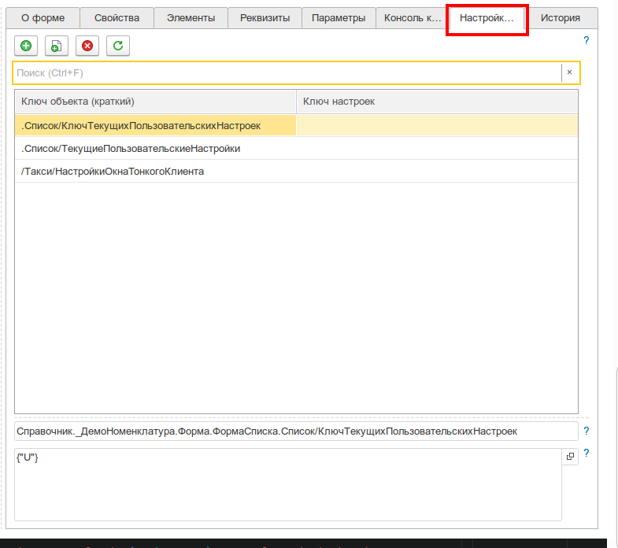

### История

Данный функционал доступен, если в настройках обработки стоит флажок «Показывать историю открытия формы».

Платформенная история открытия текущей формы текущим пользователем.

### Настройки обработки

Диалог настроек позволяет гибко включать и отключать функциональные блоки:

- Работа с элементами форм
- Работа со свойствами форм
- Работа с реквизитами форм
- Показывать параметры форм
- Работа с консолью кода
- Работа с настройками форм
- Показывать историю открытия формы
- Список автоматически проверяемых реквизитов

Отключение ненужных блоков ускоряет работу инструмента и упрощает интерфейс.

_Диалог настроек обработки_
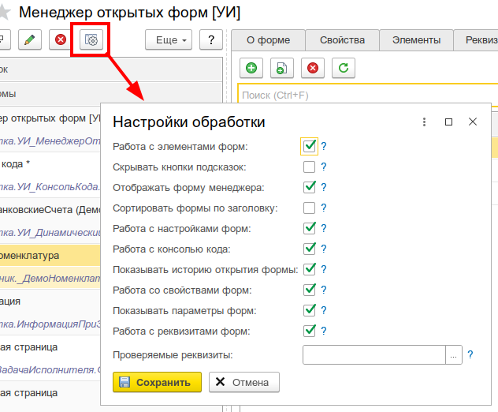

---

## Сценарии использования

### Снятие блокировки с полей формы

Пользователь жалуется, что не может редактировать поле на форме, но в конфигураторе видно, что поле доступно.

1. Откройте Менеджер открытых форм
2. Найдите нужную форму в списке
3. Нажмите **Разрешить редактирование** — со всех элементов формы будет снят `ТолькоПросмотр` и установлена `Доступность`
4. Если нужно точечно — перейдите на вкладку **Элементы** и измените свойства конкретного элемента

### Поиск и изменение скрытого реквизита

Требуется узнать значение реквизита, которого нет на форме, или изменить его для теста.

1. Выберите форму, перейдите на вкладку **Реквизиты**
2. Разверните дерево до нужного реквизита
3. Измените значение в поле ввода
4. Для сложных типов (структура, СКД, XML) откройте специализированный редактор двойным кликом

### Просмотр параметров открытия формы

Нужно понять, с какими параметрами форма была открыта (например, какая организация или период переданы).

1. Выберите форму
2. Перейдите на вкладку **Параметры**
3. Просмотрите все переданные параметры и их текущие значения

### Выполнение кода в контексте формы

Требуется выполнить серверный запрос для выбранной формы или изменить её состояние программно.

1. Выберите форму
2. Перейдите на вкладку **Консоль кода**
3. Напишите код на клиенте с доступом к переменной `ТекущаяФорма`
4. При необходимости вызовите серверный код через `ВыполнитьКодНаСервере()`

### Открытие скрытой системной формы

Нужно открыть форму, которой нет в меню конфигурации, или системную форму платформы (sysForm).

1. Нажмите **Открыть новую форму** в панели инструментов
2. В диалоге выберите тип объекта: справочник, документ, обработка, отчёт, системная форма и т.д.
3. Укажите имя формы и при необходимости параметры открытия
4. Нажмите **Открыть**

_Диалог открытия новой формы_
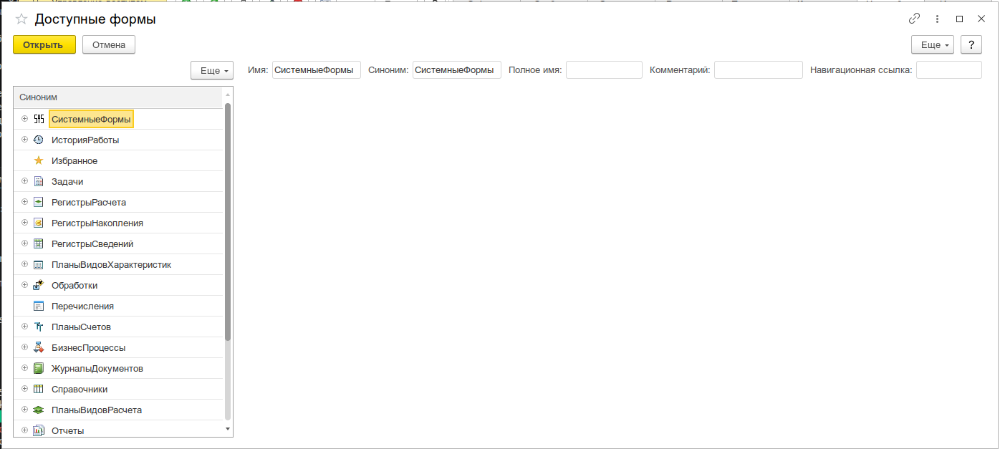

### Работа с настройками формы через хранилище

Если форма использует хранилище системных настроек (например, для сохранения состояния), можно просмотреть или изменить эти настройки напрямую.

1. Выберите форму
2. Перейдите на вкладку **Настройки из хранилища**
3. Найдите нужную настройку, измените её значение (строка в формате `ЗначениеВСтрокуВнутр`)
4. Сохраните изменения

---

## Интеграция с другими инструментами

- **Консоль кода** — код из Менеджера открытых форм можно выполнить в [Консоли кода](/docs/tools/development-tools/code-console)
- **Редактор JSON** — для анализа JSON-значений реквизитов используется [Редактор JSON](/docs/tools/development-tools/json-editor)
- **Редактор прототипов форм** — для построения макетов форм используется [Редактор прототипов форм](/docs/tools/development-tools/prototype-editor)
- **Редактор СКД** — для редактирования схем компоновки данных используется [Редактор СКД](/docs/tools/development-tools/skd-editor)
- **Просмотр значения** — для исследования свойств произвольных объектов удобно использовать [Просмотр значения](/docs/tools/debugging-tools/value-viewer)
