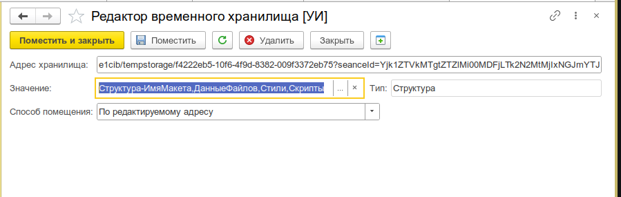
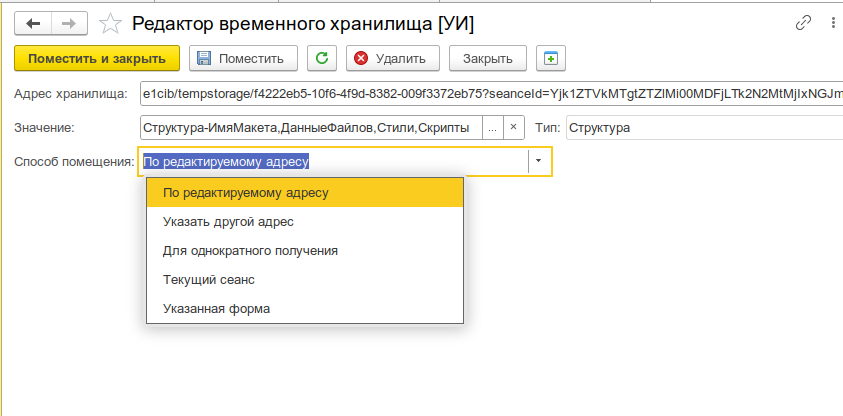
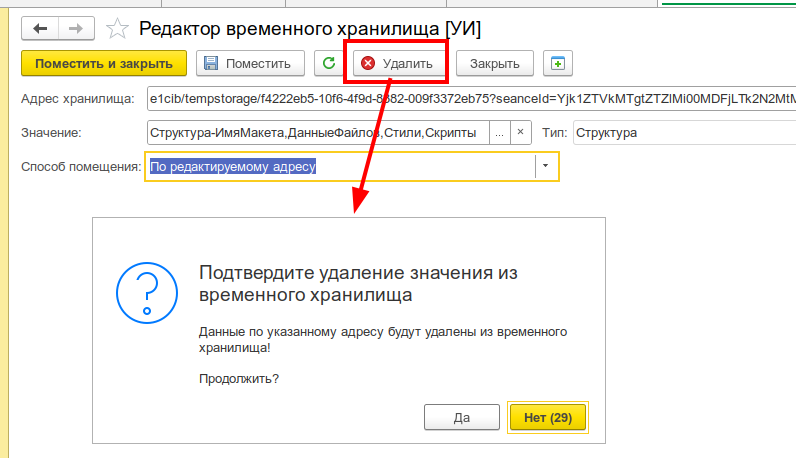

# Редактор временного хранилища

Просмотр, редактирование и помещение значений во временное хранилище 1С. Инструмент позволяет работать с произвольными данными по адресу временного хранилища: прочитать, изменить, поместить новые данные с выбором способа размещения.

_Полный вид формы: поле адреса, значение с типом, группа способа помещения, командная панель_


## Назначение

- **Просмотр** значения по адресу временного хранилища
- **Редактирование** существующего значения с контролем типа
- **Помещение** нового значения с выбором способа адресации
- **Удаление** значения из временного хранилища по адресу

## Особенности

- Единое окно для чтения и записи данных временного хранилища
- Поддержка произвольных типов данных через универсальный редактор значения (с контейнером)
- Выбор способа помещения: по текущему адресу, на форму, в новый адрес, на сеанс, однократно
- Валидация адреса временного хранилища при вводе

## Использование

### Запуск

Откройте меню **Универсальные инструменты → Отладка → Редактор временного хранилища**.

Также можно вызвать программно:

```bsl
УИ_ОбщегоНазначенияКлиент.НачатьРедактированиеВременногоХранилищаПоАдресу(
    АдресВоВременномХранилище,    // Адрес для загрузки
    ,                              // ОписаниеОповещенияОЗавершении
    "Мои данные",                  // Заголовок формы
    );                             // Владелец (форма)
```

### Просмотр и редактирование

1. Введите адрес временного хранилища в поле **Адрес хранилища** (или передайте его при открытии).
2. Значение автоматически загрузится в поле **Значение**. Тип значения отображается справа.
3. Отредактируйте значение. Для выбора типа и значения используйте кнопку выбора (
   открывается универсальный редактор значения).
4. Нажмите **Поместить**, чтобы сохранить изменения по текущему адресу.

### Способы помещения

Инструмент поддерживает пять способов размещения значения во временном хранилище:

| Способ                         | Адрес помещения                  | Описание                                                |
| ------------------------------ | -------------------------------- | ------------------------------------------------------- |
| **По редактируемому адресу**   | Текущий адрес (`АдресХранилища`) | Перезапись значения по текущему адресу                  |
| **Указать другой адрес**       | Поле `НовыйАдресДляПомещения`    | Помещение по произвольному адресу                       |
| **Указанная форма**            | `УникальныйИдентификатор` формы  | Привязка значения к открытой форме                      |
| **Текущий сеанс**              | Новый `УникальныйИдентификатор`  | Автоматическая генерация адреса сеанса                  |
| **Для однократного получения** | `Неопределено`                   | Значение без явного адреса (доступно только получателю) |

_Раскрытый список выбора способа помещения: пять доступных вариантов_


При выборе способа **Указать другой адрес** появляется дополнительное поле `Адрес для помещения`.
При выборе **Указанная форма** — поле `Форма` с кнопкой выбора из списка открытых окон.

```bsl
// Программный аналог — напрямую через функции платформы:

// Поместить по текущему адресу
ПоместитьВоВременноеХранилище(Значение, АдресХранилища);

// Поместить с новым адресом (текущий сеанс)
НовыйАдрес = ПоместитьВоВременноеХранилище(Значение, Новый УникальныйИдентификатор);

// Поместить для однократного получения
Адрес = ПоместитьВоВременноеХранилище(Значение);

// Прочитать значение
Результат = ПолучитьИзВременногоХранилища(АдресХранилища);

// Удалить
УдалитьИзВременногоХранилища(АдресХранилища);
```

### Поместить и закрыть

Кнопка **Поместить и закрыть** выполняет помещение значения и закрывает форму. После закрытия форма возвращает адрес хранилища, по которому было помещено значение. Это удобно при вызове инструмента из другого алгоритма.

### Удаление

Кнопка **Удалить** удаляет значение из временного хранилища по текущему адресу. Перед удалением выводится запрос подтверждения (таймаут 30 секунд, по умолчанию — "Нет").

_Запрос подтверждения перед удалением значения_


### Перечитать

Кнопка **Перечитать из временного хранилища** загружает свежее значение по текущему адресу (полезно, если данные могли измениться из другого места).

## Валидация

- При вводе адреса проверяется, что строка является адресом временного хранилища (функция `ЭтоАдресВременногоХранилища`)
- При попытке помещения проверяется заполнение обязательных полей в зависимости от выбранного способа
- Ошибки чтения/записи временного хранилища перехватываются и выводятся пользователю

## Программный интерфейс

Открытие инструмента из кода:

```bsl
Процедура ПоказатьРедактор(Команда)

    ОписаниеОповещения = Новый ОписаниеОповещения("ПослеРедактирования", ЭтотОбъект);
    УИ_ОбщегоНазначенияКлиент.НачатьРедактированиеВременногоХранилищаПоАдресу(
        АдресВоВременномХранилище,
        ОписаниеОповещения);

КонецПроцедуры

Процедура ПослеРедактирования(АдресРезультат, ДополнительныеПараметры) Экспорт
    Если АдресРезультат = Неопределено Тогда
        Возврат;
    КонецЕсли;
    Сообщить("Значение сохранено по адресу: " + АдресРезультат);
КонецПроцедуры
```
