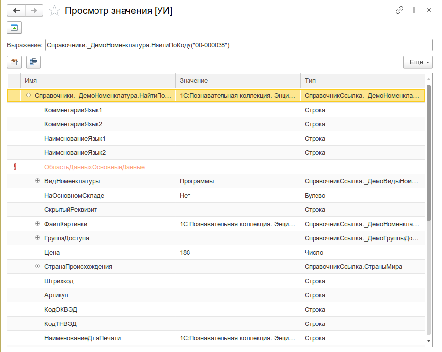
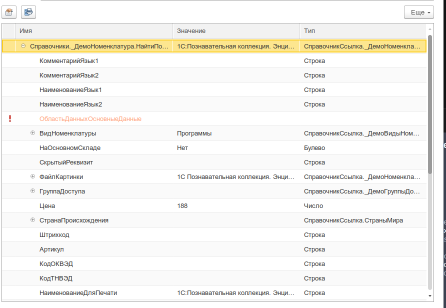
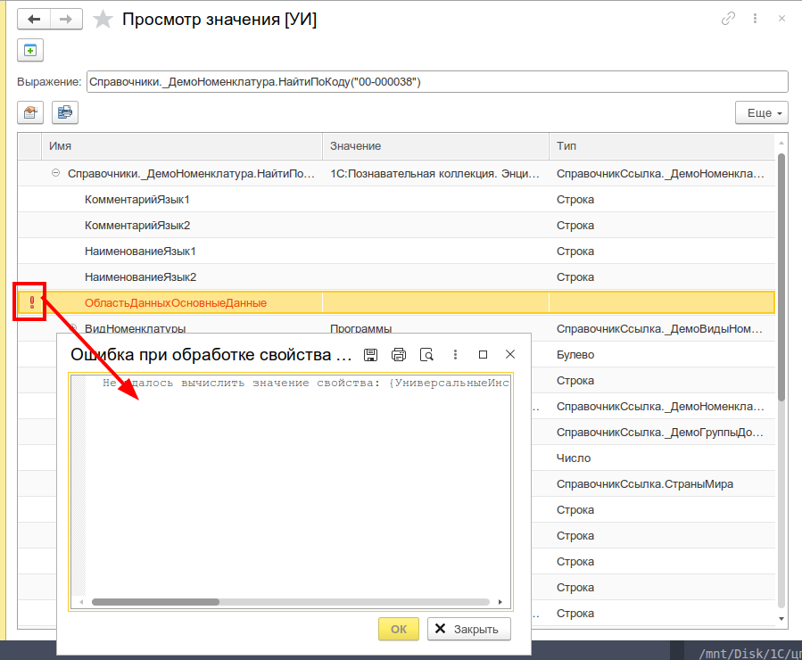
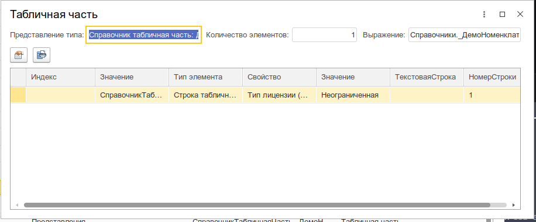

# Просмотр значения

Вычисление произвольных выражений и интерактивное исследование значений любого типа 1С с навигацией по иерархии свойств — аналог диалога «Вычислить выражение» отладчика в режиме предприятия.

_Общий вид обработки: поле ввода выражения сверху, дерево свойств значения снизу_


---

## Назначение

При разработке и отладке конфигураций 1С постоянно возникает необходимость «заглянуть внутрь» значения — посмотреть структуру объекта, перечислить его свойства, проверить конкретные реквизиты. В конфигураторе для этого есть диалог «Вычислить выражение» в отладчике, но в режиме предприятия такой возможности нет.

Просмотр значения закрывает этот пробел: инструмент позволяет вычислить выражение на клиенте или сервере и отобразить результат в виде интерактивного дерева со всеми доступными свойствами.

Инструмент будет полезен:

- **Разработчикам** — для быстрой проверки значений переменных, структуры коллекций, свойств объектов без перезапуска предприятия и подключения отладчика
- **Консультантам и техподдержке** — для диагностики проблем на работающей базе: посмотреть значение константы, проверить реквизит объекта, проанализировать структуру данных
- **Тестировщикам** — для верификации данных после выполнения обработок и проверки корректности заполнения объектов

---

## Основные возможности

- **Вычисление выражений** — ввод произвольного выражения на встроенном языке 1С с вычислением на клиенте или сервере (переключатель «Контекст»)
- **Дерево свойств** — рекурсивный просмотр всех свойств и реквизитов значения; каждый уровень загружается лениво (при разворачивании узла)
- **Коллекции** — для массивов, структур, соответствий, таблиц значений и других коллекций — отображение в виде таблицы с общими для всех элементов свойствами в колонках
- **Навигация** — двойной клик по свойству открывает его значение в новом окне для детального изучения
- **Обработка ошибок** — свойства, которые не удалось вычислить, помечаются красным восклицательным знаком; при клике показывается текст ошибки
- **Поиск и сортировка** — встроенный поиск по дереву, сортировка по возрастанию/убыванию
- **Копирование** — копирование строки в буфер обмена через контекстное меню
- **Программный вызов** — возможность открыть просмотр из кода других инструментов (Консоль кода, Менеджер открытых форм)

---

## Быстрый старт

1. Откройте меню **Универсальные инструменты → Отладка → Просмотр значения [УИ]**
2. Введите выражение в поле ввода и нажмите Enter
3. В дереве отобразится результат: имя, тип и строковое представление значения
4. Разворачивайте узлы дерева для просмотра свойств
5. Для детального изучения любого свойства — кликните по нему дважды (или нажмите **Показать в отдельном окне**)

---

## Интерфейс

### Поле выражения

| Элемент        | Назначение                               |
| -------------- | ---------------------------------------- |
| **Поле ввода** | Ввод произвольного выражения на языке 1С |

Выражение может быть любой конструкцией 1С: вызов функции, обращение к переменной, создание объекта, арифметическое или логическое выражение.

Примеры:

```bsl
Справочники.Номенклатура.НайтиПоКоду("000000001")
Новый Массив
Метаданные.Справочники
ТекущаяДата()
```

### Дерево значения

_Дерево свойств со значениями, типами и признаками ошибок_


Колонки дерева:

| Колонка      | Назначение                                         |
| ------------ | -------------------------------------------------- |
| **Имя**      | Наименование свойства                              |
| **Значение** | Строковое представление значения свойства          |
| **Тип**      | Тип данных свойства                                |
| **(иконка)** | Красный восклицательный знак при ошибке вычисления |

Панель инструментов дерева:

| Кнопка                           | Назначение                                               |
| -------------------------------- | -------------------------------------------------------- |
| **Показать в отдельном окне**    | Открыть значение выбранной строки в новом окне просмотра |
| **Вывести список**               | Экспорт содержимого дерева в табличный документ          |
| **Сортировка (возр.) / (убыв.)** | Сортировка строк дерева                                  |
| **Найти / Отменить поиск**       | Поиск по дереву значений                                 |

**Ленивая загрузка**: при открытии формы вычисляется только корневое значение. Свойства загружаются по мере разворачивания узлов — это позволяет работать с большими объёмами данных без зависаний.

**Ошибки вычисления**: если свойство не удалось вычислить (например, метод не поддерживается для данного типа), строка помечается красным восклицательным знаком. Клик по иконке открывает окно с текстом ошибки.

_Ошибка вычисления свойства_


### Форма коллекции

Если значение является коллекцией (массив, структура, соответствие, таблица значений, список значений и т.п.), оно открывается в форме таблицы:

_Коллекция в табличном представлении_


Особенности формы коллекции:

- **Автоопределение колонок** — инструмент анализирует все элементы коллекции, определяет общие для них свойства и выводит их в виде колонок таблицы
- Двойной клик по строке открывает значение элемента в отдельном окне просмотра

---

## Сценарии использования

### Исследование ссылочного объекта

Нужно быстро посмотреть реквизиты справочника или документа, не открывая его форму.

1. Откройте **Просмотр значения**
2. Введите выражение: `Справочники.Номенклатура.НайтиПоКоду("00001")`
3. Нажмите Enter
4. Разверните узел — появятся реквизиты объекта: `Код`, `Наименование`, `Родитель`, `Владелец` и т.д.
5. Разверните `Родитель` — увидите реквизиты родительского элемента

### Анализ структуры коллекции

Требуется понять, какие элементы содержит массив или структура.

1. Откройте **Просмотр значения**
2. Введите, например: `Метаданные.Справочники`
3. Дерево покажет все справочники метаданных как коллекцию
4. Для каждого элемента отобразятся общие свойства: `Имя`, `Синоним`, `Реквизиты` и т.д.

### Просмотр результата вычисления

Можно проверить любую конструкцию языка без создания обработки.

```bsl
// Группировка по месяцам
Спр = Справочники.Контрагенты.Выбрать();
Результат = Новый Соответствие;
Пока Спр.Следующий() Цикл
    Месяц = Месяц(Спр.ДатаРегистрации);
    Если Результат[Месяц] = Неопределено Тогда
        Результат.Вставить(Месяц, Новый Массив);
    КонецЕсли;
    Результат[Месяц].Добавить(Спр.Ссылка);
КонецЦикла;
Результат // вставьте это выражение в поле просмотра
```

---

## Программный интерфейс

### Открытие из кода

```bsl
УИ_ОбщегоНазначенияКлиент.ПросмотретьЗначение(
    КонтейнерЗначения,    // см. УИ_ОбщегоНазначенияКлиентСервер.НовыйХранилищеЗначенияУниверсальногоЗначения
    Форма,                // ФормаКлиентскогоПриложения — форма-владелец
    Выражение,            // Строка — текстовое представление выражения
    ВариантФормы,         // "ПоУмолчанию" | "Значение" | "Коллекция"
    ОповещениеОЗавершении // ОписаниеОповещения — обработчик закрытия формы
);
```

## Интеграция с другими инструментами

- **Консоль кода** — результат выполнения переменной можно просмотреть через [Просмотр значения](/docs/tools/debugging-tools/value-viewer) из контекстного меню
