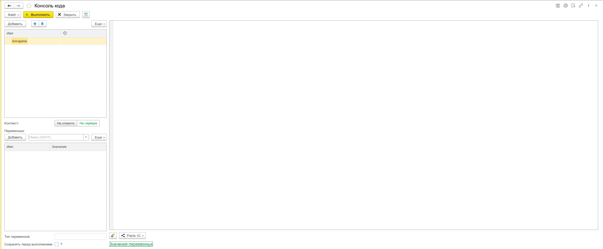
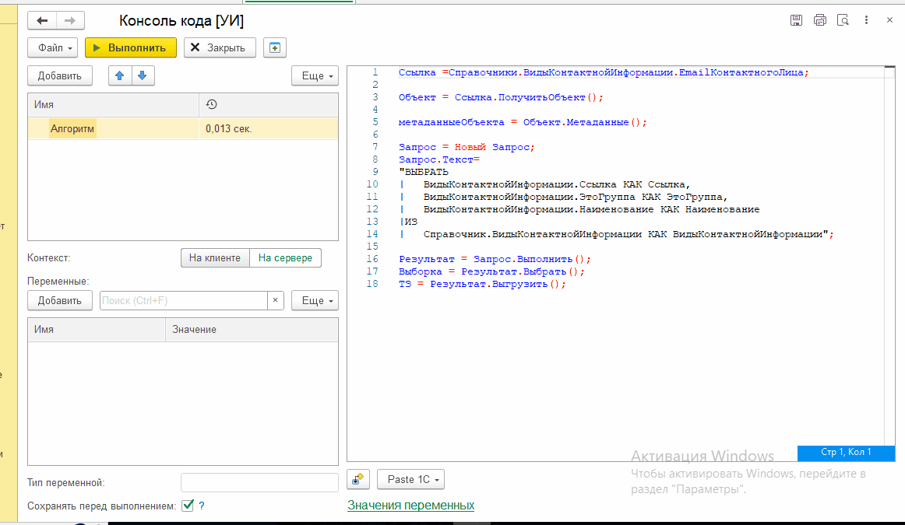

# Консоль кода

Выполнение кода из 1С без создания внешних обработок. Подсветка синтаксиса BSL, контекстная подсказка, несколько алгоритмов и режимов выполнения.



## Назначение

Консоль кода позволяет выполнять произвольный код 1С прямо из предприятия. Удобно для:

- Отладки и тестирования фрагментов кода
- Быстрого выполнения одноразовых операций
- Проверки гипотез и экспериментов с кодом
- Массовых операций с данными без написания внешних обработок

## Особенности

- **Несколько алгоритмов** — поддержка дерева алгоритмов с именами, переключение между ними без потери кода
- **Клиент/Сервер** — каждый алгоритм выполняется на клиенте или на сервере, переключение одним флажком
- **Переменные алгоритма** — таблица переменных с типизацией, значения задаются до выполнения и используются в коде
- **Просмотр переменных после выполнения** — на сервере все переменные алгоритма отображаются с их значениями после исполнения
- **Автосохранение при выполнении** — код автоматически сохраняется в файл перед запуском (опционально)
- **Процедуры и функции** — объявление собственных процедур и функций с экспортом ([в режиме выполнения через обработку](/docs/guides/execution-through-processing))

## Использование

1. Откройте меню **Универсальные инструменты → Консоль кода**
2. Введите код в поле редактора
3. При необходимости переключите выполнение на **Клиент** или **Сервер**
4. Задайте значения переменных (если нужны)
5. Нажмите **Выполнить**
6. Результат выполнения отобразится в нижней панели. На сервере также отобразятся значения всех переменных

## Переменные

### Переменные алгоритма

До выполнения можно задать переменные в таблице переменных. Для каждой указывается имя и значение. Редактирование выполняется через расширенный механизм редактирования значений с использованием специальных редакторов для сложных типов: ссылок, таблиц значений, массивов, структур, соответствий, а также составных типов данных. Поддерживается выбор ссылочных объектов через стандартные формы выбора 1С.

Переменные автоматически становятся доступны в коде алгоритма по имени.

### Просмотр значений после выполнения

При выполнении на сервере в нижней панели отображаются значения всех переменных, использованных в коде. Можно открыть любое значение для просмотра/редактирования двойным кликом:



## Сценарии использования

### Сценарий 1: Отладка алгоритма с переменными

```bsl
Функция РассчитатьСкидку(Цена, КоличествоТоваров)
    Если КоличествоТоваров > 10 Тогда
        Скидка = 0.15;
    ИначеЕсли КоличествоТоваров > 5 Тогда
        Скидка = 0.1;
    Иначе
        Скидка = 0;
    КонецЕсли;
    Возврат Цена * (1 - Скидка);
КонецФункции

Сообщить(РассчитатьСкидку(ЦенаТовара, КоличествоТовара));
```

_Задайте переменные `ЦенаТовара = 1000`, `КоличествоТовара = 12` в таблице переменных._

### Сценарий 2: Массовая операция на сервере

```bsl
Выборка = Справочники.Номенклатура.Выбрать();
Пока Выборка.Следующий() Цикл
    Если Выборка.Артикул = "" Тогда
        Попытка
            Выборка.Артикул = "ART-" + Строка(Выборка.НомерСтроки);
            Выборка.Записать();
        Исключение
            Сообщить("Ошибка: " + ОписаниеОшибки());
        КонецПопытки;
    КонецЕсли;
КонецЦикла;
```

### Сценарий 3: Клиент-серверное взаимодействие

```bsl
// Клиент
СтруктураПередачи.Вставить("Сотрудник", Справочники.Сотрудники.НайтиПоКоду("00001"));

// Сервер
Объект = СтруктураПередачи.Сотрудник.ПолучитьОбъект();
Объект.Зарплата = 150000;
Объект.Записать();
Сообщить("Зарплата установлена: " + Объект.Зарплата);
```

## Формат файлов сохранения алгоритмов

Файлы алгоритмов сохраняются в формате `.xbsl` (JSON), который содержит:

- Имена, текст и настройки всех алгоритмов
- Значения переменных
- Структуру дерева алгоритмов (поддерживаются подчинённые строки)

## Программный интерфейс

Открытие консоли кода из любого места:

```bsl
УИ_ОбщегоНазначенияКлиент.ОткрытьКонсольКода();
```

## Связанные разделы

- [Редактор кода — API](/docs/api/code-editor)
- [Выполнение кода через обработку](/docs/guides/execution-through-processing)
- [Просмотр значения](/docs/tools/debugging-tools/value-viewer)
