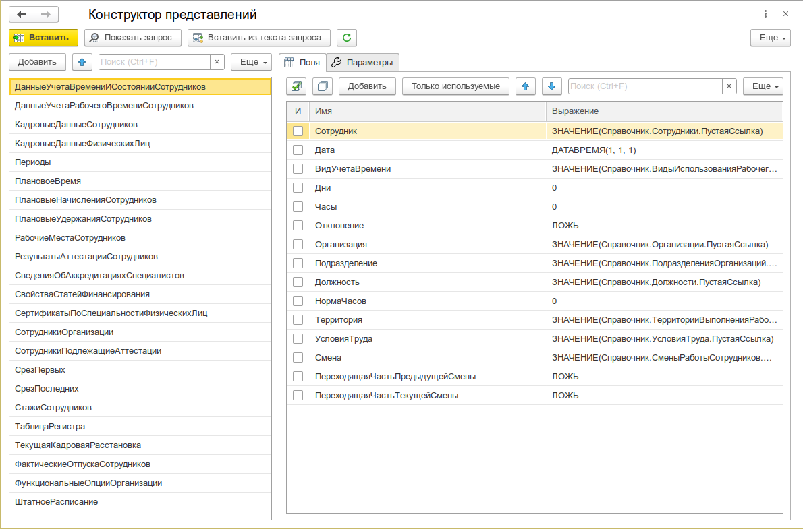

# Конструктор представлений «Зарплата и кадры»

Интерактивное формирование представлений запросов подсистемы «Зарплата и кадры».

:::info
Форк [SharedQueryDesignerHRM](https://github.com/iljyxa/SharedQueryDesignerHRM). [Лицензия MIT](https://github.com/iljyxa/SharedQueryDesignerHRM/blob/main/LICENSE)
:::



## Назначение

В типовых конфигурациях ЗиК для получения данных сотрудников, расчётов, начислений и других кадровых данных используются **представления** — виртуальные таблицы, формируемые на уровне запросов. Они скрывают сложную логику соединения множества таблиц и регистров.

Инструмент позволяет:

- **Выбирать представления** из полного списка, доступного в текущей конфигурации
- **Настраивать поля** — включать/исключать поля представления, менять выражения пустых значений
- **Управлять параметрами** — задавать значения обязательных и опциональных параметров (периоды, подразделения, сотрудники и т.д.)
- **Настраивать отборы** — добавлять условия фильтрации с видами сравнения (Равно, Больше, В списке, В иерархии и др.)
- **Формировать текст запроса** — получать готовый текст на языке запросов 1С для вставки в отчёт, печатную форму или динамический список
- **Импортировать существующий запрос** — загрузить текст запроса представления для редактирования в визуальном режиме
- **Просматривать исполняемый текст** — видеть финальный запрос после подстановки всех параметров и замены виртуальных таблиц

## Принцип работы

Представления запросов — это наборы полей и параметров, описываемые в тексте запроса. Программный интерфейс типовой конфигурации преобразует описания в фактические запросы к базе данных через общий модуль `ЗарплатаКадрыОбщиеНаборыДанных`.

Работает по принципу **виртуальных таблиц**: пользователь указывает необходимые поля и параметры, а получение данных происходит «под капотом» — конструктор формирует временную таблицу с префиксом `Представления_`, которая затем подставляется в основной запрос.

Результат работы — текст запроса для вставки в основной запрос отчёта, печатной формы или динамического списка.

## Интерфейс

Форма конструктора разделена на две основные области:

### Левая панель — список представлений

Таблица `Представления` содержит все доступные в текущей конфигурации представления. Для каждого указаны:

- **Имя** — идентификатор представления (например, `КадровыеДанныеСотрудников`, `Периоды`, `СрезПоследних`)
- **Подсистема** — подсистема, к которой относится представление (Кадровый учёт, Расчёт зарплаты и т.д.)
- **Описание** — краткое пояснение назначения

Поддерживается поиск по списку, сортировка и изменение порядка строк.

### Правая панель — настройка представления

Состоит из трёх вкладок:

1. **Поля** — таблица доступных полей выбранного представления. Для каждого поля можно:
   - Включить/исключить из запроса (флажок «И»)
   - Изменить выражение пустого значения на языке запросов
   - Отфильтровать только используемые поля (кнопка «Только используемые»)

2. **Параметры** — таблица параметров представления. Для каждого параметра:
   - **Имя** — идентификатор параметра
   - **Значение** — задаётся вручную или выбирается из списка (для параметров с предопределёнными значениями, например, периодичность: Год, Квартал, Месяц, День)
   - **Значение — это выражение** — флажок, указывающий, что значение является выражением языка запросов (например, `&НачалоПериода`)
   - **Обязательный** — признак обязательности (такие параметры автоматически помечены к использованию)

3. **Отборы** (доступны для представлений с поддержкой отборов, например, `СрезПоследних`, `СрезПервых`, `ТаблицаРегистра`) — таблица условий фильтрации:
   - **Левое значение** — поле, по которому применяется отбор (выбирается из доступных полей представления)
   - **Вид сравнения** — Равно, Не Равно, Больше, Меньше, Больше или Равно, Меньше или Равно, В списке, В иерархии
   - **Правое значение** — значение для сравнения (может быть выражением)

### Панель инструментов

- **Показать текст запроса** — открывает форму с текстом запроса представления и его исполняемым вариантом
- **Вставить / Изменить** — закрывает форму и передаёт сформированный текст запроса в вызвавшую форму (например, в Консоль запросов)
- **Импорт из текста запроса** — позволяет вставить существующий текст запроса представления для редактирования
- **Сбросить настройки** — возвращает исходные настройки представления
- **Только используемые** — фильтр для отображения только включённых полей и параметров

## Быстрый старт

1. Откройте меню **Универсальные инструменты → Конструктор представлений ЗиК**
2. В левой панели выберите нужное представление (например, `КадровыеДанныеСотрудников`)
3. На вкладке **Поля** отметьте флажками поля, которые должны войти в запрос
4. На вкладке **Параметры** задайте значения обязательных параметров
5. Нажмите **Показать текст запроса** — откроется форма с готовым текстом
6. Скопируйте текст или нажмите **Вставить** для передачи в вызвавшую форму

## Сценарии использования

### Сценарий 1: Формирование отчёта с кадровыми данными сотрудников

Требуется получить ФИО, подразделение, должность и табельный номер сотрудников за период.

1. Выберите представление `КадровыеДанныеСотрудников`
2. На вкладке **Поля** отметьте: `ИОФамилия`, `Подразделение`, `Должность`, `ТабельныйНомер`
3. На вкладке **Параметры** задайте:
   - `Период` — `ДАТАВРЕМЯ(2025, 6, 1)` (или выражение `&ДатаОтчёта`)
   - `ТолькоРазрешенные` — `Истина`
4. Нажмите **Показать текст запроса**

Сформированный текст запроса:

```sql
ВЫБРАТЬ
	ЗНАЧЕНИЕ(Справочник.Сотрудники.ПустаяСсылка) КАК ИОФамилия,
	ЗНАЧЕНИЕ(Справочник.Подразделения.ПустаяСсылка) КАК Подразделение,
	ЗНАЧЕНИЕ(Справочник.Должности.ПустаяСсылка) КАК Должность,
	"" КАК ТабельныйНомер
ПОМЕСТИТЬ Представления_КадровыеДанныеСотрудников
ГДЕ
	"Период" = ДАТАВРЕМЯ(2025, 6, 1)
	И "ТолькоРазрешенные" = ИСТИНА
```

### Сценарий 2: Использование среза регистра для анализа штатной расстановки

1. Выберите представление `СрезПоследних`
2. В поле **Источник данных** выберите регистр сведений (например, `ШтатнаяРасстановка`)
3. На вкладке **Параметры** задайте:
   - `Период` — `&ДатаАнализа`
   - `ТолькоРазрешенные` — `Истина`
4. На вкладке **Поля** отметьте нужные поля регистра
5. На вкладке **Отборы** добавьте условие: `Подразделение` = `&Подразделение`

### Сценарий 3: Редактирование существующего запроса представления

Если у вас уже есть текст запроса, использующий представления, его можно загрузить в конструктор:

1. Откройте Консоль запросов
2. Выделите текст запроса, содержащий `ПОМЕСТИТЬ Представления_...`
3. Выполните команду **Конструктор представлений** (через контекстное меню или панель инструментов)
4. Конструктор откроется с разобранным представлением — можно редактировать поля, параметры и отборы
5. Нажмите **Изменить** — обновлённый текст запроса вернётся в Консоль запросов

## Программный интерфейс

### Использование представлений в коде конфигурации

Основное применение представлений — отчёты и печатные формы. Для замены представления на реальный запрос используется процедура `ЗарплатаКадрыОбщиеНаборыДанных.ЗаменитьЗапросыКПредставлениямВиртуальныхТаблиц`.

```bsl
Запрос = Новый Запрос;
Запрос.МенеджерВременныхТаблиц = Новый МенеджерВременныхТаблиц;
Запрос.Текст =
"ВЫБРАТЬ РАЗРЕШЕННЫЕ
|	ДАТАВРЕМЯ(2025, 1, 1) КАК Период,
|	Сотрудники.Ссылка КАК Сотрудник
|ПОМЕСТИТЬ ВТФильтр
|ИЗ
|	Справочник.Сотрудники КАК Сотрудники
|;
|
|////////////////////////////////////////////////////////////////////////////////
|ВЫБРАТЬ
|	ДАТАВРЕМЯ(1, 1, 1) КАК Период,
|	ЗНАЧЕНИЕ(Справочник.Сотрудники.ПустаяСсылка) КАК Сотрудник,
|	"""" КАК ИОФамилия,
|	0 КАК ОбщийСтажЛет
|ПОМЕСТИТЬ Представления_КадровыеДанныеСотрудников
|ИЗ
|	ВТФильтр КАК ВТФильтр
|ГДЕ
|	""ТолькоРазрешенные"" = ИСТИНА";

ЗарплатаКадрыОбщиеНаборыДанных.ЗаменитьЗапросыКПредставлениямВиртуальныхТаблиц(Запрос.Текст, Запрос);
Запрос.Выполнить();
```

### Программный интерфейс обработки

Обработка предоставляет экспортные методы для использования в коде:

| Метод                                                                                    | Назначение                                                       |
| ---------------------------------------------------------------------------------------- | ---------------------------------------------------------------- |
| `ОписанияПредставленийПоКонфигурации()`                                                  | Возвращает соответствие описаний всех доступных представлений    |
| `СформироватьЗапросПредставления(ИмяПредставления, ОбязательныеПараметры)`               | Формирует исполняемый текст запроса для указанного представления |
| `НовоеОписаниеПредставления()`                                                           | Создаёт структуру описания представления                         |
| `ДобавитьПараметрПредставления(...)`                                                     | Добавляет параметр в описание представления                      |
| `ДобавитьПолеПредставления(...)`                                                         | Добавляет поле в описание представления                          |
| `ПоляЗапросаВДоступныеПоляПредставления(ТекстЗапроса, Описание)`                         | Разбирает текст запроса и добавляет поля в описание              |
| `ПоляПредставленийЗарплатаКадрыВДоступныеПоляПредставления(ПоляПредставлений, Описание)` | Преобразует типовое описание полей ЗиК в формат обработки        |

## Доступные представления

Инструмент автоматически собирает все представления, доступные в текущей конфигурации. Группировка по подсистемам:

| Подсистема                | Примеры представлений                                                                       |
| ------------------------- | ------------------------------------------------------------------------------------------- |
| **Базовые**               | `Периоды`, `СрезПоследних`, `СрезПервых`, `ТаблицаРегистра`, `СвойстваСтатейФинансирования` |
| **Кадровый учёт**         | `КадровыеДанныеСотрудников`, `КадровыеДанныеСотрудниковШирокие`, `ДанныеДляПроверкиУчета`   |
| **Учёт рабочего времени** | `ВремяВНормальныхПределах`, `ОтклоненияГрафикаРаботыСотрудников`                            |
| **Расчёт зарплаты**       | `НачисленияСотрудников`, `УдержанияСотрудников`, `ФактическиеНачисления`                    |
| **Штатное расписание**    | `ШтатнаяРасстановка`, `ШтатноеРасписание`, `ПозицииШтатногоРасписания`                      |
| **Охрана труда**          | `ВредныеФакторы`, `Медосмотры`, `ОценкиУсловийТруда`                                        |
| **Подбор персонала**      | `Кандидаты`, `Вакансии`, `ОтборКандидатов`                                                  |
| **Воинский учёт**         | `ДанныеВоинскогоУчета`                                                                      |

Состав представлений зависит от набора функциональных опций, включённых в конфигурации.

## Интеграция

- Сформированный запрос можно использовать в [Консоли запросов](/docs/tools/development-tools/query-console) для тестирования и отладки
- Конструктор можно вызвать из Консоли запросов через контекстное меню редактора — команда **Конструктор представлений**
- Результат можно применить в [Редакторе СКД](/docs/tools/development-tools/skd-editor) для создания отчётов
- Для отладки представлений из кода используйте механизм [`УИ_._От`](/docs/guides/debugging)
