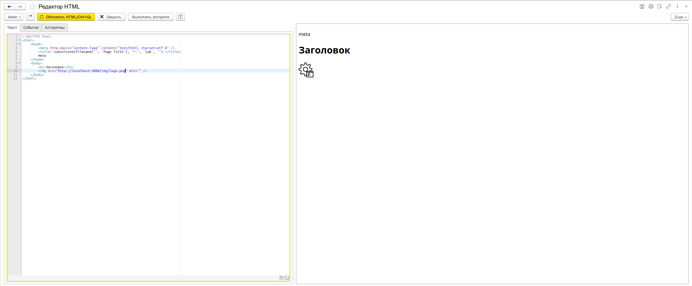
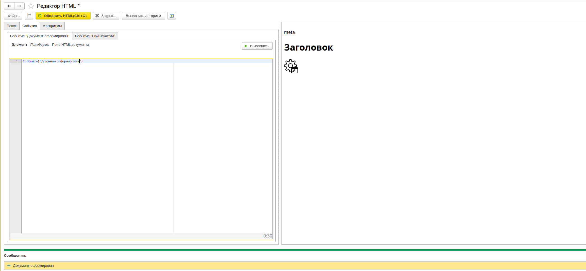
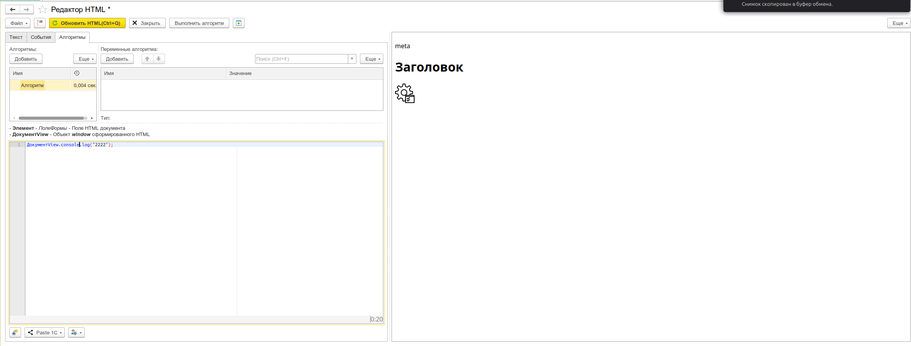
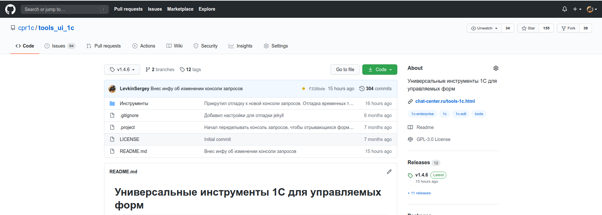
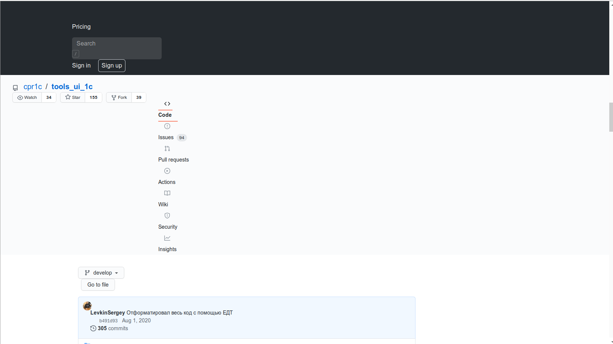
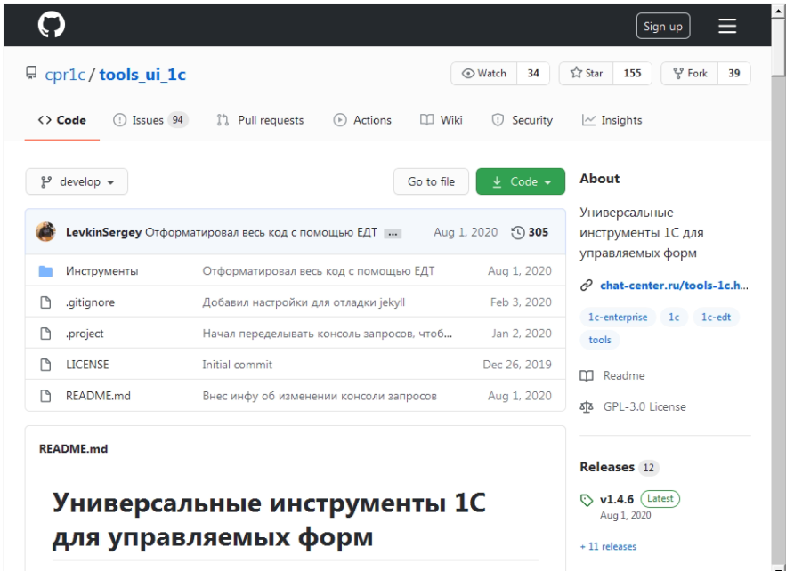
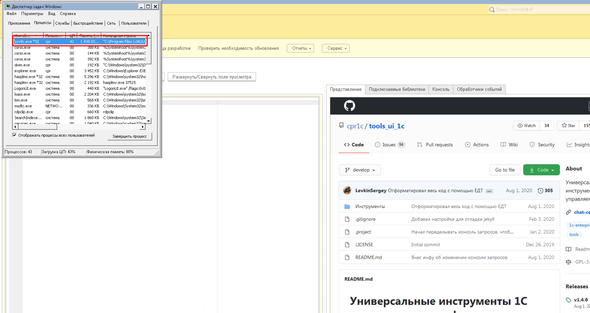
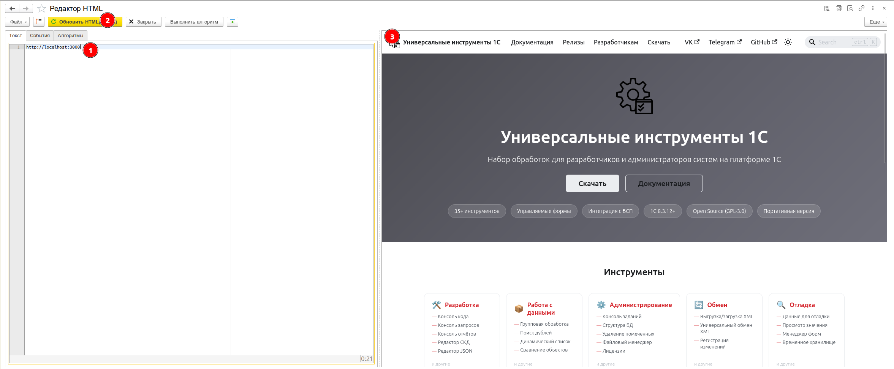
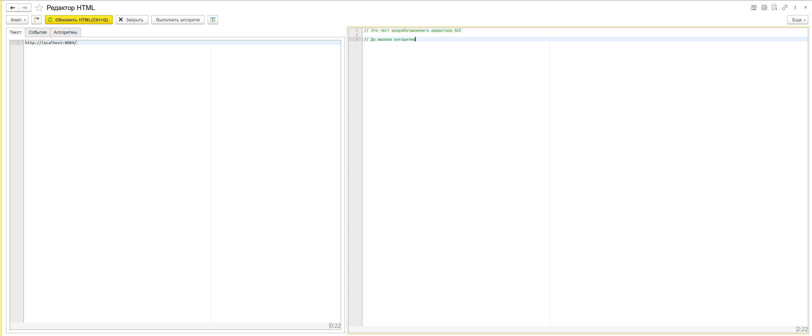
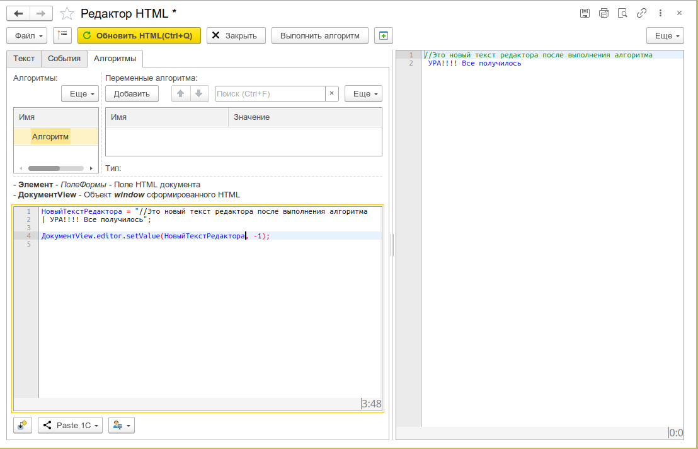

# Редактор HTML

Инструмент для отладки и тестирования HTML/CSS/JavaScript-кода непосредственно в 1С:Предприятие. Позволяет создавать HTML-шаблоны, отлаживать вёрстку и скрипты, подключать внешние библиотеки и сразу видеть результат в панели предпросмотра. Включает редактор HTML с предпросмотром, обработчики событий поля HTML на BSL (ДокументСформирован, ПриНажатии) и алгоритмы для взаимодейтсвия с полем HTML.

:::info
Инструмент доступен начиная с версии **1.4.6**
:::



## Возможности

- **Подсветка синтаксиса HTML, CSS, JavaScript** — редактор кода HTML с цветовой подсветкой на базе редактора [Ace](https://ace.c9.io/).
- **Предпросмотр в реальном времени** — отображение результата в панели предпросмотра.
- Режим редактирования **Всё сразу** — редактирование полного HTML-документа целиком.
- **Обработчики событий поля HTML** — закладка «События» содержит редакторы для двух событий поля HTML:
  - **ДокументСформирован** — BSL-код, выполняемый после формирования HTML-документа. В контексте доступна переменная `Элемент` (само поле HTML).
  - **ПриНажатии** — BSL-код, выполняемый при клике в поле HTML. Доступны переменные `Элемент`, `ДанныеСобытия` (структура с параметрами клика) и `СтандартнаяОбработка` (флаг стандартной обработки).



- **Алгоритмы** — закладка «Алгоритмы» позволяет создавать иерархические списки алгоритмов с собственными переменными. Алгоритмы выполняются с замером времени исполнения. Поддерживаются вложенные алгоритмы, контекстные переменные с типизированными значениями и [режим использования внешней обработки для выполнения кода](/docs/guides/execution-through-processing).
  

- **Сохранение проектов** — HTML можно сохранить как `.html` (только HTML-код) или как `.jbhtml` (JSON-формат, сохраняет HTML + обработчики событий + алгоритмы с переменными). Поддерживается открытие и редактирование `.html` и `.jbhtml` файлов.
- **Разворот поля просмотра на всю форму** — кнопка для переключения панели предпросмотра в полноэкранный режим, скрывая панели редакторов.

## Зачем

С платформы 8.3.14 фирма 1С перевела поле HTML на всех операционных системах на единую библиотеку Webkit.
В сборке для Linux эта библиотека использовалась в более ранних сборках. Ожидалось, что после этого в поле HTML отображение будет идентично браузеру и не будет зависеть от операционной системы. Но на практике это оказалось не так.

Вот как отображается страница универсальных инструментов в разных программах:

<div style={{border:"1px solid #e0e0e0", borderRadius:"8px", padding:"16px", marginBottom:"16px", background:"var(--ifm-card-background-color)"}}>


_В браузере_

</div>

<div style={{border:"1px solid #e0e0e0", borderRadius:"8px", padding:"16px", marginBottom:"16px", background:"var(--ifm-card-background-color)"}}>


_В поле HTML в 1С на Linux_

</div>

<div style={{border:"1px solid #e0e0e0", borderRadius:"8px", padding:"16px", marginBottom:"16px", background:"var(--ifm-card-background-color)"}}>


_В поле HTML в 1С на Windows_

</div>

На Windows в 1С отображается нормально, но 1С зависает и потребление памяти вырастает до 1,5 ГБ, пока 1С не вылетает:



1С на разных платформах использует разные версии библиотеки Webkit.

Инструмент **«Редактор HTML»** был создан, чтобы быстро отлаживать HTML/CSS/JS и просматривать результат в единой среде, независимо от платформы.

## Сценарии использования

### Отладка разрабатываемого компонента для поля HTML в 1С

```html
http://localhost:3000
```



### Отладка апи компонента для 1С

<div style={{border:"1px solid #e0e0e0", borderRadius:"8px", padding:"16px", marginBottom:"16px", background:"var(--ifm-card-background-color)"}}>


_До выполнения алгоритма_

</div>
<div style={{border:"1px solid #e0e0e0", borderRadius:"8px", padding:"16px", marginBottom:"16px", background:"var(--ifm-card-background-color)"}}>


_После выполнения алгоритма_

</div>
