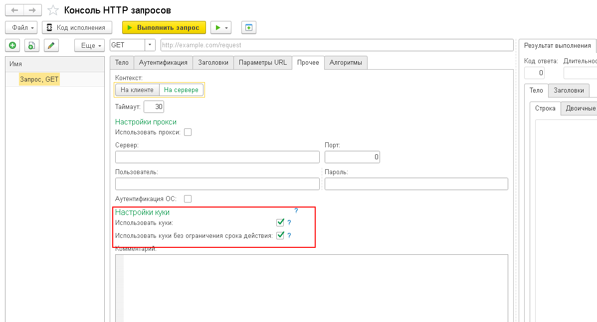
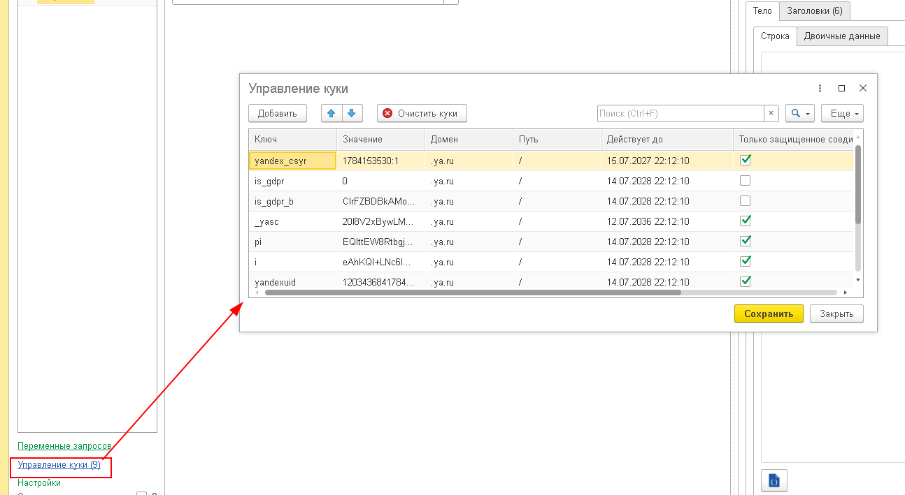
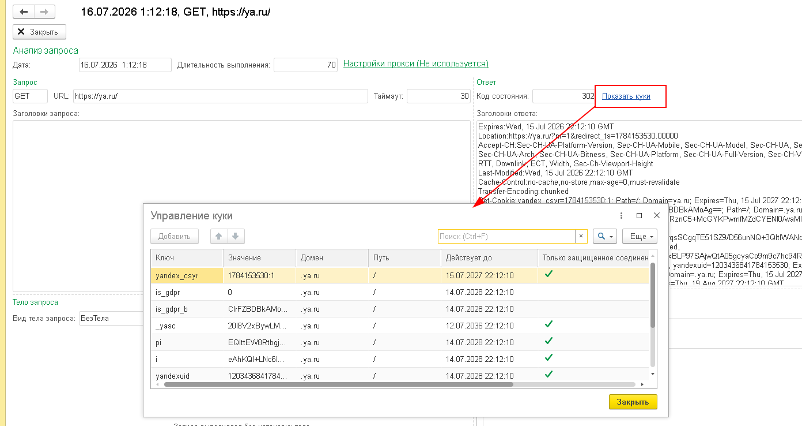

# Работа с куки (Cookies) в консоли HTTP запросов

HTTP-куки (cookies) — это небольшие фрагменты данных, которые сервер отправляет браузеру (или HTTP-клиенту), а клиент сохраняет и отправляет обратно при последующих запросах к тому же серверу. Куки используются для управления сессиями, запоминания настроек пользователя, отслеживания состояния и многих других задач.

Консоль HTTP запросов поддерживает полноценную работу с куки: автоматическое получение, хранение, редактирование и отправку куки при выполнении запросов.

---

## Основные возможности

- **Автоматический приём куки** — куки из заголовка `Set-Cookie` ответа сервера автоматически парсятся и сохраняются
- **Учёт атрибутов куки** — корректно обрабатываются `Domain`, `Path`, `Expires`, `Max-Age`, `Secure`, `HttpOnly`
- **Автоматическая отправка** — при выполнении запроса подходящие куки автоматически подставляются в заголовок `Cookie`
- **Управление куки** — просмотр, добавление, редактирование и удаление куки через отдельную форму
- **Просмотр в истории** — в подробной информации о выполненном запросе можно посмотреть, какие куки были получены
- **Персистентность** — куки сохраняются в дереве запросов и в файле коллекции (формат данных v5)
- **Генерация кода** — сгенерированный код 1С включает установку заголовка `Cookie`

---

## Как это работает

### Флажок «Использовать куки»

Для каждого запроса в дереве запросов появился новый флажок **«Использовать куки»**. Если он включён, консоль будет:

1. **При получении ответа** — парсить заголовок `Set-Cookie` и сохранять полученные куки в общий список
2. **При отправке запроса** — отбирать подходящие куки из списка по домену, пути, сроку действия и флагам безопасности, и добавлять их в заголовок `Cookie`



### Форма «Управление куки»

В левой панели под переменными запросов находится кнопка **«Управление куки»**, на которой отображается количество сохранённых куки (например, «Управление куки (3)»). Нажатие открывает форму управления куки.


Форма представляет собой таблицу со следующими колонками:

| Колонка | Назначение |
| --- | --- |
| **Ключ** | Имя куки (например, `session_id`) |
| **Значение** | Значение куки |
| **Домен** | Домен, для которого действует куки (например, `.example.com`) |
| **Путь** | Путь URL, для которого действует куки (например, `/api`) |
| **Действует до** | Дата истечения срока действия куки |
| **Только защищённое соединение** (флажок) | Куки передаётся только по HTTPS (атрибут `Secure`) |
| **Только HTTP-запросы** (флажок) | Куки недоступна из JavaScript (атрибут `HttpOnly`) |
| **Только для домена** (флажок) | Куки действует только для точного домена, а не для поддоменов (флаг `HostOnly`) |


---

## Сценарии использования

### Сценарий 1. Сессионная аутентификация через куки

Многие веб-приложения используют куки для хранения идентификатора сессии. Типичный сценарий:

1. Отправьте POST-запрос на `/auth/login` с логином и паролем
2. Сервер пришлёт ответ с заголовком `Set-Cookie: session_id=abc123; Path=/; HttpOnly`
3. Консоль автоматически сохранит куки `session_id` с атрибутами
4. Теперь отправьте GET-запрос на `/api/profile` — куки `session_id` будет автоматически добавлена в заголовок `Cookie: session_id=abc123`
5. Сервер распознаёт сессию и возвращает данные профиля

```
# Шаг 1: аутентификация
POST https://example.com/auth/login
Content-Type: application/json

{
    "username": "admin",
    "password": "secret"
}

# Сервер отвечает:
# HTTP/1.1 200 OK
# Set-Cookie: session_id=abc123; Path=/; HttpOnly

# Шаг 2: запрос с автоматической подстановкой куки
GET https://example.com/api/profile
# Cookie: session_id=abc123
```

### Сценарий 2. Просмотр куки в истории запросов

После выполнения запроса откройте **историю запросов** и выберите интересующую запись. Нажмите **«Показать куки»** — откроется форма управления куки в режиме просмотра, где можно увидеть все куки, полученные в ответе на этот запрос.



### Сценарий 3. Ручное добавление куки

Иногда нужно вручную задать куки, например, для тестирования или при работе с устаревшими API:

1. Убедитесь, что флажок **«Использовать куки»** включён
2. Нажмите **«Управление куки»**
3. Добавьте новую строку и заполните поля:
   - **Ключ**: `token`
   - **Значение**: `ваш-токен`
   - **Домен**: `.example.com`
   - **Путь**: `/`
4. Нажмите **«Сохранить»**
5. Выполните запрос — куки `token` будет отправлена в заголовке `Cookie`

### Сценарий 4. Использование куки без проверки срока действия

Флажок **«Использовать куки без ограничения срока действия»** позволяет отправлять куки даже если срок их действия не заполнен. 

---

## Генерация кода 1С с куки

При генерации кода 1С для запроса, в котором используются куки, сгенерированный код будет содержать установку заголовка `Cookie`:

```bsl
// Сгенерировано с помощью инструмента "Консоль HTTP запросов" из набора "Универсальные инструменты 1С"
// https://github.com/cpr1c/tools_ui_1c

Запрос = Новый HTTPЗапрос("/api/profile");
Запрос.Заголовки.Вставить("Cookie", "session_id=abc123");
```

---

## Формат данных

Начиная с версии **5** формата данных, куки сохраняются в файл коллекции запросов. Каждая куки представлена структурой:

```
{
    "Ключ": "session_id",
    "Значение": "abc123",
    "Домен": ".example.com",
    "Путь": "/",
    "ДействуетДо": "2026-12-31T23:59:59",
    "ТолькоЗащищенноеСоединение": false,
    "ТолькоHTTPЗапросы": true,
    "ТолькоДляДомена": false
}
```

---

## Советы

- Куки хранятся **в общей таблице** для всего дерева запросов. Если нужно изолировать куки для разных окружений, используйте разные файлы коллекций
- При импорте коллекций из Postman, Insomnia или cURL куки **не импортируются** автоматически — их нужно добавить вручную
- Флажок **«Только для домена»** означает, что куки будет отправляться только на точное совпадение домена, без учёта поддоменов. Если флажок снят, куки будет действовать и на все поддомены

---

## Связанные разделы

- [Консоль HTTP-запросов](./) — описание всех возможностей инструмента
- [Отладка HTTP-запроса через `УИ_._От`](./debug-http) — пошаговый сценарий перехвата HTTP-запроса из кода
