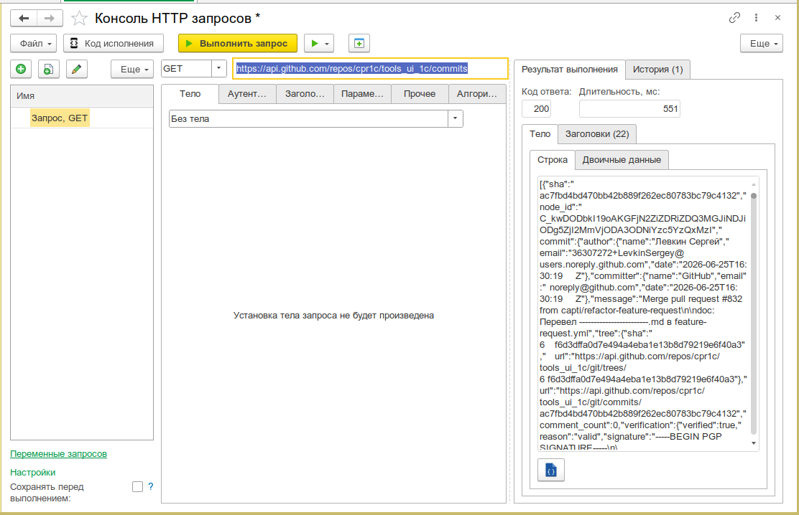
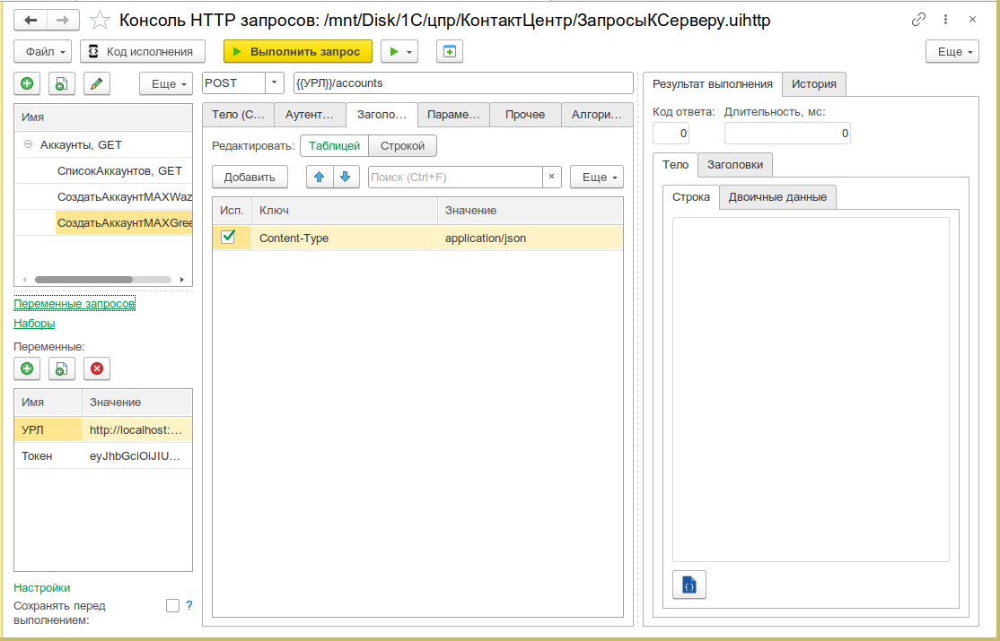
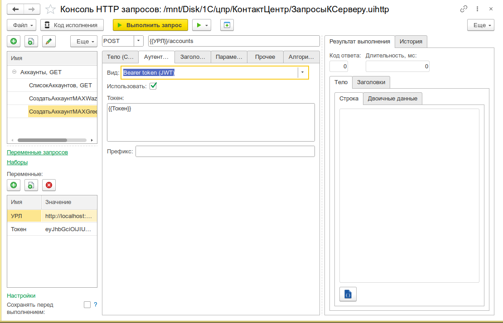
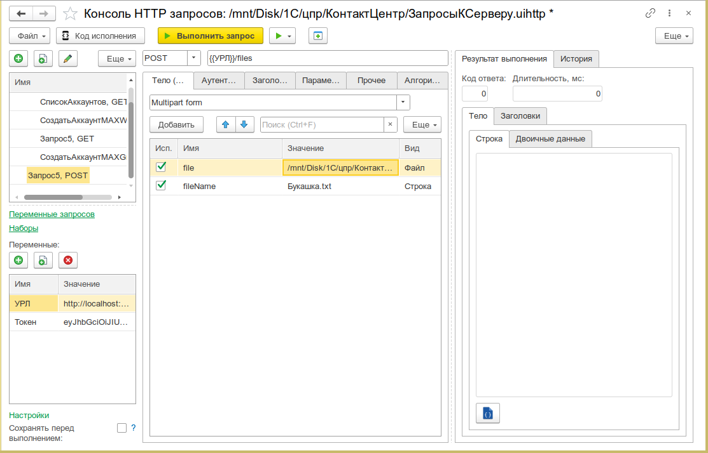
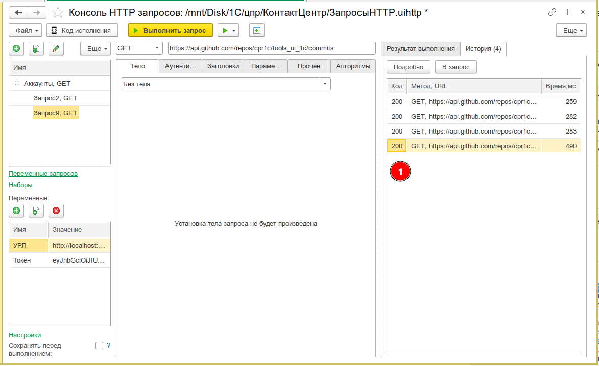
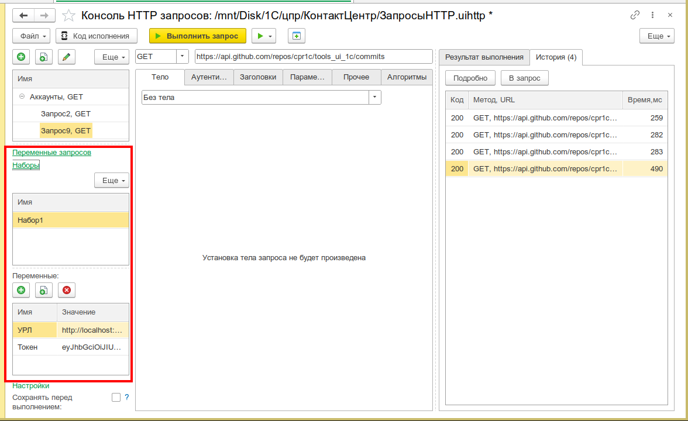
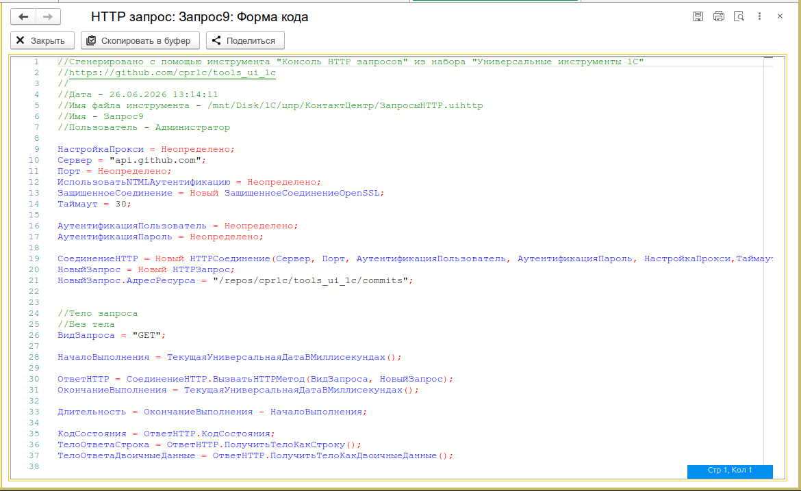
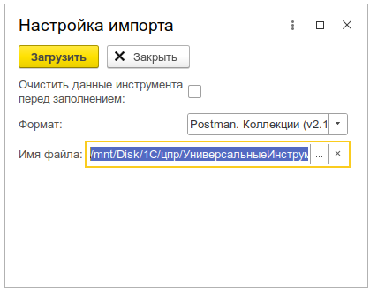

# Консоль HTTP-запросов

Выполнение HTTP-запросов из 1С без создания внешних обработок. Удобный инструмент для тестирования REST API, веб-сервисов, веб-хуков и отладки HTTP-взаимодействий прямо из предприятия.

---

## Назначение

Консоль HTTP-запросов — это полнофункциональный HTTP-клиент, встроенный в подсистему «Универсальные инструменты». Позволяет отправлять HTTP-запросы любых методов, управлять заголовками, телом запроса, аутентификацией, прокси, переменными окружения и сохранять историю выполнения. Поддерживает выполнение запросов как на сервере, так и на клиенте (в том числе в веб-клиенте).

Инструмент пригодится для:

- **Тестирования REST API** — быстрая проверка эндпоинтов без написания кода
- **Отладки интеграций** — проверка HTTP-взаимодействий с внешними системами
- **Работы с веб-хуками** — отправка и приём callback-уведомлений
- **Разработки HTTP-сервисов 1С** — отладка собственных HTTP-сервисов конфигурации
- **Импорта коллекций** — перенос запросов из Insomnia, Postman и cURL

---

## Основные возможности

- **Все методы HTTP** — GET, POST, PUT, DELETE, PATCH, HEAD, OPTIONS + произвольный метод
- **Управление заголовками** — табличное редактирование с автоподстановкой ранее использованных заголовков
- **Гибкое тело запроса** — строка, двоичные данные, файл, multipart/form-data
- **Подсветка синтаксиса** — редактор кода Ace для тела запроса (JSON, XML, YAML, текст)
- **Аутентификация** — Basic, Bearer Token (JWT), NTLM, базовая 1С (логин/пароль в HTTP-соединении)
- **Параметры URL** — удобное редактирование query-параметров с автоматической сборкой URL
- **Переменные и наборы значений** — подстановка значений через шаблоны `{{переменная}}`, переключение между наборами (окружениями)
- **Прокси** — настройка HTTP-прокси с аутентификацией
- **Таймаут** — настраиваемый таймаут соединения (по умолчанию 30 с)
- **История запросов** — автоматическое сохранение всех выполненных запросов с возможностью повторного вызова
- **Генерация кода 1С** — автоматическая генерация программного кода 1С для выполненного запроса
- **Сохранение в файл** — сохранение и загрузка коллекций запросов в формате JSON
- **Импорт из внешних инструментов** — Insomnia (v4), Postman (коллекции v2.1), cURL
- **Выполнение на клиенте** — поддержка асинхронных HTTP-вызовов на платформе 8.3.21+ (в т.ч. веб-клиент)
- **Алгоритмы до/после** — выполнение произвольного кода 1С перед отправкой и после получения ответа
- **Периодическое выполнение** — автоматический повтор запроса с заданным интервалом
- **SSL/TLS** — поддержка HTTPS с защищённым соединением OpenSSL

---

## Быстрый старт

1. Откройте меню **Универсальные инструменты → Консоль HTTP запросов [УИ]**
2. Введите URL эндпоинта (например, `https://api.example.com/v1/products`)
3. Выберите HTTP-метод (GET, POST, PUT и т.д.)
4. При необходимости настройте заголовки, тело запроса и аутентификацию
5. Нажмите **Выполнить** — результат отобразится в панели ответа (код статуса, заголовки, тело)

_Общий вид консоли: дерево запросов слева, панель редактирования по центру, результат выполнения справа_


---

## Интерфейс

### Дерево запросов

Левая панель содержит дерево запросов. Каждый запрос — это отдельная строка с именем. Запросы можно группировать, перемещать, копировать и удалять. Поддерживается drag-and-drop через кнопки перемещения.

Для каждого запроса доступны:

- **Имя** — произвольное название запроса
- **URL** — адрес эндпоинта
- **HTTP-метод** — GET, POST, PUT, DELETE, PATCH, HEAD, OPTIONS
- **Комментарий** — текстовое описание запроса
- **Контекст выполнения** — на сервере или на клиенте (для платформы 8.3.21+)

### Панель редактирования запроса

Центральная часть формы содержит вкладки:

| Вкладка            | Назначение                                                          |
| ------------------ | ------------------------------------------------------------------- |
| **Параметры**      | Query-параметры URL (имя, значение, признак использования)          |
| **Заголовки**      | HTTP-заголовки запроса (ключ, значение, признак использования)      |
| **Тело**           | Тело запроса: строка, двоичные данные, файл или multipart/form-data |
| **Аутентификация** | Настройка аутентификации (Basic, Bearer, NTLM, 1С)                  |
| **Прокси**         | Настройка HTTP-прокси-сервера                                       |
| **Алгоритмы**      | Код 1С, выполняемый перед отправкой и после получения ответа        |

_Таблица заголовков с автоподстановкой ранее использованных значений_


_Выбор вида аутентификации: Basic, Bearer Token (JWT), NTLM, базовая 1С_


_Форма multipart с текстовыми полями и файлами_


### Панель результата

Правая/нижняя панель отображает результат выполнения запроса:

- **Код статуса** — HTTP-статус ответа (200, 201, 400, 401, 500 и т.д.)
- **Заголовки ответа** — все заголовки, полученные от сервера
- **Тело ответа** — содержимое ответа с подсветкой синтаксиса
- **Время выполнения** — длительность запроса в миллисекундах

### История запросов

Все выполненные запросы автоматически сохраняются в истории. Для каждой записи сохраняется:

- URL и HTTP-метод
- Заголовки запроса и ответа
- Тело запроса и ответа (включая двоичные данные)
- Дата и время выполнения
- Длительность запроса
- Код статуса ответа

Из истории можно:

- Скопировать данные запроса в текущую строку дерева
- Открыть подробную информацию по запросу
- Сохранить тело запроса или ответа в файл
- Отредактировать тело запроса или ответа в редакторе JSON

_Панель истории с детальной информацией по каждому выполненному запросу_


---

## Сценарии использования

### GET-запрос к REST API

```
GET https://api.example.com/v1/products
Headers:
  Accept: application/json
  Authorization: Bearer {{token}}
```

Ответ отобразится в панели результатов. JSON можно открыть в [Редакторе JSON](/docs/tools/development-tools/json-editor) для анализа.

### POST-запрос с JSON-телом

```
POST https://api.example.com/v1/orders
Headers:
  Content-Type: application/json
  Authorization: Bearer {{token}}

Body:
{
    "customer_id": "12345",
    "items": [
        {"product_id": "ABC", "quantity": 2}
    ]
}
```

### POST-запрос с multipart/form-data (отправка файла)

1. Выберите вид тела **Multipart form**
2. Добавьте строки: текстовые поля и файлы
3. Для файлов укажите путь через диалог выбора файла
4. Заголовок `Content-Type` установится автоматически

### Работа с веб-хуками

Проверка входящего веб-хука от внешней системы:

```
POST https://hook.example.com/payment
Headers:
  Content-Type: application/x-www-form-urlencoded

Body:
event=payment.completed&order_id=ORD-2026-001&amount=1500.00
```

После выполнения проверьте код ответа — `200 OK` означает успешный приём.

### Использование переменных и окружений

1. Перейдите на вкладку **Переменные**
2. Создайте набор значений (окружение), например «Боевое» и «Тестовое»
3. Добавьте переменные: `base_url`, `token`, `organization_id`
4. В URL и заголовках используйте шаблоны: `{{base_url}}/api/v1/orders`
5. Переключайтесь между наборами для быстрой смены окружения

_Таблица переменных с переключением между окружениями (наборами значений)_


### Периодическое выполнение запроса

Для мониторинга эндпоинта:

1. Настройте запрос
2. Нажмите **Выполнить с периодичностью**
3. Укажите интервал в секундах
4. Консоль будет автоматически повторять запрос с заданной периодичностью
5. Для остановки нажмите **Остановить периодическое выполнение**

### Генерация кода 1С

После успешного выполнения запроса:

1. Нажмите **Сгенерировать код исполнения**
2. Откроется форма со сгенерированным кодом 1С, который полностью повторяет выполненный запрос
3. Код можно скопировать и использовать в своей конфигурации

Генерируется полный код: создание HTTP-соединения, настройка прокси, аутентификации, заголовков, тела запроса и выполнение.

_Сгенерированный код 1С для выполненного HTTP-запроса_


### Импорт коллекций из Insomnia, Postman и cURL

1. Нажмите **Импорт**
2. Выберите формат: Insomnia (v4), Postman (коллекция v2.1) или cURL
3. Укажите файл для импорта
4. Запросы будут добавлены в дерево запросов

_Диалог импорта с выбором формата: Insomnia, Postman, cURL_


---

## Интеграция с другими инструментами

- **Редактор JSON** — тело запроса/ответа можно открыть в [Редакторе JSON](/docs/tools/development-tools/json-editor) для удобного просмотра и редактирования
- **Консоль кода** — сгенерированный код можно выполнить в [Консоли кода](/docs/tools/development-tools/code-console)
- **Консоль веб-сервисов** — для работы с SOAP-сервисами используйте [Консоль веб-сервисов](/docs/tools/development-tools/web-service-console)
- **Данные для отладки** — консоль может быть открыта с предзаполненными данными из инструмента «Данные для отладки»
