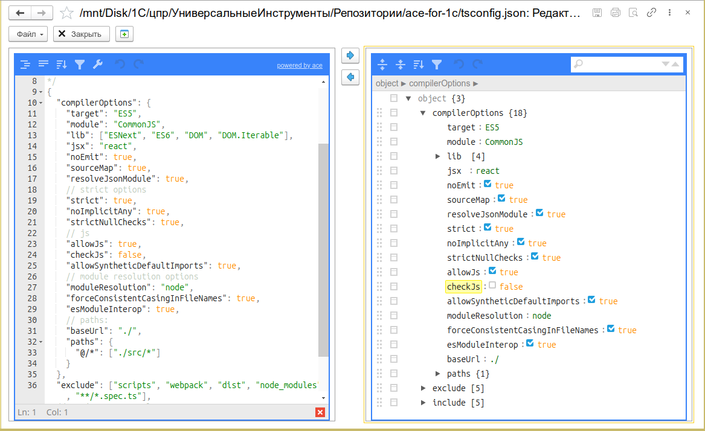

# Редактор JSON

Визуальное редактирование, просмотр и валидация JSON-данных прямо в 1С:Предприятие. Два синхронизированных редактора — в виде дерева и в виде кода — на базе библиотеки [jsoneditor](https://github.com/josdejong/jsoneditor).

_Общий вид редактора: слева — дерево JSON, справа — редактор кода, между ними — кнопки синхронизации_


---

## Назначение

Редактор JSON — это встроенный инструмент подсистемы «Универсальные инструменты» для работы с JSON-данными. Позволяет просматривать, редактировать, форматировать и валидировать JSON в удобном интерфейсе без написания кода и без внешних утилит.

Инструмент пригодится для:

- **Анализа JSON-ответов API** — просмотр структуры ответа от HTTP-сервисов в наглядном виде
- **Редактирования конфигурационных JSON-файлов** — правка настроек, маппингов, правил обмена
- **Подготовки тестовых данных** — быстрое создание и модификация JSON для отладки интеграций
- **Преобразования JSON в код 1С** — визуальный анализ структуры перед написанием кода обработки
- **Отладки HTTP-сервисов 1С** — проверка форматов запросов/ответов собственных HTTP-сервисов

---

## Основные возможности

- **Два синхронизированных редактора** — дерево (слева) и код (справа). Изменения в одном редакторе мгновенно отражаются в другом
- **Режим «Дерево»** — сворачиваемое дерево узлов с подсветкой типов (строки, числа, булевы, null). Удобно для навигации по глубоко вложенным структурам
- **Режим «Код»** — полноценный текстовый редактор с подсветкой синтаксиса JSON, автодополнением и нумерацией строк
- **Валидация JSON** — мгновенная проверка синтаксиса при вводе. Ошибочные позиции подсвечиваются с описанием проблемы
- **Форматирование** — Pretty Print (читаемый вид с отступами) и Minify (сжатая строка)
- **Поиск по ключам и значениям** — фильтрация узлов в режиме дерева
- **Поддержка больших данных** — работа с JSON-файлами до нескольких десятков мегабайт
- **История изменений** — отмена и повтор действий (Ctrl+Z / Ctrl+Y)
- **Работа с файлами** — открытие, сохранение, создание нового JSON-файла
- **Вызов из других инструментов** — интеграция с [Консолью HTTP-запросов](/docs/tools/development-tools/http-console) для просмотра и редактирования тела запроса/ответа

---

## Быстрый старт

1. Откройте меню **Универсальные инструменты → Редактор JSON [УИ]**
2. Вставьте JSON-текст в редактор кода (правая панель) или откройте файл через меню **Файл → Открыть**
3. Просматривайте структуру в режиме дерева (левая панель) — сворачивайте и разворачивайте узлы
4. Вносите изменения в любом из редакторов — они синхронизируются автоматически
5. Сохраните результат через **Файл → Сохранить** или скопируйте в буфер обмена

---

## Интерфейс

### Редактор дерева (левая панель)

Визуальное представление JSON в виде сворачиваемого дерева. Каждый узел отображается с иконкой типа:

| Тип значения | Отображение                  |
| ------------ | ---------------------------- |
| Строка       | `"значение"` (зелёный)       |
| Число        | `123.45` (синий)             |
| Булево       | `true` / `false` (оранжевый) |
| null         | `null` (серый)               |
| Объект       | `{...}` — сворачиваемый узел |
| Массив       | `[...]` — сворачиваемый узел |

Доступные действия:

- **Сворачивание/разворачивание** узлов кликом на треугольник
- **Развернуть всё** — кнопка на панели инструментов
- **Поиск** — фильтрация узлов по ключу или значению
- **Редактирование** — двойной клик по значению для изменения
- **Добавление/удаление** полей и элементов массива через контекстное меню

### Редактор кода (правая панель)

Текстовый редактор на базе библиотеки jsoneditor с подсветкой синтаксиса JSON. Поддерживает:

- Подсветку ключей, строк, чисел, булевых значений и null
- Автоматическое закрытие кавычек и скобок
- Нумерацию строк
- Pretty Print (автоформатирование с отступами)
- Minify (сжатие в одну строку)

### Кнопки синхронизации

Между панелями расположены две кнопки:

- **→** (Скопировать из строки в дерево) — переносит содержимое из редактора кода в редактор дерева
- **←** (Скопировать из дерева в строку) — переносит содержимое из дерева в редактор кода

### Командная панель

| Команда                      | Описание                                                                 |
| ---------------------------- | ------------------------------------------------------------------------ |
| **Завершить редактирование** | Закрыть редактор и вернуть результат (при вызове из другого инструмента) |
| **Файл → Новый**             | Создать новый пустой JSON                                                |
| **Файл → Открыть**           | Загрузить JSON из файла (кодировка UTF-8)                                |
| **Файл → Сохранить**         | Сохранить в текущий файл                                                 |
| **Файл → Сохранить как...**  | Сохранить в новый файл                                                   |
| **Закрыть**                  | Выйти из редактора с подтверждением                                      |

---

## Сценарии использования

### Сценарий 1: Анализ JSON-ответа от API

Вставьте JSON-ответ от REST API и используйте режим дерева для навигации:

```json
{
  "status": "success",
  "data": {
    "users": [
      {
        "id": 1,
        "name": "Иван",
        "email": "ivan@example.com",
        "roles": ["admin", "editor"]
      },
      {
        "id": 2,
        "name": "Мария",
        "email": "maria@example.com",
        "roles": ["viewer"]
      }
    ],
    "total": 2,
    "page": 1,
    "per_page": 10
  }
}
```

В режиме дерева можно:

- Сворачивать/разворачивать объекты `users[...]` для сравнения записей
- Быстро найти поле `email` через поиск
- Отредактировать значение `name` двойным кликом

### Сценарий 2: Подготовка JSON для HTTP-запроса

Создайте тело POST-запроса в редакторе кода, затем скопируйте в [Консоль HTTP-запросов](/docs/tools/development-tools/http-console):

```json
{
  "order": {
    "customer_id": "CUST-001",
    "items": [
      {
        "product_id": "PROD-100",
        "quantity": 2,
        "price": 1500.0
      }
    ],
    "delivery": {
      "address": "ул. Ленина, д. 1",
      "city": "Москва"
    }
  }
}
```

Используйте Pretty Print для форматирования перед отправкой.

### Сценарий 3: Редактирование конфигурационного JSON

Откройте существующий JSON-файл через **Файл → Открыть**. Внесите изменения в режиме дерева — это удобно, когда нужно изменить несколько значений в разных ветках структуры, не рискуя нарушить синтаксис.

### Сценарий 4: Валидация и отладка JSON

При вставке некорректного JSON редактор мгновенно подсветит ошибку:

```json
{
  "name": "Товар",
  "price": 100,
  "quantity":    // <-- ошибка: пропущено значение
}
```

Редактор укажет строку и позицию ошибки, а также описание проблемы.

### Сценарий 5: Интеграция с Консолью HTTP-запросов

Из [Консоли HTTP-запросов](/docs/tools/development-tools/http-console) можно открыть тело запроса или ответа в Редакторе JSON для детального анализа. Для этого в истории запросов или в результатах выполнения доступна команда «Редактировать в редакторе JSON».

---

## Программный вызов

Редактор JSON можно вызвать программно из любого модуля 1С через общий модуль [`УИ_ОбщегоНазначенияКлиент`](/docs/api/code-editor):

```bsl
УИ_ОбщегоНазначенияКлиент.РедактироватьJSON(СтрокаJSON, РежимПросмотра, ОписаниеОповещенияОЗавершении);
```

Параметры:

| Параметр                        | Тип                | Описание                                                                               |
| ------------------------------- | ------------------ | -------------------------------------------------------------------------------------- |
| `СтрокаJSON`                    | Строка             | JSON-текст для редактирования                                                          |
| `РежимПросмотра`                | Булево             | `Истина` — только просмотр, `Ложь` — редактирование                                    |
| `ОписаниеОповещенияОЗавершении` | ОписаниеОповещения | Необязательный. Если передан, результат редактирования вернётся в указанный обработчик |

Пример вызова:

```bsl
Процедура ОткрытьРедакторJSON(Команда)
    JSONСтрока = "{""name"": ""Тест"", ""value"": 42}";
    УИ_ОбщегоНазначенияКлиент.РедактироватьJSON(JSONСтрока, Ложь);
КонецПроцедуры
```

Пример вызова с получением результата:

```bsl
Процедура ОтредактироватьИОбработать(Команда)
    ОписаниеОповещения = Новый ОписаниеОповещения("ПослеРедактированияJSON", ЭтотОбъект);
    УИ_ОбщегоНазначенияКлиент.РедактироватьJSON(МояСтрокаJSON, Ложь, ОписаниеОповещения);
КонецПроцедуры

Процедура ПослеРедактированияJSON(Результат, ДополнительныеПараметры) Экспорт
    Если Результат <> Неопределено Тогда
        Сообщить("Отредактированный JSON: " + Результат);
    КонецЕсли;
КонецПроцедуры
```

---

## Ограничения

- **Платформа 8.3.14+** — на Windows. На Linux и веб-клиенте редактор работает, начиная с версии платформы, поддерживающей HTML-поля
- **Размер файла** — рекомендуется не более 50 МБ. При открытии файлов большего размера возможно замедление работы интерфейса
- **Режим «Таблица»** — библиотека jsoneditor не поддерживает табличный режим. Для табличного просмотра массивов объектов используйте другие инструменты

---

## Часто задаваемые вопросы

### В чём разница между режимами «Дерево» и «Код»?

Дерево показывает полную структуру JSON с визуальными подсказками типов значений. Код — это текстовый редактор с подсветкой синтаксиса. Оба режима синхронизированы: изменения в одном мгновенно отражаются в другом.

### Можно ли редактировать JSON в режиме дерева?

Да. Двойной клик по значению узла открывает его для редактирования. Также через контекстное меню можно добавлять и удалять поля и элементы массива.

### Как проверить корректность JSON?

JSON валидируется автоматически при вводе. Если есть ошибка, редактор подсветит проблемное место и покажет описание ошибки. Также можно использовать кнопку форматирования (Pretty Print) — если JSON некорректен, форматирование не выполнится, и редактор укажет на ошибку.

### Работает ли редактор на веб-клиенте?

Да, редактор JSON работает во всех режимах клиента 1С: толстом, тонком и веб-клиенте (на платформах, поддерживающих HTML-поля).

### Как открыть JSON из Консоли HTTP-запросов?

В истории запросов или в результатах выполнения HTTP-запроса нажмите «Редактировать в редакторе JSON» — тело запроса или ответа откроется в редакторе для детального анализа.

### Можно ли настроить размер шрифта?

Размер шрифта настраивается в меню «Настройки» редактора (доступно через общие настройки инструментов).

---

## Решение проблем

### Редактор показывает ошибку «Невалидный JSON»

**Причина:** JSON содержит синтаксическую ошибку: лишняя запятая, пропущенная кавычка, неверный формат числа.
**Решение:** Внимательно проверьте строку, на которую указывает редактор. Используйте функцию форматирования (Pretty Print) — она часто помогает обнаружить лишние символы.

### Не открывается файл JSON

**Причина:** Файл сохранён в кодировке, отличной от UTF-8.
**Решение:** Убедитесь, что файл сохранён в UTF-8. Редактор читает файлы в кодировке UTF-8 (исправлено в версии v25.1.1).

### Не сохраняется отредактированный JSON

**Причина:** Отсутствие прав на запись в выбранную папку.
**Решение:** Выберите другую папку для сохранения или запустите 1С от имени администратора.

### Медленно работает при большом JSON

**Причина:** Размер JSON превышает 10–20 МБ.
**Решение:** Закройте другие вкладки с JSON. Используйте режим «Код» вместо «Дерево» — он менее требователен к ресурсам.

### Потерялось форматирование после редактирования

**Причина:** Редактирование в режиме «Код» могло нарушить отступы.
**Решение:** Используйте кнопку «Форматировать» (Pretty Print) для восстановления читаемого вида.
