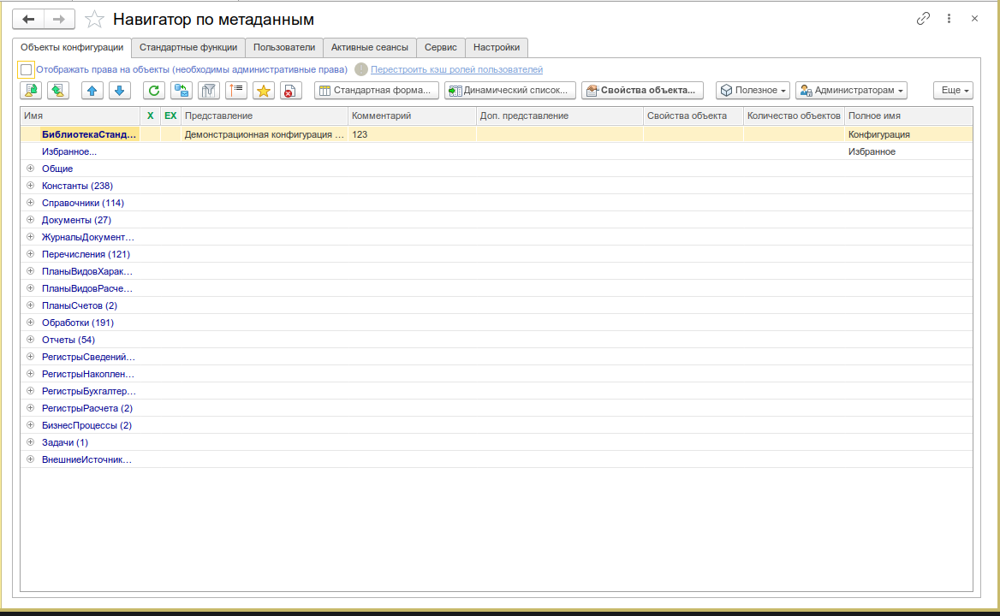
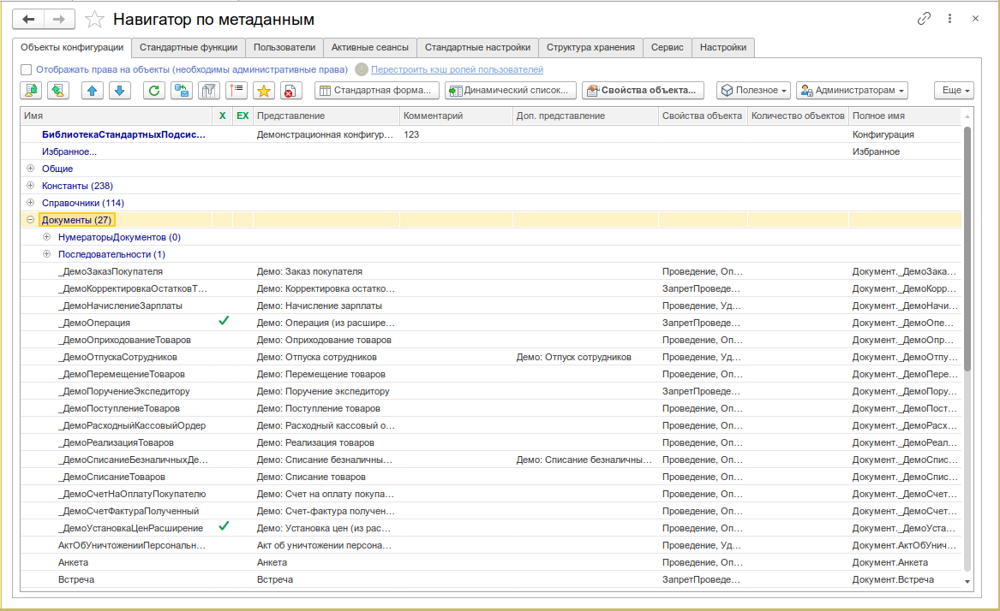
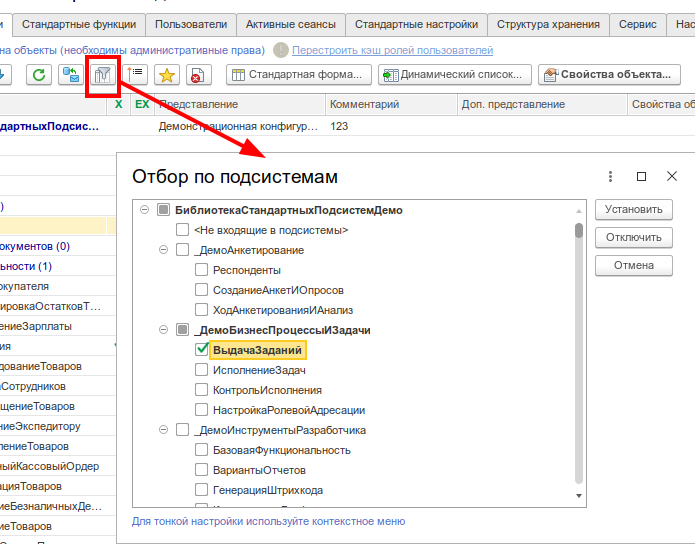
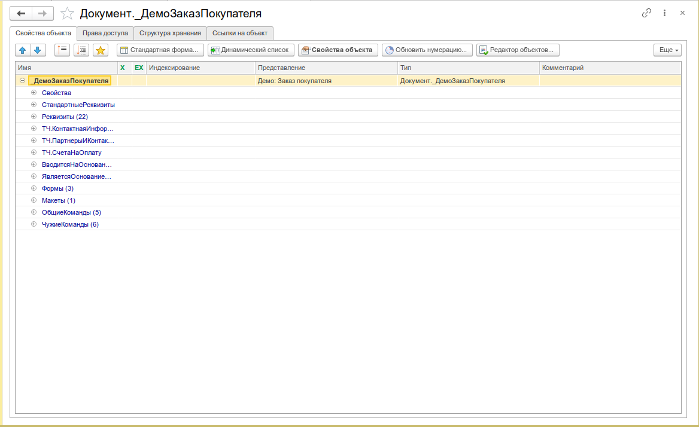
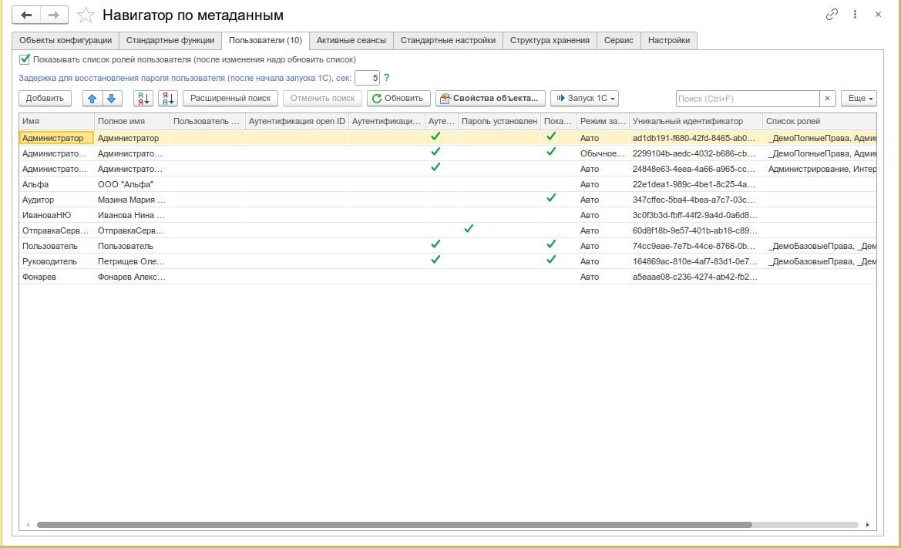

# Навигатор по метаданным

Просмотр метаданных конфигурации 1С в удобном интерфейсе.

:::info
Форк [СДРНавигаторУпр](https://infostart.ru/1c/tools/931586/). [Разрешение автора](http://forum.infostart.ru/forum9/topic202659/message2375904/#message2375904)
:::

---

## Назначение

Навигатор по метаданным — это инструмент для просмотра и исследования метаданных конфигураций 1С 8.3.

Инструмент пригодится для:

- **Изучения новой конфигурации** — быстрая навигация по всем объектам метаданных
- **Поиска объектов** — фильтрация по подсистемам, поиск по имени, избранное
- **Анализа прав доступа** — просмотр ролей и пользователей, имеющих доступ к объекту
- **Поддержки** — запуск новых сеансов 1С под любым пользователем (пароль знать необязательно)

---

## Основные возможности

### Дерево метаданных

- **Полный обход метаданных** — все разделы конфигурации: справочники, документы, регистры, обработки, отчёты, подсистемы, общие модули и т.д.
- **Счётчики объектов** — рядом с именем раздела отображается количество объектов в нём
- **Избранное** — добавление часто используемых объектов в отдельный раздел для быстрого доступа
- **Поиск по дереву** — фильтрация объектов по имени в реальном времени
- **Отбор по подсистемам** — просмотр объектов, входящих только в выбранные подсистемы

### Свойства объектов метаданных

По каждому объекту метаданных доступны:

| Раздел                      | Что отображается                                                                                       |
| --------------------------- | ------------------------------------------------------------------------------------------------------ |
| **Свойства**                | Имя, синоним, комментарий, тип, модули, реквизиты, стандартные реквизиты                               |
| **Реквизиты**               | Табличная форма со всеми реквизитами объекта, их типом, индексированием                                |
| **Табличные части**         | Реквизиты табличных частей                                                                             |
| **Предопределённые данные** | Элементы предопределённого состава справочников и планов видов расчёта                                 |
| **Движения документов**     | Регистры, по которым документ формирует движения                                                       |
| **Регистраторы**            | Для регистров — список документов-регистраторов                                                        |
| **Ввод на основании**       | Какие объекты вводятся на основании данного                                                            |
| **Подписки на события**     | Подписки на события, источником которых является объект                                                |
| **Команды**                 | Собственные команды объекта                                                                            |
| **Общие команды**           | Общие команды, параметром которых является объект                                                      |
| **Подсистемы**              | Подсистемы, в состав которых входит объект                                                             |
| **Права доступа**           | Роли и пользователи, имеющие доступ к объекту (анализируются основные права: чтение, получение и т.д.) |
| **Структура хранения**      | Имя таблицы в СУБД, поля, индексы — для программистов, знакомых с SQL                                  |
| **Ссылки на объект**        | Перечень зависимых объектов конфигурации                                                               |

### Пользователи информационной базы

- **Просмотр списка пользователей** — таблица со всеми пользователями ИБ и их свойствами
- **Создание, копирование, удаление пользователей** — полноценное управление
- **Редактирование ролей** — назначение и снятие ролей через форму редактирования
- **Смена пароля** — изменение пароля пользователя
- **Защита от опасных действий** — настройка предупреждений

### Сеансы и соединения

- **Список активных сеансов** — все текущие подключения к информационной базе
- **Список соединений** — соединения с кластером серверов 1С
- **Завершение сеансов** — принудительное завершение выбранных сеансов (требуются административные права)
- **Блокировка сеансов** — установка и снятие блокировки начала сеансов с указанием причины, времени начала и окончания

### Стандартные функции

Раздел, аналогичный меню платформы «Все функции» или «Функции для технического специалиста»:

- Журнал регистрации
- Управление полнотекстовым поиском
- Управление серверами 1С
- Управление кластером
- И другие стандартные команды платформы

### Сервис

На закладке «Сервис» собраны полезные команды:

| Команда                                     | Описание                                                                                 |
| ------------------------------------------- | ---------------------------------------------------------------------------------------- |
| **Запуск сеансов 1С**                       | Запуск конфигуратора, толстого клиента (обычный/управляемый режим), тонкого клиента      |
| **Запуск 1С с параметрами**                 | Расширенный запуск с указанием сервера, базы, пользователя, стартера                     |
| **Выполнить код 1С**                        | Встроенная консоль кода с подсветкой синтаксиса, выполнением на клиенте/сервере          |
| **Масштаб отображения**                     | Изменение масштаба форм для текущего или любого пользователя (Авто, Обычный, Компактный) |
| **Монопольный режим**                       | Установка и снятие монопольного режима                                                   |
| **Обновить повторно используемые значения** | Сброс кэша повторно используемых значений (для программистов)                            |
| **Системная информация**                    | Версия платформы, версия ОС, имя компьютера, информация о клиенте и сервере              |
| **Версия подсистемы БСП**                   | Определение версии подсистемы БСП (если она есть)                                        |
| **Хранилища настроек**                      | Просмотр содержимого стандартных хранилищ настроек                                       |

---

## Быстрый старт

1. Откройте меню **Универсальные инструменты → Навигатор по метаданным [УИ]**
2. В дереве слева раскрывайте разделы конфигурации — объекты загружаются по мере необходимости
3. Выберите любой объект метаданных и нажмите **Свойства** (или дважды кликните) — откроется окно со всеми свойствами объекта
4. Для перехода к данным нажмите **Открыть форму списка** — откроется стандартная форма списка объектов
5. Используйте поиск в верхней части дерева для быстрого нахождения объектов по имени

_Основное окно навигатора: дерево метаданных слева, панель свойств и закладки справа_

---

## Интерфейс

### Дерево объектов

Левая панель содержит дерево метаданных конфигурации. Структура дерева:

- **Конфигурация** — корневой узел с именем и версией конфигурации
- **Избранное** — пользовательские закладки на часто используемые объекты
- **Основные разделы** — справочники, документы, регистры, обработки, отчёты, бизнес-процессы и т.д.
- **Общие разделы** — общие модули, общие формы, подсистемы, роли, пользователи, общие макеты, общие команды, подписки на события, стили, функциональные опции, хранилища настроек и т.д.

Каждый раздел отображает количество объектов в нём. При первом раскрытии раздела данные загружаются с сервера.

_Дерево метаданных с разделами конфигурации и счётчиками объектов_

### Поиск и фильтрация

- **Поиск по имени** — поле ввода над деревом фильтрует объекты по вхождению подстроки
- **Отбор по подсистемам** — кнопка открывает форму выбора подсистем, после чего в дереве отображаются только объекты, входящие в выбранные подсистемы
- **Избранное** — добавление объекта через контекстное меню или кнопку

_Форма отбора объектов по подсистемам с деревом подсистем_

### Окно свойств объекта

Открывается при выборе объекта метаданных и нажатии «Свойства» (или двойном клике). Содержит закладки:

| Закладка                  | Содержимое                                                 |
| ------------------------- | ---------------------------------------------------------- |
| **Свойства**              | Основные свойства объекта метаданных                       |
| **Реквизиты**             | Таблица реквизитов с типом, индексированием                |
| **Стандартные реквизиты** | Стандартные реквизиты, доступные для объекта               |
| **Табличные части**       | Реквизиты табличных частей (если есть)                     |
| **Предопределённые**      | Элементы предопределённого состава                         |
| **Движения**              | Для документов — регистры, по которым формируются движения |
| **Регистраторы**          | Для регистров — документы-регистраторы                     |
| **Ввод на основании**     | Объекты, вводимые на основании данного                     |
| **Подписки на события**   | Подписки, источником которых является объект               |
| **Команды**               | Собственные команды объекта                                |
| **Общие команды**         | Общие команды с параметром-объектом                        |
| **Подсистемы**            | Подсистемы, в которые входит объект                        |
| **Права доступа**         | Роли и пользователи с доступом к объекту                   |
| **Структура хранения**    | Таблица СУБД, поля, индексы                                |
| **Ссылки на объект**      | Зависимые объекты конфигурации                             |

_Окно свойств объекта метаданных с закладками_

### Пользователи информационной базы

Закладка отображает таблицу пользователей ИБ с колонками: имя, полное имя, аутентификация (ОС/1С), язык, режим запуска, защита от опасных действий, дата блокировки.

Доступные действия:

- **Создать** — добавление нового пользователя
- **Копировать** — создание пользователя на основе существующего
- **Удалить** — удаление пользователя (нельзя удалить текущего)
- **Свойства** — открытие формы редактирования пользователя

_Форма редактирования пользователя информационной базы со списком ролей_

### Сервисные функции

Закладка «Сервис» содержит:

- **Запуск сеансов** — конфигуратор, толстый клиент (обычный/управляемый), тонкий клиент
- **Расширенный запуск 1С** — форма с указанием пути к стартеру, сервера, базы, пользователя, режима запуска
- **Выполнить код 1С** — редактор кода с выполнением на клиенте или сервере, синтаксический контроль
- **Масштаб отображения** — выбор варианта масштаба для пользователя (Авто, Обычный, Компактный)
- **Монопольный режим** — установка/снятие
- **Обновить повторно используемые значения**
- **Системная информация** — информация о клиенте и сервере (версия платформы, ОС, конфигурация, строка соединения)
- **Хранилища настроек** — просмотр содержимого хранилищ

---

## Сценарии использования

### Изучение новой конфигурации

При переходе на новую конфигурацию или новую версию:

1. Откройте навигатор — дерево загрузится мгновенно
2. Последовательно раскрывайте разделы, изучая состав объектов
3. Для каждого интересующего объекта открывайте свойства — смотрите реквизиты, табличные части, подсистемы
4. Используйте отбор по подсистемам, чтобы увидеть только объекты нужной подсистемы
5. Добавляйте важные объекты в Избранное для быстрого доступа

### Анализ прав доступа

1. Выберите объект метаданных в дереве
2. Откройте свойства → закладка «Права доступа»
3. Включите отображение прав через кнопку «Отображать права на объекты» (требуются права администратора)
4. Настройте проверяемое право на закладке «Проверяемые права» (по умолчанию — «Чтение»)
5. Таблица покажет, какие роли и пользователи имеют доступ к объекту

### Поиск зависимостей объекта

1. Выберите объект в дереве
2. Откройте свойства → закладка «Ссылки на объект»
3. Просмотрите перечень объектов конфигурации, которые ссылаются на данный объект
4. Это полезно перед удалением или изменением структуры объекта

### Просмотр структуры хранения в СУБД

1. Включите настройку «Показывать таблицы и индексы БД» (меню «Ещё» → «Стандартные настройки»)
2. Выберите объект метаданных
3. Перейдите на закладку «Структура хранения»
4. Просмотрите имя таблицы, поля и индексы — полезно при написании SQL-запросов

### Запуск сеанса под другим пользователем

1. Перейдите на закладку «Пользователи ИБ»
2. Выберите пользователя
3. Нажмите «Запустить 1С» — откроется новый сеанс 1С под выбранным пользователем
4. **Пароль знать необязательно** — это полезно для проверки функционала под пользователями с ограниченными правами
