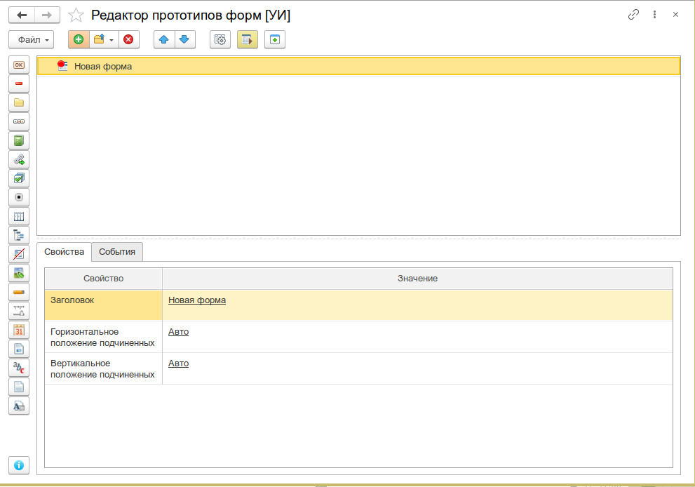
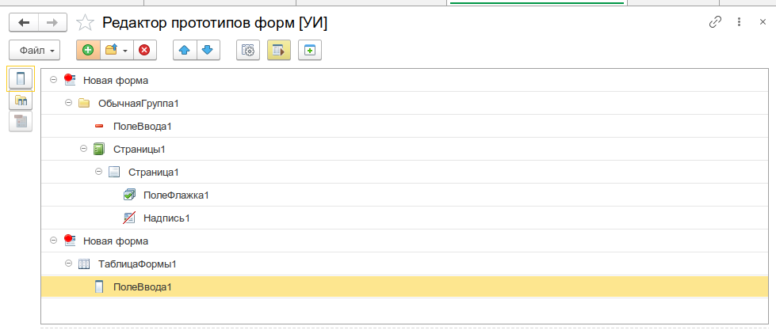
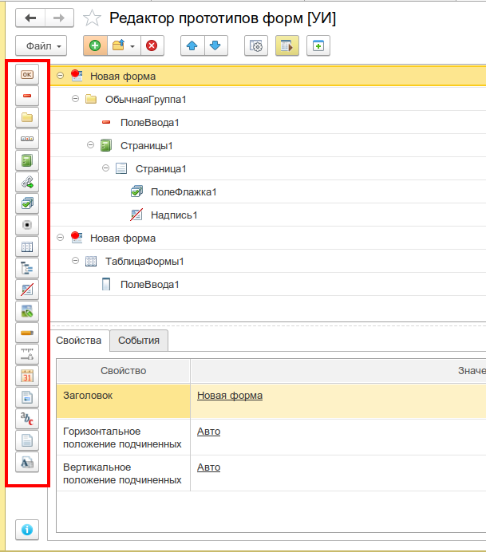
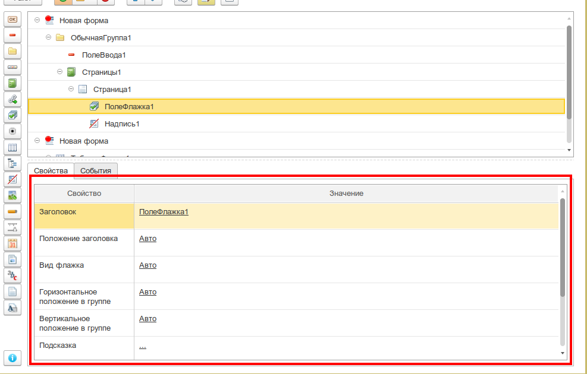
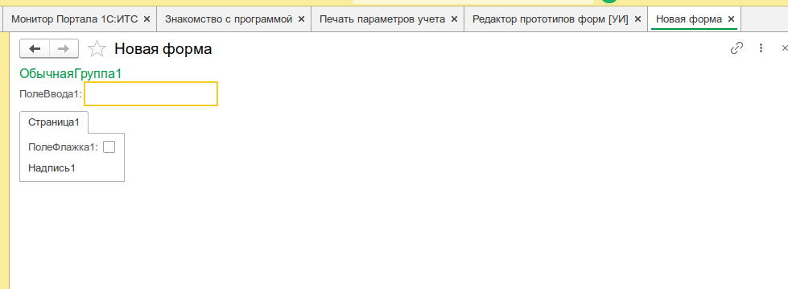

# Редактор прототипов форм

Интерактивное построение прототипов управляемых форм 1С в режиме реального времени. Позволяет визуально спроектировать внешний вид формы, настроить свойства элементов управления и сразу увидеть результат — без написания кода и без объектов метаданных.

:::info
Форк [sketch1c](https://github.com/alehinsasha/sketch1c). [Лицензия BSD-3-Clause](https://github.com/alehinsasha/sketch1c/blob/master/LICENSE). [Разрешение автора](https://github.com/cpr1c/tools_ui_1c/issues/245#issuecomment-2821633879).
:::

_Основное окно редактора: дерево прототипов форм, панель добавления элементов, свойства выделенного элемента_


---

## Назначение

Редактор прототипов форм — это инструмент для быстрого визуального проектирования управляемых форм 1С:Предприятие 8.3.

Инструмент пригодится для:

- **Прототипирования новых форм** — быстро «накидать» внешний вид формы до написания кода
- **Согласования макетов** — показать заказчику или коллегам, как будет выглядеть форма, не разрабатывая её в конфигураторе
- **Обучения** — наглядно продемонстрировать, из каких элементов состоит управляемая форма и как работают свойства
- **Реверс-инжиниринга** — загрузить существующую форму из конфигурации или открытого окна и изучить её структуру

---

## Основные возможности

### Визуальное конструирование форм

Редактор позволяет добавлять на форму любые элементы управления платформы 1С и сразу видеть результат в отдельном окне прототипа:

| Категория     | Элементы                                                                                                                                                                               |
| ------------- | -------------------------------------------------------------------------------------------------------------------------------------------------------------------------------------- |
| **Группы**    | Обычная группа, командная панель, страницы, страница, подменю, группа кнопок, группа колонок, контекстное меню                                                                         |
| **Поля**      | Поле ввода, флажок, переключатель, индикатор, полоса регулирования, календарь, поле картинки, форматированный документ, форматированная строка, текстовый документ, табличный документ |
| **Кнопки**    | Обычная кнопка, кнопка командной панели, гиперссылка, гиперссылка командной панели                                                                                                     |
| **Таблицы**   | Таблица (с колонками), дерево                                                                                                                                                          |
| **Декорации** | Надпись, картинка                                                                                                                                                                      |

### Редактирование свойств

При выборе элемента в дереве прототипа отображается список его свойств, сгруппированных по типу элемента. Доступны два режима:

- **Простой режим** — отображаются только свойства, релевантные для выбранного типа элемента
- **Расширенный режим** — отображаются все свойства в виде плоского списка (включается в настройках)

Свойства можно изменять прямо в таблице — изменения мгновенно применяются к прототипу.

### Работа с реквизитами формы

При добавлении поля, таблицы или кнопки редактор автоматически создаёт соответствующий реквизит формы. Поддерживаемые типы реквизитов:

- Число, Строка, Дата, Булево
- ТаблицаЗначений, ДеревоЗначений
- ТабличныйДокумент, ТекстовыйДокумент
- ФорматированнаяСтрока, ФорматированныйДокумент
- Картинка, СтандартныйПериод

### Загрузка существующих форм

Редактор умеет загружать структуру уже существующих форм из двух источников:

- **Из открытых окон предприятия** — выберите любую открытую форму из списка активных окон, и редактор построит её прототип
- **Из конфигурации** — выберите форму любого объекта метаданных (справочника, документа, обработки и т.д.) через дерево конфигурации

### Сохранение и загрузка прототипов

- **Сохранение в файл** (`*.xuiproto`) — весь проект с несколькими формами сохраняется в JSON-файл
- **Загрузка из файла** — ранее сохранённый проект можно открыть и продолжить редактирование

### Управление иерархией элементов

- Перемещение элементов перетаскиванием в дереве
- Кнопки «Переместить вверх» / «Переместить вниз» для изменения порядка
- Удаление элементов и целых форм
- Контекстное меню с доступными действиями

### Настройки инструмента

- **Режим редактирования свойств** — простой (контекстный) или расширенный (все свойства)
- **Загрузка свойств из файла** — возможность подгрузить кастомный файл описания свойств
- **Автоактивация элемента в прототипе** — при выборе элемента в дереве он автоматически выделяется в окне прототипа
- **Показывать подсказки команд** — отображение подписей к кнопкам на панели инструментов

---

## Быстрый старт

1. Откройте меню **Универсальные инструменты → Редактор прототипов форм [УИ]**
2. Нажмите **Создать прототип** — появится новая форма в дереве и откроется пустое окно прототипа
3. Выберите корень формы в дереве и начните добавлять элементы через панель инструментов (Группа, Поле, Кнопка, Таблица и т.д.)
4. Настройте свойства элементов в таблице справа — изменения сразу отобразятся в окне прототипа
5. Для генерации кода используйте команду **Сгенерировать код** — редактор создаст готовый код 1С для конфигуратора

---

## Интерфейс

### Дерево прототипов форм

Левая панель содержит дерево всех созданных форм и их элементов. Структура дерева:

- **Корневые элементы** — формы клиентского приложения (каждая форма — отдельный прототип)
- **Вложенные элементы** — группы, поля, кнопки, таблицы, декорации в иерархии «родитель-потомок»

Каждый элемент отображается с иконкой, соответствующей его типу. Формы, в которые были внесены изменения, помечаются специальной иконкой модификации.

_Дерево прототипов с несколькими формами и вложенными элементами_


### Панель добавления элементов

Контекстная панель инструментов автоматически переключает набор доступных элементов в зависимости от того, какой элемент выбран в дереве:

| Выбранный элемент                                                 | Доступные команды                                              |
| ----------------------------------------------------------------- | -------------------------------------------------------------- |
| **Форма / Обычная группа**                                        | Все элементы: группы, поля, кнопки, таблицы, декорации         |
| **Страницы**                                                      | Страница                                                       |
| **Командная панель / Подменю / Группа кнопок / Контекстное меню** | Кнопка командной панели, подменю, гиперссылка командной панели |
| **Таблица / Группа колонок**                                      | Колонка, группа колонок, контекстное меню                      |

_Панель добавления элементов с контекстным переключением_


### Таблица свойств

Правая панель отображает свойства выбранного элемента. Состав свойств зависит от типа элемента:

- Для **формы** — имя, заголовок, вспомогательные свойства формы
- Для **группы** — вид, группировка, отображение, заголовок и т.д.
- Для **поля** — вид, путь к данным, тип значения, заголовок, ширина, высота и т.д.
- Для **кнопки** — вид, заголовок, имя команды, кнопка по умолчанию и т.д.
- Для **таблицы** — путь к данным, тип значения, ширина, высота и т.д.

Свойства, требующие выбора из списка, отображаются с выпадающим списком. Для редактирования сложных свойств (список выбора, данные выбора) открываются отдельные формы.

_Таблица свойств выделенного элемента_


### Окно прототипа

Для каждой формы открывается отдельное окно, в котором в реальном времени отображаются все добавленные элементы. Окно прототипа — это настоящая управляемая форма 1С, поэтому все элементы выглядят и ведут себя так же, как в реальной конфигурации.

_Окно прототипа с добавленными элементами_


---

## Сценарии использования

### Создание прототипа новой формы

1. Создать новый прототип
2. Добавить группы для логической структуры (шапка, табличная часть, командная панель)
3. Разместить поля ввода, флажки, переключатели
4. Добавить таблицу с колонками
5. Разместить кнопки
6. Настроить свойства каждого элемента
7. Сохранить прототип в файл

### Анализ существующей формы

1. Откройте форму, структуру которой хотите изучить (в режиме предприятия)
2. В редакторе нажмите **Загрузить прототип из открытой формы**
3. Выберите нужную форму из списка открытых окон
4. Изучите структуру элементов и их свойства в дереве прототипа

### Перенос формы между конфигурациями

1. Загрузите существующую форму в редактор (из открытого окна или из конфигурации)
2. Сохраните прототип в файл (`*.xuiproto`)
3. Откройте файл в другой информационной базе

---

## Формат файлов

### Файл проекта (`*.xuiproto`)

Содержит все прототипы форм в одном проекте. Внутренний формат — JSON со следующей структурой:

```json
{
  "ВерсияФормата": 1,
  "Прототипы": [
    {
      "Имя": "Новая форма",
      "Заголовок": "Новая форма",
      "Идентификатор": "...",
      "Элементы": [
        /* вложенные элементы */
      ]
    }
  ]
}
```

---

## Системные требования

- Платформа 1С:Предприятие 8.3.6 и выше
- Для версий платформы 8.3.15 и выше используется оптимизированный механизм работы с файлами
