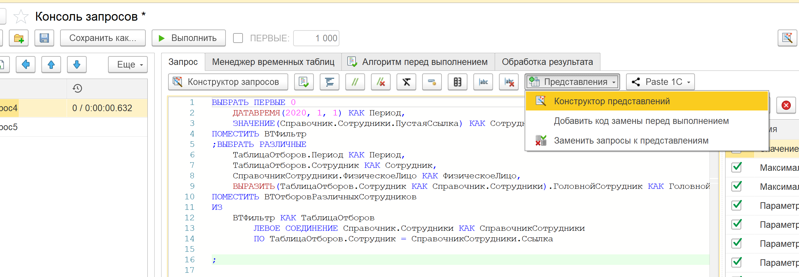
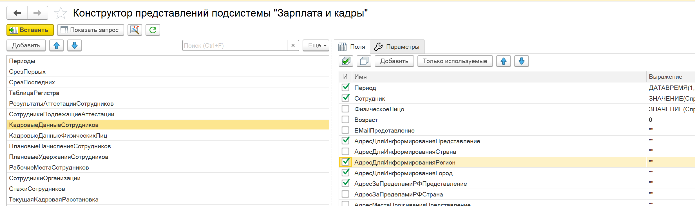
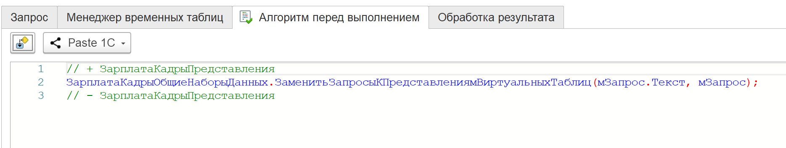

# Работа с представлениями ЗУП в консоли запросов

**Сценарий.** Вы работаете в конфигурации «Зарплата и управление персоналом» (ЗиК ГУ, ERP) и используете в запросах **представления подсистемы «Зарплата и кадры»** — виртуальные таблицы с префиксом `Представления_`. Чтобы сформировать, отредактировать или выполнить такой запрос, в Консоль запросов добавлены специализированные команды.

:::info
Команды отображаются только при наличии в конфигурации подсистемы `ЗарплатаКадрыПодсистемы`. В конфигурациях без ЗиК они скрыты.
:::



## Доступные команды

На панели инструментов Консоли запросов (и на вкладке «Алгоритм перед выполнением») доступны три команды:

| Команда                               | Назначение                                                                                                                            |
| ------------------------------------- | ------------------------------------------------------------------------------------------------------------------------------------- |
| **Конструктор представлений**         | Открывает визуальный конструктор для интерактивного формирования текста запроса представления                                         |
| **Вставить код замены представлений** | Добавляет/удаляет вызов `ЗарплатаКадрыОбщиеНаборыДанных.ЗаменитьЗапросыКПредставлениямВиртуальныхТаблиц` в алгоритм перед выполнением |
| **Заменить запросы к представлениям** | Выполняет замену представлений на реальные запросы прямо в текущем тексте запроса (без выполнения)                                    |

## Шаг 1. Сформировать представление через конструктор

Команда **Конструктор представлений** открывает визуальный конструктор, в котором можно выбрать представление, настроить поля, параметры и отборы.



1. Нажмите **Конструктор представлений** на панели инструментов
2. В левой панели выберите нужное представление (например, `КадровыеДанныеСотрудников`)
3. На вкладке **Поля** отметьте флажками поля для включения в запрос
4. На вкладке **Параметры** задайте значения обязательных параметров
5. Нажмите **Показать текст запроса**, затем **Вставить**

Конструктор автоматически:

- Вставит сформированный текст запроса в редактор
- Добавит параметры представления в таблицу параметров запроса
- Включит код замены представлений в алгоритм перед выполнением (если он ещё не был добавлен)

## Шаг 2. Добавить код замены представлений в алгоритм перед выполнением

Чтобы запрос с представлениями выполнился корректно, перед его запуском необходимо вызвать процедуру `ЗарплатаКадрыОбщиеНаборыДанных.ЗаменитьЗапросыКПредставлениямВиртуальныхТаблиц`. Этот код можно добавить автоматически.

Нажмите **Вставить код замены представлений** — в алгоритм перед выполнением будет добавлен следующий код:

```bsl
// + ЗарплатаКадрыПредставления
ЗарплатаКадрыОбщиеНаборыДанных.ЗаменитьЗапросыКПредставлениямВиртуальныхТаблиц(мЗапрос.Текст, мЗапрос);
// - ЗарплатаКадрыПредставления
```

Код вставляется между маркерами `// + ЗарплатаКадрыПредставления` и `// - ЗарплатаКадрыПредставления`. При повторном нажатии команды код удаляется. Состояние вставки отображается пометкой на кнопке.



:::tip
Если вы используете **Конструктор представлений**, код замены вставляется автоматически — отдельно вызывать команду не требуется.
:::

## Шаг 3. Выполнить запрос

После того как представление сформировано и код замены добавлен:

1. При необходимости задайте значения параметров в таблице параметров
2. Нажмите **Выполнить**

Алгоритм перед выполнением отработает автоматически: вызовет `ЗарплатаКадрыОбщиеНаборыДанных.ЗаменитьЗапросыКПредставлениямВиртуальныхТаблиц`, который подставит реальные запросы вместо псевдонимов `Представления_...`, и только после этого выполнится основной запрос.

## Альтернатива: замена представлений без выполнения

Если нужно просто посмотреть, во что разворачивается представление, без выполнения запроса — используйте команду **Заменить запросы к представлениям**. Она заменяет псевдонимы виртуальных таблиц на реальные запросы прямо в тексте редактора.

Это удобно для:

- Предварительного просмотра финального текста запроса
- Копирования готового запроса для использования вне консоли
- Отладки — чтобы понять, какие именно таблицы и соединения скрываются за представлением

## Импорт существующего запроса в конструктор

Если у вас уже есть текст запроса с представлением, его можно отредактировать в визуальном режиме:

1. Выделите в редакторе текст, содержащий `ПОМЕСТИТЬ Представления_...`
2. Нажмите **Конструктор представлений**
3. Конструктор откроется в режиме редактирования — разобранный запрос будет загружен в форму
4. Внесите изменения и нажмите **Изменить**

## Пример полного сценария

Допустим, нужно получить список сотрудников с их подразделениями и должностями на указанную дату.

**1. Откройте Консоль запросов** через меню **Универсальные инструменты → Консоль запросов**

**2. Нажмите Конструктор представлений**, выберите `КадровыеДанныеСотрудников`, отметьте поля `ИОФамилия`, `Подразделение`, `Должность`, задайте параметр `Период = &ДатаОтчёта` и нажмите **Вставить**.

В редакторе появится текст:

```sql
ВЫБРАТЬ
	ЗНАЧЕНИЕ(Справочник.Сотрудники.ПустаяСсылка) КАК ИОФамилия,
	ЗНАЧЕНИЕ(Справочник.Подразделения.ПустаяСсылка) КАК Подразделение,
	ЗНАЧЕНИЕ(Справочник.Должности.ПустаяСсылка) КАК Должность
ПОМЕСТИТЬ Представления_КадровыеДанныеСотрудников
ГДЕ
	"Период" = &ДатаОтчёта
	И "ТолькоРазрешенные" = ИСТИНА
```

**3. Добавьте основной запрос**, который использует это представление:

```sql
////////////////////////////////////////////////////////////////////////////////
ВЫБРАТЬ
	КадровыеДанные.ИОФамилия,
	КадровыеДанные.Подразделение,
	КадровыеДанные.Должность
ИЗ
	Представления_КадровыеДанныеСотрудников КАК КадровыеДанные
```

**4. Задайте параметр** `ДатаОтчёта` в таблице параметров (тип «Дата»).

**5. Нажмите Выполнить** — запрос выполнится с автоматической подстановкой реальных данных через механизм представлений.

## Связанные разделы

- [Конструктор представлений «Зарплата и кадры»](/docs/tools/development-tools/hrm-query-constructor) — подробная документация инструмента
- [Консоль запросов](/docs/tools/development-tools/query-console) — основные возможности консоли
- [Алгоритм перед выполнением](/docs/tools/development-tools/query-console#алгоритм-перед-выполнением) — раздел в документации консоли запросов
