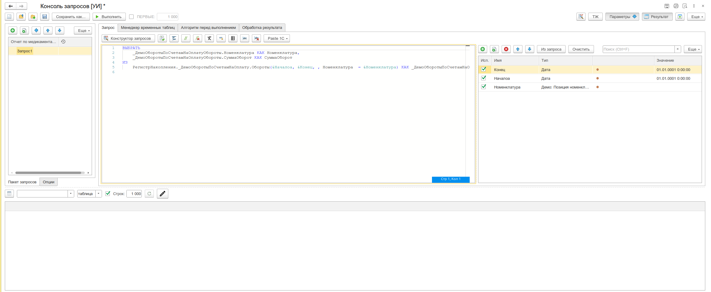

# Консоль запросов

Разработка и выполнение запросов к базе данных.

:::info
Форк [RequestConsole9000](https://github.com/hal9000cc/RequestConsole9000). [Лицензия GPL3](https://github.com/hal9000cc/RequestConsole9000/blob/master/LICENSE)
:::



## Назначение

Инструмент для написания, отладки и выполнения запросов к базе данных 1С непосредственно из предприятия. Позволяет:

- Разрабатывать запросы любой сложности с подсветкой синтаксиса и автодополнением
- Выполнять одиночные и пакетные запросы с временными таблицами
- Управлять параметрами запросов через удобный интерфейс
- Просматривать, сортировать и экспортировать результаты
- Обрабатывать результат запроса кодом 1С прямо в консоли
- Генерировать готовый код для конфигуратора
- Перехватывать запросы из выполняемого кода
- Интегрироваться с технологическим журналом для получения плана запроса

## Особенности

- Подсветка синтаксиса языка запросов 1С
- Автодополнение таблиц метаданных и их полей
- Пакеты запросов с деревом именованных запросов
- Редактор параметров с расширенными редакторами для сложных типов (ссылки, таблицы значений, массивы, структуры)
- Обработка результата запроса кодом в 5 режимах выполнения
- Макроколонки: уникальный идентификатор, дата создания ссылки
- Вставка предопределенных значений
- Перехват запросов из выполняемого кода
- Интеграция с технологическим журналом — получение плана запроса
- Генерация готового кода 1С из текущего запроса
- Просмотр значений строки результата в отдельной таблице
- Экспорт результатов: табличный документ MXL, CSV, XML
- Автосохранение с настраиваемым интервалом

## Быстрый старт

1. Откройте меню **Универсальные инструменты → Консоль запросов**
2. Введите текст запроса в поле редактора
3. При необходимости укажите значения параметров в панели параметров
4. Нажмите **Выполнить**
5. Результат отобразится в таблице в нижней части формы

## Пакеты запросов

Консоль поддерживает работу с пакетами запросов — набором именованных запросов, организованных в дерево:

- Создание, копирование, переименование, изменение порядка запросов в пакете
- Сохранение и загрузка пакетов в файл
- Автосохранение пакета перед выполнением
- Выполнение как текущего запроса, так и всего пакета
- Объединение нескольких пакетов

## Параметры запросов

- Автоматическое определение параметров из текста запроса (кнопка «Заполнить параметры»)
- Добавление, редактирование и удаление параметров
- Поддержка всех основных типов данных 1С: строки, числа, даты, ссылки, таблицы значений, списки значений, массивы, структуры, соответствия
- Редактирование значений через специализированные редакторы (выбор ссылок через стандартные формы 1С)
- Использование результата запроса как значения параметра

## Алгоритм перед выполнением

Перед запуском запроса можно выполнить произвольный код 1С — **предварительный алгоритм**. Это полезно для:

- Подготовки данных или параметров перед выполнением запроса
- Инициализации менеджера временных таблиц
- Подстановки представлений подсистемы «Зарплата и Кадры»

Код предварительного алгоритма выполняется на сервере до выполнения запроса.

## Макроколонки

Макроколонки позволяют добавить в результат запроса служебные поля, вычисленные на основе ссылочных колонок. Реализованы через механизм параметров-маркеров с пост-обработкой результата.

### Принцип работы

В текст запроса вместо выражения вставляется маркер вида `&__УИД_ИмяКолонки` или `&__ДатаСоздания_ИмяКолонки`. Перед выполнением эти маркеры устанавливаются в `NULL` — запрос выполняется с пустыми значениями. После получения результата консоль построчно обходит выборку и заполняет вычисленные значения.

### Вставка маркера

Маркер можно вставить через контекстное меню редактора — **Вставить макроколонку** (доступно в режиме подсветки языка запросов). Откроется диалог выбора типа и имени колонки-источника.

### Типы макроколонок

- **УИД** — маркер `&__УИД_ИмяКолонки`. После выполнения для каждой строки вызывается `КолонкаИсточника.УникальныйИдентификатор()`. Результат имеет тип `УникальныйИдентификатор`.

- **ДатаСоздания** — маркер `&__ДатаСоздания_ИмяКолонки`. После выполнения для каждой строки из GUID ссылки декодируется дата её создания. Результат имеет тип `Дата`.

### Управление

Включение и отключение обработки макроколонок выполняется опцией **Обрабатывать макроколонки** на форме консоли. Если опция выключена, маркеры обрабатываются как обычные параметры запроса.

## Обработка результата запросом

После выполнения запроса можно обработать его результат кодом 1С. Доступно 5 режимов выполнения:

1. **Простое выполнение** — полный код на сервере, ручной обход результата
2. **Построчная без прогресса** — код вызывается для каждой строки результата, без индикатора
3. **Построчная с прогрессом** — код для каждой строки с индикатором выполнения и расчётом времени
4. **Фоновое простое (БСП 2.3+)** — полный код в фоновом задании
5. **Фоновое построчное (БСП 2.3+)** — обработка строк в фоновом задании с прогрессом

Доступен [режим исполнения через обработку](/docs/guides/execution-through-processing) с написанием методов в коде алгоритма

## Генерация кода

Консоль может сгенерировать готовый код 1С из текущего запроса:

- Полный код с созданием объекта `Запрос`, текстом запроса, параметрами и обработкой результата
- Код готов к вставке в модуль конфигурации
- Преобразование текста запроса из строки встроенного языка — удаление кавычек и переносов строк

## Интеграция с технологическим журналом

- Включение логирования на уровне запросов для текущего сеанса
- Автоматическая настройка технологического журнала (добавление/удаление записей в `logcfg.xml`)
- Извлечение плана запроса из логов технологического журнала
- Визуализация плана запроса в отдельной форме

## Программный интерфейс

### Открытие консоли из кода

```bsl
УИ_ОбщегоНазначенияКлиент.ОткрытьКонсольЗапросов();
```

### Отладка запроса через УИ*.*От

```bsl
Запрос = Новый Запрос;
Запрос.Текст = "ВЫБРАТЬ Ссылка, Наименование ИЗ Справочник.Номенклатура ГДЕ ЭтоГруппа = Ложь";
Запрос.МенеджерВременныхТаблиц = Новый МенеджерВременныхТаблиц;

// Открыть консоль запросов с заполненным текстом и менеджером временных таблиц
УИ_._От(Запрос);

// С указанием имени для сохранения
УИ_._От(Запрос, "Мой запрос");

// Отладка менеджера временных таблиц
УИ_._От(Запрос.МенеджерВременныхТаблиц);

// Сохранение данных отладки в файлы
УИ_._ОтФ(Запрос, "Запрос для анализа");
```

## Формат файлов

Пакеты запросов сохраняются в файлы с расширением `.q9` (формат JSON), содержащие:

- Список запросов с текстом
- Имена и порядок запросов в дереве
- Значения параметров

## Связанные разделы

- [Отладка из кода](/docs/guides/debugging) — подробная документация по `УИ_._От`
- [Консоль кода](/docs/tools/development-tools/code-console) — обработка результатов запроса кодом
- [Консоль отчётов](/docs/tools/development-tools/report-console) — запросы как основа для отчётов СКД
- [Редактор СКД](/docs/tools/development-tools/skd-editor) — подготовка схемы компоновки на основе запросов
- [Консоль сравнения данных](/docs/tools/data-tools/data-comparison-console) — сравнение результатов из разных источников
- [Пример отладки запроса](./debug-query) — пошаговый сценарий отладки
- [Работа с представлениями ЗУП](./debug-hrm-views) — формирование и выполнение запросов с представлениями подсистемы «Зарплата и кадры»

## Прочие ссылки

- [Консоль запросов — многофункциональный инструмент для разработки и отладки запросов](https://infostart.ru/1c/tools/1190868/) — Infostart
- [Консоль кода — режимы выполнения алгоритмов](https://infostart.ru/1c/articles/1243948/) — Infostart
