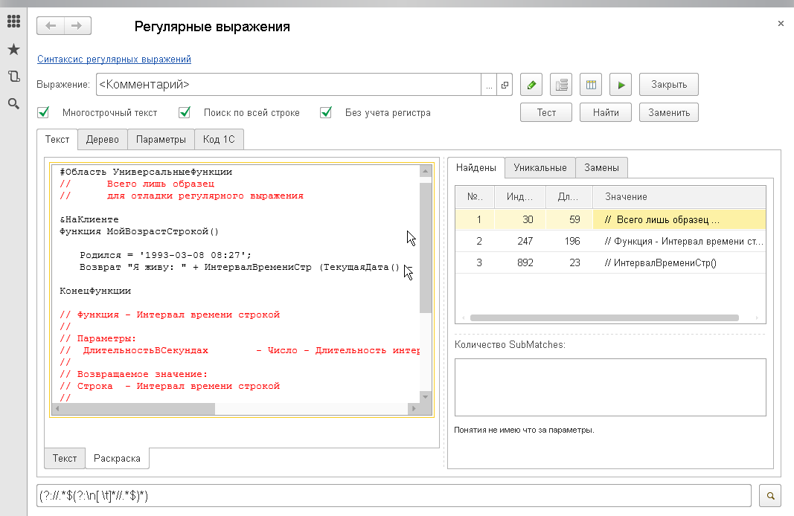
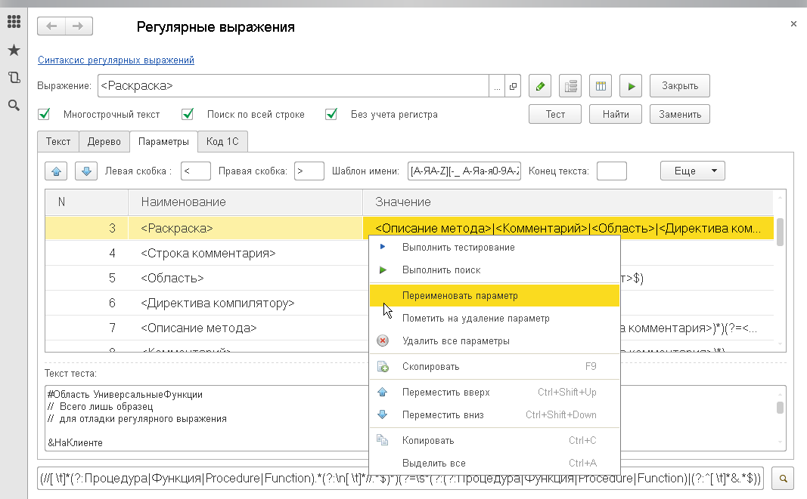
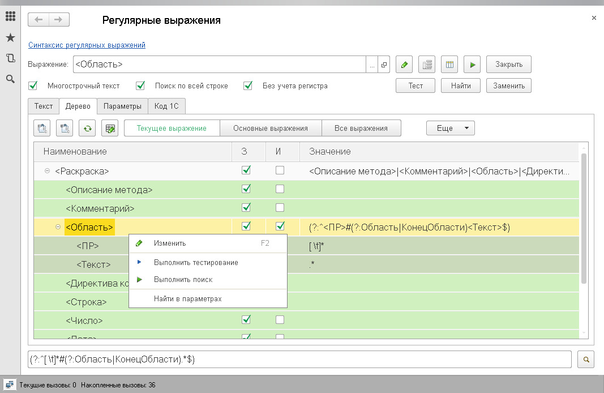
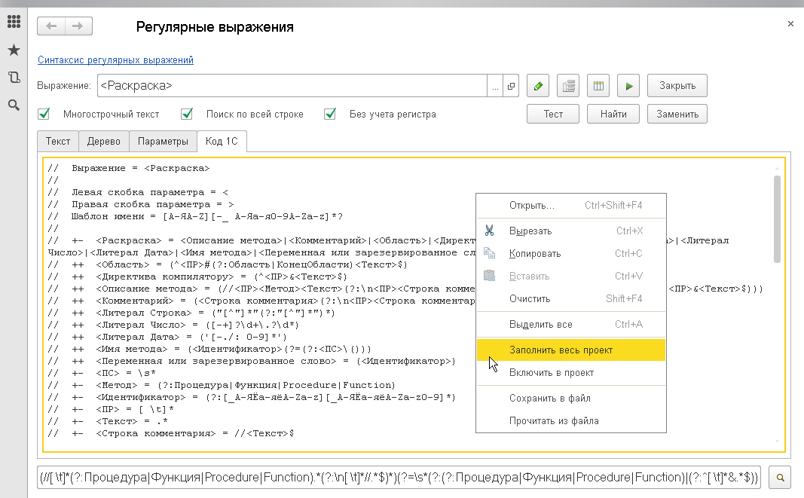
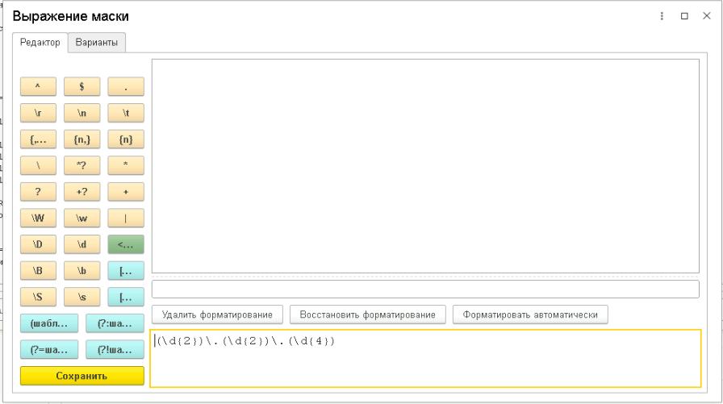

# Конструктор регулярных выражений

Визуальный построитель и отладчик регулярных выражений для 1С. Позволяет конструировать сложные регулярные выражения через параметрическое описание, тестировать их на произвольных текстах и сразу получать готовый программный код 1С на основе `VBScript.RegExp`.

:::info
Форк [Построителя регулярных выражений](https://infostart.ru/public/592108/) от пользователя Infostart [fokind](https://infostart.ru/user/56652/). [Разрешение автора](http://forum.infostart.ru/forum9/topic167495/message2389269/#message2389269)
:::

_Общий вид конструктора: поле маски, поле текста, панель результатов и закладки параметров_


---

## Назначение

Регулярные выражения — мощный, но сложный для восприятия инструмент обработки текста. Даже простое выражение, записанное в одну строку, бывает трудно прочитать и отладить, а поддержка сложных шаблонов без специальных средств превращается в мучение.

**Конструктор регулярных выражений** решает эту проблему, предлагая **параметрический подход**: сложное выражение разбивается на именованные параметры-кирпичики, каждый из которых описывается и тестируется отдельно. Из этих параметров, как из конструктора, собирается итоговое регулярное выражение.

Инструмент пригодится для:

- **Разработки и отладки регулярных выражений** — визуальное конструирование без необходимости помнить синтаксис наизусть
- **Обучения регулярным выражениям** — наглядная демонстрация работы шаблонов и групп
- **Обработки текстовых файлов** — извлечение данных, замена фрагментов, валидация форматов
- **Разбора и анализа исходного кода 1С** — поиск областей, директив компилятору, процедур, функций, переменных, зарезервированных слов, комментариев
- **Генерации кода 1С** — получение готового кода для вставки в модуль конфигурации

На текущий момент поддерживается только ОС Windows.

---

## Основные возможности

- **Параметрическое конструирование** — разбиение сложного выражения на именованные параметры с возможностью вложенности и переиспользования
- **Тестирование шаблона** — проверка, соответствует ли текст шаблону (режим «Тест»)
- **Поиск совпадений** — нахождение всех вхождений шаблона в тексте с отображением позиций, длины и подгрупп (SubMatches)
- **Замена по шаблону** — замена найденных фрагментов на указанный текст
- **Уникальные совпадения** — отбор неповторяющихся результатов поиска
- **Дерево параметров** — иерархическое отображение структуры параметров с возможностью редактирования
- **Редактор выражений** — отдельная форма для редактирования регулярного выражения с подсветкой синтаксиса и подсказками
- **Генерация кода 1С** — автоматическое создание программного кода на языке 1С для выполненного запроса
- **Настройка флагов** — `Global` (глобальный поиск), `IgnoreCase` (игнорировать регистр), `Multiline` (многострочный режим)
- **Форматированный текст** — работа с текстом, содержащим форматирование (цвета, шрифты)
- **Сохранение и загрузка** — сохранение набора параметров и масок в файл и восстановление из файла
- **Справочник по синтаксису** — встроенная справка по метасимволам регулярных выражений

---

## Быстрый старт

1. Откройте меню **Универсальные инструменты → Конструктор регулярных выражений [УИ]**
2. В поле **Маска** введите регулярное выражение (например, `\d+` для поиска чисел)
3. В поле **Текст** введите или вставьте текст для анализа
4. Нажмите **Тест** — инструмент покажет, какие строки соответствуют шаблону
5. Нажмите **Найти** — будут найдены все совпадения с указанием позиции и подгрупп
6. Нажмите **Заменить** — выполните замену найденных фрагментов на указанный текст
7. Перейдите на закладку **Код 1С** — получите готовый программный код для вставки в конфигурацию

---

## Интерфейс

### Основные поля

| Поле             | Назначение                                                                                                              |
| ---------------- | ----------------------------------------------------------------------------------------------------------------------- |
| **Маска**        | Регулярное выражение (шаблон поиска). Может содержать параметры в виде `{ИмяПараметра}`                                 |
| **Текст**        | Анализируемый текст. Поддерживает многострочный ввод и форматированный текст                                            |
| **Конец текста** | Дополнительный текст, добавляемый к основному при поиске (полезно, если основной текст заканчивается не так, как нужно) |
| **Результат**    | Панель вывода результатов тестирования, поиска или замены                                                               |

### Флаги (свойства RegExp)

| Флаг           | Описание                                                                                            |
| -------------- | --------------------------------------------------------------------------------------------------- |
| **Global**     | Глобальный поиск — находятся все совпадения, а не только первое                                     |
| **IgnoreCase** | Игнорировать регистр символов при поиске                                                            |
| **Multiline**  | Многострочный режим — символы `^` и `$` соответствуют началу/концу каждой строки, а не всего текста |

### Закладки

| Закладка       | Назначение                                                                                                                |
| -------------- | ------------------------------------------------------------------------------------------------------------------------- |
| **Найдены**    | Список всех найденных совпадений с указанием номера, позиции в тексте, длины, значения и подгрупп (SubMatches)            |
| **Уникальные** | Список неповторяющихся значений найденных совпадений                                                                      |
| **Замены**     | Поле для ввода текста замены и кнопка выполнения замены по шаблону                                                        |
| **Дерево**     | Иерархическое дерево параметров — наглядное представление вложенности и структуры параметров                              |
| **Параметры**  | Таблица всех определённых параметров с возможностью редактирования значения, признаков «Замещать», «Извлекать», «Удалять» |
| **Код 1С**     | Автоматически сгенерированный программный код 1С для текущего выражения                                                   |

_Закладка «Параметры» с таблицей именованных параметров и их значений_


_Закладка «Дерево» с иерархическим отображением структуры параметров_


_Закладка «Код 1С» со сгенерированным кодом_


### Панель инструментов

- **Тест** — проверка соответствия текста шаблону (показывает для каждой строки, найдено совпадение или нет)
- **Найти** — поиск всех совпадений с детальной информацией по каждому
- **Заменить** — замена найденных фрагментов на указанный текст
- **Загрузить из файла** — загрузка ранее сохранённого набора параметров
- **Сохранить в файл** — сохранение текущих параметров и масок
- **Редактор выражений** — открытие отдельной формы для редактирования выражения с подсветкой синтаксиса

---

## Параметрическое конструирование

Ключевая особенность инструмента — возможность разбивать сложное регулярное выражение на **именованные параметры**.

### Синтаксис параметров

Параметр в маске обозначается как `<ИмяПараметра>`. Скобки `<` и `>` можно настроить в полях **Левая скобка параметра** и **Правая скобка параметра**.

### Свойства параметра

| Свойство         | Описание                                                                                       |
| ---------------- | ---------------------------------------------------------------------------------------------- |
| **Наименование** | Имя параметра в маске (например, `Число`, `Идентификатор`)                                     |
| **Значение**     | Регулярное выражение, которым заменяется параметр (например, `\d+`)                            |
| **Замещать**     | Если установлено — параметр заменяется своим значением в итоговом выражении                    |
| **Извлекать**    | Если установлено — значение параметра заключается в круглые скобки для извлечения в SubMatches |
| **Удалять**      | Если установлено — пустой параметр автоматически удаляется из итогового выражения              |

### Пример

Маска: `<ЦелоеЧисло>\s+<Строка>`

Параметры:

- `<ЦелоеЧисло>` = `[-+]?\d+`
- `<Строка>` = `[А-Яа-яA-Za-z]+`

Итоговое выражение: `[-+]?\d+\s+[А-Яа-яA-Za-z]+`

---

## Сценарии использования

### Разбор модуля 1С: поиск областей

Маска: `<Область>`

Параметр `<Область>`:

```
(?:^[ \t]*#(?:Область|КонецОбласти).*$)
```

Режим: `Multiline = Истина`

Результат: будут найдены все строки, содержащие `#Область` и `#КонецОбласти`.

### Поиск директив компилятору

Маска: `<Директива>`

Параметр `<Директива>`:

```
(?:^[ \t]*&\w+.*$)
```

Режим: `Multiline = Истина`

### Поиск чисел в тексте

Маска: `<Число>`

Параметр `<Число>`:

```
[-+]?\d+\.?\d*
```

### Замена дат с перестановкой фрагментов

Маска: `<Дата>`

Параметр `<Дата>`:

```
(\d{2})\.(\d{2})\.(\d{4})
```

Текст замены: `$3-$2-$1`

Результат: `01.01.2024` → `2024-01-01`

### Генерация кода 1С

После настройки маски и параметров перейдите на закладку **Код 1С**. Инструмент сгенерирует готовый код:

```bsl
RegExpLocal = Новый COMОбъект("VBScript.RegExp");

RegExpLocal.Multiline = Истина;
RegExpLocal.Global = Истина;
RegExpLocal.IgnoreCase = Истина;
RegExpLocal.Pattern = idPattern;

Найдено = RegExpLocal.Execute(ОбрабатываемыйТекст);
Для каждого Стр Из Найдено Цикл

    Начало = Стр.FirstIndex;
    Длина = Стр.Length;
    Значение = Стр.Value;

    vЧисло = Стр.SubMatches(0);

КонецЦикла;
```

Код можно скопировать и вставить в любой модуль конфигурации 1С.

---

## Редактор выражений

Отдельная форма для редактирования регулярного выражения, открываемая по кнопке **Редактор выражений**. Предоставляет:

- Подсветку синтаксиса регулярного выражения
- Контекстную подсказку по мере ввода
- Удобное редактирование многострочных выражений
- Проверку синтаксиса

_Редактор выражений с подсветкой синтаксиса и подсказками_


---

## Ограничения

- Работает только в ОС **Windows** (требуется COM-объект `VBScript.RegExp`)
- Для работы инструмента необходима платформа 1С:Предприятие 8.3.12 и выше
- В веб-клиенте работа инструмента может быть ограничена

---

## См. также

- [Программный API для работы с регулярными выражениями](/docs/api/regex) — модуль `УИ_РегулярныеВыраженияКлиентСервер` для использования регулярных выражений в коде 1С
- [Внешняя компонента RegEx1CAddin](https://github.com/alexkmbk/RegEx1CAddin) — компонента для работы с регулярными выражениями на платформе 1С
- [Оригинальная публикация на Infostart](https://infostart.ru/1c/tools/592108/) — статья автора «Регулярные выражения – это просто. Построитель и отладчик регулярных выражений»
