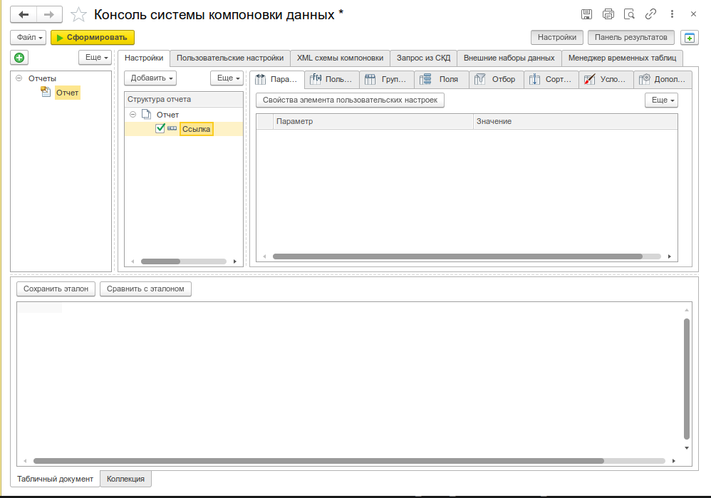
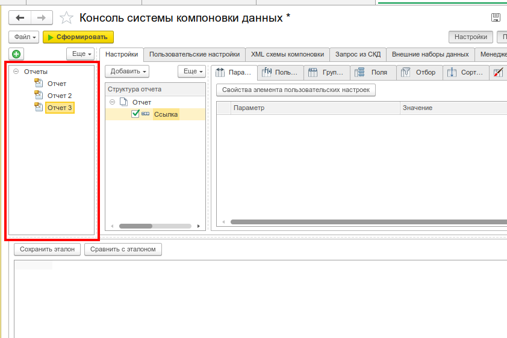
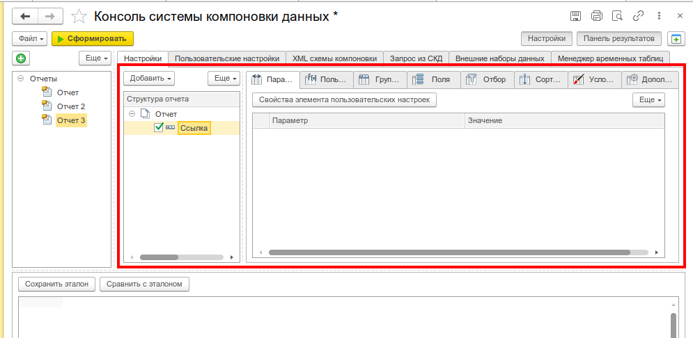
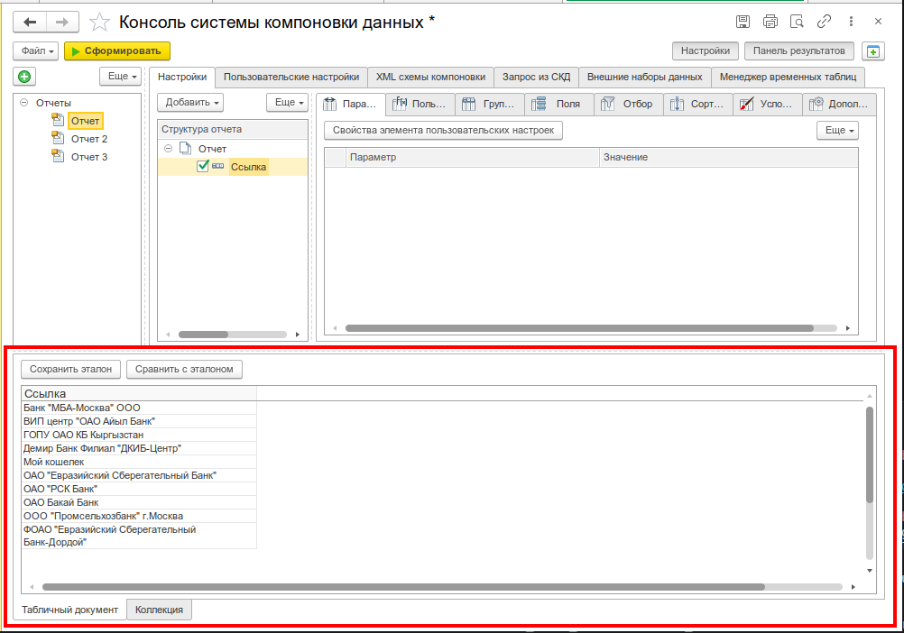
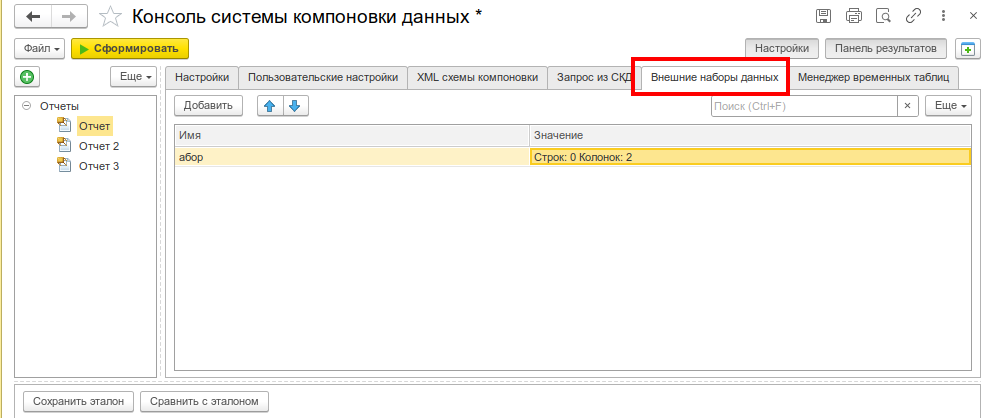
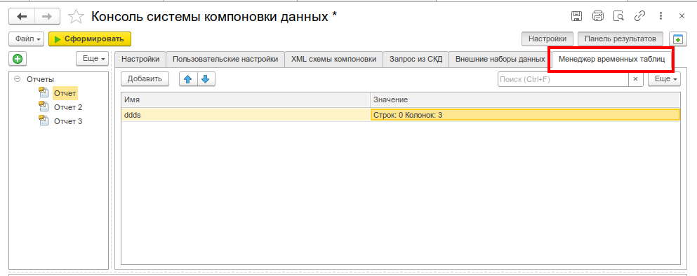
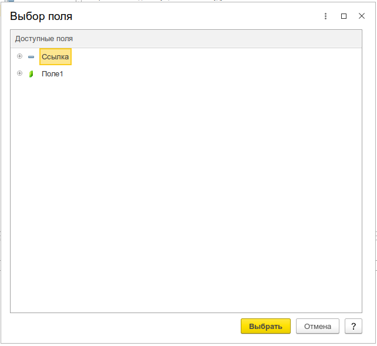

# Консоль отчетов

Проектирование, настройка и выполнение отчётов на системе компоновки данных (СКД) прямо из предприятия. Переработанная консоль компоновок с диска ИТС — теперь ей удобнее пользоваться.

_Общий вид консоли: дерево отчётов слева, панель настроек по центру, результат выполнения справа_

---

## Назначение

Консоль отчетов — это полнофункциональный инструмент для работы с отчётами на СКД. Позволяет создавать, редактировать, выполнять и отлаживать схемы компоновки данных без необходимости открывать конфигуратор или писать внешние обработки.

Инструмент пригодится для:

- **Разработки отчётов на СКД** — создание и редактирование схем компоновки данных в интерактивном режиме
- **Настройки вариантов отчётов** — гибкое управление полями, отборами, порядком, условным оформлением
- **Отладки отчётов** — выполнение с внешними наборами данных, временными таблицами, сравнение с эталоном
- **Анализа результатов** — просмотр в табличном документе или коллекции значений
- **Работы с расшифровкой** — детализация показателей по любой ячейке отчёта
- **Обмена отчётами** — сохранение и загрузка файлов консоли, экспорт/импорт схем СКД

---

## Основные возможности

- **Дерево отчётов** — иерархическая структура с отчетами (схемами СКД), вариантами, настройками и папками. Поддерживается копирование, перемещение, переименование
- **Полный набор настроек СКД** — поля группировки, выбранные поля, отбор, порядок, условное оформление, параметры вывода
- **Формирование в разных форматах** — табличный документ, коллекция значений (дерево значений)
- **Расшифровка** — обработка расшифровки с открытием значения или детализацией в отдельной форме
- **Внешние наборы данных** — подключение таблиц значений в качестве источников данных для отчёта
- **Временные таблицы** — управление временными таблицами для пакетных запросов в СКД
- **Конструктор СКД** — вызов штатного конструктора схемы компоновки данных (в толстом клиенте) или [Редактора СКД](/docs/tools/development-tools/skd-editor) (в тонком и веб-клиенте)
- **Сравнение с эталоном** — сохранение эталона табличного документа или макета и сравнение с текущим результатом
- **Загрузка настроек из варианта отчёта** — выбор и загрузка настроек из любого варианта схемы
- **Открытие в консоли запросов** — передача текстов запросов из СКД в [Консоль запросов](/docs/tools/development-tools/query-console)
- **Работа с файлами** — сохранение и загрузка файлов консоли (набор отчётов), экспорт/импорт отдельных схем СКД в XML
- **Отладка** — загрузка схемы СКД из параметров для отладки внешних отчётов и обработок

---

## Быстрый старт

1. Откройте меню **Универсальные инструменты → Консоль отчетов [УИ]**
2. В дереве отчётов (левая панель) выберите существующий отчёт или создайте новый через кнопку **Добавить схему компоновки данных**
3. В центральной панели настройте структуру отчёта: группировки, поля, отборы, порядок, условное оформление
4. Нажмите **Сформировать** — результат отобразится в правой панели
5. При необходимости сохраните набор отчётов в файл через **Файл → Сохранить**

---

## Интерфейс

### Дерево отчётов

Левая панель содержит иерархическое дерево отчётов.

_Дерево отчётов с отображением иерархии: папки, отчёты, варианты_

### Панель настроек

Центральная часть формы содержит вкладки для настройки отчёта:

| Вкладка                 | Назначение                                   |
| ----------------------- | -------------------------------------------- |
| **Поля группировки**    | Настройка строк и колонок группировки отчёта |
| **Выбранные поля**      | Отбор полей, выводимых в отчёт               |
| **Отбор**               | Условия фильтрации данных                    |
| **Порядок**             | Сортировка записей                           |
| **Условное оформление** | Оформление ячеек в зависимости от значений   |
| **Параметры вывода**    | Дополнительные параметры отображения         |

Для каждого элемента структуры отчёта можно включить/отключить локальные настройки (флажок слева от названия вкладки). Это позволяет гибко управлять наследованием настроек от вышестоящих группировок.

_Панель настроек с вкладками: поля группировки, выбранные поля, отбор, порядок_

### Панель результата

Нижняя панель отображает результат выполнения отчёта. Поддерживаются следующие режимы просмотра:

| Режим                  | Описание                                                   |
| ---------------------- | ---------------------------------------------------------- |
| **Табличный документ** | Классическое представление отчёта с расшифровкой           |
| **Коллекция значений** | Результат в виде дерева значений для программной обработки |

_Результат отчёта в виде табличного документа с возможностью расшифровки_

---

## Сценарии использования

### Создание нового отчёта

1. Нажмите **Добавить схему компоновки данных** — в дереве появится новый отчёт с именем по умолчанию
2. Переименуйте отчёт через контекстное меню или двойным кликом
3. Нажмите **Конструктор СКД** для визуального проектирования схемы:
   - в **толстом клиенте** откроется штатный конструктор схемы компоновки данных
   - в **тонком и веб-клиенте** откроется [Редактор СКД](/docs/tools/development-tools/skd-editor)
4. Настройте структуру отчёта: добавьте группировки, выберите поля, установите отборы
5. Нажмите **Сформировать** для проверки результата

### Работа с вариантами отчёта

Если схема компоновки данных содержит несколько вариантов настроек:

1. Выберите отчёт в дереве
2. Нажмите **Загрузить настройки из варианта**
3. В диалоге выберите нужный вариант
4. Настройки варианта загрузятся в компоновщик — их можно доработать
5. Сформируйте отчёт для проверки

### Использование внешних наборов данных

Для отчётов, которые используют данные не из базы данных (например, из таблицы значений):

1. Выберите отчёт в дереве
2. В таблице **Внешние наборы данных** добавьте строку
3. Укажите **Имя** набора (должно совпадать с именем набора в схеме СКД)
4. Заполните **Значение** — таблицу значений с данными
5. Сформируйте отчёт — данные из внешнего набора будут использованы при выполнении

_Таблица внешних наборов данных с возможностью редактирования значений_

### Работа с временными таблицами (менеджер временных таблиц)

Для отчётов, использующих пакетные запросы с временными таблицами:

1. Выберите отчёт в дереве
2. В таблице **Временные таблицы** добавьте строку
3. Укажите **Имя** временной таблицы
4. Заполните **Значение** — таблицу значений с данными
5. При формировании отчёта временные таблицы будут доступны в пакете запросов

_Управление временными таблицами для пакетных запросов_

### Сравнение с эталоном

Для регрессионного тестирования отчётов:

1. Сформируйте отчёт с эталонными данными
2. Нажмите **Сохранить эталон табличного документа** — текущий результат сохранится во временном хранилище как эталон
3. Внесите изменения в настройки или данные
4. Сформируйте отчёт заново
5. Нажмите **Сравнить с эталоном** — откроется форма сравнения табличных документов, где слева отображается текущий результат, справа — сохранённый эталон

Аналогично можно сохранять и сравнивать эталоны макетов компоновки данных и XML-результатов (доступно только в толстом клиенте, через сравнение файлов).

### Расшифровка отчёта

1. Сформируйте отчёт в режиме **Табличный документ**
2. Кликните на любую ячейку с данными — откроется диалог выбора действия расшифровки
3. Доступные действия:
   - **Расшифровать** — детализировать выбранный показатель (откроется новая форма расшифровки)
   - **Открыть значение** — показать значение ячейки
   - **Выполнить действие** — выполнить действие, заданное в схеме СКД
4. В форме расшифровки можно изменить вариант отчёта и сформировать детализацию заново

_Форма расшифровки с возможностью изменения варианта отчёта_

### Отладка внешних отчётов

Подробный пошаговый пример — в статье [Отладка отчёта СКД через консоль отчетов](./debug-report).

---

## Связанные инструменты

- [Редактор СКД](/docs/tools/development-tools/skd-editor) — визуальный конструктор схем компоновки данных для тонкого и веб-клиента
- [Консоль запросов](/docs/tools/development-tools/query-console) — разработка и выполнение запросов к базе данных
- [Отладка отчёта СКД через консоль отчетов](./debug-report) — пошаговый пример отладки с внешними наборами данных и временными таблицами
