# Редактор СКД

Аналог платформенного конструктора схемы компоновки данных для работы в тонком клиенте.

:::info
Доступен начиная с версии **1.4.7**
:::

## Назначение

Создание, редактирование и отладка схем компоновки данных непосредственно в тонком клиенте 1С:Предприятие, без использования конфигуратора. Инструмент является аналогом штатного конструктора СКД, адаптированным для работы в режиме управляемого приложения.

## Основные возможности

- **Визуальный конструктор СКД** — создание схем компоновки данных через интуитивный интерфейс без написания XML-разметки.
- **Поддержка всех элементов СКД** — наборы данных, поля, группировки, отборы, сортировки, условное оформление, параметры, макеты (только просмотр).
- **Редактирование вычисляемых полей** — конструктор выражений для создания полей с расчётами на языке компоновки данных.
- **Предпросмотр отчёта** — выполнение схемы СКД и просмотр результата без выхода из редактора.
- **Экспорт в XML** — сохранение схемы в формате XML для встраивания в конфигурацию.

## Проблема

В 1С есть возможность редактировать схему компоновки непосредственно в предприятии. Это позволяет разрабатывать и отлаживать отчёт, не заходя в конфигуратор. А в конфигуратор переходить только для внесения изменений в конфигурацию.

Также есть возможность перехватывать СКД и её настройки в момент выполнения и выполнять отладку СКД в режиме предприятия, если возникают проблемы в работе отчётов. Например, в «Универсальных инструментах 1С» это можно сделать, вызвав в форме вычисления выражения функцию:

```bsl
УИ_._От(СхемаКомпоновкиДанных,НастройкиСКД, ВнешниеНаборыДанных);
```

Если предприятие запущено в толстом клиенте, то СКД можно спокойно отредактировать и внести изменения. Для этого платформа предоставляет объект **«КонструкторСхемыКомпоновкиДанных»**. Он аналогичен тому, что используется в конфигураторе.

Но если предприятие запущено в **тонком клиенте**, такой возможности платформа не предоставляет. И любое редактирование СКД было невозможно.

Начиная с версии **1.4.7**, появился новый инструмент **«Редактор СКД»**. Он позволяет **редактировать схему компоновки данных**, находясь **в тонком клиенте**.

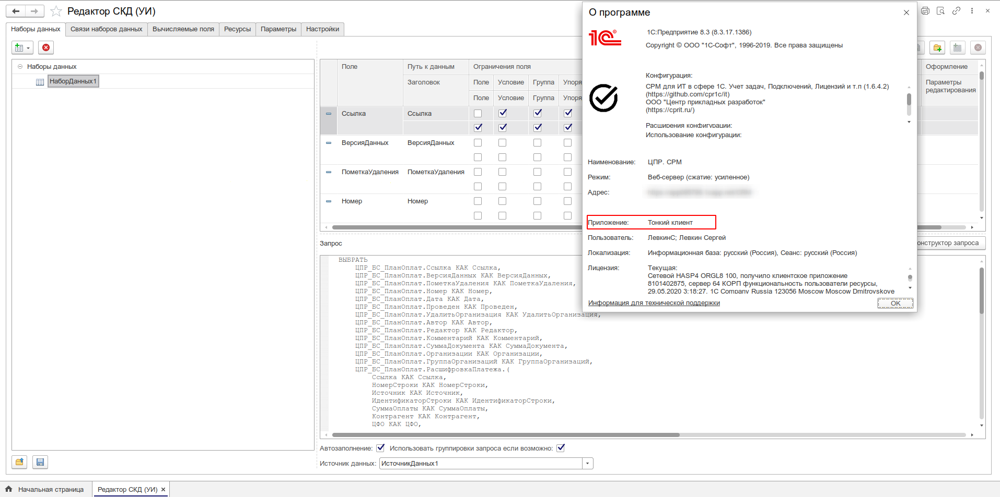

## Что умеет

Инструмент реализует основные функции и механики конструктора схемы компоновки данных из конфигуратора. На данный момент не реализованными остаются только работа с макетами и вложенными схемами. Данные функции будут реализованы в будущих релизах.

### Добавление набора данных

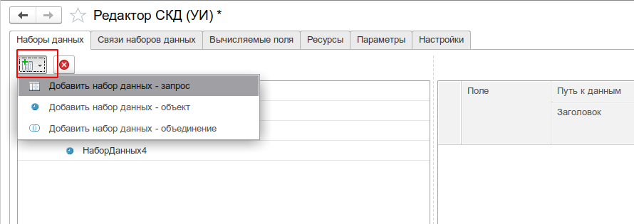

**Набор данных — запрос**

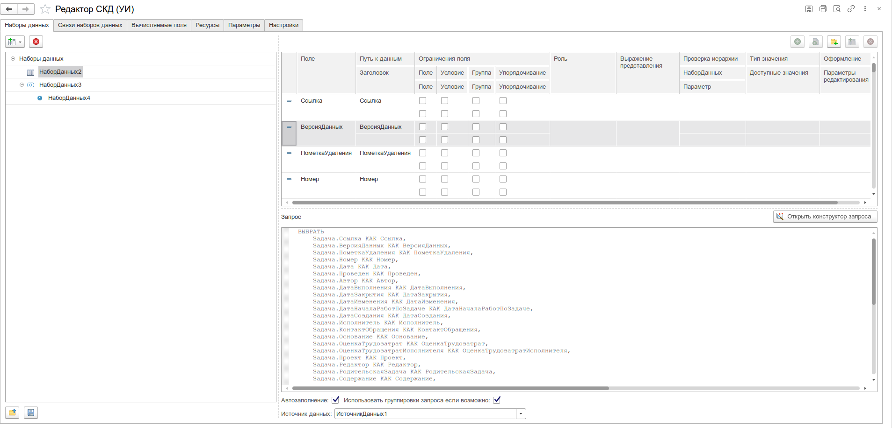

**Набор данных — объект**

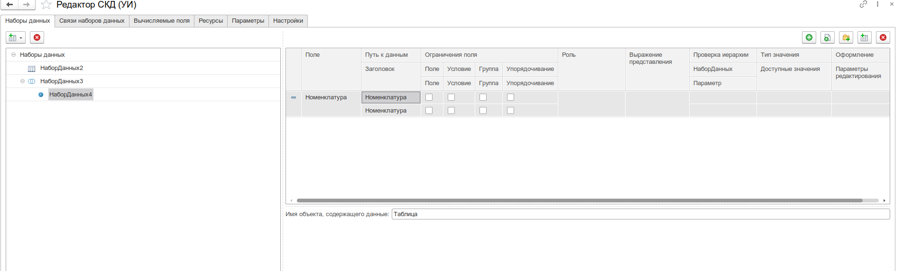

**Редактирование роли поля набора данных**

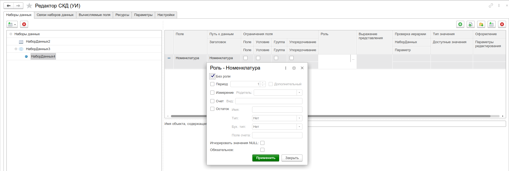

**Редактирование типа значения поля**

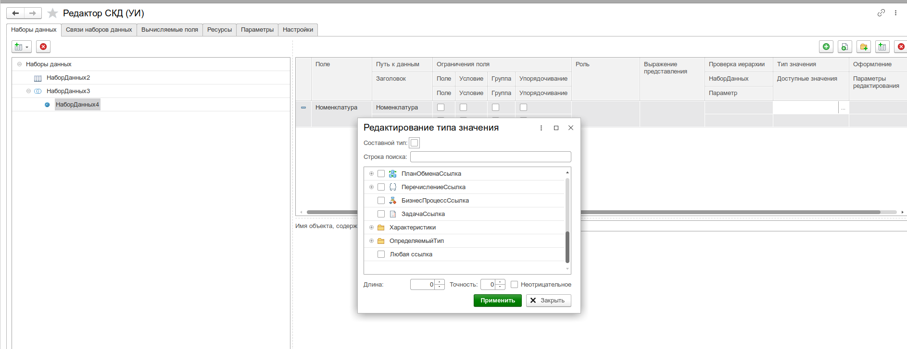

**Редактор оформления поля**

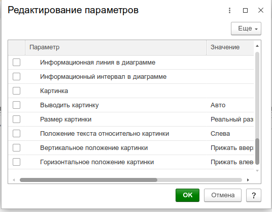

**Связи наборов данных**

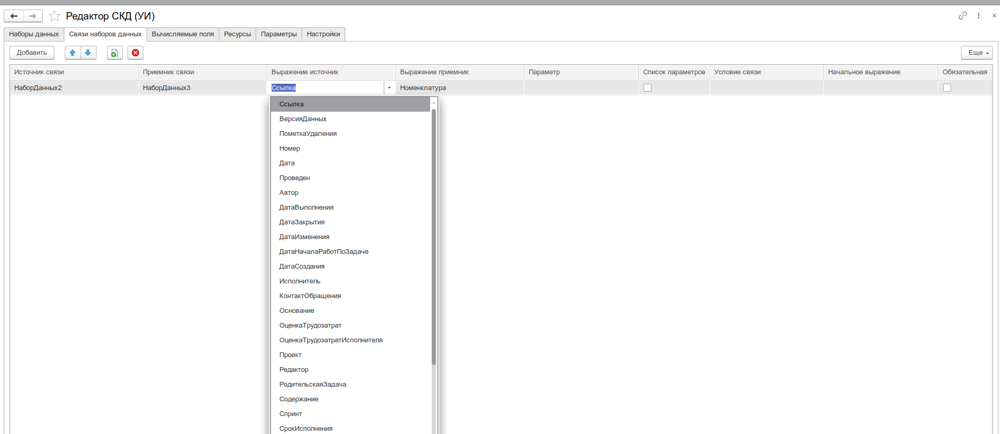

**Вычисляемые поля СКД**

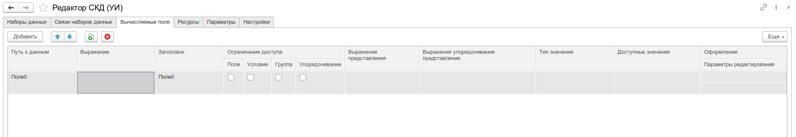

**Редактор выражения вычисляемого поля в отдельном окне**

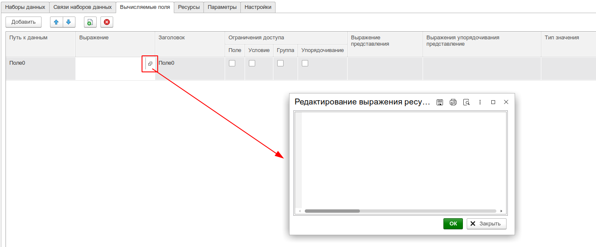

**Ресурсы**

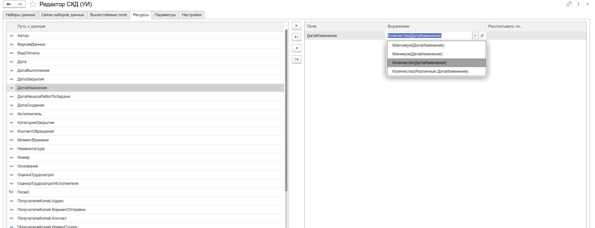

Дополнительно реализовано редактирование выражения ресурса в отдельном окне.

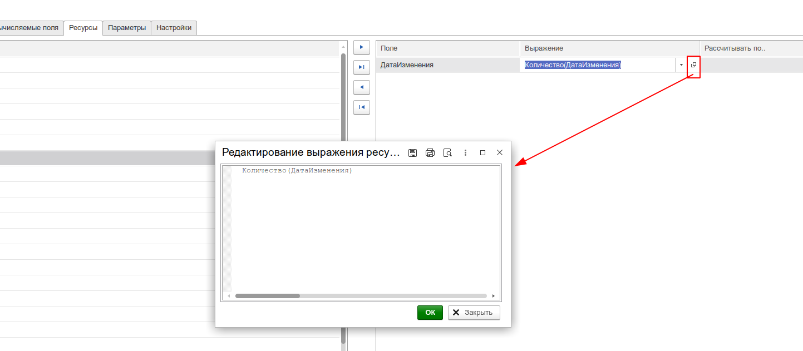

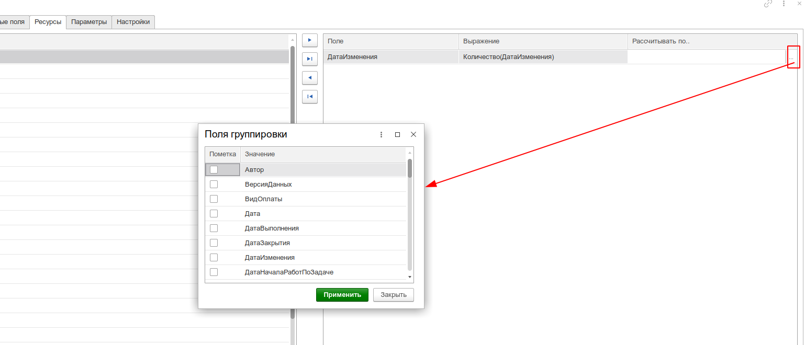

**Параметры**

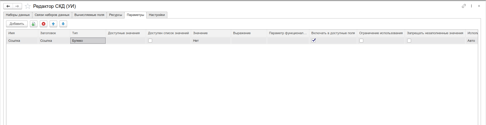

**Настройки**

Реализовано редактирование нескольких вариантов настроек.

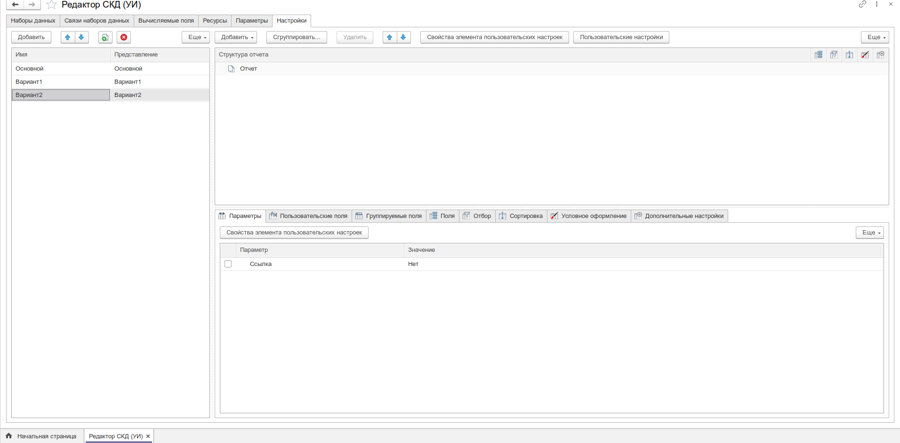

### Сохранение схемы в файл и восстановление

Для этого реализованы соответствующие кнопки на закладке «Наборы данных».

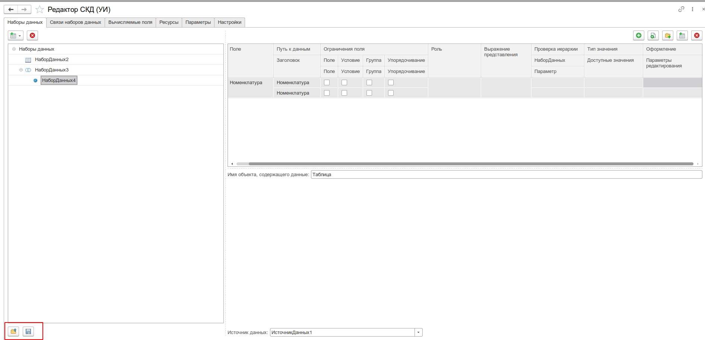

### Редактирование СКД, содержащей макеты и вложенные схемы

Если исходная схема содержала макеты и/или вложенные схемы, их редактирование недоступно. Но данные настройки не затираются в процессе, а сохраняются в первоначальном варианте.

### Интеграция с консолью отчётов

Отладить СКД также можно в тонком клиенте с помощью инструмента «Консоль отчётов». При вызове редактора СКД в толстом клиенте открывается платформенный редактор, а в тонком клиенте — из состава инструментов.

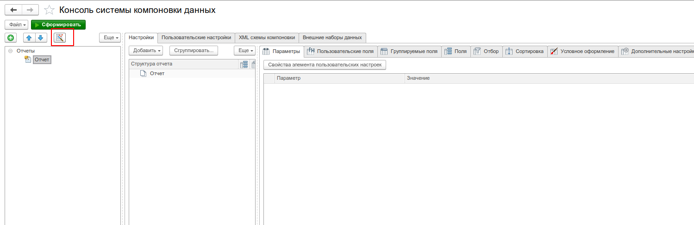

## Связанные разделы

- [Консоль отчётов](/docs/tools/development-tools/report-console) — выполнение готовых компоновок.
- [Консоль запросов](/docs/tools/development-tools/query-console) — подготовка запросов для наборов данных.

## Прочие ссылки

- [Редактор схемы компоновки для тонкого клиента](https://infostart.ru/1c/articles/1398485/) — оригинальная статья на Infostart
