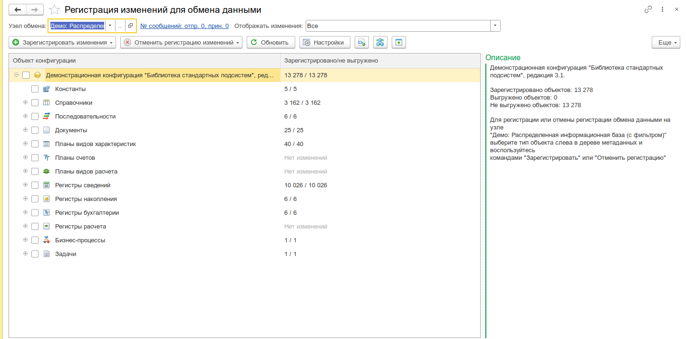
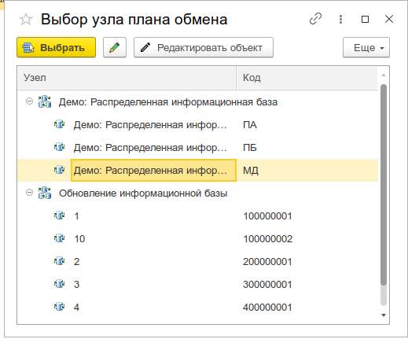
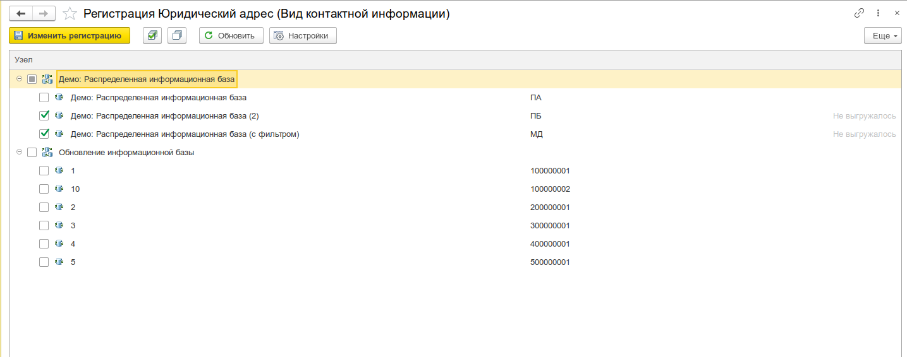
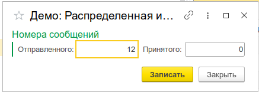

# Регистрация изменений для обмена данными

## Назначение

Инструмент предназначен для **управления регистрацией изменений объектов метаданных** на узлах планов обмена. Предоставляет графический интерфейс для операций, которые штатно выполняются через программные методы [`ПланыОбмена.ЗарегистрироватьИзменения()`](https://v8.1c.ru/platforma/plany-obmena/) и [`ПланыОбмена.УдалитьРегистрациюИзменений()`](https://v8.1c.ru/platforma/plany-obmena/).

---

## Основные возможности

- **Выбор узла обмена** — работа с произвольным узлом любого плана обмена в конфигурации
- **Дерево метаданных** — навигация по структуре конфигурации с отображением количества зарегистрированных изменений по каждому объекту
- **Регистрация/отмена регистрации** — пообъектная, групповая, по отбору, а также массовая по всем объектам метаданных
- **Работа с константами** — добавление и удаление регистрации констант на узле
- **Работа со ссылочными объектами** — добавление регистрации через форму выбора, в том числе с возможностью подбора и по отбору
- **Работа с наборами записей** — регистрация изменений по измерениям регистров
- **Регистрация результата запроса** — выполнение произвольного запроса и регистрация полученных объектов на узле
- **Редактирование номеров сообщений** — просмотр и изменение номеров отправленного/принятого сообщения для узла
- **Просмотр узлов регистрации объекта** — форма, показывающая на каких узлах зарегистрирован конкретный объект
- **Фильтрация по статусу выгрузки** — отображение всех, только выгруженных или только невыгруженных изменений
- **Сериализация результата** — формирование строки для стандартной выгрузки (РИБ) по выделенным объектам

---

## Интерфейс

### Главная форма

_Главная форма инструмента с выбранным узлом обмена и деревом метаданных_

Главная форма состоит из следующих областей:

1. **Шапка формы:**
   - Поле выбора **узла обмена** — выбор узла плана обмена, для которого выполняется регистрация
   - Гиперссылка **«№ сообщений: отпр. \<номер\>, прин. \<номер\>»** — открывает форму редактирования номеров сообщений узла
   - Поле **«Отображать изменения»** — фильтр отображения: «Все», «Только выгруженные», «Только невыгруженные»

2. **Дерево метаданных** (левая панель) — иерархическая структура конфигурации:
   - Корень — имя конфигурации
   - Группы метаданных: Константы, Справочники, Документы, Регистры сведений, Регистры накопления, Регистры бухгалтерии, Регистры расчёта, Планы видов характеристик, Планы счетов, Планы видов расчёта, Последовательности, Бизнес-процессы, Задачи
   - Для каждого объекта отображается количество изменений, выгруженных и невыгруженных записей
   - При выборе узла обмена дополнительно показывается флаг авторегистрации

3. **Панель команд** — кнопки для выполнения операций с регистрацией

4. **Рабочая область** (правая панель) — три вкладки:
   - **Константы** — список констант, зарегистрированных на узле
   - **Ссылки** — список ссылочных объектов, зарегистрированных на узле
   - **Наборы записей** — список наборов записей регистров, зарегистрированных на узле

---

### Форма выбора узла обмена

_Форма выбора узла плана обмена с деревом узлов_

Открывается при выборе узла обмена. Содержит дерево со структурой: план обмена → узлы обмена. Поддерживает одиночный и множественный выбор. Для каждого узла отображается код, номера отправленного/принятого сообщения.

---

### Форма узлов регистрации объекта

_Форма узлов регистрации объекта с деревом узлов и флагами регистрации_

Открывается при выборе команды «Редактирование регистрации изменений объекта» из контекстного меню. Показывает для выбранного объекта все узлы планов обмена, на которых он зарегистрирован. Позволяет:

- Включать/отключать регистрацию на отдельных узлах
- Менять номер сообщения для конкретного узла
- Применять изменения массово: пометить все, снять пометку со всех, инвертировать

---

### Форма номеров сообщений узла

_Форма редактирования номеров сообщений узла обмена_

Позволяет просматривать и редактировать:

- **Номер отправленного сообщения** — счётчик отправленных данных на узел
- **Номер принятого сообщения** — счётчик принятых данных с узла

---

## Работа с инструментом

### Выбор узла обмена

1. Нажмите кнопку выбора в поле «Узел обмена»
2. В открывшейся форме выберите план обмена и узел
3. После выбора узла дерево метаданных автоматически перестроится — будут показаны только объекты, входящие в состав выбранного плана обмена

### Регистрация изменений

**Для констант:**

1. Перейдите на вкладку «Константы»
2. Нажмите «Добавить» — откроется форма выбора констант
3. Выберите одну или несколько констант для регистрации

**Для ссылочных объектов:**

1. Перейдите на вкладку «Ссылки»
2. Используйте одну из команд:
   - **«Добавить»** — стандартный выбор из списка
   - **«Подбор»** — выбор без закрытия формы
   - **«По отбору»** — регистрация по условию отбора
   - **«Регистрация удаления»** — создание пустой ссылки для регистрации удаления объекта

**Для наборов записей:**

1. Перейдите на вкладку «Наборы записей»
2. Используйте команду «Добавить по отбору» для регистрации по измерениям

**Массовые операции:**

- **«Зарегистрировать все» / «Отменить все»** — для всех объектов выбранного типа метаданных
- **«Зарегистрировать авто» / «Отменить авто»** — только для объектов с разрешённой авторегистрацией

### Регистрация результата запроса

1. Нажмите «Зарегистрировать результат запроса» или «Отменить регистрацию результата запроса»
2. В открывшейся консоли запросов выполните произвольный запрос
3. Результат будет зарегистрирован на выбранном узле

### Редактирование номера сообщения

Для изменения номера сообщения конкретного объекта:

1. Выделите строку в списке констант, ссылок или наборов записей
2. Нажмите «Редактировать номер сообщения» или дважды кликните по полю номера
3. Введите новое значение номера сообщения

### Просмотр узлов регистрации объекта

1. Выделите объект в дереве метаданных
2. Нажмите «Редактировать регистрацию на узлах»
3. В открывшейся форме отобразится дерево всех узлов с флагами регистрации для выбранного объекта

### Сериализация для РИБ

1. Выделите одну или несколько строк в списке констант, ссылок или наборов записей
2. Нажмите «Показать результат выгрузки (РИБ)»
3. Будет сформирован текст в формате, понятном стандартным механизмам выгрузки РИБ
