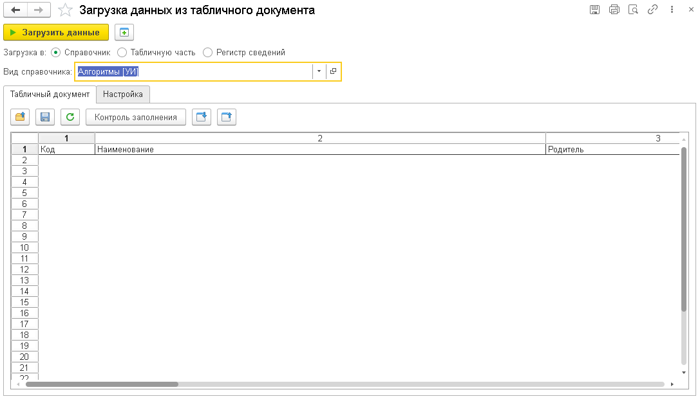
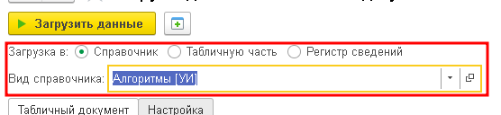
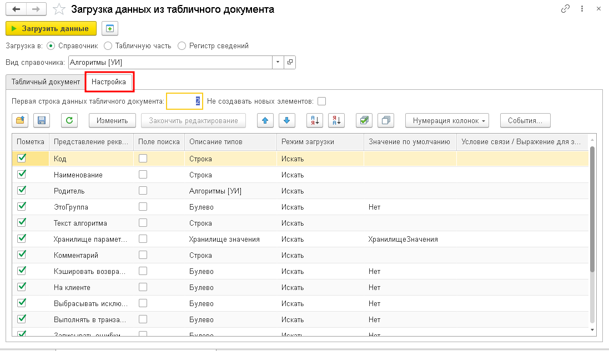
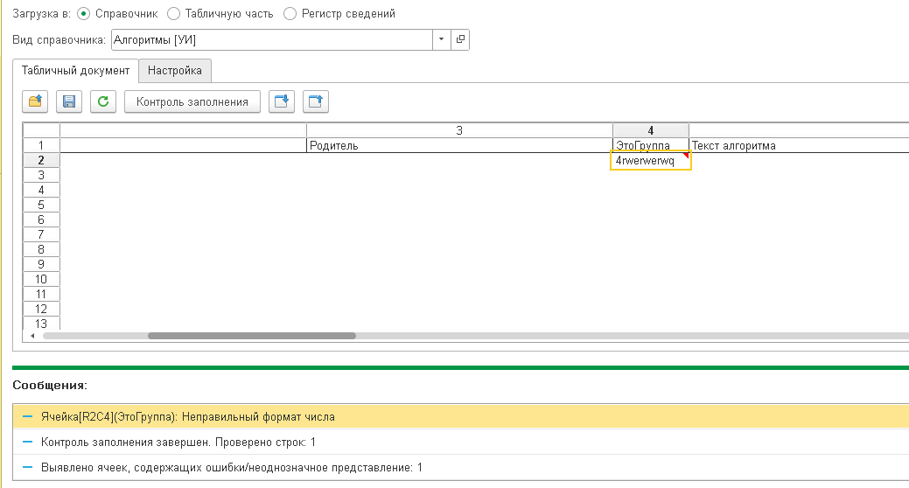

# Загрузка данных из табличного документа

Загрузка данных в справочники, табличные части и регистры сведений из табличного документа.

:::info
Форк обработки [Загрузка данных из табличного документа](https://infostart.ru/public/269425/). [Разрешение автора](http://forum.infostart.ru/forum15/topic107643/message2397121/#message2397121)
:::



## Назначение

Инструмент предназначен для массового импорта данных из табличных документов в различные объекты метаданных 1С. Позволяет:

- Загружать данные в справочники (создание и обновление элементов)
- Заполнять табличные части документов и справочников
- Записывать движения в регистры сведений
- Выполнять загрузку из файлов форматов MXL, XLS, XLSX, TXT, DBF
- Гибко настраивать сопоставление колонок источника реквизитам приёмника
- Искать существующие элементы по ключевым полям для предотвращения дублей
- Контролировать корректность данных перед записью

## Особенности

- Три режима загрузки: справочник, табличная часть, регистр сведений
- Поддержка пяти форматов исходных файлов
- Три режима привязки реквизитов: поиск, установка, вычисление
- Автоматическое определение и приведение типов данных (числа, даты, строки, булево, ссылки)
- Поиск существующих элементов по нескольким полям
- Поддержка иерархии справочников (группы и элементы)
- Поддержка владельцев и подчинённых справочников
- Поддержка связи по типу (планы счетов, субконто)
- Контроль заполнения с визуальными примечаниями
- Навигация по примечаниям (предыдущее/следующее)
- Сохранение и восстановление настроек привязки
- События с произвольным кодом: перед записью, при записи, после добавления строки
- Автосохранение последних настроек при закрытии формы
- Указание вручную стартовой строки данных

## Быстрый старт

1. Откройте меню **Универсальные инструменты → Загрузка данных из ТД**
2. Выберите режим загрузки: **Справочник**, **Табличную часть** или **Регистр сведений**
3. Укажите приёмник данных (вид справочника, объект-владелец с табличной частью или вид регистра)
4. Нажмите **Открыть** и выберите файл исходных данных
5. Настройте привязку колонок — сопоставьте колонки файла реквизитам приёмника
6. Нажмите **Контроль заполнения** для проверки данных
7. Выполните загрузку

## Режимы загрузки



### Справочник

Загрузка данных в справочник с возможностью создания новых и обновления существующих элементов. Поддерживается:

- Выбор вида справочника через поле с выбором типа
- Создание групп и элементов (флаг «Создавать группы»)
- Поиск существующих элементов по полям (Наименование, Код, артикул и др.)
- Заполнение всех реквизитов справочника, включая подчинённые

### Табличная часть

Загрузка данных в табличную часть документа или справочника. Необходимо указать:

- Ссылку на объект-владелец (документ или элемент справочника)
- Имя табличной части

Данные будут добавлены в указанную табличную часть выбранного объекта.

### Регистр сведений

Загрузка данных в регистр сведений (периодический или непериодический). Для периодических регистров требуется указание даты/периода в одном из полй загрузки.

## Поддерживаемые форматы файлов

- **MXL** — встроенный формат табличного документа 1С
- **XLS / XLSX** — файлы Microsoft Excel (чтение через COM-соединение с Excel)
- **TXT** — текстовые файлы с разделителями (разделитель настраивается, по умолчанию табуляция)
- **DBF** — файлы баз данных dBASE (через COM-соединение с Excel или нативный XBase)

## Настройка привязки колонок



После открытия файла становится доступна таблица настройки реквизитов. Каждая строка — один реквизит приёмника со следующими параметрами:

| Колонка               | Назначение                                            |
| --------------------- | ----------------------------------------------------- |
| Пометка               | Включение/исключение реквизита из загрузки            |
| Представление         | Представление реквизита метаданных                    |
| Имя                   | Имя реквизита                                         |
| Поле поиска           | Флаг — реквизит участвует в поиске дублей             |
| Описание типов        | Тип данных реквизита                                  |
| Режим загрузки        | Способ заполнения: Искать / Устанавливать / Вычислять |
| Номер колонки         | Номер колонки из исходного файла                      |
| Значение по умолчанию | Значение, если колонка не указана                     |
| Искать по             | Вид поиска: «Точное совпадение» или «Содержит»        |
| Связь по владельцу    | Владелец для подчинённых справочников                 |
| Связь по типу         | Вид субконто / план счетов для связи по типу          |
| Элемент связи по типу | Конкретный элемент связи по типу                      |

### Режимы заполнения реквизитов

- **Устанавливать** — значение берётся из соответствующей колонки исходного файла и подставляется в реквизит
- **Искать** — выполняется поиск существующего элемента в справочнике по значению из колонки; если элемент найден, в реквизит подставляется ссылка на него
- **Вычислять** — значение вычисляется на сервере в обработчике события «При запросе вычисляемого выражения»

### Поиск существующих элементов

Для поиска дублей можно пометить одно или несколько полей как «Поле поиска». При загрузке будет выполнен запрос к базе данных:

- Если элемент найден — он будет обновлён (или пропущен, если установлен флаг «Не создавать новых элементов»)
- Если элемент не найден — будет создан новый
- Поиск поддерживает два режима: точное совпадение и «Содержит»

### Связь по владельцу и по типу

- **Связь по владельцу** — для подчинённых справочников указывает, из какого поля загрузки брать владельца
- **Связь по типу** — для планов счетов и видов субконто позволяет указать вид субконто и конкретный элемент связи по типу

## Контроль заполнения и навигация по ошибкам



Перед записью данных рекомендуется выполнить контроль заполнения (кнопка **Контроль заполнения**). Инструмент проверяет:

- Заполнение обязательных реквизитов
- Корректность типов данных
- Корректность ссылочных значений
- Наличие дублей по ключевым полям

Результаты отображаются в виде примечаний в строках таблицы. Для навигации используйте кнопки **Следующее примечание** / **Предыдущее примечание**.

## Сообщения и события

Инструмент поддерживает три события, в которых можно выполнить произвольный код 1С:

- **Перед записью** — выполняется перед началом записи данных на сервере. В обработчике доступны: `Объект.ТаблицаЗагружаемыхРеквизитов` (настройки привязки) и `Объект.ДанныеПередЗаписью` (таблица значений с данными текущего элемента)
- **При записи** — выполняется в момент записи каждого элемента. Доступен объект `Объект.ДанныеПриЗаписи` с данными текущей строки
- **После добавления строки** — выполняется после добавления строки в приёмник. Доступен объект `Объект.ДанныеПослеДобавленияСтроки` с данными добавленной строки

Код для событий указывается в полях на форме настроек.

## Сохранение и восстановление настроек

Настройки привязки можно сохранять и восстанавливать:

- **В файл** — кнопки «Сохранить значения в файл» / «Восстановить значения из файла». Позволяет перенести настройки между базами
- **В хранилище** — кнопки «Сохранить значения» / «Восстановить значения». Сохраняет настройки для текущего пользователя (автосохранение при закрытии формы)

## Программный вызов

### Открытие формы из кода

```bsl
УИ_ОбщегоНазначенияКлиент.ОткрытьФормуЗагрузкиДанныхИзТабличногоДокумента();
```

### Загрузка данных из кода

```bsl
Обработка = Обработки.УИ_ЗагрузкаДанныхИзТабличногоДокумента.Создать();

// Настройка режима (0 - Справочник, 1 - Табличная часть, 2 - Регистр сведений)
Обработка.РежимЗагрузки = 0;

// Указание приёмника
Обработка.ТипОбъектаСправочника = "Справочник.Номенклатура";

// Настройка привязки колонок
Колонка = Обработка.ТаблицаЗагружаемыхРеквизитов.Добавить();
Колонка.Имя = "Наименование";
Колонка.РежимЗагрузки = 1; // Устанавливать
Колонка.НомерКолонки = 1;

Колонка = Обработка.ТаблицаЗагружаемыхРеквизитов.Добавить();
Колонка.Имя = "Код";
Колонка.РежимЗагрузки = 2; // Искать
Колонка.НомерКолонки = 2;
Колонка.ПолеПоиска = Истина;

// Инициализация и выполнение
Обработка.ИнициализироватьПараметрыЗагрузкиПоРеквизитам();
Обработка.ВыполнитьЗагрузку();
```

## Связанные разделы

- [Консоль запросов](/docs/tools/development-tools/query-console) — разработка и отладка запросов
- [Загрузка данных из табличного документа](./create-settings) — пошаговый сценарий создания настроек
