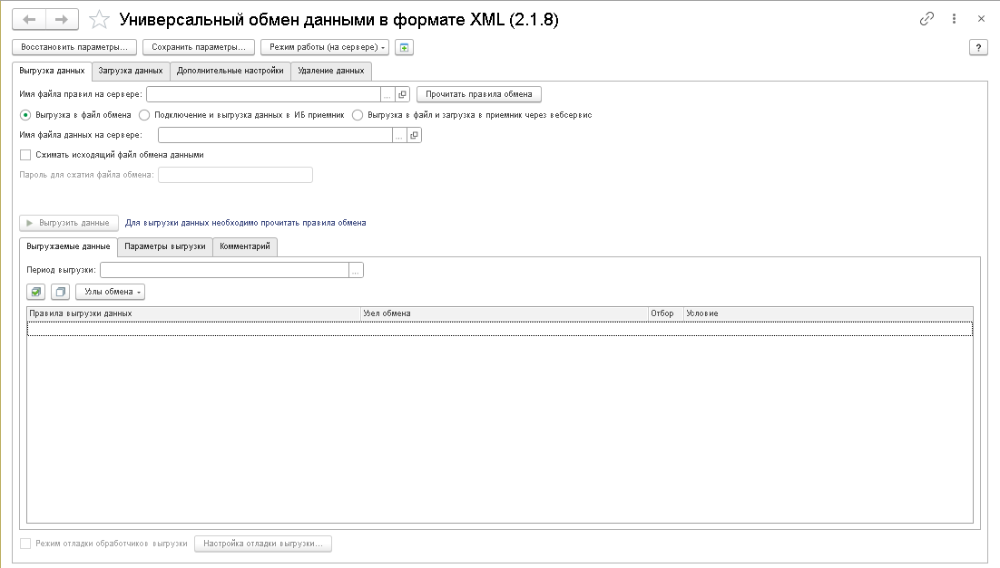
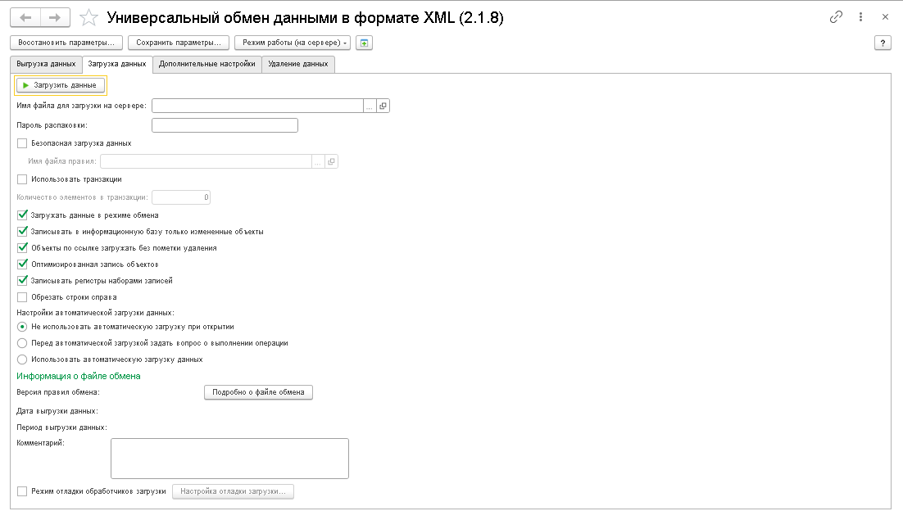
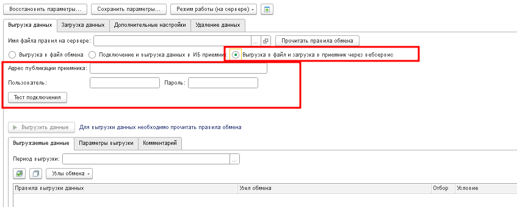

# Универсальный обмен данными в формате XML

Выгрузка и загрузка данных по правилам обмена между конфигурациями 1С.

:::info
Форк типовой обработки «Универсальный обмен данными в формате XML» от 1С и доработки [sir-job](https://infostart.ru/user/567609/) (https://infostart.ru/public/1176839/). [Разрешение автора](https://github.com/cpr1c/tools_ui_1c/issues/139).
:::

## Назначение

Инструмент предназначен для **обмена данными между информационными базами 1С по правилам обмена** — штатному механизму платформы, используемому в планах обмена и типовых конфигурациях. В отличие от инструмента [«Выгрузка загрузка XML с фильтрами»](../xml-upload-download), данный инструмент работает **по правилам конвертации** (файлы `XML` правил обмена), что позволяет переносить данные между базами с **различающейся структурой метаданных**.

**Области применения:**

- Настройка и выполнение синхронизации данных по правилам обмена
- Перенос данных между базами с разной структурой метаданных (конвертация объектов и полей)
- Отладка правил конвертации объектов (ПКО) и правил конвертации свойств (ПКС)
- Разовые миграции данных с обработчиками событий обмена

## Основные возможности

- **Полноценная поддержка правил обмена** — загрузка правил конвертации из файла (`XML`), работа с ПКО, ПКС, ПВД, ПОД, алгоритмами и обработчиками событий
- **Три режима выгрузки:**
  - **В файл** — классическая выгрузка в XML-файл
  - **В файловую ИБ-приёмник** — прямая выгрузка в файловую базу 1С (клиент-серверное подключение)
  - **Через HTTP-сервис** — выгрузка в базу-приёмник через HTTP-сервис `/hs/tools-ui-1c/exchange` (инструмент «Публикуемые функции»)
- **Фильтрация объектов выгрузки** — настройка отборов и параметров правил выгрузки данных
- **Отладка алгоритмов обмена** — три режима отладки: без отладки, процедурный вызов, непосредственная вставка кода в обработчик
- **Внешние обработчики событий** — подключение внешней обработки с обработчиками событий для кастомной логики
- **Автоматическая загрузка** — настройка автоматической загрузки данных при открытии обработки
- **Сжатие файла обмена** — архивация файла обмена с поддержкой пароля
- **Транзакционная выгрузка/загрузка** — настройка количества объектов на транзакцию, использование транзакций для планов обмена
- **Работа с планами обмена** — интеграция с узлами планов обмена, удаление регистрации изменений после выгрузки
- **Протоколирование** — детальный протокол обмена с информационными сообщениями и сообщениями об ошибках

---

## Интерфейс

### Главная форма

_Главная форма инструмента с вкладками выгрузки и загрузки, настройками правил обмена и параметрами подключения_



#### 1. Панель переключения режима

В верхней части формы расположены основные вкладки:

- **«Выгрузка»** — настройка и выполнение выгрузки данных
- **«Загрузка»** — настройка и выполнение загрузки данных

А также дополнительные страницы:

- **«Удаляемые данные»** — настройка правил очистки данных (ПОД)
- **«Параметры»** — таблица параметров обмена для передачи значений в правила конвертации
- **«Регистрация изменений»** — управление узлами планов обмена

#### 2. Параметры выгрузки

- **«Имя файла правил»** — путь к файлу правил обмена (XML)
- **«Имя файла данных» / «Имя файла обмена»** — путь к файлу выгружаемых данных или каталог ИБ-приёмника
- **«Период выгрузки»** — даты начала и окончания для фильтрации выгружаемых данных
- **«Режим выгрузки»** — выбор режима:
  - _Выгрузка в файл_ (по умолчанию) — создание XML-файла данных
  - _Выгрузка в ИБ-приёмник_ — прямая запись в файловую базу 1С (требуется указать каталог базы, пользователя, пароль)
  - _Выгрузка через веб-сервис_ — передача данных через HTTP-сервис (требуется указать адрес публикации приёмника)
- **«Архивировать файл»** — сжатие файла обмена в ZIP
- **«Пароль для сжатия / распаковки»** — пароль на ZIP-архив файла обмена

#### 3. Дерево правил выгрузки

Центральный элемент — дерево объектов метаданных, для которых настроены правила выгрузки:

- Отображает иерархию: тип объекта → объект метаданных
- Флаг «Включить» — признак участия в выгрузке
- Колонки с настройками отборов и параметров для каждого объекта

#### 4. Панель дополнительных настроек выгрузки

Содержит:

- **«Безопасный режим»** — исполнение алгоритмов в безопасном режиме
- **«Выводить в окно сообщений»** — информационные сообщения
- **«Выводить в протокол»** — логирование информационных сообщений и ошибок
- **«Использовать транзакции»** — групповая запись объектов в транзакциях
- **«Использовать транзакции для планов обмена»** — транзакционная выгрузка по планам обмена
- **«Вести дополнительный контроль записи в XML»** — автоматическое удаление недопустимых символов

#### 5. Вкладка загрузки

_Вкладка загрузки с настройками режима загрузки, протоколом и параметрами подключения_



- **«Имя файла правил»** — файл правил обмена (может не требоваться, если правила встроены в файл данных)
- **«Имя файла обмена»** — путь к файлу данных для загрузки
- **«Безопасная загрузка»** — загрузка по правилам из отдельного файла
- **«Загружать данные в режиме обмена»** — при установке флага для загружаемых объектов устанавливается `ОбменДанными.Загрузка = Истина`
- **«Обрезать строки справа»** — удаление пробелов справа при загрузке строк
- **«Записывать регистры наборами записей»** — пакетная запись регистров
- **«Продолжить загрузку при возникновении ошибки»** — обработка ошибок без прерывания
- **Итоги регистров** — кнопки «Отключить итоги» / «Включить итоги» для ускорения загрузки больших объёмов

#### 6. Параметры подключения ИБ-приёмника

При выборе режима **«Выгрузка в ИБ-приёмник»** или **«Выгрузка через веб-сервис»** становятся доступными поля:

- **Адрес публикации приёмника** — URL веб-сервиса (для HTTP-режима)
- **Тип ИБ** — файловая / клиент-серверная
- **Каталог ИБ / сервер + имя базы** — параметры подключения
- **Пользователь / Пароль** — учётные данные для подключения к базе-приёмнику
- **Версия платформы** — версия платформы 1С базы-приёмника
- **Аутентификация Windows** — использование NTLM-аутентификации

_Панель настройки подключения к базе-приёмнику при прямой выгрузке_



#### 7. Отладка алгоритмов

Инструмент содержит три режима отладки алгоритмов обмена:

| Режим                                   | Описание                                                     |
| --------------------------------------- | ------------------------------------------------------------ |
| **0 — Без отладки**                     | Штатное выполнение алгоритмов                                |
| **1 — Процедурный вызов**               | Вызов алгоритмов как процедур с отслеживанием                |
| **2 — Процедурный вызов с параметрами** | Вызов обработчиков с передачей параметров                    |
| **3 — Непосредственная вставка кода**   | Подстановка кода алгоритма непосредственно в код обработчика |

Режим отладки позволяет разработчику правил обмена пошагово проверить корректность алгоритмов конвертации.

---

## Работа с инструментом

### Подготовка к обмену

Перед началом обмена необходимо подготовить **файл правил обмена** — XML-файл, содержащий правила конвертации объектов (ПКО), правил конвертации свойств (ПКС), правил выгрузки данных (ПВД), правил очистки данных (ПОД), а также алгоритмы и обработчики событий обмена. Правила создаются в конфигураторе через меню «Конвертация данных» или в специализированных конфигурациях (например, «Конвертация данных 2.0/2.1»).

### Выгрузка данных

1. Переключитесь на вкладку **«Выгрузка»**
2. Укажите **файл правил обмена**
3. Выберите **режим выгрузки**:
   - _В файл_ — укажите путь к выходному XML-файлу
   - _В ИБ-приёмник_ — укажите каталог файловой базы, пользователя и пароль
   - _Через веб-сервис_ — укажите адрес публикации (например, `http://server/base`), настройте аутентификацию
4. При необходимости задайте **период выгрузки**
5. Настройте **параметры правил выгрузки** и **отборы** в дереве правил
6. Нажмите **«Выгрузить данные»**
7. После завершения откроется **протокол обмена** с детальной информацией

### Загрузка данных

1. Переключитесь на вкладку **«Загрузка»**
2. Укажите **файл правил обмена** (или снимите флаг, если правила встроены в файл данных)
3. Укажите **файл данных** для загрузки
4. Настройте параметры загрузки:
   - **Режим обмена данными** — установить `ОбменДанными.Загрузка`
   - **Продолжать при ошибках** — не прерывать загрузку при ошибках записи
   - **Итоги регистров** — отключить для ускорения
5. Нажмите **«Загрузить данные»**

### Прямая выгрузка через HTTP-сервис

Инструмент поддерживает прямую выгрузку данных через HTTP-сервис `/hs/tools-ui-1c/exchange`, который предоставляется HTTP-сервисом **УИ_ПубликуемыеФункции** (входит в состав подсистемы). Для использования:

1. Убедитесь, что база-приёмник опубликована на веб-сервере и HTTP-сервис активен
2. В обработке выберите режим **«Выгрузка через веб-сервис»**
3. Укажите **адрес публикации приёмника** (например, `http://server/ib-base`)
4. Настройте аутентификацию (пользователь/пароль)
5. Нажмите **«Тест подключения к веб-сервису»** для проверки доступности
6. Выполните выгрузку — данные будут переданы на приёмник и загружены автоматически

Работа HTTP-сервиса осуществляется по протоколу `POST` — файл данных передаётся в теле запроса, на стороне приёмника создаётся сессия обработки `УИ_УниверсальныйОбменДаннымиXML`, выполняющая загрузку.

### Работа с планами обмена

На вкладке **«Регистрация изменений»** доступны:

- Выбор узла плана обмена
- Выгрузка изменений, зарегистрированных для узла
- Тип удаления регистрации изменений после выгрузки:
  - Не удалять
  - Удалять успешно выгруженные
  - Удалять все (включая не прошедшие выгрузку)
  - Удалять кроме не выгруженных по ошибке
- Количество объектов в транзакции при выгрузке для планов обмена

---

## Программный интерфейс

### Открытие обработки из кода

```bsl
Обработка = Обработки.УИ_УниверсальныйОбменДаннымиXML.Создать();
Обработка.РежимОбмена = "Выгрузка"; // или "Загрузка"
Обработка.ИмяФайлаПравилОбмена = "C:\rules.xml";
Обработка.ИмяФайлаОбмена = "C:\data.xml";
Обработка.ДатаНачала = '20240101';
Обработка.ДатаОкончания = '20240630';
Обработка.ВыполнитьВыгрузку();
```

### Программная загрузка

```bsl
Обработка = Обработки.УИ_УниверсальныйОбменДаннымиXML.Создать();
Обработка.РежимОбмена = "Загрузка";
Обработка.ИмяФайлаОбмена = "C:\data.xml";
Обработка.ЗагружатьДанныеВРежимеОбмена = Истина;
Обработка.ВыполнитьЗагрузку();
```

### Вызов HTTP-сервиса обмена

```bsl
Адрес = "http://server/base/hs/tools-ui-1c/exchange";
Результат = УИ_КоннекторHTTP.Post(Адрес, ДвоичныеДанныеФайлаОбмена);
```

---

## Формат файлов

- **Файл правил обмена** — XML-файл, содержащий правила конвертации (ПКО, ПКС, ПВД, ПОД), алгоритмы и обработчики событий. Полностью совместим со стандартным форматом правил обмена 1С
- **Файл данных обмена** — XML-файл с сериализованными данными, сжатый или обычный. Также может быть упакован в ZIP-архив. Формат соответствует механизму сериализации платформы 1С:Предприятие

---

## Связанные инструменты

- [Выгрузка загрузка XML с фильтрами](../xml-upload-download) — перенос данных между однородными базами без правил обмена, с гибкими отборами и фильтрацией
- [Регистрация изменений для обмена данными](../change-registration) — управление регистрацией объектов на узлах планов обмена
