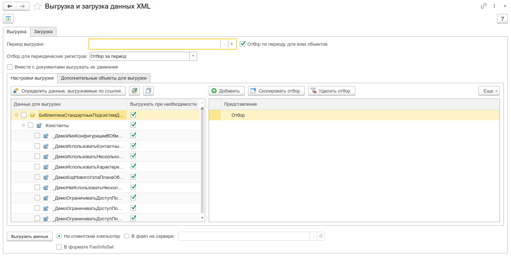
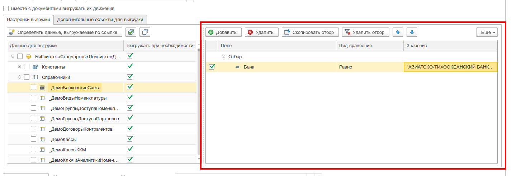
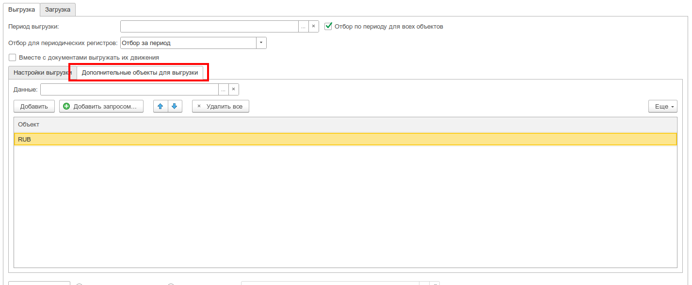
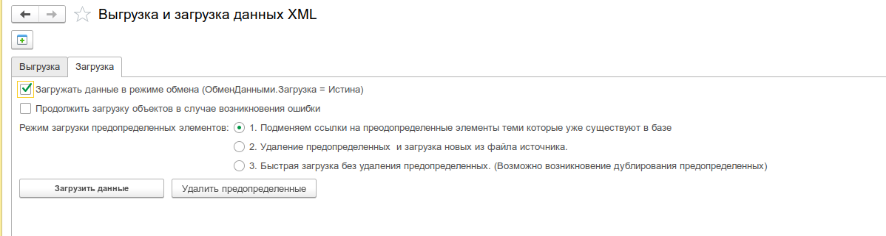

# Выгрузка загрузка XML с фильтрами

:::info
Форк обработки [«Выгрузка-загрузка данных XML 8.3»](https://infostart.ru/1c/tools/1149722/) от пользователя Infostart [sir-job](https://infostart.ru/user/567609/). [Разрешение автора](http://forum.infostart.ru/forum15/topic229143/message2372663/#message2372663).
:::

## Назначение

Инструмент предназначен для **переноса данных между однородными информационными базами 1С** в формате XML. Позволяет гибко настраивать состав выгружаемых данных: от полной выгрузки всей базы до частичной — с отбором по конкретным объектам метаданных, реквизитам, периоду и ссылочной целостности.

Формат файла выгрузки совместим со стандартным механизмом XML-сериализации платформы 1С:Предприятие 8.3. В основе выгрузки/загрузки используется тот же механизм, что и в планах обмена, что обеспечивает корректную передачу данных между идентичными конфигурациями.

**Области применения:**

- Создание полных и частичных резервных копий данных
- Перенос данных между однородными базами (например, из тестовой в рабочую)
- Восстановление проблемных информационных баз
- Выгрузка отдельных фрагментов данных для анализа или передачи

---

## Основные возможности

- **Два режима работы** — выгрузка (создание XML-файла) и загрузка (чтение и запись данных из файла)
- **Дерево метаданных** — иерархический выбор объектов для выгрузки с двумя типами пометок: «Выгружать» и «Выгружать при необходимости» (по ссылке)
- **Автоматический расчёт ссылочной целостности** — кнопка «Определить данные, выгружаемые по ссылке» анализирует, на какие объекты могут ссылаться выгружаемые данные, и проставляет флаги «Выгружать при необходимости»
- **Многоуровневые отборы** — индивидуальные отборы по реквизитам для каждого объекта метаданных (включая отборы по вложенным ссылкам)
- **Фильтрация по периоду** — ограничение выгрузки по дате для документов и периодических регистров
- **Отбор для периодических регистров** — четыре режима: за период, срез последних, срез первых, срез последних + изменения за период
- **Выгрузка движений документов** — опция включения движений вместе с документами
- **Дополнительные объекты для выгрузки** — возможность добавить конкретные ссылки на объекты через форму выбора или произвольный запрос
- **Формат FastInfoSet (.fi)** — поддержка бинарного формата для ускорения выгрузки/загрузки больших объёмов данных
- **Три режима загрузки предопределённых данных** — подмена ссылок, удаление и загрузка новых, быстрая загрузка без удаления
- **Управление итогами регистров** — возможность отключения/включения использования итогов при загрузке для ускорения
- **Проверка на недопустимые символы** — выявление объектов, содержащих символы, недопустимые в XML
- **Сохранение и восстановление настроек** — форма сохраняет состояние дерева метаданных, отборов и параметров между сеансами

---

## Интерфейс

### Главная форма

_Главная форма инструмента с деревом метаданных и панелью настройки выгрузки_

Главная форма состоит из следующих областей:

#### 1. Панель переключения режима

В верхней части формы расположены две вкладки:

- **«Выгрузка»** — режим создания файла с данными
- **«Загрузка»** — режим чтения файла и записи данных в ИБ

#### 2. Параметры выгрузки (вкладка «Выгрузка»)

- **«Имя файла»** — путь к файлу выгрузки. Поддерживаются форматы `.xml` и `.fi` (FastInfoSet). При смене расширения автоматически переключается флаг «Использовать формат FastInfoSet»
- **«Использовать формат FastInfoSet»** — флаг для выбора бинарного формата (`.fi`), который обеспечивает более быструю запись и чтение больших объёмов данных
- **«Период выгрузки»** — даты начала и окончания для ограничения выгружаемых данных по периоду
- **«Отбор по периоду для всех объектов»** — если флаг установлен, ограничение по дате применяется ко всем объектам, включая справочники и регистры. Если снят — только к документам и периодическим регистрам
- **«Отбор для периодических регистров»** — выбор режима выгрузки периодических регистров сведений:
  - _Отбор за период_ — все записи за указанный период
  - _Срез последних на дату окончания_ — актуальные записи на конец периода
  - _Срез первых на дату начала_ — записи на начало периода
  - _Срез последних на дату начала + изменения за период_ — комбинированный режим
- **«Вместе с документами выгружать их движения»** — при установке флага вместе с каждым документом выгружаются его движения по регистрам

#### 3. Дерево метаданных

Центральный элемент формы — иерархическое дерево, отображающее структуру метаданных конфигурации:

- **Группы объектов:** Константы, Справочники, Документы, Регистры сведений, Регистры накопления, Регистры бухгалтерии, Регистры расчёта, Планы видов характеристик, Планы счетов, Планы видов расчёта, Последовательности, Бизнес-процессы, Задачи
- **Колонка «Выгружать»** — флаг полной выгрузки всех объектов данного типа
- **Колонка «Выгружать при необходимости»** — флаг выгрузки объектов данного типа только по ссылке (для обеспечения ссылочной целостности)
- Флаги имеют тройное состояние (включён/выключен/частично), которое автоматически обновляется при изменении вложенных элементов

**Командная панель дерева:**

- **«Определить данные, выгружаемые по ссылке»** — автоматический анализ и простановка флагов «Выгружать при необходимости» для объектов, на которые могут ссылаться выбранные данные
- **«Отметить выделенные» / «Снять выделенные»** — массовые операции с флагами для выделенных строк
- **«Скопировать отбор»** — копирование настроек отбора с текущего объекта на другие объекты того же типа

#### 4. Панель отборов (СКД)

_Панель настройки отборов для выбранного объекта метаданных_

При активации строки в дереве метаданных в нижней части формы отображается панель настройки отборов на основе системы компоновки данных (СКД). Позволяет:

- Устанавливать произвольные условия отбора по любому реквизиту объекта
- Использовать все виды сравнения: Равно, Не равно, Больше, Меньше, В списке, Содержит, Заполнено и др.
- Создавать группы отборов с логическими условиями «И» / «ИЛИ»
- Отборы сохраняются индивидуально для каждого объекта метаданных

#### 5. Таблица дополнительных объектов для выгрузки

_Таблица дополнительных объектов, добавленных для выгрузки_

Позволяет добавить конкретные ссылки на объекты для выгрузки:

- **«Добавить»** — выбор объектов через стандартную форму выбора
- **«Добавить из запроса»** — открывает консоль запросов для выборки объектов по произвольному условию
- **«Очистить»** — удаление всех дополнительных объектов

#### 6. Параметры загрузки (вкладка «Загрузка»)

_Вкладка загрузки с настройками режима загрузки предопределённых данных_

- **«Имя файла»** — путь к файлу для загрузки
- **«Режим загрузки предопределённых»** — выбор стратегии обработки предопределённых элементов:
  - _Подмена ссылок на предопределённые_ (стандартный) — формируется таблица соответствия предопределённых элементов, идентификаторы в файле заменяются на существующие в базе. Требует наличия предопределённых элементов в выгрузке
  - _Удаление предопределённых и загрузка новых_ — старые предопределённые удаляются, создаются новые с идентификаторами из файла выгрузки. Подходит для загрузки в пустую базу
  - _Быстрая загрузка без удаления предопределённых_ — максимально быстрый режим, чтение выполняется за один проход. Возможно дублирование предопределённых элементов. Рекомендуется для больших (многогигабайтных) баз
- **«При загрузке использовать режим обмена данными»** — при установке флага у загружаемых объектов устанавливается свойство `ОбменДанными.Загрузка = Истина`
- **«Продолжить загрузку при возникновении ошибки»** — если флаг установлен, загрузка не прерывается при ошибках записи отдельных объектов
- **«Включить возможность редактирования использования итогов»** — при установке становятся доступны кнопки «Отключить итоги» и «Включить итоги» для ручного управления использованием итогов регистров при загрузке

---

## Работа с инструментом

### Выгрузка данных

1. Переключитесь на вкладку **«Выгрузка»**
2. Укажите **имя файла** выгрузки (`.xml` или `.fi`)
3. При необходимости задайте **период выгрузки** и настройте режим отбора для периодических регистров
4. В **дереве метаданных** отметьте объекты для выгрузки:
   - Флаг **«Выгружать»** — данные этого типа будут выгружены полностью (с учётом отборов)
   - Флаг **«Выгружать при необходимости»** — данные этого типа будут выгружены только если на них есть ссылки из других выгружаемых объектов
5. Нажмите **«Определить данные, выгружаемые по ссылке»** для автоматического расчёта ссылочной целостности
6. При необходимости настройте **индивидуальные отборы** для каждого объекта метаданных
7. Добавьте **дополнительные объекты** для выгрузки, если требуется выгрузить конкретные элементы
8. Нажмите **«Выгрузить данные»**

### Загрузка данных

1. Переключитесь на вкладку **«Загрузка»**
2. Укажите **имя файла** для загрузки
3. Выберите **режим загрузки предопределённых данных**:
   - Для загрузки в базу, где уже ведётся учёт — используйте **«Подмена ссылок»**
   - Для загрузки в пустую базу — используйте **«Удаление и загрузка новых»**
   - Для больших объёмов данных — используйте **«Быстрая загрузка»**
4. При необходимости установите флаг **«При загрузке использовать режим обмена данными»**
5. Нажмите **«Загрузить данные»**

### Настройка отборов

1. Выберите объект метаданных в дереве (активируйте строку)
2. В нижней части формы появится панель отборов СКД
3. Добавьте необходимые условия отбора по реквизитам объекта
4. Отборы автоматически сохраняются и восстанавливаются при повторном выборе объекта
5. Для копирования отбора на другие объекты того же типа используйте кнопку **«Скопировать отбор»** в контекстном меню

### Проверка на недопустимые символы

Перед выгрузкой можно выполнить проверку объектов на наличие символов, недопустимых в XML. Для этого используется программный метод [`ВыполнитьПроверкуДляВыгрузкиОбъектовИзПланаОбмена()`](src/Инструменты/src/DataProcessors/УИ_ВыгрузкаЗагрузкаДанныхXMLСФильтрами/ObjectModule.bsl:432) — он доступен при вызове из планов обмена.

---

## Формат файла выгрузки

Файл выгрузки имеет формат XML, совместимый со стандартом обмена 1С:

- Корневой элемент: `_1CV8DtUD` (пространство имён `http://www.1c.ru/V8/1CV8DtUD/`)
- Секция `Data` — содержит сериализованные объекты данных
- Секция `PredefinedData` — содержит таблицу соответствия предопределённых элементов

При использовании формата FastInfoSet (`.fi`) данные упаковываются в бинарный формат, что сокращает время записи/чтения и объём файла.

---

## Связанные инструменты

- [Универсальный обмен данными XML](../universal-xml-exchange/intro.mdx) — обмен по правилам с прямой загрузкой через HTTP-сервис
- [Регистрация изменений для обмена данными](../change-registration/intro.mdx) — управление регистрацией объектов на узлах планов обмена

